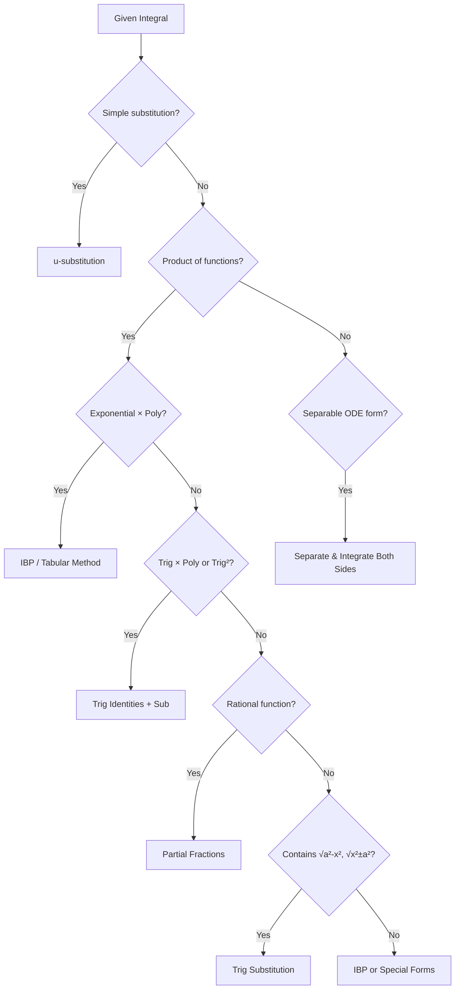
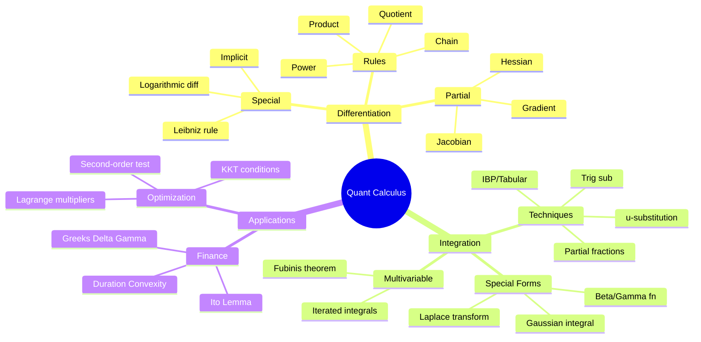

# 📐 Quant Researcher's Complete Calculus & Integration Reference

> **GitHub Flavored Markdown** | MathJax equations | ASCII diagrams | Mermaid diagrams  
> *Differentiation · Integration · Quant Hacks · 50 Worked Problems*

---

## Table of Contents

```
┌─────────────────────────────────────────────────────────────────┐
│  PART I   : Differentiation — Standard Forms                    │
│  PART II  : Integration — Standard Forms                        │
│  PART III : Trigonometric Derivatives & Integrals               │
│  PART IV  : Quant Hacks & Power Techniques                      │
│  PART V   : 25 Differentiation Problems (Worked)                │
│  PART VI  : 25 Integration Problems (Worked)                    │
└─────────────────────────────────────────────────────────────────┘
```

---

# PART I — DIFFERENTIATION: STANDARD FORMS

## 1.1 Fundamental Rules

### Power Rule
$$\frac{d}{dx}\left[x^n\right] = n x^{n-1}$$

- **Line 1**: Bring exponent $n$ down as coefficient  
- **Line 2**: Reduce exponent by 1  
- Works for all $n \in \mathbb{R}$ (including fractions & negatives)

### Constant Rule
$$\frac{d}{dx}[c] = 0$$

### Constant Multiple Rule
$$\frac{d}{dx}[c \cdot f(x)] = c \cdot f'(x)$$

### Sum / Difference Rule
$$\frac{d}{dx}[f(x) \pm g(x)] = f'(x) \pm g'(x)$$

### Product Rule
$$\frac{d}{dx}[f \cdot g] = f'g + fg'$$

- **Mnemonic**: *"first times derivative of second + second times derivative of first"*

### Quotient Rule
$$\frac{d}{dx}\left[\frac{f}{g}\right] = \frac{f'g - fg'}{g^2}$$

- **Mnemonic**: *"lo d-hi minus hi d-lo over lo-squared"*

### Chain Rule
$$\frac{d}{dx}[f(g(x))] = f'(g(x)) \cdot g'(x)$$

- **Line 1**: Differentiate the **outer** function, leave inner intact  
- **Line 2**: Multiply by derivative of the **inner** function

---

## 1.2 Exponential & Logarithmic Derivatives

| Function | Derivative | Notes |
|---|---|---|
| $e^x$ | $e^x$ | Self-derivative — only function with this property |
| $e^{u(x)}$ | $e^{u} \cdot u'$ | Chain rule applied |
| $a^x$ | $a^x \ln a$ | General exponential base $a>0, a\neq 1$ |
| $a^{u}$ | $a^u \ln a \cdot u'$ | Chain rule applied |
| $\ln x$ | $\dfrac{1}{x}$ | Defined for $x>0$ |
| $\ln\|x\|$ | $\dfrac{1}{x}$ | Defined for $x \neq 0$ |
| $\ln(u)$ | $\dfrac{u'}{u}$ | Chain rule applied |
| $\log_a x$ | $\dfrac{1}{x \ln a}$ | Change-of-base: $\log_a x = \tfrac{\ln x}{\ln a}$ |

---

## 1.3 Algebraic & Radical Derivatives

$$\frac{d}{dx}\left[\sqrt{x}\right] = \frac{1}{2\sqrt{x}} \qquad \Leftarrow x^{1/2}, \text{ power rule gives } \tfrac{1}{2}x^{-1/2}$$

$$\frac{d}{dx}\left[\frac{1}{x}\right] = -\frac{1}{x^2} \qquad \Leftarrow x^{-1}, \text{ power rule gives } -x^{-2}$$

$$\frac{d}{dx}\left[\frac{1}{x^n}\right] = -\frac{n}{x^{n+1}}$$

---

## 1.4 Inverse Function Derivative

If $y = f^{-1}(x)$, then:

$$\frac{dy}{dx} = \frac{1}{f'(y)}$$

---

## 1.5 Implicit Differentiation Schema

For $F(x,y) = 0$:

$$\frac{dy}{dx} = -\frac{\partial F/\partial x}{\partial F/\partial y} = -\frac{F_x}{F_y}$$

---

## 1.6 Logarithmic Differentiation

For $y = [f(x)]^{g(x)}$:

$$\ln y = g(x) \ln f(x)$$
$$\frac{y'}{y} = g'(x)\ln f(x) + g(x)\frac{f'(x)}{f(x)}$$
$$y' = y \left[g'\ln f + g\frac{f'}{f}\right]$$

---

# PART II — DIFFERENTIATION: TRIGONOMETRIC

## 2.1 Six Core Trig Derivatives

$$\frac{d}{dx}[\sin x] = \cos x$$

- **Proof sketch**: $\lim_{h\to 0}\frac{\sin(x+h)-\sin x}{h}$ → use angle-addition formula → $\cos x$

$$\frac{d}{dx}[\cos x] = -\sin x$$

- Note the **negative sign** — crucial in oscillation models (e.g., bond duration convexity)

$$\frac{d}{dx}[\tan x] = \sec^2 x$$

- Derived from quotient rule on $\sin x / \cos x$

$$\frac{d}{dx}[\cot x] = -\csc^2 x$$

$$\frac{d}{dx}[\sec x] = \sec x \tan x$$

$$\frac{d}{dx}[\csc x] = -\csc x \cot x$$

### Memory Pattern

```
  sin → cos  → -sin → -cos → sin  (cycle of 4)
  ↑                              ↑
  differentiate clockwise ──────┘
```

---

## 2.2 Inverse Trig Derivatives

| Function | Derivative | Domain |
|---|---|---|
| $\arcsin x$ | $\dfrac{1}{\sqrt{1-x^2}}$ | $\|x\|<1$ |
| $\arccos x$ | $-\dfrac{1}{\sqrt{1-x^2}}$ | $\|x\|<1$ |
| $\arctan x$ | $\dfrac{1}{1+x^2}$ | all $x$ |
| $\text{arccot}\, x$ | $-\dfrac{1}{1+x^2}$ | all $x$ |
| $\text{arcsec}\, x$ | $\dfrac{1}{\|x\|\sqrt{x^2-1}}$ | $\|x\|>1$ |
| $\text{arccsc}\, x$ | $-\dfrac{1}{\|x\|\sqrt{x^2-1}}$ | $\|x\|>1$ |

**Quant Note**: $\arctan$ appears in the Black-Scholes $N(d_1)$ via the normal CDF; inverse trig integrals arise in barrier option pricing.

---

## 2.3 Hyperbolic Derivatives

| Function | Derivative |
|---|---|
| $\sinh x$ | $\cosh x$ |
| $\cosh x$ | $\sinh x$ |
| $\tanh x$ | $\text{sech}^2 x$ |
| $\text{coth}\, x$ | $-\text{csch}^2 x$ |
| $\text{sech}\, x$ | $-\text{sech}\,x\tanh x$ |
| $\text{csch}\, x$ | $-\text{csch}\,x\coth x$ |

**Note**: No minus sign on $\cosh' = \sinh$ (unlike circular: $\cos' = -\sin$)

---

## 2.4 Partial Differentiation

For $f(x_1, x_2, \ldots, x_n)$:

$$\frac{\partial f}{\partial x_i} \equiv \text{hold all } x_j \;(j \neq i) \text{ constant, differentiate w.r.t. } x_i$$

### Total Differential
$$df = \sum_{i=1}^n \frac{\partial f}{\partial x_i} dx_i$$

### Chain Rule (Multivariable)
If $z = f(x,y)$, $x = x(t)$, $y = y(t)$:

$$\frac{dz}{dt} = \frac{\partial f}{\partial x}\frac{dx}{dt} + \frac{\partial f}{\partial y}\frac{dy}{dt}$$

### Gradient Vector
$$\nabla f = \left(\frac{\partial f}{\partial x_1}, \frac{\partial f}{\partial x_2}, \ldots, \frac{\partial f}{\partial x_n}\right)$$

### Hessian Matrix
$$H_{ij} = \frac{\partial^2 f}{\partial x_i \partial x_j}$$

```
H = [ f_xx  f_xy ]   ← 2×2 Hessian for f(x,y)
    [ f_yx  f_yy ]
    
    If det(H) > 0 and f_xx > 0  → local minimum
    If det(H) > 0 and f_xx < 0  → local maximum  
    If det(H) < 0               → saddle point
```

---

# PART III — INTEGRATION: STANDARD FORMS

## 3.1 Power & Algebraic

$$\int x^n \, dx = \frac{x^{n+1}}{n+1} + C \qquad (n \neq -1)$$

- **Line 1**: Raise power by 1, divide by new power, add $C$

$$\int x^{-1} \, dx = \int \frac{1}{x} \, dx = \ln|x| + C$$

- **Line 1**: Exception to power rule (would give $0$ in denominator)

$$\int \sqrt{x} \, dx = \frac{2}{3} x^{3/2} + C$$

$$\int \frac{1}{\sqrt{x}} \, dx = 2\sqrt{x} + C$$

$$\int c \, dx = cx + C$$

---

## 3.2 Exponential Integrals

$$\int e^x \, dx = e^x + C$$

$$\int e^{ax} \, dx = \frac{e^{ax}}{a} + C$$

- **Line 1**: Integrate $e^{ax}$; by chain rule intuition, divide by the inner derivative $a$

$$\int a^x \, dx = \frac{a^x}{\ln a} + C \qquad (a>0, a\neq 1)$$

$$\int x e^x \, dx = e^x(x-1) + C \quad \text{[IBP]}$$

$$\int x^n e^x \, dx \text{ : use IBP } n \text{ times (tabular method)}$$

---

## 3.3 Logarithmic Integrals

$$\int \ln x \, dx = x\ln x - x + C$$

- **Derivation**: IBP with $u=\ln x$, $dv=dx$ → $\int \ln x\,dx = x\ln x - \int x\cdot\frac{1}{x}\,dx = x\ln x - x + C$

$$\int \frac{\ln x}{x} \, dx = \frac{(\ln x)^2}{2} + C$$

- **Sub**: $u=\ln x$, $du=dx/x$

$$\int \frac{1}{x\ln x} \, dx = \ln|\ln x| + C$$

---

## 3.4 Trigonometric Integrals

$$\int \sin x \, dx = -\cos x + C$$

$$\int \cos x \, dx = \sin x + C$$

$$\int \tan x \, dx = -\ln|\cos x| + C = \ln|\sec x| + C$$

- **Line 1**: Write $\tan x = \sin x / \cos x$; substitute $u = \cos x$

$$\int \cot x \, dx = \ln|\sin x| + C$$

$$\int \sec x \, dx = \ln|\sec x + \tan x| + C$$

- **Trick**: Multiply numerator & denominator by $(\sec x + \tan x)$

$$\int \csc x \, dx = \ln|\csc x - \cot x| + C = -\ln|\csc x + \cot x| + C$$

$$\int \sec^2 x \, dx = \tan x + C$$

$$\int \csc^2 x \, dx = -\cot x + C$$

$$\int \sec x \tan x \, dx = \sec x + C$$

$$\int \csc x \cot x \, dx = -\csc x + C$$

---

## 3.5 Inverse Trig Integrals (Critical for Quant Work)

$$\int \frac{1}{\sqrt{1-x^2}} \, dx = \arcsin x + C$$

$$\int \frac{-1}{\sqrt{1-x^2}} \, dx = \arccos x + C$$

$$\int \frac{1}{1+x^2} \, dx = \arctan x + C$$

$$\int \frac{1}{a^2+x^2} \, dx = \frac{1}{a}\arctan\frac{x}{a} + C$$

$$\int \frac{1}{\sqrt{a^2-x^2}} \, dx = \arcsin\frac{x}{a} + C$$

$$\int \frac{1}{x\sqrt{x^2-a^2}} \, dx = \frac{1}{a}\text{arcsec}\frac{|x|}{a} + C$$

---

## 3.6 Reduction Formulas

$$\int \sin^n x \, dx = -\frac{\sin^{n-1}x\cos x}{n} + \frac{n-1}{n}\int\sin^{n-2}x\,dx$$

$$\int \cos^n x \, dx = \frac{\cos^{n-1}x\sin x}{n} + \frac{n-1}{n}\int\cos^{n-2}x\,dx$$

$$\int \tan^n x \, dx = \frac{\tan^{n-1}x}{n-1} - \int\tan^{n-2}x\,dx$$

$$\int x^n e^x \, dx = x^n e^x - n\int x^{n-1}e^x\,dx$$

---

## 3.7 Powers of Trig Functions

### $\sin^m x \cos^n x$ — Strategy Table

```
┌────────────────┬────────────────────────────────────────────────┐
│   Conditions   │   Strategy                                     │
├────────────────┼────────────────────────────────────────────────┤
│ m odd          │ Factor out sin x, sub u=cos x                  │
│ n odd          │ Factor out cos x, sub u=sin x                  │
│ m,n both even  │ Use half-angle: sin²=(1-cos2x)/2               │
│                │              cos²=(1+cos2x)/2                  │
└────────────────┴────────────────────────────────────────────────┘
```

### Half-Angle Identities (Quant Must-Know)

$$\sin^2 x = \frac{1-\cos 2x}{2}, \qquad \cos^2 x = \frac{1+\cos 2x}{2}$$

$$\sin x \cos x = \frac{1}{2}\sin 2x$$

---

## 3.8 Hyperbolic Integrals

| Integral | Result |
|---|---|
| $\int \sinh x\,dx$ | $\cosh x + C$ |
| $\int \cosh x\,dx$ | $\sinh x + C$ |
| $\int \tanh x\,dx$ | $\ln(\cosh x) + C$ |
| $\int \text{sech}^2 x\,dx$ | $\tanh x + C$ |
| $\int \frac{1}{\sqrt{x^2+a^2}}\,dx$ | $\sinh^{-1}(x/a) + C = \ln(x+\sqrt{x^2+a^2})+C$ |
| $\int \frac{1}{\sqrt{x^2-a^2}}\,dx$ | $\cosh^{-1}(x/a) + C = \ln(x+\sqrt{x^2-a^2})+C$ |

---

# PART IV — QUANT HACKS & POWER TECHNIQUES

## 4.1 Integration Techniques Decision Tree



---

## 4.2 Integration by Parts (IBP) — LIATE Rule

$$\int u \, dv = uv - \int v \, du$$

### LIATE Priority for choosing $u$:

```
L — Logarithmic   (ln x, log x)         ← highest priority
I — Inverse trig  (arcsin, arctan...)
A — Algebraic     (x², x³, polynomials)
T — Trigonometric (sin, cos, tan...)
E — Exponential   (eˣ, aˣ)              ← lowest priority
```

**Tabular Method** (for $\int x^n e^{ax} dx$):

```
  Derivatives (sign alternating)  |  Integrals
  ─────────────────────────────────────────────
  (+) x³                         |  eˣ
  (-) 3x²                        |  eˣ
  (+) 6x                         |  eˣ
  (-) 6                          |  eˣ
  (+) 0                          |  eˣ

  Result: x³eˣ - 3x²eˣ + 6xeˣ - 6eˣ + C
```

---

## 4.3 Trigonometric Substitution Table

| Integrand Form | Substitution | Identity Used |
|---|---|---|
| $\sqrt{a^2 - x^2}$ | $x = a\sin\theta$ | $1-\sin^2\theta = \cos^2\theta$ |
| $\sqrt{a^2 + x^2}$ | $x = a\tan\theta$ | $1+\tan^2\theta = \sec^2\theta$ |
| $\sqrt{x^2 - a^2}$ | $x = a\sec\theta$ | $\sec^2\theta - 1 = \tan^2\theta$ |

---

## 4.4 Partial Fractions Decomposition

For $\dfrac{P(x)}{Q(x)}$ where $\deg P < \deg Q$:

```
Factor Type          Partial Fraction Form
────────────────────────────────────────────────────────
(ax+b)             →  A/(ax+b)
(ax+b)²            →  A/(ax+b) + B/(ax+b)²
(ax²+bx+c)         →  (Ax+B)/(ax²+bx+c)  [irreducible]
(ax²+bx+c)²        →  (Ax+B)/(ax²+bx+c) + (Cx+D)/(ax²+bx+c)²
```

---

## 4.5 Gaussian Integral (Quant #1 Must-Know)

$$\int_{-\infty}^{\infty} e^{-x^2} \, dx = \sqrt{\pi}$$

$$\int_{-\infty}^{\infty} e^{-ax^2} \, dx = \sqrt{\frac{\pi}{a}} \quad (a>0)$$

$$\int_{-\infty}^{\infty} e^{-ax^2+bx} \, dx = \sqrt{\frac{\pi}{a}} \, e^{b^2/(4a)}$$

**Proof sketch**: Square the integral, convert to polar → $\int_0^{2\pi}\int_0^\infty e^{-r^2}r\,dr\,d\theta = \pi$, take square root.

---

## 4.6 Itô's Lemma (Stochastic Chain Rule)

For $f(t, X_t)$ where $dX = \mu\,dt + \sigma\,dW$:

$$df = \left(\frac{\partial f}{\partial t} + \mu\frac{\partial f}{\partial x} + \frac{1}{2}\sigma^2\frac{\partial^2 f}{\partial x^2}\right)dt + \sigma\frac{\partial f}{\partial x}\,dW$$

**Key difference from classical chain rule**: The $\frac{1}{2}\sigma^2 f_{xx}$ term (Itô correction) — arises because $(dW)^2 = dt$.

```
Classical:    df = f_t dt + f_x dx
Itô:          df = f_t dt + f_x dx + ½σ²f_xx dt
                                     ↑
                              Itô correction term
```

---

## 4.7 Leibniz Integral Rule (Differentiation Under the Integral)

$$\frac{d}{d\alpha}\int_{a(\alpha)}^{b(\alpha)} f(x,\alpha)\,dx = f(b,\alpha)\cdot b'(\alpha) - f(a,\alpha)\cdot a'(\alpha) + \int_a^b \frac{\partial f}{\partial \alpha}\,dx$$

**Quant use**: Greeks calculation — $\Delta, \Gamma, \Vega$ via differentiation of option pricing integrals.

---

## 4.8 Laplace Transform Pairs (Signal/Control Theory)

| $f(t)$ | $\mathcal{L}\{f\}(s)$ |
|---|---|
| $1$ | $1/s$ |
| $t^n$ | $n!/s^{n+1}$ |
| $e^{at}$ | $1/(s-a)$ |
| $\sin(\omega t)$ | $\omega/(s^2+\omega^2)$ |
| $\cos(\omega t)$ | $s/(s^2+\omega^2)$ |
| $t e^{at}$ | $1/(s-a)^2$ |
| $\delta(t)$ | $1$ |

---

## 4.9 Key Identities Every Quant Must Memorize

### Euler's Formula
$$e^{i\theta} = \cos\theta + i\sin\theta \implies e^{i\pi}+1=0$$

### Taylor / Maclaurin Series

$$e^x = \sum_{n=0}^\infty \frac{x^n}{n!} = 1 + x + \frac{x^2}{2!} + \frac{x^3}{3!} + \cdots$$

$$\ln(1+x) = x - \frac{x^2}{2} + \frac{x^3}{3} - \cdots \quad |x|\le 1$$

$$\sin x = x - \frac{x^3}{6} + \frac{x^5}{120} - \cdots$$

$$\cos x = 1 - \frac{x^2}{2} + \frac{x^4}{24} - \cdots$$

$$(1+x)^n = 1 + nx + \frac{n(n-1)}{2!}x^2 + \cdots \quad |x|<1$$

### Geometric Series
$$\sum_{k=0}^\infty r^k = \frac{1}{1-r}, \quad |r|<1$$

### L'Hôpital's Rule
$$\lim_{x\to a}\frac{f(x)}{g(x)} = \lim_{x\to a}\frac{f'(x)}{g'(x)} \quad \text{when } \frac{0}{0} \text{ or } \frac{\infty}{\infty}$$

---

## 4.10 Moment Generating Function & Cumulants

$$M_X(t) = E[e^{tX}] = \int_{-\infty}^\infty e^{tx} f(x)\,dx$$

$$E[X^n] = M_X^{(n)}(0) = \left.\frac{d^n M}{dt^n}\right|_{t=0}$$

**Cumulant Generating Function**:
$$K(t) = \ln M(t), \quad \kappa_n = K^{(n)}(0)$$

$$\kappa_1 = \mu, \quad \kappa_2 = \sigma^2, \quad \kappa_3 = \text{skewness factor}, \quad \kappa_4 = \text{excess kurtosis factor}$$

---

## 4.11 Numerical Differentiation (Finite Differences)

```
Forward:   f'(x) ≈ [f(x+h) - f(x)] / h           O(h)
Backward:  f'(x) ≈ [f(x) - f(x-h)] / h           O(h)  
Central:   f'(x) ≈ [f(x+h) - f(x-h)] / (2h)      O(h²)  ← prefer

Second:    f''(x) ≈ [f(x+h) - 2f(x) + f(x-h)] / h²
```

---

## 4.12 Greeks as Partial Derivatives

For option price $V(S, t, \sigma, r, \tau)$:

$$\Delta = \frac{\partial V}{\partial S}, \quad \Gamma = \frac{\partial^2 V}{\partial S^2}, \quad \Theta = \frac{\partial V}{\partial t}, \quad \mathcal{V} = \frac{\partial V}{\partial \sigma}, \quad \rho = \frac{\partial V}{\partial r}$$

```
Black-Scholes PDE (the fundamental partial differential equation):

  ∂V/∂t + ½σ²S² ∂²V/∂S² + rS ∂V/∂S - rV = 0
     Θ    + ½σ²S²Γ        + rS·Δ       - rV = 0
```

---

## 4.13 Convexity & Duration (Fixed Income Calculus)

$$\text{Duration} = -\frac{1}{P}\frac{dP}{dy}, \quad \text{Convexity} = \frac{1}{P}\frac{d^2P}{dy^2}$$

$$\Delta P \approx -D \cdot P \cdot \Delta y + \frac{1}{2} C \cdot P \cdot (\Delta y)^2$$

---

# PART V — 25 DIFFERENTIATION PROBLEMS (WORKED)

---

## Q1. Differentiate $f(x) = x^5 - 3x^3 + 7x - 2$

**Step 1**: Apply power rule term by term  
**Step 2**: $d/dx[x^5] = 5x^4$  
**Step 3**: $d/dx[-3x^3] = -9x^2$  
**Step 4**: $d/dx[7x] = 7$  
**Step 5**: $d/dx[-2] = 0$  

$$\boxed{f'(x) = 5x^4 - 9x^2 + 7}$$

---

## Q2. Differentiate $f(x) = \dfrac{x^3 - 2x}{x^2 + 1}$

**Step 1**: Quotient rule: $f'= \dfrac{f'g - fg'}{g^2}$  
**Step 2**: $f = x^3-2x$, $f' = 3x^2-2$; $g = x^2+1$, $g' = 2x$  
**Step 3**: Numerator $= (3x^2-2)(x^2+1) - (x^3-2x)(2x)$  
**Step 4**: Expand: $= 3x^4+3x^2-2x^2-2 - 2x^4+4x^2$  
**Step 5**: Collect: $= x^4 + 5x^2 - 2$  

$$\boxed{f'(x) = \frac{x^4+5x^2-2}{(x^2+1)^2}}$$

---

## Q3. Differentiate $f(x) = e^{3x^2+2x}$

**Step 1**: Chain rule: outer = $e^u$, inner $u = 3x^2+2x$  
**Step 2**: $d/dx[e^u] = e^u \cdot u'$  
**Step 3**: $u' = 6x+2$  

$$\boxed{f'(x) = (6x+2)e^{3x^2+2x}}$$

---

## Q4. Differentiate $f(x) = \ln(\sin x)$

**Step 1**: Chain rule: outer = $\ln u$, inner $u = \sin x$  
**Step 2**: $d/dx[\ln u] = u'/u$  
**Step 3**: $u' = \cos x$  

$$\boxed{f'(x) = \frac{\cos x}{\sin x} = \cot x}$$

---

## Q5. Differentiate $f(x) = x^2 \sin x$

**Step 1**: Product rule: $(fg)' = f'g + fg'$  
**Step 2**: $f=x^2$, $f'=2x$; $g=\sin x$, $g'=\cos x$  
**Step 3**: $f' = 2x\sin x + x^2\cos x$  

$$\boxed{f'(x) = 2x\sin x + x^2\cos x}$$

---

## Q6. Differentiate $f(x) = \arctan(x^2)$

**Step 1**: Chain rule: $d/dx[\arctan u] = u'/(1+u^2)$  
**Step 2**: $u = x^2$, $u' = 2x$  
**Step 3**: Substitute: $\dfrac{2x}{1+(x^2)^2}$  

$$\boxed{f'(x) = \frac{2x}{1+x^4}}$$

---

## Q7. Differentiate $f(x) = x^{\sin x}$ (Logarithmic differentiation)

**Step 1**: Take $\ln$ both sides: $\ln f = \sin x \cdot \ln x$  
**Step 2**: Differentiate both sides: $\dfrac{f'}{f} = \cos x \ln x + \sin x \cdot \dfrac{1}{x}$  
**Step 3**: Multiply both sides by $f = x^{\sin x}$  

$$\boxed{f'(x) = x^{\sin x}\left(\cos x \ln x + \frac{\sin x}{x}\right)}$$

---

## Q8. Find $\partial f/\partial x$ and $\partial f/\partial y$ for $f(x,y) = x^3y^2 + e^{xy}$

**For $\partial f/\partial x$**: treat $y$ as constant  
**Step 1**: $\partial/\partial x[x^3y^2] = 3x^2y^2$  
**Step 2**: $\partial/\partial x[e^{xy}] = ye^{xy}$ (chain rule: inner = $xy$, derivative w.r.t. $x$ = $y$)  
$$\frac{\partial f}{\partial x} = 3x^2y^2 + ye^{xy}$$

**For $\partial f/\partial y$**: treat $x$ as constant  
**Step 3**: $\partial/\partial y[x^3y^2] = 2x^3y$  
**Step 4**: $\partial/\partial y[e^{xy}] = xe^{xy}$  

$$\boxed{\frac{\partial f}{\partial x} = 3x^2y^2 + ye^{xy}, \quad \frac{\partial f}{\partial y} = 2x^3y + xe^{xy}}$$

---

## Q9. Differentiate $f(x) = \sin^3(x^2+1)$

**Step 1**: Outer: $(\sin u)^3$, differentiate: $3(\sin u)^2 \cdot \cos u$  
**Step 2**: Middle: $\sin(v)$ where $v = x^2+1$, derivative: $\cos v$  
**Step 3**: Inner: $v = x^2+1$, derivative: $2x$  
**Step 4**: Chain: $f' = 3\sin^2(x^2+1) \cdot \cos(x^2+1) \cdot 2x$  

$$\boxed{f'(x) = 6x\sin^2(x^2+1)\cos(x^2+1)}$$

---

## Q10. Implicit Differentiation: $x^2 + xy + y^2 = 7$

**Step 1**: Differentiate both sides w.r.t. $x$  
**Step 2**: $2x + y + x\dfrac{dy}{dx} + 2y\dfrac{dy}{dx} = 0$ (product rule on $xy$)  
**Step 3**: Group $dy/dx$ terms: $\dfrac{dy}{dx}(x+2y) = -2x-y$  
**Step 4**: Solve: $\dfrac{dy}{dx} = \dfrac{-(2x+y)}{x+2y}$  

$$\boxed{\frac{dy}{dx} = \frac{-(2x+y)}{x+2y}}$$

---

## Q11. Differentiate $f(x) = \sec(\ln x)$

**Step 1**: Chain rule: outer = $\sec u$, inner $u = \ln x$  
**Step 2**: $d/dx[\sec u] = \sec u \tan u \cdot u'$  
**Step 3**: $u' = 1/x$  

$$\boxed{f'(x) = \frac{\sec(\ln x)\tan(\ln x)}{x}}$$

---

## Q12. Find $f''(x)$ for $f(x) = xe^x$

**Step 1**: First derivative via product rule: $f'(x) = e^x + xe^x = e^x(1+x)$  
**Step 2**: Second derivative — product rule on $e^x(1+x)$:  
**Step 3**: $f''(x) = e^x(1+x) + e^x(1) = e^x(2+x)$  

$$\boxed{f''(x) = e^x(x+2)}$$

---

## Q13. Differentiate $f(x) = \tanh(3x)$

**Step 1**: $d/dx[\tanh u] = \text{sech}^2 u \cdot u'$  
**Step 2**: $u = 3x$, $u' = 3$  

$$\boxed{f'(x) = 3\,\text{sech}^2(3x)}$$

---

## Q14. Partial: $f(x,y,z) = x^2yz + y\sin z$, find $\partial^2 f/\partial x \partial y$

**Step 1**: $\partial f/\partial y = x^2z + \sin z$ (hold $x,z$ constant)  
**Step 2**: $\partial^2 f/\partial x\partial y = \partial/\partial x[x^2z + \sin z] = 2xz$  

$$\boxed{\frac{\partial^2 f}{\partial x\,\partial y} = 2xz}$$

---

## Q15. Differentiate $f(x) = \dfrac{\sqrt{x^2+1}}{x-1}$

**Step 1**: Quotient rule: top $= \sqrt{x^2+1}$, bottom $= x-1$  
**Step 2**: $\left(\sqrt{x^2+1}\right)' = \dfrac{x}{\sqrt{x^2+1}}$ (chain rule)  
**Step 3**: $(x-1)' = 1$  
**Step 4**: Apply quotient rule:
$$f'(x) = \frac{\dfrac{x}{\sqrt{x^2+1}}(x-1) - \sqrt{x^2+1}\cdot 1}{(x-1)^2}$$
**Step 5**: Multiply through by $\sqrt{x^2+1}/\sqrt{x^2+1}$:
$$= \frac{x(x-1) - (x^2+1)}{(x-1)^2\sqrt{x^2+1}} = \frac{-x-1}{(x-1)^2\sqrt{x^2+1}}$$

$$\boxed{f'(x) = \frac{-(x+1)}{(x-1)^2\sqrt{x^2+1}}}$$

---

## Q16. Total derivative: $z = x^2+y^2$, $x=\cos t$, $y=\sin t$. Find $dz/dt$.

**Step 1**: $dz/dt = \partial z/\partial x \cdot dx/dt + \partial z/\partial y \cdot dy/dt$  
**Step 2**: $\partial z/\partial x = 2x$, $dx/dt = -\sin t$  
**Step 3**: $\partial z/\partial y = 2y$, $dy/dt = \cos t$  
**Step 4**: $dz/dt = 2\cos t(-\sin t) + 2\sin t(\cos t) = -2\sin t\cos t + 2\sin t\cos t$  

$$\boxed{\frac{dz}{dt} = 0}$$

*(Makes sense: $z = \cos^2t + \sin^2t = 1$, a constant)*

---

## Q17. Differentiate $f(x) = \arcsin\!\left(\dfrac{x}{2}\right)$

**Step 1**: $d/dx[\arcsin u] = \dfrac{u'}{\sqrt{1-u^2}}$  
**Step 2**: $u = x/2$, $u' = 1/2$  
**Step 3**: $f'(x) = \dfrac{1/2}{\sqrt{1-(x/2)^2}} = \dfrac{1/2}{\sqrt{1-x^2/4}}$  
**Step 4**: Simplify: $= \dfrac{1/2}{\sqrt{(4-x^2)/4}} = \dfrac{1/2}{{\sqrt{4-x^2}}/2}$  

$$\boxed{f'(x) = \frac{1}{\sqrt{4-x^2}}}$$

---

## Q18. Differentiate $f(x) = \cos^2 x - \sin^2 x$

**Step 1**: Note: $f(x) = \cos(2x)$ by double-angle identity  
**Step 2** *(alternatively)*: $f'(x) = 2\cos x(-\sin x) - 2\sin x\cos x = -4\sin x\cos x$  
**Step 3**: Which equals $-2\sin(2x)$ — confirming $d/dx[\cos 2x] = -2\sin 2x$  

$$\boxed{f'(x) = -2\sin(2x)}$$

---

## Q19. Find the gradient of $f(x,y) = \ln\sqrt{x^2+y^2}$

**Step 1**: Simplify: $f = \frac{1}{2}\ln(x^2+y^2)$  
**Step 2**: $\partial f/\partial x = \dfrac{1}{2}\cdot\dfrac{2x}{x^2+y^2} = \dfrac{x}{x^2+y^2}$  
**Step 3**: $\partial f/\partial y = \dfrac{y}{x^2+y^2}$ (by symmetry)  

$$\boxed{\nabla f = \left(\frac{x}{x^2+y^2},\; \frac{y}{x^2+y^2}\right)}$$

---

## Q20. Differentiate $f(x) = \csc(e^x)$

**Step 1**: $d/dx[\csc u] = -\csc u \cot u \cdot u'$  
**Step 2**: $u = e^x$, $u' = e^x$  

$$\boxed{f'(x) = -e^x\csc(e^x)\cot(e^x)}$$

---

## Q21. Logarithmic differentiation: $f(x) = \dfrac{x^2\sqrt{x+1}}{(2x-1)^3}$

**Step 1**: $\ln f = 2\ln x + \frac{1}{2}\ln(x+1) - 3\ln(2x-1)$  
**Step 2**: Differentiate: $\dfrac{f'}{f} = \dfrac{2}{x} + \dfrac{1}{2(x+1)} - \dfrac{6}{2x-1}$  
**Step 3**: Multiply by $f$:

$$\boxed{f'(x) = \frac{x^2\sqrt{x+1}}{(2x-1)^3}\left(\frac{2}{x} + \frac{1}{2(x+1)} - \frac{6}{2x-1}\right)}$$

---

## Q22. Second partial: $f(x,y) = e^{x^2y}$. Find $\partial^2f/\partial y^2$.

**Step 1**: $\partial f/\partial y = x^2 e^{x^2y}$  
**Step 2**: $\partial^2 f/\partial y^2 = x^4 e^{x^2y}$  

$$\boxed{\frac{\partial^2 f}{\partial y^2} = x^4 e^{x^2y}}$$

---

## Q23. Differentiate $f(x) = \sin(\cos(\tan x))$

**Step 1**: Three nested functions — apply chain rule outward in  
**Step 2**: $d/dx[\sin(\cos(\tan x))] = \cos(\cos(\tan x)) \cdot d/dx[\cos(\tan x)]$  
**Step 3**: $d/dx[\cos(\tan x)] = -\sin(\tan x) \cdot \sec^2 x$  
**Step 4**: Combine:

$$\boxed{f'(x) = -\cos(\cos(\tan x))\cdot\sin(\tan x)\cdot\sec^2 x}$$

---

## Q24. Jacobian: $u = x^2-y^2$, $v = 2xy$. Find $\partial(u,v)/\partial(x,y)$.

$$J = \begin{vmatrix} \partial u/\partial x & \partial u/\partial y \\ \partial v/\partial x & \partial v/\partial y \end{vmatrix} = \begin{vmatrix} 2x & -2y \\ 2y & 2x \end{vmatrix}$$

$$\boxed{J = 4x^2 + 4y^2 = 4(x^2+y^2)}$$

---

## Q25. Differentiate $f(x) = \int_0^{x^2} e^{t^3}\,dt$ using Leibniz rule

**Step 1**: By Fundamental Theorem of Calculus + chain rule:  
**Step 2**: $f'(x) = e^{(x^2)^3} \cdot \dfrac{d}{dx}[x^2]$  
**Step 3**: $= e^{x^6} \cdot 2x$  

$$\boxed{f'(x) = 2xe^{x^6}}$$

---

# PART VI — 25 INTEGRATION PROBLEMS (WORKED)

---

## Q26. $\displaystyle\int (3x^4 - 5x^2 + 2)\,dx$

**Step 1**: Power rule term by term  
**Step 2**: $\int 3x^4\,dx = \frac{3x^5}{5}$  
**Step 3**: $\int -5x^2\,dx = -\frac{5x^3}{3}$  
**Step 4**: $\int 2\,dx = 2x$  

$$\boxed{\frac{3x^5}{5} - \frac{5x^3}{3} + 2x + C}$$

---

## Q27. $\displaystyle\int \frac{1}{x^2+4}\,dx$

**Step 1**: Match form $\int \dfrac{1}{a^2+x^2}dx = \dfrac{1}{a}\arctan\dfrac{x}{a}+C$  
**Step 2**: $a^2=4$, so $a=2$  

$$\boxed{\frac{1}{2}\arctan\frac{x}{2} + C}$$

---

## Q28. $\displaystyle\int xe^{x^2}\,dx$

**Step 1**: Substitution $u = x^2$, $du = 2x\,dx$, so $x\,dx = du/2$  
**Step 2**: $\int e^u \dfrac{du}{2} = \dfrac{1}{2}e^u + C$  
**Step 3**: Back-substitute $u = x^2$  

$$\boxed{\frac{1}{2}e^{x^2} + C}$$

---

## Q29. $\displaystyle\int x\ln x\,dx$ (IBP)

**Step 1**: LIATE — $u = \ln x$, $dv = x\,dx$  
**Step 2**: $du = 1/x\,dx$, $v = x^2/2$  
**Step 3**: $\int x\ln x\,dx = \dfrac{x^2}{2}\ln x - \int \dfrac{x^2}{2}\cdot\dfrac{1}{x}\,dx$  
**Step 4**: $= \dfrac{x^2\ln x}{2} - \int \dfrac{x}{2}\,dx = \dfrac{x^2\ln x}{2} - \dfrac{x^2}{4}$  

$$\boxed{\frac{x^2}{2}\ln x - \frac{x^2}{4} + C}$$

---

## Q30. $\displaystyle\int \sin^2 x\,dx$

**Step 1**: Half-angle identity: $\sin^2 x = \dfrac{1-\cos 2x}{2}$  
**Step 2**: $\int \dfrac{1-\cos 2x}{2}\,dx = \dfrac{1}{2}\int dx - \dfrac{1}{2}\int\cos 2x\,dx$  
**Step 3**: $= \dfrac{x}{2} - \dfrac{\sin 2x}{4}$  

$$\boxed{\frac{x}{2} - \frac{\sin 2x}{4} + C}$$

---

## Q31. $\displaystyle\int \frac{2x+3}{x^2+3x+2}\,dx$

**Step 1**: Note numerator $= d/dx[x^2+3x+2]$; this is a log form  
**Step 2**: Let $u = x^2+3x+2$, $du = (2x+3)dx$  
**Step 3**: $\int \dfrac{du}{u} = \ln|u|$  

$$\boxed{\ln|x^2+3x+2| + C}$$

---

## Q32. $\displaystyle\int \frac{1}{x^2-4}\,dx$ (Partial Fractions)

**Step 1**: Factor: $x^2-4 = (x-2)(x+2)$  
**Step 2**: Decompose: $\dfrac{1}{(x-2)(x+2)} = \dfrac{A}{x-2} + \dfrac{B}{x+2}$  
**Step 3**: $1 = A(x+2)+B(x-2)$; set $x=2$: $A=1/4$; $x=-2$: $B=-1/4$  
**Step 4**: $\int \left(\dfrac{1/4}{x-2} - \dfrac{1/4}{x+2}\right)dx = \dfrac{1}{4}\ln|x-2| - \dfrac{1}{4}\ln|x+2|$  

$$\boxed{\frac{1}{4}\ln\left|\frac{x-2}{x+2}\right| + C}$$

---

## Q33. $\displaystyle\int \sqrt{4-x^2}\,dx$ (Trig Substitution)

**Step 1**: $x = 2\sin\theta$, $dx = 2\cos\theta\,d\theta$  
**Step 2**: $\sqrt{4-x^2} = \sqrt{4\cos^2\theta} = 2\cos\theta$  
**Step 3**: $\int 2\cos\theta\cdot 2\cos\theta\,d\theta = 4\int\cos^2\theta\,d\theta$  
**Step 4**: $= 4\cdot\dfrac{\theta + \sin\theta\cos\theta}{2} = 2\theta + 2\sin\theta\cos\theta$  
**Step 5**: Back-substitute: $\theta = \arcsin(x/2)$, $\sin\theta = x/2$, $\cos\theta = \sqrt{4-x^2}/2$  

$$\boxed{2\arcsin\frac{x}{2} + \frac{x\sqrt{4-x^2}}{2} + C}$$

---

## Q34. $\displaystyle\int e^x\cos x\,dx$

**Step 1**: IBP with $u=e^x$, $dv=\cos x\,dx$; $du=e^x dx$, $v=\sin x$  
**Step 2**: $I = e^x\sin x - \int e^x\sin x\,dx$  
**Step 3**: IBP again on remainder: $u=e^x$, $dv=\sin x\,dx$; $v=-\cos x$  
**Step 4**: $I = e^x\sin x - [-e^x\cos x + \int e^x\cos x\,dx]$  
**Step 5**: $I = e^x\sin x + e^x\cos x - I$  
**Step 6**: $2I = e^x(\sin x + \cos x)$  

$$\boxed{\int e^x\cos x\,dx = \frac{e^x(\sin x + \cos x)}{2} + C}$$

---

## Q35. $\displaystyle\int \tan^3 x\,dx$

**Step 1**: Write $\tan^3 x = \tan x \cdot \tan^2 x = \tan x(\sec^2 x - 1)$  
**Step 2**: $= \int\tan x\sec^2 x\,dx - \int\tan x\,dx$  
**Step 3**: First: $u=\tan x$, $du=\sec^2 x\,dx$ → $\int u\,du = u^2/2 = \tan^2x/2$  
**Step 4**: Second: $-\int\tan x\,dx = \ln|\cos x|$  

$$\boxed{\frac{\tan^2 x}{2} + \ln|\cos x| + C}$$

---

## Q36. $\displaystyle\int_0^1 \frac{x}{(x^2+1)^2}\,dx$

**Step 1**: $u = x^2+1$, $du = 2x\,dx$  
**Step 2**: Limits: $x=0\to u=1$; $x=1\to u=2$  
**Step 3**: $\dfrac{1}{2}\int_1^2 u^{-2}\,du = \dfrac{1}{2}\left[-\dfrac{1}{u}\right]_1^2 = \dfrac{1}{2}\left(-\dfrac{1}{2}+1\right)$  

$$\boxed{\frac{1}{4}}$$

---

## Q37. $\displaystyle\int \frac{x^2+1}{x^3+3x}\,dx$

**Step 1**: Factor denominator: $x(x^2+3)$  
**Step 2**: Partial fractions: $\dfrac{A}{x} + \dfrac{Bx+C}{x^2+3}$  
**Step 3**: $x^2+1 = A(x^2+3)+(Bx+C)x$  
**Step 4**: $x=0$: $1=3A \Rightarrow A=1/3$; equate $x^2$: $1=A+B \Rightarrow B=2/3$; equate $x^1$: $C=0$  
**Step 5**: $\int\dfrac{1/3}{x}dx + \int\dfrac{2x/3}{x^2+3}dx = \dfrac{1}{3}\ln|x| + \dfrac{1}{3}\ln(x^2+3)$  

$$\boxed{\frac{1}{3}\ln\left|x(x^2+3)\right| + C = \frac{1}{3}\ln|x^3+3x| + C}$$

---

## Q38. $\displaystyle\int \sin^3 x\cos^2 x\,dx$

**Step 1**: $m=3$ (odd) — factor out $\sin x$  
**Step 2**: $\sin^3 x = \sin x(1-\cos^2 x)$  
**Step 3**: $\int\sin x(1-\cos^2 x)\cos^2 x\,dx$  
**Step 4**: $u=\cos x$, $du=-\sin x\,dx$  
**Step 5**: $-\int(1-u^2)u^2\,du = -\int(u^2-u^4)\,du = -\dfrac{u^3}{3}+\dfrac{u^5}{5}$  
**Step 6**: Back-substitute:  

$$\boxed{-\frac{\cos^3 x}{3} + \frac{\cos^5 x}{5} + C}$$

---

## Q39. $\displaystyle\int \frac{dx}{\sqrt{x^2+9}}$ (Hyperbolic / trig sub)

**Step 1**: $x = 3\sinh t$, $dx = 3\cosh t\,dt$; $\sqrt{x^2+9}=3\cosh t$  
**Step 2**: $\int\dfrac{3\cosh t\,dt}{3\cosh t} = \int dt = t$  
**Step 3**: $t = \sinh^{-1}(x/3) = \ln\!\left(x/3 + \sqrt{x^2/9+1}\right) = \ln(x+\sqrt{x^2+9})-\ln 3$  

$$\boxed{\ln\!\left(x+\sqrt{x^2+9}\right) + C}$$

---

## Q40. $\displaystyle\int x^2 e^x\,dx$ (Tabular IBP)

```
  Sign |  u derivatives  |  v integrals
  ─────┼─────────────────┼──────────────
   +   |  x²             |  eˣ
   -   |  2x             |  eˣ
   +   |  2              |  eˣ
   -   |  0              |  eˣ
```

**Step**: Multiply diagonals with alternating signs:

$$\boxed{x^2e^x - 2xe^x + 2e^x + C = e^x(x^2-2x+2)+C}$$

---

## Q41. $\displaystyle\int_0^{\pi/2} \sin^4 x\,dx$

**Step 1**: $\sin^4 x = (\sin^2 x)^2 = \left(\dfrac{1-\cos 2x}{2}\right)^2 = \dfrac{1-2\cos 2x+\cos^2 2x}{4}$  
**Step 2**: $\cos^2 2x = \dfrac{1+\cos 4x}{2}$  
**Step 3**: $\sin^4 x = \dfrac{1}{4}\left(\dfrac{3}{2} - 2\cos 2x + \dfrac{\cos 4x}{2}\right)$  
**Step 4**: Integrate from $0$ to $\pi/2$:  
**Step 5**: $\int_0^{\pi/2} \cos 2x\,dx = 0$; $\int_0^{\pi/2}\cos 4x\,dx = 0$  
**Step 6**: $= \dfrac{1}{4}\cdot\dfrac{3}{2}\cdot\dfrac{\pi}{2} = \dfrac{3\pi}{16}$  

$$\boxed{\frac{3\pi}{16}}$$

---

## Q42. $\displaystyle\int \frac{3x+1}{(x-1)(x^2+1)}\,dx$

**Step 1**: $\dfrac{A}{x-1}+\dfrac{Bx+C}{x^2+1}$  
**Step 2**: $3x+1 = A(x^2+1)+(Bx+C)(x-1)$  
**Step 3**: $x=1$: $4=2A \Rightarrow A=2$  
**Step 4**: Expand, collect $x^2$: $0=A+B \Rightarrow B=-2$  
**Step 5**: Constant: $1=A-C \Rightarrow C=1$  
**Step 6**: $\int\dfrac{2}{x-1}dx + \int\dfrac{-2x+1}{x^2+1}dx$  
**Step 7**: $= 2\ln|x-1| - \ln(x^2+1) + \arctan x$  

$$\boxed{2\ln|x-1| - \ln(x^2+1) + \arctan x + C}$$

---

## Q43. $\displaystyle\int_0^\infty e^{-3x}\,dx$

**Step 1**: Improper integral: $\lim_{b\to\infty}\int_0^b e^{-3x}\,dx$  
**Step 2**: $= \lim_{b\to\infty}\left[-\dfrac{e^{-3x}}{3}\right]_0^b$  
**Step 3**: $= \lim_{b\to\infty}\left(-\dfrac{e^{-3b}}{3}+\dfrac{1}{3}\right) = 0 + \dfrac{1}{3}$  

$$\boxed{\frac{1}{3}}$$

---

## Q44. $\displaystyle\int \frac{\sin x}{\cos^3 x}\,dx$

**Step 1**: Rewrite: $= \int\sin x\cos^{-3}x\,dx$  
**Step 2**: $u=\cos x$, $du=-\sin x\,dx$  
**Step 3**: $-\int u^{-3}\,du = -\dfrac{u^{-2}}{-2} = \dfrac{1}{2u^2}$  
**Step 4**: Back-substitute:  

$$\boxed{\frac{1}{2\cos^2 x} + C = \frac{\sec^2 x}{2} + C}$$

---

## Q45. $\displaystyle\int \frac{x+2}{\sqrt{4-x^2}}\,dx$

**Step 1**: Split: $\int\dfrac{x}{\sqrt{4-x^2}}dx + \int\dfrac{2}{\sqrt{4-x^2}}dx$  
**Step 2**: First part: $u=4-x^2$, $du=-2x\,dx$  
→ $-\dfrac{1}{2}\int u^{-1/2}du = -\sqrt{u} = -\sqrt{4-x^2}$  
**Step 3**: Second part: $2\arcsin(x/2)$  

$$\boxed{-\sqrt{4-x^2} + 2\arcsin\frac{x}{2} + C}$$

---

## Q46. $\displaystyle\int \ln^2 x\,dx$

**Step 1**: IBP: $u=\ln^2 x$, $dv=dx$; $du=\dfrac{2\ln x}{x}dx$, $v=x$  
**Step 2**: $= x\ln^2 x - 2\int\ln x\,dx$  
**Step 3**: Use known result $\int\ln x\,dx = x\ln x - x$  
**Step 4**: $= x\ln^2 x - 2(x\ln x - x)$  

$$\boxed{x\ln^2 x - 2x\ln x + 2x + C}$$

---

## Q47. $\displaystyle\int_0^1 x\arctan x\,dx$

**Step 1**: IBP: $u=\arctan x$, $dv=x\,dx$; $du=\dfrac{dx}{1+x^2}$, $v=\dfrac{x^2}{2}$  
**Step 2**: $= \left[\dfrac{x^2}{2}\arctan x\right]_0^1 - \int_0^1\dfrac{x^2}{2(1+x^2)}dx$  
**Step 3**: First term: $\dfrac{1}{2}\cdot\dfrac{\pi}{4} = \dfrac{\pi}{8}$  
**Step 4**: $\dfrac{x^2}{1+x^2} = 1-\dfrac{1}{1+x^2}$; integral $= \dfrac{1}{2}\int_0^1\left(1-\dfrac{1}{1+x^2}\right)dx = \dfrac{1}{2}\left[1-\dfrac{\pi}{4}\right]$  
**Step 5**: Final: $\dfrac{\pi}{8} - \dfrac{1}{2}+\dfrac{\pi}{8} = \dfrac{\pi}{4}-\dfrac{1}{2}$  

$$\boxed{\frac{\pi}{4} - \frac{1}{2}}$$

---

## Q48. $\displaystyle\int \frac{dx}{x^2\sqrt{x^2-1}}$ (Trig sub)

**Step 1**: $x=\sec\theta$, $dx=\sec\theta\tan\theta\,d\theta$, $\sqrt{x^2-1}=\tan\theta$  
**Step 2**: $\int\dfrac{\sec\theta\tan\theta\,d\theta}{\sec^2\theta\cdot\tan\theta} = \int\cos\theta\,d\theta = \sin\theta$  
**Step 3**: $\sin\theta = \sqrt{x^2-1}/x$ (from right triangle where $\sec\theta=x$)  

$$\boxed{\frac{\sqrt{x^2-1}}{x} + C}$$

---

## Q49. $\displaystyle\int\int_R xy\,dA$ over $R=[0,2]\times[0,3]$

**Step 1**: Iterated integral (Fubini's theorem — separate if no cross dependence)  
**Step 2**: $\int_0^2 x\,dx \cdot \int_0^3 y\,dy$  
**Step 3**: $= \left[\dfrac{x^2}{2}\right]_0^2 \cdot \left[\dfrac{y^2}{2}\right]_0^3$  
**Step 4**: $= 2 \cdot \dfrac{9}{2} = 9$  

$$\boxed{9}$$

---

## Q50. $\displaystyle\int \frac{e^x-e^{-x}}{e^x+e^{-x}}\,dx = \int\tanh x\,dx$

**Step 1**: $u = e^x+e^{-x}$, $du = (e^x-e^{-x})dx$  
**Step 2**: $\int\dfrac{du}{u} = \ln|u|$  
**Step 3**: Back-substitute:  

$$\boxed{\ln(e^x+e^{-x}) + C = \ln(2\cosh x) + C}$$

---

# APPENDIX — Quick Reference Card

```
┌──────────────────────────────────────────────────────────────────┐
│              DIFFERENTIATION AT A GLANCE                         │
├──────────────┬───────────────────────────────────────────────────┤
│ xⁿ           │ nxⁿ⁻¹                                            │
│ eˣ           │ eˣ                                               │
│ ln x         │ 1/x                                              │
│ sin x        │ cos x                                            │
│ cos x        │ -sin x                                           │
│ tan x        │ sec²x                                            │
│ sec x        │ sec x tan x                                      │
│ arcsin x     │ 1/√(1-x²)                                        │
│ arctan x     │ 1/(1+x²)                                         │
│ sinh x       │ cosh x                                           │
│ cosh x       │ sinh x                                           │
│ tanh x       │ sech²x                                           │
├──────────────┴───────────────────────────────────────────────────┤
│              INTEGRATION AT A GLANCE                             │
├──────────────┬───────────────────────────────────────────────────┤
│ xⁿ           │ xⁿ⁺¹/(n+1)                     (n≠-1)           │
│ 1/x          │ ln|x|                                            │
│ eˣ           │ eˣ                                               │
│ sin x        │ -cos x                                           │
│ cos x        │ sin x                                            │
│ tan x        │ ln|sec x|                                        │
│ sec²x        │ tan x                                            │
│ 1/(a²+x²)   │ (1/a)arctan(x/a)                                │
│ 1/√(a²-x²)  │ arcsin(x/a)                                     │
│ eˣcos x      │ eˣ(sin x+cos x)/2                               │
│ ln x         │ x ln x - x                                       │
└──────────────┴───────────────────────────────────────────────────┘
```

---



---

*Generated for Quant Researchers — All formulas GFM + MathJax compatible*
