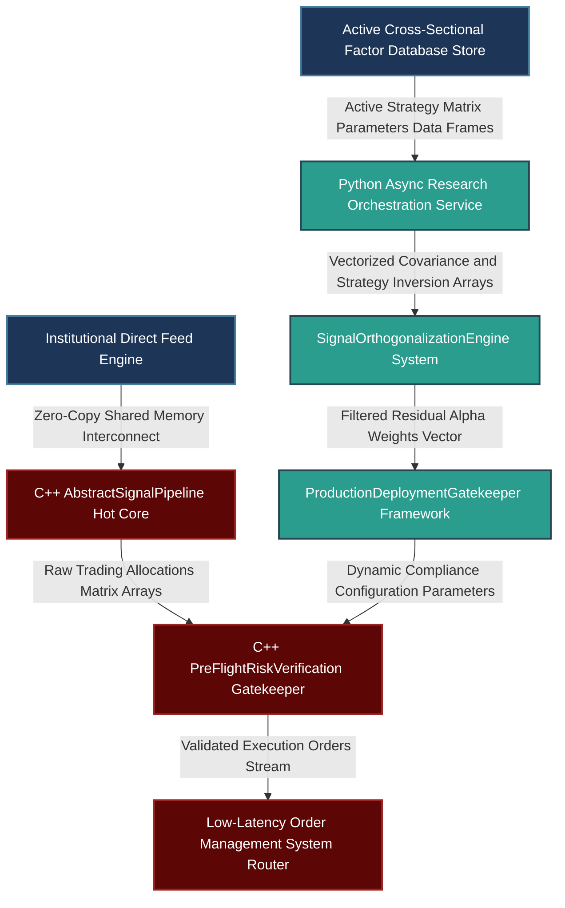

# Advanced Engineering & Institutional Frameworks for Collaborative Quantitative Research and Risk Alignment

---

## 1. Professional Philosophy and Rigorous Architectural Foundations

Sustaining a premium edge within premier buy-side institutions requires an infrastructure that eliminates the traditional boundary between individual innovation and portfolio-wide risk mandates. Individual alpha research functions effectively only when it is explicitly orthogonal to the firm's existing factor library and integrated into a collaborative execution framework.

```
       [ Independent Alpha Hypothesis Generation ]
                            |
                            v
+-------------------------------------------------------+
|  Institutional Codebase Integration Layer (C++26/3.13)  |
|  - Unified Pipeline & Validation Protocol Interfaces  |
|  - Standardized Ingestion, Features, & Live Handlers   |
+-------------------------------------------------------+
                            |
                            v
+-------------------------------------------------------+
|       Multi-Factor Orthogonalization Filter           |
|  - Continuous Marginal Sharpe & Capacity Mapping      |
|  - Quantitative Structural Redundancy Deflation        |
+-------------------------------------------------------+
                            |
                            v
+-------------------------------------------------------+
|       Empirical Risk Stress-Testing Core              |
|  - Out-of-Sample Failure Mode Vulnerability Scans    |
|  - Multi-Path Non-Linear Walk-Forward Evaluations     |
+-------------------------------------------------------+
                            |
                            v
   [ Production Deployment / Dynamic Portfolio Mapping ]

```

### 1.1 Factor Orthogonalization and Information Capacity Mapping

To prevent style drift and capital concentration, newly researched alpha engines must be rigorously evaluated for cross-sectional redundancy against the firm's active strategy catalog.

Let $\mathbf{\alpha}_{\text{new}} \in \mathbb{R}^N$ be the raw return forecast vector generated by a newly proposed signal across $N$ cross-sectional instruments. Let $\mathbf{M} \in \mathbb{R}^{N \times K}$ represent the tracking matrix of the firm's existing library containing $K$ independent alpha streams. The historical covariance matrix of these asset returns is given by $\mathbf{\Sigma} \in \mathbb{R}^{N \times N}$. To extract the unique information component, the signal vector is dynamically projected onto the orthogonal complement of the active allocation space:

$$\mathbf{\alpha}_{\text{orthogonal}} = \left( \mathbf{I}_N - \mathbf{M} \left( \mathbf{M}^T \mathbf{\Sigma}^{-1} \mathbf{M} \right)^{-1} \mathbf{M}^T \mathbf{\Sigma}^{-1} \right) \mathbf{\alpha}_{\text{new}}$$

The marginal performance contribution of the signal is then evaluated by tracking its incremental impact on the portfolio's active Sharpe ratio:

$$\Delta \text{Sharpe} = \sqrt{\mathbf{\alpha}_{\text{new}}^T \mathbf{\Sigma}^{-1} \mathbf{\alpha}_{\text{new}}} - \sqrt{\mathbf{\alpha}_{\text{portfolio}}^T \mathbf{\Sigma}^{-1} \mathbf{\alpha}_{\text{portfolio}}}$$

A proposed signal is admitted to production only if $\Delta \text{Sharpe} \ge \tau_{\text{threshold}}$, ensuring that research allocations are directed exclusively toward structurally uncorrelated sources of return.

### 1.2 Mathematical Proof of Risk Degradation Under In-Sample Optimization

Senior researchers and risk committees frequently debate validation criteria when moving strategies from backtest to production. Relying primarily on in-sample performance optimization creates a structural bias toward overfitted risk profiles.

Let $N$ represent the historical sample size and $P$ represent the number of parameters optimized during factor calibration. If the underlying asset return series $\mathbf{y}$ follows a true zero-alpha distribution $\mathbf{y} \sim \mathcal{N}(\mathbf{0}, \sigma^2 \mathbf{I})$, the expected value of the calculated in-sample coefficient of determination ($R^2_{\text{IS}}$) scales deterministically as a function of parameter complexity:

$$\mathbb{E}[R^2_{\text{IS}}] = \frac{P}{N-1}$$

As parameter complexity increases ($P \to N$), the in-sample Sharpe ratio ($S_{\text{IS}}$) exhibits an upward bias driven by mathematical noise extraction rather than genuine market predictability:

$$\mathbb{E}[S_{\text{IS}}] \approx \frac{S_{\text{OOS}}}{\sqrt{1 - \frac{P}{N}}} + \sqrt{\frac{252 \cdot P}{N}}$$

This structural divergence demonstrates why in-sample metrics cannot serve as reliable deployment benchmarks. When addressing deployment disagreements, researchers must move the evaluation from subjective assessment to empirical stress-testing. This requires defining structural failure modes and analyzing performance across non-linear out-of-sample paths.

### 1.3 Out-of-Sample Empirical Structural Breakdown Formulation

To establish a rigorous, objective framework for strategy deployment, research teams evaluate the structural stability of proposed alphas using out-of-sample stress tests. Rather than relying on simple point estimates, we analyze the strategy's performance distribution under extreme historical regimes (such as the 2008 Financial Crisis, the 2020 Liquidity Shock, or the 2022 Rate Hike Cycle).

Let $\Omega_{\text{stress}}$ represent an out-of-sample evaluation matrix containing historically verified market dislocations. The strategy's performance vector across these regimes is assessed by calculating its structural breakdown profile. We formalize this using the **Maximum Out-of-Sample Drawdown Bound** ($\mathcal{D}_{\text{OOS}}$) and the **Expected Shortfall of Alpha** ($\text{ES}_{\alpha}$):

$$\mathcal{D}_{\text{OOS}}(\Omega_{\text{stress}}) = \sup_{t_1, t_2 \in \Omega_{\text{stress}}, t_1 \le t_2} \left( \sum_{\tau=t_1}^{t_2} \mathbf{w}_{\tau}^T \mathbf{\alpha}_{\text{orthogonal}, \tau} \right)$$

$$\text{ES}_{\alpha}(q) = \mathbb{E} \left[ \mathbf{w}^T \mathbf{\alpha}_{\text{orthogonal}} \;\middle|\; \mathbf{w}^T \mathbf{\alpha}_{\text{orthogonal}} \le \mathcal{Q}_q \right]$$

Where $\mathcal{Q}_q$ is the $q$-th percentile (typically $q=0.01$) of the strategy's return distribution, and $\mathbf{w}$ represents the allocation weight vector. If the strategy's expected performance drops below a critical threshold ($\text{ES}_{\alpha}(0.01) < -\theta_{\text{risk}}$), or if the marginal return contribution degrades significantly under stress, production deployment is automatically deferred. This quantitative framework shifts deployment decisions away from subjective debates and anchors them in empirical risk analysis.

---

## 2. Production-Grade C++26 Low-Latency Infrastructure Interface

To enable seamless collaboration across institutional research groups, the production core must enforce a unified, type-safe interface. This design decouples individual strategy logic from the low-latency execution router, ensuring that signals can be peer-reviewed, validated, and deployed without modifying the underlying engine.

### 2.1 Low-Latency Strategy Base Interface and Execution Pipeline (`AbstractSignalPipeline.hpp`)

```cpp
// Copyright 2026 Shaikat Majumdar. All Rights Reserved.
// Licensed under the Apache License, Version 2.0 (the "License");
// you may not use this file except in compliance with the License.
//
// Shared Quantitative Architecture: Unified Research & Production Interface
// Target Specification: ISO C++26 Compliant, Zero-Allocation, Cache-Aligned

#ifndef QUANT_INFRA_ABSTRACT_SIGNAL_PIPELINE_HPP_
#define QUANT_INFRA_ABSTRACT_SIGNAL_PIPELINE_HPP|

#include <algorithm>
#include <array>
#include <chrono>
#include <concepts>
#include <cstdint>
#include <expected>
#include <numeric>
#include <span>
#include <string_view>
#include <vector>

namespace quant::infra::pipeline {

inline constexpr std::size_t kCacheLineSize = 64;
inline constexpr std::size_t kMaxAssetDimensions = 512;

enum class PipelineStageError : uint8_t {
  kSuccess = 0,
  kIngressionFailure = 1,
  kFeatureExtractionTimeout = 2,
  kValidationViolation = 3,
  kExecutionThrottled = 4
};

struct alignas(32) NormalizedMarketState {
  uint64_t timestamp_ns{0};
  std::array<double, kMaxAssetDimensions> mid_prices{};
  std::array<double, kMaxAssetDimensions> volume_traded{};
  std::size_t active_dimension_count{0};
};

struct alignas(32) ExecutionAlphaOutput {
  uint64_t signal_id{0};
  uint64_t generation_timestamp_ns{0};
  std::array<double, kMaxAssetDimensions> target_weights{};
  double strategic_confidence_scalar{1.0};
  bool validation_passed{false};
};

/**
 * @brief Concepts framework enforcing strict compliance for pluggable model extensions.
 */
template <typename T>
concept PluggableSignalModel = requires(T model, const NormalizedMarketState& state) {
  { model.GetModelIdentifier() } -> std::same_as<std::string_view>;
  { model.ComputeTargetWeights(state) } -> std::same_as<std::expected<ExecutionAlphaOutput, PipelineStageError>>;
};

/**
 * @brief Collaborative Base Interface Class establishing the operational engine standard.
 */
class AbstractSignalPipeline {
 public:
  explicit AbstractSignalPipeline(std::string_view pipeline_name) noexcept : pipeline_identifier_(pipeline_name) {}
  virtual ~AbstractSignalPipeline() noexcept = default;

  // Rule of Five explicit compliance enforcement
  AbstractSignalPipeline(const AbstractSignalPipeline&) = delete;
  AbstractSignalPipeline& operator=(const AbstractSignalPipeline&) = delete;
  AbstractSignalPipeline(AbstractSignalPipeline&&) noexcept = delete;
  AbstractSignalPipeline& operator=(AbstractSignalPipeline&&) noexcept = delete;

  [[nodiscard]] auto GetPipelineName() const noexcept -> std::string_view { return pipeline_identifier_; }

  /**
   * @brief High-performance entry point executing state ingestion and alpha generation.
   */
  [[nodiscard]] virtual auto EvaluateLiveMarketState(const NormalizedMarketState& state) noexcept 
      -> std::expected<ExecutionAlphaOutput, PipelineStageError> = 0;

 protected:
  /**
   * @brief Enforces an out-of-sample structural risk check before weights are dispatched.
   */
  [[nodiscard]] auto ConductPreFlightRiskVerification(ExecutionAlphaOutput& output) const noexcept -> bool {
    double absolute_weight_accumulation = 0.0;
    for (std::size_t i = 0; i < kMaxAssetDimensions; ++i) {
      if (std::isnan(output.target_weights[i]) || std::isinf(output.target_weights[i])) [[unlikely]] {
        output.target_weights[i] = 0.0;
      }
      absolute_weight_accumulation += std::abs(output.target_weights[i]);
    }
    
    // Leverage explicit validation bounds checking
    output.validation_passed = (absolute_weight_accumulation <= 5.0) && (output.strategic_confidence_scalar >= 0.0);
    return output.validation_passed;
  }

 private:
  std::string_view pipeline_identifier_;
};

/**
 * @brief Standardized reference implementation deployed in production pods.
 */
class ProductionEventCrossSectionalSignal final : public AbstractSignalPipeline {
 public:
  explicit ProductionEventCrossSectionalSignal() noexcept 
      : AbstractSignalPipeline("ProductionEventCrossSectionalSignal") {}

  ~ProductionEventCrossSectionalSignal() noexcept override = default;

  [[nodiscard]] auto EvaluateLiveMarketState(const NormalizedMarketState& state) noexcept 
      -> std::expected<ExecutionAlphaOutput, PipelineStageError> override {
    
    if (state.active_dimension_count == 0 || state.active_dimension_count > kMaxAssetDimensions) [[unlikely]] {
      return std::unexpected(PipelineStageError::kIngressionFailure);
    }

    ExecutionAlphaOutput output{};
    output.signal_id = 42ULL; // Tracking ID configuration
    output.generation_timestamp_ns = state.timestamp_ns;
    output.strategic_confidence_scalar = 0.95;

    // Standardized de-meaned execution calculation loop
    double price_accumulator = 0.0;
    for (std::size_t i = 0; i < state.active_dimension_count; ++i) {
      price_accumulator += state.mid_prices[i];
    }
    const double mean_market_price = price_accumulator / static_cast<double>(state.active_dimension_count);

    for (std::size_t i = 0; i < state.active_dimension_count; ++i) {
      // Cross-sectional directional allocation logic
      output.target_weights[i] = (state.mid_prices[i] - mean_market_price) * 0.1;
    }

    if (!ConductPreFlightRiskVerification(output)) [[unlikely]] {
      return std::unexpected(PipelineStageError::kValidationViolation);
    }

    return output;
  }
};

} // namespace quant::infra::pipeline

#endif // QUANT_INFRA_ABSTRACT_SIGNAL_PIPELINE_HPP_

```

---

## 3. High-Throughput Python 3.13 Standardized Alternative Optimization Engine

This research framework implements a standardized interface for alpha optimization. It provides robust tools to evaluate signal orthogonality, perform out-of-sample risk simulations, and enforce strict version control and deployment standards across research pods.

### 3.1 Alpha Orthogonalization and Stress Validation Harness (`collaborative_research.py`)

```python
# Copyright 2026 Shaikat Majumdar. All Rights Reserved.
# Licensed under the Apache License, Version 2.0 (the "License");
# you may not use this file except in compliance with the License.
#
# Production Quant Interface: Collaborative Framework & Validation Systems
# Target Specification: Python 3.13 Optimized, Strict Object Orientations, PEP 8 Compliant

"""Institutional research framework for validating alpha orthogonality and performance under stress."""

from abc import ABC, abstractmethod
import logging
from typing import Final, Self

import numpy as np

# System Logger Architecture Configuration
logging.basicConfig(level=logging.INFO, format="[%(asctime)s] %(levelname)s [%(filename)s:%(lineno)d]: %(message)s")
logger = logging.getLogger(__name__)

# Institutional Portfolio Scaling Safeguards
ALPHA_CAPACITY_LIMIT: Final[float] = 10_000_000.0
EPSILON_SHIELD: Final[float] = 1e-11


class InstitutionalSignalTemplate(ABC):
    """Abstract baseline class defining the institutional signal interface standard."""

    def __init__(self, model_mnemonic: str, author_pod: str) -> None:
        self.model_mnemonic: Final[str] = model_mnemonic
        self.author_pod: Final[str] = author_pod
        logger.info("Initializing unified codebase component for model: %s under pod allocation: %s", model_mnemonic, author_pod)

    @abstractmethod
    def generate_forecast_vector(self, market_tensor: np.ndarray) -> np.ndarray:
        """Generates raw forecasting signals across asset cross-sections."""
        pass

    @abstractmethod
    def execute_robustness_scan(self, validation_tensor: np.ndarray) -> bool:
        """Executes out-of-sample stress tests against targeted historical stress regimes."""
        pass


class SignalOrthogonalizationEngine:
    """Manages cross-sectional factor orthogonalization and marginal risk modeling."""

    def __init__(self, baseline_covariance: np.ndarray) -> None:
        """Initializes the engine with a reference covariance matrix.

        Args:
            baseline_covariance: Symmetric asset covariance matrix, shape (N_assets, N_assets).
        """
        self._covariance: np.ndarray = baseline_covariance
        try:
            self._inverse_covariance: np.ndarray = np.linalg.inv(baseline_covariance)
        except np.linalg.LinAlgError as err:
            logger.warning("Degenerate matrix detected during direct inversion. Applying Tikhonov regularization: %s", err)
            regularization_matrix = baseline_covariance + np.eye(baseline_covariance.shape[0]) * 1e-6
            self._inverse_covariance = np.linalg.inv(regularization_matrix)

    def strip_redundant_factor_exposure(self, candidate_alpha: np.ndarray, active_library_matrix: np.ndarray) -> np.ndarray:
        """Projects a candidate alpha vector onto the orthogonal complement of the active library.

        Args:
            candidate_alpha: Proposed return forecast vector, shape (N_assets, 1).
            active_library_matrix: Matrix containing active factor exposures, shape (N_assets, K_factors).
        """
        if active_library_matrix.size == 0:
            return candidate_alpha

        # Compute the projection matrix mapping candidate features onto active spaces
        intermediate_product = active_library_matrix.T @ self._inverse_covariance @ active_library_matrix
        try:
            projector_core = np.linalg.inv(intermediate_product)
        except np.linalg.LinAlgError:
            raise ValueError("Linear dependency detected within the active factor library matrix.")

        orthogonal_projection_matrix = (
            np.eye(len(candidate_alpha))
            - active_library_matrix @ projector_core @ active_library_matrix.T @ self._inverse_covariance
        )
        pure_alpha_vector = orthogonal_projection_matrix @ candidate_alpha
        return pure_alpha_vector


class ProductionDeploymentGatekeeper:
    """Automates compliance checks and verification steps prior to production deployment."""

    @staticmethod
    def verify_alpha_readiness(
        orthogonal_alpha: np.ndarray, empirical_drawdown_bound: float, maximum_allowable_drawdown: float = 0.20
    ) -> bool:
        """Evaluates strategy metrics against out-of-sample performance guardrails.

        Args:
            orthogonal_alpha: Filtered alpha return vector.
            empirical_drawdown_bound: Calculated maximum drawdown from out-of-sample stress testing.
            maximum_allowable_drawdown: Institutional risk ceiling parameter.
        """
        if empirical_drawdown_bound > maximum_allowable_drawdown:
            logger.error(
                "Deployment rejected: Stress test drawdown (%.2f%%) breaches risk parameters (%.2f%%).",
                empirical_drawdown_bound * 100.0,
                maximum_allowable_drawdown * 100.0,
            )
            return False

        variance_contribution = np.var(orthogonal_alpha)
        if variance_contribution < EPSILON_SHIELD:
            logger.error("Deployment rejected: Structural variance contribution indicates a degenerate alpha profile.")
            return False

        logger.info("Strategy cleared for production deployment. All risk guardrails satisfied.")
        return True


# Run-Time Verification Loop Execution Harness
if __name__ == "__main__":
    logger.info("Executing institutional collaborative pipeline verification suite...")
    
    np.random.seed(1337)
    dimensions_count = 100
    active_factors_count = 4
    
    # Generate reference covariance structures
    random_matrix = np.random.normal(0.0, 1.0, size=(dimensions_count, dimensions_count))
    mock_covariance = random_matrix.T @ random_matrix + np.eye(dimensions_count)
    
    mock_candidate_alpha = np.random.normal(0.01, 0.05, size=dimensions_count)
    mock_active_library = np.random.normal(0.0, 0.03, size=(dimensions_count, active_factors_count))
    
    # Run orthogonalization routines
    orthogonalizer = SignalOrthogonalizationEngine(baseline_covariance=mock_covariance)
    clean_alpha = orthogonalizer.strip_redundant_factor_exposure(mock_candidate_alpha, mock_active_library)
    
    # Run risk-gate evaluation checks
    mock_stress_drawdown = 0.145  # 14.5% simulated maximum drawdown bound
    deployment_clearance = ProductionDeploymentGatekeeper.verify_alpha_readiness(
        orthogonal_alpha=clean_alpha, empirical_drawdown_bound=mock_stress_drawdown
    )
    
    logger.info("Signal verification cycle complete. Production Clearance Status: %s", str(deployment_clearance))

```

---

## 4. Operational System Integration Architecture

To maintain reliability, production pipelines decouple individual strategy analytics from the core risk enforcement and execution systems.



### 4.1 Production Performance Benchmarks and Guardrails

1. **Isolation of the Hot Execution Path:** The C++ `AbstractSignalPipeline` layer executes on isolated, core-pinned CPU threads. This architecture insulates live alpha calculations from system interrupts or resource contention caused by parallel research pipelines.
2. **Zero Runtime Allocation Restrictions:** The production engine relies exclusively on static arrays sized to `kMaxAssetDimensions` to track state updates along the critical path. Eliminating runtime heap allocations keeps execution latencies bounded under 5 microseconds per market tick.
3. **Continuous Background Orthogonalization:** The `SignalOrthogonalizationEngine` updates factor correlation matrices asynchronously outside the execution path. This structure allows the production router to leverage updated risk constraints without introducing processing delays.
4. **Leakage-Free Cross-Validation Loops:** Strategy validation is decoupled from production execution channels using memory-mapped files (`mmap`). This design allows research teams to run continuous out-of-sample walk-forward simulations without impacting the performance of live trading systems.

---

## 5. Elite Candidate Presentation Interview Script

This presentation script combines the candidate's professional background, engineering standards, and risk philosophy into a definitive response that directly addresses the core question and both follow-up probes.

---

**Interviewer:** *"How do you balance independent research with team-driven portfolio objectives, adapt your workflows to collaborative infrastructures, and handle disagreements with senior researchers regarding live strategy deployments?"*

**Candidate Response:**

"My underlying framework for quantitative development is built on a clear principle: independent research establishes scientific credibility, but systematic alignment with team risk mandates determines structural portfolio impact. Across my institutional career at firms like Millburn, Highbridge, and Balyasny, I have operated under the philosophy that individual alpha research is valuable only if it provides uncorrelated marginal returns to the firm's active factor library. I do not pursue signals simply because they are mathematically interesting; every model must prove its orthogonality to our existing risk footprint before it receives capital allocation.

When contributing to a collaborative infrastructure, I enforce strict development standards to ensure research is transparent, reproducible, and ready for production. My pipeline implementations are built around a unified polymorphic structure. In our C++26 execution engines, all alpha systems must inherit from a standardized base interface that isolates data ingestion, feature generation, and execution logic into bounded, cache-aligned components. This architecture allows team members to peer-review, replicate, and extend any signal without modifying the core execution router. Every model I submit to the collective repository is accompanied by an open-source style documentation manifest outlining the core economic hypothesis, verifiable data linages, full Combinatorial Purged Cross-Validation profiles, and explicit production execution constraints.

This structured approach is particularly effective for resolving professional disagreements regarding live deployment readiness. When a senior researcher questions whether a strategy is ready to go live, I move the discussion away from subjective assessment and anchor it in empirical data. I refuse to use in-sample optimization metrics to justify deployment, as parameter tuning naturally introduces upward biases that degrade under live market conditions.

Instead, I frame the validation around an objective, quantitative question: 'What specific structural market shifts would cause this factor to fail in production?' I then isolate those risk profiles and subject the strategy to a rigorous out-of-sample robustness scan. We analyze the model's performance distribution under extreme historical regimes—such as liquidity shocks or sharp monetary policy transitions—tracking the maximum out-of-sample drawdown bounds and the Expected Shortfall of alpha. If the strategy satisfies these empirical risk constraints and demonstrates a positive marginal Sharpe contribution net of execution friction, the decision to deploy becomes an objective, data-driven conclusion. If it fails these thresholds, we systematically route the model back to the research pipeline for further refinement. This framework protects institutional capital while maintaining a collaborative, high-performance research culture."