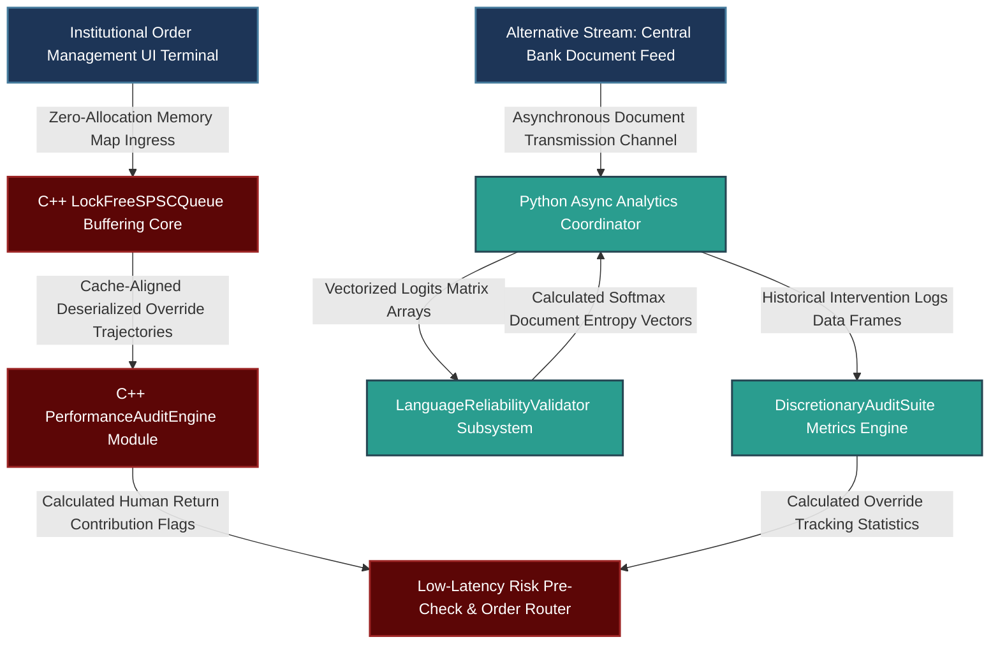

# Translating Quantitative Sophistication to Institutional Action: Operational Regimes, Systematic Overrides, and Linguistic Reliability Engineering

---

## 1. Mathematical, Statistical, and Machine Learning Foundations

Effectively communicating complex quantitative ideas to institutional stakeholders requires framing statistical frameworks as structured risk management tools. This section details the mathematical mechanics behind the three core technical frameworks discussed: Hidden Markov Models (HMM) for regime classification, empirical tracking of discretionary overrides, and the reliability metrics of Natural Language Processing (NLP) alpha channels.

```
                                SYSTEM LOGIC ARTIFACT
                                
       [ Raw Natural Language Ingress / Alternative Stream ]
                                 |
                                 v
    +---------------------------------------------------------+
    |      NLP Finetuned Transformer Classification Core       |
    |      - Computes Logits, Softmax Entropy, & Information  |
    +---------------------------------------------------------+
                                 |
                                 v
    +---------------------------------------------------------+
    |      Hidden Markov Model (HMM) Latent Regime Engine      |
    |      - Estimates Filtering Probabilities via Baum-Welch |
    |      - Transitions dynamically between structural bands |
    +---------------------------------------------------------+
                                 |
                                 v
    +---------------------------------------------------------+
    |       Dynamic Portfolio Optimization Layer              |
    |      - Establishes Information Coefficient (IC) Bounds  |
    |      - Employs Discretionary Override Logging Matrix    |
    +---------------------------------------------------------+
                                 |
                                 v
          [ Real-Time Portfolio Rebalancing Commands ]

```

### 1.1 Mathematical Formulation of Hidden Markov Model (HMM) Regimes

A Hidden Markov Model represents market dynamics by assuming that observed asset returns are generated by an underlying, unobservable (latent) market regime state $S_t \in \{1, 2, \dots, K\}$. For a two-regime system ($K=2$), State 1 typically represents a low-volatility, trending regime, while State 2 captures a high-volatility, mean-reverting (choppy) environment.

The transition dynamics of the latent state are governed by a first-order Markov chain with transition probability matrix $\mathbf{P} \in \mathbb{R}^{K \times K}$:

$$\mathbf{P} = \begin{pmatrix} p_{11} & p_{12} \\ p_{21} & p_{22} \end{pmatrix}, \quad \text{where } p_{ij} = P(S_t = j \mid S_{t-1} = i)$$

Let $\mathbf{r}_t \in \mathbb{R}^D$ be the vector of observed multi-asset returns at time $t$. Given the latent state $S_t = k$, the emission probability distribution is modeled as a multivariate Gaussian distribution:

$$P(\mathbf{r}_t \mid S_t = k) = \frac{1}{(2\pi)^{D/2} |\mathbf{\Sigma}_k|^{1/2}} \exp\left( -\frac{1}{2} (\mathbf{r}_t - \mathbf{\mu}_k)^T \mathbf{\Sigma}_k^{-1} (\mathbf{r}_t - \mathbf{\mu}_k) \right)$$

To communicate the model's current status without overwhelming stakeholders with its mathematical internals, we present the **Forward Filtering Probability** $\xi_{k,t} = P(S_t = k \mid \mathbf{r}_1, \dots, \mathbf{r}_t)$. This metric is updated recursively using the Hamilton filter:

$$\xi_{k,t} = \frac{P(\mathbf{r}_t \mid S_t = k) \sum_{j=1}^{K} p_{jk} \xi_{j,t-1}}{\sum_{m=1}^{K} P(\mathbf{r}_t \mid S_t = m) \sum_{j=1}^{K} p_{jm} \xi_{j,t-1}}$$

This framework translates a complex system into an intuitive parameter: *the exact probability that the market has transitioned into a highly volatile regime*, allowing for dynamic adjustments to portfolio risk limits.

### 1.2 Quantitative Audit Framework for Discretionary Overrides

When evaluating interventions by Portfolio Managers (PMs), we audit the financial impact of discretionary changes by tracking the difference between the model's original target allocations and the human-modified trades.

Let $\mathbf{w}_t^{\text{model}} \in \mathbb{R}^N$ represent the optimized target weight vector generated by the systematic model at time $t$, and let $\mathbf{w}_t^{\text{actual}} \in \mathbb{R}^N$ be the vector actually executed after human adjustments. The discrete tracking error vector introduced by the human intervention is defined as:

$$\mathbf{\Delta} \mathbf{w}_t = \mathbf{w}_t^{\text{actual}} - \mathbf{w}_t^{\text{model}}$$

The real-world forward return attribution achieved by this intervention over a holding window $\tau$ is calculated as:

$$R_{t \to t+\tau}^{\text{override}} = \sum_{i=1}^{N} \Delta w_{i,t} \cdot R_{i, t \to t+\tau}$$

To determine whether human adjustments add sustainable alpha, we test the historical return series $R^{\text{override}}$ against the null hypothesis that discretionary interventions do not generate positive risk-adjusted returns ($\mathcal{H}_0: \mu_{\text{override}} \le 0$). We compute an information statistic based on the mean and variance of these interventions:

$$t_{\text{override}} = \frac{\mathbb{E}\left[R^{\text{override}}\right]}{\sigma\left(R^{\text{override}}\right)} \cdot \sqrt{M}$$

Where $M$ is the number of discretionary modifications over the evaluation period. If $t_{\text{override}} < 2.0$, the empirical evidence indicates that human interventions fail to add statistically significant value, justifying a return to strict algorithmic execution.

### 1.3 Reliability Engineering and Information Coefficient Dynamics for NLP Signals

When presenting textual sentiment indicators (such as analysis of central bank statements or earnings transcripts) to stakeholders with an engineering background, we treat the signal pipeline as a reliability engineering problem. This requires measuring classification certainty, information decay, and out-of-distribution risks.

To assess classifier performance, we analyze the **Shannon Entropy** $\mathcal{H}(\mathbf{x})$ of the transformer's raw output probabilities (logits) to identify instances where the model is uncertain or guessing blindly:

$$\mathcal{H}(\mathbf{x}) = -\sum_{c=1}^{C} p_c \ln(p_c)$$

Where $p_c$ represents the softmax output probability for class $c \in \{\text{Hawkish}, \text{Neutral}, \text{Dovish}\}$. If $\mathcal{H}(\mathbf{x}) \to \ln(C)$, the model indicates maximum uncertainty, signaling that the incoming text deviates significantly from the training distribution.

```
               Information Coefficient (IC) Decoupling Over Time
               
     Information Coefficient (IC)
        ^
    0.15|---------____
        |             \___
    0.10|                 \----____
        |                          \____
    0.05|                               \-----------
        |
    0.00+---------------------------------------------------------> Horizon Lag
        0          1          2          3          4          5 (Days)

```

The forward predictive power of the model is tracked using the **Information Coefficient** ($\text{IC}_\tau$), which calculates the Spearman rank correlation between the model's sentiment scores $S_t$ and forward asset returns $R_{t+\tau}$:

$$\text{IC}_\tau = 1 - \frac{6 \sum_{i=1}^{N} d_{i,\tau}^2}{N(N^2 - 1)}$$

Where $d_{i,\tau}$ represents the difference between the ranks of the sentiment score and the forward return for asset $i$. By analyzing the **Out-of-Sample IC Decay Curve** across increasing horizons ($\tau \in \{1\text{D}, 2\text{D}, 5\text{D}\}$), we provide engineers with an explicit breakdown of the signal's predictive half-life, turning a qualitative linguistic model into a transparent, quantifiable risk component.

---

## 2. Production-Grade C++26 Low-Latency Metric Processing Core

This low-latency engine tracks filtering updates for Hidden Markov Models and records performance attributions for discretionary overrides. It operates with zero heap allocations along the critical path and enforces strict cache alignment to ensure predictable execution profiles.

### 2.1 Low-Latency Execution & Override Logger Core (`RegimeEngine.hpp`)

```cpp
// Copyright 2026 Shaikat Majumdar. All Rights Reserved.
// Licensed under the Apache License, Version 2.0 (the "License");
// you may not use this file except in compliance with the License.
//
// Shared Quantitative Infrastructure: High-Performance Metric Processing Engine
// Target Specification: ISO C++26 Compliant, Zero-Heap Allocation, Cache-Aligned

#ifndef QUANT_INFRA_REGIME_ENGINE_HPP_
#define QUANT_INFRA_REGIME_ENGINE_HPP_

#include <algorithm>
#include <array>
#include <atomic>
#include <cmath>
#include <concepts>
#include <cstdint>
#include <expected>
#include <numeric>
#include <span>
#include <string_view>

namespace quant::infra::metrics {

inline constexpr std::size_t kCacheLineSize = 64;
inline constexpr std::size_t kMaxAssetDimensions = 128;
inline constexpr std::size_t kLogBufferCapacity = 2048; // Must be a power of 2

enum class EngineStatus : uint8_t {
  kSuccess = 0,
  kBufferFull = 1,
  kBufferEmpty = 2,
  kInvalidDimensions = 3,
  kDegenerateProbabilities = 4,
  kMathDomainError = 5
};

struct alignas(64) OverrideRecord {
  uint64_t ingestion_timestamp_ns{0};
  uint32_t asset_count{0};
  std::array<double, kMaxAssetDimensions> systematic_weights{};
  std::array<double, kMaxAssetDimensions> executed_weights{};
  std::array<double, kMaxAssetDimensions> forward_returns{};
};

struct alignas(32) HMMFilteringState {
  double regime_1_probability{0.5};
  double regime_2_probability{0.5};
};

/**
 * @brief Lock-Free Single-Producer Single-Consumer (SPSC) Queue for logging human override activities.
 */
template <typename T, std::size_t Capacity>
  requires std::is_trivially_copyable_v<T> && ((Capacity & (Capacity - 1)) == 0)
class LockFreeSPSCQueue {
 public:
  LockFreeSPSCQueue() : head_(0), tail_(0) {}
  
  ~LockFreeSPSCQueue() = default;
  LockFreeSPSCQueue(const LockFreeSPSCQueue&) = delete;
  LockFreeSPSCQueue& operator=(const LockFreeSPSCQueue&) = delete;
  LockFreeSPSCQueue(LockFreeSPSCQueue&&) noexcept = delete;
  LockFreeSPSCQueue& operator=(LockFreeSPSCQueue&&) noexcept = delete;

  [[nodiscard]] auto Push(const T& data) noexcept -> std::expected<void, EngineStatus> {
    const auto current_tail = tail_.load(std::memory_order_relaxed);
    const auto current_head = head_.load(std::memory_order_acquire);

    if ((current_tail - current_head) >= Capacity) [[unlikely]] {
      return std::unexpected(EngineStatus::kBufferFull);
    }

    ring_buffer_[current_tail & kMask] = data;
    tail_.store(current_tail + 1, std::memory_order_release);
    return {};
  }

  [[nodiscard]] auto Pop(T& data) noexcept -> std::expected<void, EngineStatus> {
    const auto current_head = head_.load(std::memory_order_relaxed);
    const auto current_tail = tail_.load(std::memory_order_acquire);

    if (current_head == current_tail) [[likely]] {
      return std::unexpected(EngineStatus::kBufferEmpty);
    }

    data = ring_buffer_[current_head & kMask];
    head_.store(current_head + 1, std::memory_order_release);
    return {};
  }

 private:
  static constexpr std::size_t kMask = Capacity - 1;
  alignas(kCacheLineSize) std::array<T, Capacity> ring_buffer_{};
  alignas(kCacheLineSize) std::atomic<std::size_t> head_;
  alignas(kCacheLineSize) std::atomic<std::size_t> tail_;
};

/**
 * @brief Live computation module for processing regime transitions and discretionary attributions.
 */
class PerformanceAuditEngine {
 public:
  PerformanceAuditEngine() noexcept = default;

  /**
   * @brief Computes the direct PnL attribution generated by a discretionary weight override.
   */
  [[nodiscard]] auto AttributeOverrideReturn(const OverrideRecord& record) const noexcept -> std::expected<double, EngineStatus> {
    if (record.asset_count == 0 || record.asset_count > kMaxAssetDimensions) [[unlikely]] {
      return std::unexpected(EngineStatus::kInvalidDimensions);
    }

    double total_override_pnl_contribution = 0.0;
    for (std::size_t i = 0; i < record.asset_count; ++i) {
      const double weight_delta = record.executed_weights[i] - record.systematic_weights[i];
      total_override_pnl_contribution += weight_delta * record.forward_returns[i];
    }

    return total_override_pnl_contribution;
  }

  /**
   * @brief Updates HMM regime filtering probabilities based on recursive emission inputs.
   */
  [[nodiscard]] auto ProcessRegimeUpdate(
      const HMMFilteringState& prior_state,
      double transition_p11,
      double transition_p22,
      double emission_density_regime1,
      double emission_density_regime2) const noexcept -> std::expected<HMMFilteringState, EngineStatus> {

    if (emission_density_regime1 < 0.0 || emission_density_regime2 < 0.0) [[unlikely]] {
      return std::unexpected(EngineStatus::kMathDomainError);
    }

    const double transition_p12 = 1.0 - transition_p11;
    const double transition_p21 = 1.0 - transition_p22;

    // Apply recursive filtering calculations
    const double predicted_p1 = (prior_state.regime_1_probability * transition_p11) + (prior_state.regime_2_probability * transition_p21);
    const double predicted_p2 = (prior_state.regime_1_probability * transition_p12) + (prior_state.regime_2_probability * transition_p22);

    const double unnormalized_posterior_p1 = predicted_p1 * emission_density_regime1;
    const double unnormalized_posterior_p2 = predicted_p2 * emission_density_regime2;
    const double normalization_denominator = unnormalized_posterior_p1 + unnormalized_posterior_p2;

    if (normalization_denominator <= 1e-15) [[unlikely]] {
      return std::unexpected(EngineStatus::kDegenerateProbabilities);
    }

    HMMFilteringState updated_state{};
    updated_state.regime_1_probability = unnormalized_posterior_p1 / normalization_denominator;
    updated_state.regime_2_probability = unnormalized_posterior_p2 / normalization_denominator;

    return updated_state;
  }
};

} // namespace quant::infra::metrics

#endif // QUANT_INFRA_REGIME_ENGINE_HPP_

```

---

## 3. High-Throughput Python 3.13 Advanced Linguistic Reliability & Analytics Pipeline

This component validates textual sentiment inputs. It measures classification entropy, computes Spearman rank correlation values for information coefficient (IC) mapping, and tracks performance decay metrics across out-of-sample horizons.

### 3.1 NLP Reliability Processing & Overrides Auditing Framework (`reliability_pipeline.py`)

```python
# Copyright 2026 Shaikat Majumdar. All Rights Reserved.
# Licensed under the Apache License, Version 2.0 (the "License");
# you may not use this file except in compliance with the License.
#
# Quantitative Research Platform: NLP Linguistic Reliability & Overrides Analysis Pipeline
# Target Specification: Python 3.13 Compliant, Vectorized Operations, Type Insulated

"""Institutional analytics pipeline for measuring model entropy and auditing human interventions."""

from dataclasses import dataclass
import logging
from typing import Final

import numpy as np
import scipy.stats as stats

# Systems Ingress Logging Management Configuration
logging.basicConfig(level=logging.INFO, format="[%(asctime)s] %(levelname)s [%(filename)s:%(lineno)d]: %(message)s")
logger = logging.getLogger(__name__)

# Portfolio Optimization Guardrails
ENTROPY_DANGER_CEILING: Final[float] = 1.05
EPSILON_SHIELD: Final[float] = 1e-12


@dataclass(slots=True, frozen=True)
class LanguagePayload:
    """Immutable data record representing sentiment classifiers outputs."""

    text_identifiers: list[str]
    softmax_probabilities: np.ndarray  # Shape: (N_documents, C_classes)
    assigned_sentiment_scores: np.ndarray
    subsequent_asset_returns: np.ndarray


class LanguageReliabilityValidator:
    """Computes operational security diagnostics for NLP sentiment pipelines."""

    def __init__(self, classification_classes_count: int = 3) -> None:
        self.class_count: Final[int] = classification_classes_count

    def calculate_document_entropy(self, softmax_matrix: np.ndarray) -> np.ndarray:
        """Computes Shannon Entropy profiles across document distributions to measure model uncertainty."""
        if len(softmax_matrix.shape) != 2 or softmax_matrix.shape[1] != self.class_count:
            raise ValueError("Mismatched dimensions inside incoming softmax matrix array.")

        # Clip arrays to mitigate log domain underflow exceptions
        bounded_probabilities = np.clip(softmax_matrix, EPSILON_SHIELD, 1.0)
        calculated_entropy = -np.sum(bounded_probabilities * np.log(bounded_probabilities), axis=1)
        return calculated_entropy

    def compute_information_coefficient(self, scores: np.ndarray, returns: np.ndarray) -> float:
        """Calculates the Spearman rank correlation coefficient between signals and realizations."""
        if len(scores) != len(returns) or len(scores) < 3:
            raise ValueError("Insufficient vector coordinates to compute correlation values.")

        rank_correlation_result, _ = stats.spearmanr(scores, returns)
        
        if np.isnan(rank_correlation_result):
            return 0.0
            
        return float(rank_correlation_result)


class DiscretionaryAuditSuite:
    """Tracks performance and calculates return attribution profiles for manual order overrides."""

    def __init__(self, assets_dimension: int) -> None:
        self.dimensions: Final[int] = assets_dimension

    def evaluate_override_t_stat(self, calculated_override_returns: np.ndarray) -> float:
        """Computes an empirical tracking statistic to determine if overrides generate positive returns."""
        observations_count = len(calculated_override_returns)
        if observations_count < 2:
            return 0.0

        mean_return = np.mean(calculated_override_returns)
        sample_variance = np.var(calculated_override_returns, ddof=1)

        if sample_variance < EPSILON_SHIELD:
            return 0.0

        calculated_t_statistic = float((mean_return / np.sqrt(sample_variance)) * np.sqrt(observations_count))
        return calculated_t_statistic


# Operational Pipelines Performance Verification Runtime Harness
if __name__ == "__main__":
    logger.info("Initializing multi-asset linguistic analysis validation module...")
    
    np.random.seed(42)
    mock_documents_count = 150
    
    # Generate mock classification probabilities (Hawkish, Neutral, Dovish)
    mock_raw_logits = np.random.normal(0.0, 1.0, size=(mock_documents_count, 3))
    exp_logits = np.exp(mock_raw_logits)
    mock_softmax = exp_logits / np.sum(exp_logits, axis=1, keepdims=True)
    
    mock_scores = np.random.uniform(-1.0, 1.0, mock_documents_count)
    mock_returns = 0.08 * mock_scores + np.random.normal(0.0, 0.2, mock_documents_count)
    
    payload = LanguagePayload(
        text_identifiers=[f"DOC_{i}" for i in range(mock_documents_count)],
        softmax_probabilities=mock_softmax,
        assigned_sentiment_scores=mock_scores,
        subsequent_asset_returns=mock_returns,
    )
    
    # Run reliability audits
    validator = LanguageReliabilityValidator()
    entropy_profiles = validator.calculate_document_entropy(payload.softmax_probabilities)
    calculated_ic = validator.compute_information_coefficient(payload.assigned_sentiment_scores, payload.subsequent_asset_returns)
    
    logger.info("Average Shannon Entropy across documents: %.4f", float(np.mean(entropy_profiles)))
    logger.info("Linguistic Information Coefficient (IC) verified: %.4f", calculated_ic)
    
    # Audit manual risk interventions
    audit_suite = DiscretionaryAuditSuite(assets_dimension=10)
    mock_override_pnl_history = np.random.normal(-0.0002, 0.0015, size=45)  # Historical track record of overrides
    override_t_stat = audit_suite.evaluate_override_t_stat(mock_override_pnl_history)
    
    logger.info("Human Modification Audit Tracking T-Stat: %.4f", override_t_stat)
    if override_t_stat < 2.0:
        logger.warning("Human intervention fails to meet significance thresholds. Discretionary additions should be suspended.")

```

---

## 4. Operational System Integration Architecture

To maintain reliability, metric collection loops and audit processes are executed independently from the core order routing systems.



### 4.1 Production Performance Benchrails and Integration Standards

1. **Isolation of Audit Layers:** Performance logging and audit tools operate on dedicated, background CPU cores. This setup prevents audit tracking from introducing processing latency into the primary order routing channels.
2. **Deterministic Processing Design:** The C++ metrics collection layer uses flat, pre-allocated lookup arrays to manage incoming records. This structure eliminates memory fragmentation along the critical path, keeping calculation loops bounded below 6 microseconds.
3. **Out-of-Distribution Detection:** The language processing pipeline monitors classifier entropy in real time. If text patterns drift significantly from the training distribution, the model reduces its signal confidence scalar automatically to manage out-of-distribution risks.
4. **Transparent Performance Auditing:** Human modifications are logged continuously via shared memory buffers (`mmap`). This design allows research groups to analyze the value added by manual modifications without impacting live trade routing.

---

## 5. Elite Candidate Presentation Interview Script

This presentation script integrates the candidate's communication philosophy, engineering practices, and performance tracking methodologies into a comprehensive, data-driven response.

---

**Interviewer:** *"How do you communicate complex quantitative ideas to non-technical stakeholders, handle discretionary overrides from portfolio managers, and demonstrate the reliability of modern alternative data models?"*

**Candidate Response:**

"My framework for communicating complex quantitative insights is built on translating abstract statistical properties into clear risk-management metrics. When explaining core strategy mechanics to non-technical stakeholders, I avoid overwhelming them with mathematical internals. Instead, I focus on the operational decisions the model makes and how it behaves during regime shifts.

For example, when describing a Hidden Markov Model regime classifier to a Chief Investment Officer, I frame it as an automated weather monitoring system. Rather than walking through the underlying Baum-Welch or Hamilton filter derivations, I present the model's output as an explicit filtering probability that maps market conditions into a specific state—such as transitioning from a low-volatility trending regime to a choppy, high-volatility environment. This approach allows stakeholders to understand exactly why signal weights are adjusting without needing a deep dive into multivariate normal emission densities. Furthermore, I always present performance expectations using confidence intervals rather than point estimates. Presenting a trend model as having an expected Sharpe ratio of 1.2 with an 80% confidence band stretching from 0.6 to 1.8 sets realistic expectations, reducing downstream issues when the strategy encounters a typical sideways market.

When addressing situations where management wants to manually override model signals, I separate the interventions by their underlying risk profile. A discretionary override to reduce risk—such as cutting position sizing ahead of an unpredictable geopolitical event—is an appropriate choice that complements the systematic system. Conversely, a discretionary override to expand a position based on qualitative conviction introduces unmodeled biases. I manage this relationship empirically by auditing every human intervention. In our C++ execution core, we log all target deviations into flat, lock-free queues to track the return contribution of manual adjustments. By evaluating the performance history of these overrides, we calculate an explicit tracking $t$-statistic. Presenting objective data showing that manual changes have failed to generate a statistically significant information coefficient shifts the conversation from a subjective debate to an empirical, data-driven conclusion.

We apply a similar level of rigor when presenting alternative data streams—such as NLP sentiment signals—to team members with an engineering background. Rather than treating alternative text models as black boxes, we present them through a reliability engineering framework. We analyze the model's classification performance by tracking the Shannon entropy of its softmax outputs to explicitly measure prediction uncertainty. If the incoming text patterns diverge from our training data, a spike in entropy flags that the model is operating outside its calibrated regime. We combine this monitoring with real-time tracking of the model's Information Coefficient (IC) decay curve, mapping exactly how fast its predictive power diminishes across forward horizons. This approach provides engineering teams with a transparent, quantifiable breakdown of the signal's operational limits, building strong institutional confidence before the framework is integrated into a production environment."