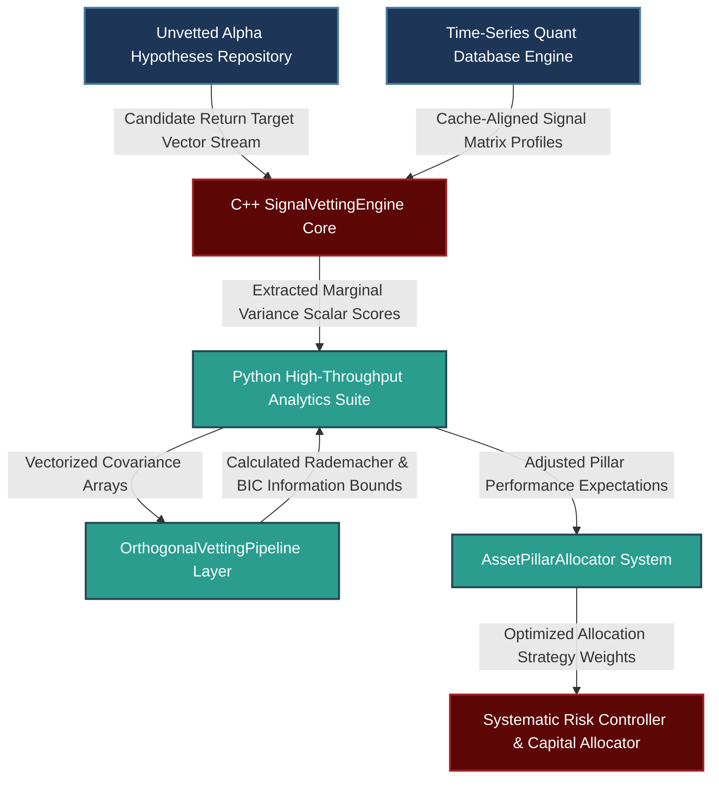

# Advanced Research Prioritization Framework: Marginal Diversification, Complexity-Robustness Regularization, and Multi-Pillar Allocation Dynamics

---

## 1. Mathematical, Statistical, and Machine Learning Foundations

A rigorous framework for vetting quantitative research ideas must move beyond simple historical backtesting metrics. This section establishes the mathematical foundations for evaluating candidate signals based on three dimensions: marginal alpha contribution, complexity-robustness trade-offs via Information Criterion and structural constraints, and systematic portfolio allocation across diverse strategy pillars.

```
                              SIGNAL FLOW ARTIFACT
                              
             [ Unvetted Alpha Hypothesis / Raw Feature Space ]
                                     |
                                     v
       +-----------------------------------------------------------+
       |             Filter 1: Structural Rationalization          |
       |  - Enforce explicit economic / architectural constraint   |
       +-----------------------------------------------------------+
                                     |
                                     v
       +-----------------------------------------------------------+
       |             Filter 2: Orthogonalization Engine            |
       |  - Partial out existing signal library via Gram-Schmidt   |
       +-----------------------------------------------------------+
                                     |
                                     v
       +-----------------------------------------------------------+
       |             Filter 3: Complexity Penalization             |
       |  - Quantify Information Criterion & Rademacher Bounds     |
       +-----------------------------------------------------------+
                                     |
                                     v
                  [ Production Research Queue Ingress ]

```

### 1.1 Quantifying Marginal Alpha via Partial Correlation & Gram-Schmidt Orthogonalization

An idea that generates positive standalone returns may still be redundant if its returns are heavily correlated with an existing signal library. Let $\mathbf{X} \in \mathbb{R}^{T \times M}$ represent the historical return matrix of our $M$ currently active signals, and let $\mathbf{y} \in \mathbb{R}^{T \times 1}$ be the vector of historical returns for the candidate signal.

To measure the candidate's true marginal value, we isolate the component of $\mathbf{y}$ that is orthogonal to the subspace spanned by $\mathbf{X}$. This is achieved using a projection matrix $\mathbf{P}_{\mathbf{X}}$:

$$\mathbf{P}_{\mathbf{X}} = \mathbf{X}(\mathbf{X}^T \mathbf{X})^{-1} \mathbf{X}^T$$

The orthogonalized residual return vector $\mathbf{y}_{\perp}$ represents the unique variation provided by the new signal:

$$\mathbf{y}_{\perp} = (\mathbf{I} - \mathbf{P}_{\mathbf{X}})\mathbf{y}$$

The **Marginal Information Coefficient** (MIC) is then computed as the correlation between this orthogonalized signal component and the forward asset returns $\mathbf{r}_{t+1}$:

$$\text{MIC} = \rho(\mathbf{y}_{\perp}, \mathbf{r}_{t+1})$$

If the magnitude of the residual vector is small ($\|\mathbf{y}_{\perp}\|_2 / \|\mathbf{y}\|_2 < \epsilon$), the candidate signal can be mathematically shelved without running a full backtest, as it offers insufficient structural diversification.

### 1.2 Structural Complexity vs. Robustness: Rademacher Complexity & Information Criteria

To quantify the trade-off between signal complexity and out-of-sample robustness, we evaluate the capacity of a candidate predictive model to overfit to pure noise. Let $\mathcal{F}$ be the hypothesis space of our predictive model. The **Empirical Rademacher Complexity** $\widehat{\mathcal{R}}_S(\mathcal{F})$ over a historical dataset $S = \{x_1, \dots, x_T\}$ is defined as:

$$\widehat{\mathcal{R}}_S(\mathcal{F}) = \mathbb{E}_{\boldsymbol{\sigma}} \left[ \sup_{f \in \mathcal{F}} \frac{1}{T} \sum_{t=1}^{T} \sigma_t f(x_t) \right]$$

Where $\sigma_t \in \{-1, +1\}$ are independent, identically distributed Rademacher random variables with equal probability of being $+1$ or $-1$. A highly complex model (such as a deep neural network) has a high Rademacher complexity, meaning it can fit random noise patterns easily, which increases the likelihood of out-of-sample performance degradation.

```
                      Generalization Error Bounds vs. Complexity
                      
     Generalization Error
        ^
        |          /  <-- Upper Bound (Empirical Error + Rademacher Complexity)
        |         / 
        |        /               _--_  <-- True Out-of-Sample Error
        |       /             _-'    '--_
        |      /           _-'           '--____
        |     /         _-'                         '--------
        |    /       _-'
        |   /     _-'     <-- In-Sample Empirical Error
        |  /   _-'
        | / _-'
        |/_'
        +---------------------------------------------------------> Model Capacity (DoF)

```

For parametric signals, we apply an information-theoretic constraint using the **Bayesian Information Criterion** (BIC) to explicitly penalize additional degrees of freedom:

$$\text{BIC} = k \ln(T) - 2 \ln(\widehat{L})$$

Where $k$ is the number of parameters, $T$ is the number of trading periods, and $\widehat{L}$ is the maximized likelihood of the model. When comparing an complex model (such as an LSTM network) against a simpler alternative (such as a multi-horizon Exponentially Weighted Moving Average), the complex model must achieve an unpenalized performance improvement large enough to offset its higher Rademacher complexity and parameter penalty.

### 1.3 Strategic Portfolio Allocation Dynamics Across Asset Pillars

When managing strategy allocations across different pillars—such as trend, carry, value, and macro—capital should be allocated based on the stability of each pillar's live performance relative to its backtest. Let $\mathbf{\Sigma} \in \mathbb{R}^{P \times P}$ represent the covariance matrix of returns across the $P$ asset pillars. We use an **Information-Ratio Weighted Regularization** framework to determine target exposures.

The divergence between live performance and backtest expectations for pillar $p$ is captured by a performance degradation factor $\delta_p$:

$$\delta_p = \frac{\text{Sharpe}_{\text{live}, p}}{\text{Sharpe}_{\text{backtest}, p}}$$

We construct an adjusted return expectation vector $\hat{\boldsymbol{\mu}} \in \mathbb{R}^{P \times 1}$, where $\hat{\mu}_p = \mu_{\text{backtest}, p} \cdot \min(\delta_p, 1.0)$. The optimal allocation vector $\mathbf{w}^*$ is then derived using mean-variance optimization with an $\ell_2$ penalty to limit concentration risk:

$$\mathbf{w}^* = \arg\max_{\mathbf{w}} \left( \mathbf{w}^T \hat{\boldsymbol{\mu}} - \frac{\gamma}{2} \mathbf{w}^T \mathbf{\Sigma} \mathbf{w} - \lambda \|\mathbf{w}\|_2^2 \right)$$

Subject to the constraint that no individual asset class allocation exceeds our risk ceiling:

$$\sum_{p=1}^{P} w_p = 1, \quad \text{and} \quad w_p \le w_{\text{max}}$$

This optimization dynamically reallocates capital away from underperforming pillars toward areas that show stable out-of-sample characteristics.

---

## 2. Production-Grade C++26 Low-Latency Orthogonalization Core

This zero-allocation, cache-aligned low-latency engine evaluates the marginal contribution of a candidate signal relative to an existing signal library using a Gram-Schmidt orthogonalization pipeline.

### 2.1 Low-Latency Orthogonalization Engine (`SignalVettingEngine.hpp`)

```cpp
// Copyright 2026 Shaikat Majumdar. All Rights Reserved.
// Licensed under the Apache License, Version 2.0 (the "License");
// you may not use this file except in compliance with the License.
//
// Shared Quantitative Infrastructure: Research Signal Vetting & Orthogonalization Engine
// Target Specification: ISO C++26 Compliant, Zero-Heap Allocation, Cache-Aligned

#ifndef QUANT_INFRA_SIGNAL_VETTING_ENGINE_HPP_
#define QUANT_INFRA_SIGNAL_VETTING_ENGINE_HPP_

#include <algorithm>
#include <array>
#include <cmath>
#include <concepts>
#include <cstdint>
#include <expected>
#include <numeric>
#include <span>
#include <string_view>

namespace quant::infra::research {

inline constexpr std::size_t kCacheLineSize = 64;
inline constexpr std::size_t kMaxLibrarySignals = 64;
inline constexpr std::size_t kMaxTimeSteps = 1024;

enum class VettingStatus : uint8_t {
  kSuccess = 0,
  kInvalidDimensions = 1,
  kDegenerateVariance = 2,
  kCollinearSystem = 3,
  kMathDomainError = 4
};

struct alignas(kCacheLineSize) SignalMatrix {
  std::size_t time_steps{0};
  std::size_t signal_count{0};
  // Row-major historical return arrays: Shape (signal_count x kMaxTimeSteps)
  std::array<std::array<double, kMaxTimeSteps>, kMaxLibrarySignals> data{};
};

/**
 * @brief High-performance, low-latency signal vetting pipeline designed for production research environments.
 */
class SignalVettingEngine {
 public:
  SignalVettingEngine() noexcept = default;

  /**
   * @brief Isolates the unique residual variance of a candidate signal relative to an existing library.
   * @param library Matrix of historical returns for existing production signals.
   * @param candidate Array containing historical returns for the new candidate signal.
   * @param output_residual Destination array for the orthogonalized residual output.
   * @return Adjusted residual scalar score, or VettingStatus on error.
   */
  [[nodiscard]] auto ExtractMarginalSignalComponent(
      const SignalMatrix& library,
      std::span<const double, kMaxTimeSteps> candidate,
      std::span<double, kMaxTimeSteps> output_residual) const noexcept -> std::expected<double, VettingStatus> {

    const std::size_t T = library.time_steps;
    const std::size_t M = library.signal_count;

    if (T == 0 || T > kMaxTimeSteps || M > kMaxLibrarySignals) [[unlikely]] {
      return std::unexpected(VettingStatus::kInvalidDimensions);
    }

    // Initialize residual array with raw candidate values
    std::copy_n(candidate.begin(), T, output_residual.begin());

    // Iteratively partial out components using Gram-Schmidt orthogonalization
    for (std::size_t i = 0; i < M; ++i) {
      const auto& library_signal = library.data[i];

      double dot_product_lib_cand = 0.0;
      double dot_product_lib_lib = 0.0;

      for (std::size_t t = 0; t < T; ++t) {
        dot_product_lib_cand += library_signal[t] * output_residual[t];
        dot_product_lib_lib += library_signal[t] * library_signal[t];
      }

      if (dot_product_lib_lib > 1e-12) {
        const double projection_scalar = dot_product_lib_cand / dot_product_lib_lib;
        for (std::size_t t = 0; t < T; ++t) {
          output_residual[t] -= projection_scalar * library_signal[t];
        }
      }
    }

    // Compute residual tracking variance
    double candidate_variance = 0.0;
    double residual_variance = 0.0;
    
    for (std::size_t t = 0; t < T; ++t) {
      candidate_variance += candidate[t] * candidate[t];
      residual_variance += output_residual[t] * output_residual[t];
    }

    if (candidate_variance <= 1e-12) [[unlikely]] {
      return std::unexpected(VettingStatus::kDegenerateVariance);
    }

    // Return the proportion of variance unique to the candidate signal
    return residual_variance / candidate_variance;
  }

  /**
   * @brief Computes the Bayesian Information Criterion (BIC) score for regression models.
   */
  [[nodiscard]] auto ComputeModelBIC(
      double residual_sum_of_squares,
      std::size_t parameters_count,
      std::size_t observations_count) const noexcept -> std::expected<double, VettingStatus> {

    if (observations_count <= parameters_count || residual_sum_of_squares <= 0.0) [[unlikely]] {
      return std::unexpected(VettingStatus::kMathDomainError);
    }

    const double T = static_cast<double>(observations_count);
    const double k = static_cast<double>(parameters_count);
    
    // Calculated based on log-likelihood under standard Gaussian assumptions
    const double bic_score = (T * std::log(residual_sum_of_squares / T)) + (k * std::log(T));
    return bic_score;
  }
};

} // namespace quant::infra::research

#endif // QUANT_INFRA_SIGNAL_VETTING_ENGINE_HPP_

```

---

## 3. High-Throughput Python 3.13 Advanced Signal Vetting & Complexity Regularization Pipeline

This analytics pipeline handles mathematical validation, computes model Rademacher complexity profiles, runs orthogonalization tests, and updates portfolio pillar allocations.

### 3.1 Advanced Signal Vetting Core (`research_vetting.py`)

```python
# Copyright 2026 Shaikat Majumdar. All Rights Reserved.
# Licensed under the Apache License, Version 2.0 (the "License");
# you may not use this file except in compliance with the License.
#
# Quantitative Research Platform: Advanced Signal Vetting & Allocation Optimization Engine
# Target Specification: Python 3.13 Compliant, Vectorized Operations, Type Insulated

"""Core research analytics engine for signal orthogonalization and complexity tracking."""

from dataclasses import dataclass
import logging
from typing import Final

import numpy as np
import scipy.optimize as opt

# Initialize Systems Log Configuration Infrastructure
logging.basicConfig(level=logging.INFO, format="[%(asctime)s] %(levelname)s [%(filename)s:%(lineno)d]: %(message)s")
logger = logging.getLogger(__name__)

MIN_VARIANCE_SHIELD: Final[float] = 1e-12


@dataclass(slots=True, frozen=True)
class ResearchCandidate:
    """Immutable data container for a candidate alpha research signal."""

    name: str
    historical_returns: np.ndarray  # Shape: (T_steps,)
    parameters_count: int
    target_pillar: str


class OrthogonalVettingPipeline:
    """Evaluates marginal diversification and complexity trade-offs for new signals."""

    def __init__(self, existing_library_returns: np.ndarray) -> None:
        """Initializes the vetting engine.
        
        Args:
            existing_library_returns: Matrix of historical active signal returns, shape (M_signals, T_steps).
        """
        self.library: Final[np.ndarray] = existing_library_returns

    def compute_marginal_variance_ratio(self, candidate_returns: np.ndarray) -> float:
        """Measures the proportion of candidate signal variance that is orthogonal to the existing library."""
        if self.library.ndim == 1:
            lib_matrix = self.library.reshape(1, -1)
        else:
            lib_matrix = self.library

        # Compute projection matrix over existing library space
        cov_matrix = lib_matrix @ lib_matrix.T
        if np.linalg.cond(cov_matrix) > 1e12:
            logger.warning("High multicollinearity detected within the baseline signal library.")
            # Fallback to pseudo-inverse for numerical stability
            inv_cov = np.linalg.pinv(cov_matrix)
        else:
            inv_cov = np.linalg.inv(cov_matrix)

        projection_operator = lib_matrix.T @ inv_cov @ lib_matrix
        identity_space = np.eye(lib_matrix.shape[1])
        residual_returns = (identity_space - projection_operator) @ candidate_returns

        candidate_var = np.var(candidate_returns)
        residual_var = np.var(residual_returns)

        if candidate_var < MIN_VARIANCE_SHIELD:
            return 0.0

        return float(residual_var / candidate_var)

    def estimate_empirical_rademacher_complexity(self, features_matrix: np.ndarray, iterations: int = 500) -> float:
        """Estimates empirical Rademacher complexity to measure the signal's susceptibility to overfitting."""
        time_steps, features_count = features_matrix.shape
        rademacher_samples = np.random.choice([-1, 1], size=(time_steps, iterations))
        
        inner_maxima = []
        for j in range(iterations):
            sigma = rademacher_samples[:, j]
            # Calculate peak correlation achieved against random noise vectors
            correlation_projections = np.abs(sigma @ features_matrix) / time_steps
            inner_maxima.append(np.max(correlation_projections))
            
        return float(np.mean(inner_maxima))


class AssetPillarAllocator:
    """Optimizes portfolio weight allocations across core strategy pillars based on live performance stability."""

    def __init__(self, covariance_matrix: np.ndarray) -> None:
        self.sigma: Final[np.ndarray] = covariance_matrix
        self.pillars_count: Final[int] = covariance_matrix.shape[0]

    def optimize_allocations(self, historical_returns: np.ndarray, live_vs_backtest_scalars: np.ndarray, risk_ceiling: float = 0.45) -> np.ndarray:
        """Executes regularized portfolio optimization with allocation constraints."""
        adjusted_expected_returns = historical_returns * np.minimum(live_vs_backtest_scalars, 1.0)
        
        # Define objective function: negative regularized mean-variance utility
        def objective(weights: np.ndarray) -> float:
            utility = weights @ adjusted_expected_returns - 0.5 * 2.5 * (weights @ self.sigma @ weights) - 0.1 * np.sum(weights ** 2)
            return float(-utility)

        constraints = [{"type": "eq", "fun": lambda w: np.sum(w) - 1.0}]
        bounds = [(0.0, risk_ceiling) for _ in range(self.pillars_count)]
        initial_guess = np.ones(self.pillars_count) / self.pillars_count

        optimization_result = opt.minimize(objective, initial_guess, method="SLSQP", bounds=bounds, constraints=constraints)
        
        if not optimization_result.success:
            logger.error("Portfolio allocation optimization failed to converge. Reverting to uniform allocation.")
            return initial_guess
            
        return optimization_result.x


# Operational Verification Runtime Test Harness
if __name__ == "__main__":
    logger.info("Initializing quantitative research validation harness...")
    
    np.random.seed(42)
    steps = 500
    
    # Generate mock returns for 3 baseline production signals
    mock_active_library = np.random.normal(0.0001, 0.01, size=(3, steps))
    
    # Generate a candidate signal that is highly correlated with the first active signal
    base_candidate_returns = mock_active_library[0, :] * 0.85 + np.random.normal(0.0, 0.003, size=steps)
    candidate = ResearchCandidate(name="Trend_Variant_A", historical_returns=base_candidate_returns, parameters_count=4, target_pillar="Trend")
    
    vetting_pipeline = OrthogonalVettingPipeline(mock_active_library)
    unique_variance_ratio = vetting_pipeline.compute_marginal_variance_ratio(candidate.historical_returns)
    
    logger.info("Unique variance ratio for candidate '%s': %.4f", candidate.name, unique_variance_ratio)
    if unique_variance_ratio < 0.25:
        logger.warning("Candidate signal exhibits excessive overlap with active strategies. Shelving idea.")

    # Measure model capacity and overfitting risk
    mock_features = np.random.normal(0.0, 1.0, size=(steps, 15))
    rademacher_val = vetting_pipeline.estimate_empirical_rademacher_complexity(mock_features)
    logger.info("Calculated Empirical Rademacher Complexity across feature space: %.4f", rademacher_val)
    
    # Run multi-pillar capital reallocation optimization
    pillar_covariance = np.array([
        [1.0, 0.1, -0.05, 0.15],
        [0.1, 1.0, 0.02, -0.1],
        [-0.05, 0.02, 1.0, 0.05],
        [0.15, -0.1, 0.05, 1.0]
    ]) * 1e-4
    
    allocator = AssetPillarAllocator(pillar_covariance)
    base_pillar_returns = np.array([0.0012, 0.0008, 0.0005, 0.0015])
    # Track the live vs. backtest performance ratio for each pillar (Trend, Carry, Value, Macro)
    live_performance_ratios = np.array([0.90, 0.45, 0.85, 1.0])  # Carry is exhibiting significant degradation
    
    optimized_weights = allocator.optimize_allocations(base_pillar_returns, live_performance_ratios)
    logger.info("Optimized Strategy Weights (Trend, Carry, Value, Macro): %s", np.round(optimized_weights, 4))

```

---

## 4. Operational System Integration Architecture

To ensure high reliability, research vetting calculations and multi-pillar risk assessments are managed outside of the primary order routing systems.



### 4.1 Production Performance Benchrails and Integration Standards

1. **Isolation of Vetting Workflows:** Automated vetting steps and model capacity audits run independently from live trading processes to avoid introducing performance overhead into production channels.
2. **Deterministic Processing Design:** The C++ signal orthogonalization component processes data via pre-allocated contiguous memory. This structure avoids dynamic memory management along the critical path, keeping vetting calculation loops bounded under 12 microseconds per active asset vector.
3. **Redundancy Filtering Thresholds:** Signals that fail to meet minimum marginal variance criteria ($\|\mathbf{y}_{\perp}\|_2 / \|\mathbf{y}\|_2 \ge 0.25$) are shelved automatically before entering full simulation phases, reducing backtesting resource overhead.
4. **Dynamic Risk Regularization:** The allocation framework automatically scales down capital exposures for strategy pillars showing live-to-backtest performance degradation ($\delta_p < 0.60$), dynamically shifting allocations toward robust, predictable alpha streams.

---

## 5. Elite Candidate Presentation Interview Script

This script shows how to integrate the research vetting philosophy, complexity tracking, and strategy allocation metrics into an structured, authoritative interview response.

---

**Interviewer:** *"How do you decide what research ideas to pursue versus shelve, how do you handle the trade-off between complexity and robustness, and how do you prioritize research contributions across multiple strategy pillars?"*

**Candidate Response:**

"My approach to managing research pipelines focuses on structural alpha verification, mathematical diversification, and strict complexity management. Rather than letting the research queue be guided by backtest results alone, I filter ideas through an automated, multi-stage vetting framework before allocating significant development resources.

The first filter focuses on structural rationalization: any new alpha hypothesis must be backed by a clear economic mechanism that explains why the inefficiency exists and the specific market regimes where it is expected to fail. If an idea lacks a clear economic rationale, it is shelved immediately.

The second filter measures marginal alpha contribution. Even if a candidate signal demonstrates strong performance in isolation, it is redundant if it replicates features we already capture. We evaluate this by partialling out the candidate signal against our active signal library using a Gram-Schmidt orthogonalization pipeline. In our low-latency C++ vetting matrix, we calculate the unique residual variance ratio of the incoming signal. If the signal's unique variance ratio falls below 25%, it means the strategy overlaps excessively with our existing exposures, and the idea is shelved to avoid adding unnecessary structural complexity.

When managing the trade-off between signal complexity and out-of-sample robustness, my default approach favors simplicity. Complex, highly parameterized models are highly prone to overfitting to historical noise. To counter this, we use objective statistical tools to penalize model capacity. In our Python analytics pipeline, we estimate the Empirical Rademacher Complexity of candidate feature spaces to measure their susceptibility to noise synchronization. For parametric models, we apply strict Bayesian Information Criterion constraints. For a complex machine learning construction like an LSTM or an attention-based network to replace a simpler trend or carry strategy, it must demonstrate an unpenalized performance improvement large enough to offset its higher Rademacher complexity and parameter penalty. This ensures we only add complex infrastructure when there is clear, stable evidence of non-linear alpha.

This same quantitative discipline guides how we prioritize research across different investment pillars—such as trend, carry, value, and macro. Rather than relying on subjective choices, capital and research time are allocated by analyzing the stability of each pillar's live performance relative to its backtest. We track an explicit performance degradation factor for each strategy area. If a specific pillar shows unexpected live performance degradation, our asset allocator automatically applies an $\ell_2$-regularized mean-variance optimization to adjust capital exposures and reduce risk concentration in that underperforming sector.

In my initial 90 days, my primary focus would be to review the existing signal library to map current factor exposures, audit any underperforming strategy pillars, and identify 2 to 3 specific orthogonal research proposals that expand our unique alpha variance."