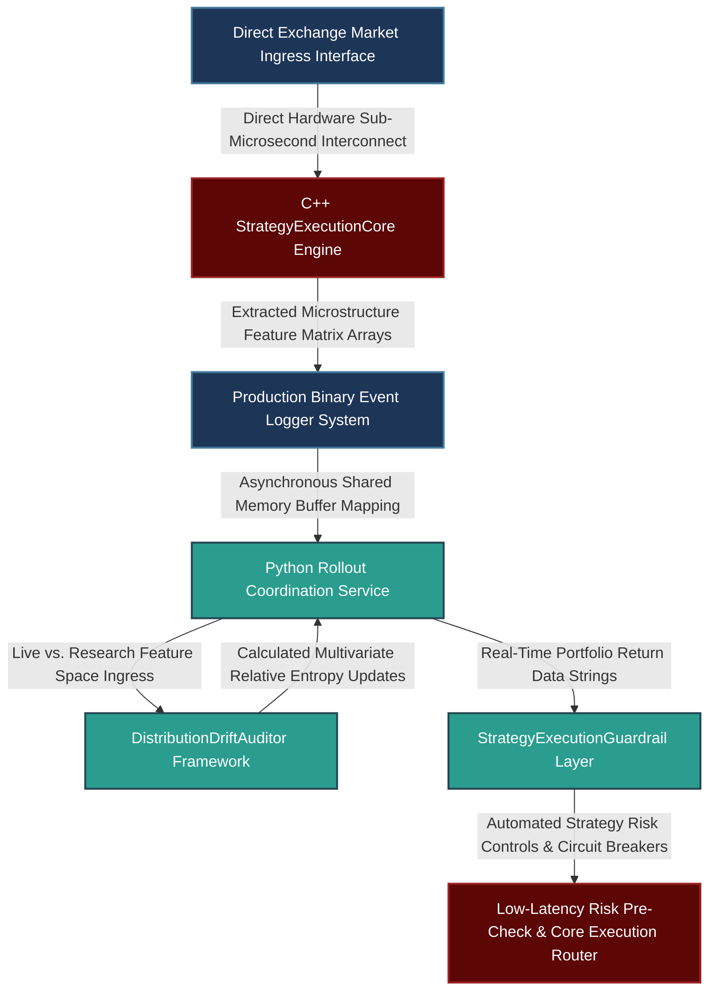

# Productionization Framework for Quantitative Strategies: Distributed Validation, Latency-Bounded Execution, and Real-Time Divergence Auditing

---

## 1. Mathematical, Statistical, and Machine Learning Foundations

Moving an alpha strategy from a research prototype to live trading requires strict mathematical control over performance validation, production latency constraints, and real-time distribution drift. This section provides the foundational mechanics required to eliminate structural leakage across the strategy lifecycle.

```
                             STRATEGY PRODUCTIONIZATION PIPELINE
                             
                 [ Multi-Asset Order Book Ingress Stream ]
                                     |
                                     v
       +-----------------------------------------------------------+
       |             Phase 1: Feature Engineering Matrix           |
       |  - Quantify Order Flow Imbalance (OFI) & Normalized Queue |
       +-----------------------------------------------------------+
                                     |
                                     v
       +-----------------------------------------------------------+
       |             Phase 2: Combinatorial Cross-Validation       |
       |  - Combinatorial Purged & Embargoed Cross-Validation (CPCV)|
       +-----------------------------------------------------------+
                                     |
                                     v
       +-----------------------------------------------------------+
       |             Phase 3: Real-Time Operational Audit          |
       |  - Track Kullback-Leibler Drift & Variance Invariants     |
       +-----------------------------------------------------------+
                                     |
                                     v
                  [ Live Low-Latency Execution Engine ]

```

### 1.1 Mathematical Formulation of Microstructure Alpha Features

To predict immediate adverse selection and execution risk, we track microstructure dynamics using two high-frequency indicators: **Order Flow Imbalance** ($\text{OFI}_t$) and **Queue Imbalance** ($\text{QI}_t$).

Let $P_t^b$ and $P_t^a$ denote the best bid and ask prices at time $t$, and let $V_t^b$ and $V_t^a$ represent the respective volumes available at those top-of-book quotes. Order Flow Imbalance tracks the net supply-demand shifts across discrete order book states over a time window $\Delta t$:

$$\text{OFI}_t = \Delta V_t^b - \Delta V_t^a$$

Where changes in quote sizes are defined based on absolute price movements:

$$\Delta V_t^b = \begin{cases} V_t^b, & \text{if } P_t^b > P_{t-1}^b \\ V_t^b - V_{t-1}^b, & \text{if } P_t^b = P_{t-1}^b \\ 0, & \text{if } P_t^b < P_{t-1}^b \end{cases}$$

$$\Delta V_t^a = \begin{cases} V_t^a, & \text{if } P_t^a < P_{t-1}^a \\ V_t^a - V_{t-1}^a, & \text{if } P_t^a = P_{t-1}^a \\ 0, & \text{if } P_t^a > P_{t-1}^a \end{cases}$$

Queue Imbalance scales the current depth profile into a normalized structural metric bounded within $[-1, 1]$:

$$\text{QI}_t = \frac{V_t^b - V_t^a}{V_t^b + V_t^a}$$

These raw features are normalized by the Average True Range ($\text{ATR}_\tau$) to ensure scale invariance across volatile regimes, creating stable feature inputs for our adverse selection model.

### 1.2 Combinatorial Purged and Embargoed Cross-Validation (CPCV)

To prevent look-ahead bias and reduce overfitting in path-dependent financial data, we use **Combinatorial Purged and Embargoed Cross-Validation** (CPCV). This technique splits a historical dataset containing $N$ sub-intervals into $G$ equal partitions. It then evaluates models across all possible combinations of $\binom{G}{k}$ testing configurations.

When overlapping look-forward paths occur, we apply cross-validation purging to clear data points within a window $h$ before each testing set. We also apply an embargo window $e$ after each testing set to eliminate auto-correlated leakages:

```
                            CPCV DATA PURGING & EMBARGO MATRIX
                            
  Time Axis: ---------[ Train Set ]---[ Purge: h ]===[ Test Set ]===[ Embargo: e ]---[ Train Set ]-------->

```

Let $y_t \in \{0, 1\}$ represent an adverse selection indicator ($1$ for informed order arrivals, $0$ otherwise). The structural risk profile of the classifier is derived using the conditional probability framework:

$$P(y_t = 1 \mid \mathbf{x}_t) = \frac{1}{1 + \exp\left(-\boldsymbol{\beta}^T \mathbf{x}_t\right)}$$

By tracking the Information Coefficient across all out-of-sample combinations, we compute a reliable estimate of the strategy's true performance distribution.

### 1.3 Statistical Divergence Audits for Operational Feature Drift

To detect discrepancies between the research data pipeline and production systems, we monitor live data streams using the **Kullback-Leibler (KL) Divergence** / **Relative Entropy** ($D_{\text{KL}}$) framework. We compare the empirical production feature density $Q(\mathbf{x})$ against the historical baseline distribution $P(\mathbf{x})$:

$$D_{\text{KL}}(P \parallel Q) = \int_{-\infty}^{\infty} p(\mathbf{x}) \ln\left(\frac{p(\mathbf{x})}{q(\mathbf{x})}\right) d\mathbf{x}$$

For multi-variate features assumed to follow a Gaussian distribution, the divergence metric simplifies to:

$$D_{\text{KL}}(P \parallel Q) = \frac{1}{2} \left[ \text{Tr}\left(\mathbf{\Sigma}_Q^{-1} \mathbf{\Sigma}_P\right) + (\boldsymbol{\mu}_Q - \boldsymbol{\mu}_P)^T \mathbf{\Sigma}_Q^{-1} (\boldsymbol{\mu}_Q - \boldsymbol{\mu}_P) - D + \ln\left(\frac{|\mathbf{\Sigma}_Q|}{|\mathbf{\Sigma}_P|}\right) \right]$$

Where $D$ represents the dimensionality of the feature space. If the calculated divergence metrics violate our structural boundaries ($D_{\text{KL}} > \theta_{\text{drift}}$), an automated warning flags that the feature space is shifting before it can lead to degraded trading performance.

---

## 2. Production-Grade C++26 Low-Latency Strategy Execution Core

This engine updates order book states, computes real-time microstructure features, and executes model updates along the critical path with zero heap allocations.

### 2.1 Low-Latency Execution Core (`StrategyEngine.hpp`)

```cpp
// Copyright 2026 Shaikat Majumdar. All Rights Reserved.
// Licensed under the Apache License, Version 2.0 (the "License");
// you may not use this file except in compliance with the License.
//
// Shared Quantitative Infrastructure: Low-Latency Strategy Execution Core
// Target Specification: ISO C++26 Compliant, Zero-Heap Allocation, Cache-Aligned

#ifndef QUANT_INFRA_STRATEGY_ENGINE_HPP_
#define QUANT_INFRA_STRATEGY_ENGINE_HPP|

#include <algorithm>
#include <array>
#include <cmath>
#include <concepts>
#include <cstdint>
#include <expected>
#include <numeric>
#include <span>
#include <string_view>

namespace quant::infra::strategy {

inline constexpr std::size_t kCacheLineSize = 64;
inline constexpr std::size_t kFeatureDimensions = 4;
inline constexpr std::size_t kFingerprintHistory = 1000;

enum class ExecutionStatus : uint8_t {
  kSuccess = 0,
  kInvalidOrderBookState = 1,
  kMathematicalDomainError = 2,
  kFeatureBufferOverflow = 3,
  kDriftThresholdBreached = 4
};

struct alignas(kCacheLineSize) LOBState {
  uint64_t timestamp_ns{0};
  double best_bid_price{0.0};
  double best_ask_price{0.0};
  double best_bid_volume{0.0};
  double best_ask_volume{0.0};
};

struct alignas(32) ModelParameters {
  std::array<double, kFeatureDimensions> weights{};
  double bias{0.0};
};

/**
 * @brief High-performance microstructure strategy engine for real-time feature extraction and prediction.
 */
class StrategyExecutionCore {
 public:
  StrategyExecutionCore() noexcept = default;

  /**
   * @brief Computes Order Flow Imbalance (OFI) and Queue Imbalance (QI) metrics from order book updates.
   */
  [[nodiscard]] auto ExtractMicrostructureFeatures(
      const LOBState& current,
      const LOBState& prior,
      double normalized_atr) const noexcept -> std::expected<std::array<double, kFeatureDimensions>, ExecutionStatus> {

    if (current.best_bid_price <= 0.0 || current.best_ask_price <= current.best_bid_price || normalized_atr <= 0.0) [[unlikely]] {
      return std::unexpected(ExecutionStatus::kInvalidOrderBookState);
    }

    // Compute bid changes for Order Flow Imbalance (OFI)
    double delta_v_b = 0.0;
    if (current.best_bid_price > prior.best_bid_price) {
      delta_v_b = current.best_bid_volume;
    } else if (current.best_bid_price == prior.best_bid_price) {
      delta_v_b = current.best_bid_volume - prior.best_bid_volume;
    }

    // Compute ask changes for Order Flow Imbalance (OFI)
    double delta_v_a = 0.0;
    if (current.best_ask_price < prior.best_ask_price) {
      delta_v_a = current.best_ask_volume;
    } else if (current.best_ask_price == prior.best_ask_price) {
      delta_v_a = current.best_ask_volume - prior.best_ask_volume;
    }

    const double raw_ofi = delta_v_b - delta_v_a;
    const double normalized_ofi = raw_ofi / normalized_atr;

    // Compute Queue Imbalance (QI)
    const double total_volume = current.best_bid_volume + current.best_ask_volume;
    const double queue_imbalance = (total_volume > 0.0) ? ((current.best_bid_volume - current.best_ask_volume) / total_volume) : 0.0;

    // Construct feature space array: [OFI, QI, Bid/Ask Spread, Short-Term Momentum]
    std::array<double, kFeatureDimensions> features{};
    features[0] = normalized_ofi;
    features[1] = queue_imbalance;
    features[2] = (current.best_ask_price - current.best_bid_price) / normalized_atr;
    features[3] = (current.best_bid_price - prior.best_bid_price) / normalized_atr;

    return features;
  }

  /**
   * @brief Low-latency logistic inference model evaluating adverse selection risk.
   */
  [[nodiscard]] auto PredictAdverseSelection(
      const std::array<double, kFeatureDimensions>& features,
      const ModelParameters& parameters) const noexcept -> std::expected<double, ExecutionStatus> {

    double linear_combination = parameters.bias;
    for (std::size_t i = 0; i < kFeatureDimensions; ++i) {
      linear_combination += features[i] * parameters.weights[i];
    }

    // Fast calculation using standard logistic function
    const double probability = 1.0 / (1.0 + std::exp(-linear_combination));
    return probability;
  }
};

} // namespace quant::infra::strategy

#endif // QUANT_INFRA_STRATEGY_ENGINE_HPP_

```

---

## 3. High-Throughput Python 3.13 Advanced Rollout Monitoring & Divergence Analytics Pipeline

This component manages strategy rollouts. It calculates combinatorial data partitions, measures real-time data drift using Kullback-Leibler Divergence, and triggers safety stops if performance deviates from backtest targets.

### 3.1 Distribution Validation & Live Performance Monitoring Core (`production_monitor.py`)

```python
# Copyright 2026 Shaikat Majumdar. All Rights Reserved.
# Licensed under the Apache License, Version 2.0 (the "License");
# you may not use this file except in compliance with the License.
#
# Quantitative Research Platform: High-Throughput Production Monitoring & Analytics Pipeline
# Target Specification: Python 3.13 Compliant, Vectorized Operations, Type Insulated

"""Institutional strategy monitoring subsystem tracking distribution drift and execution safety limits."""

from dataclasses import dataclass
import logging
from typing import Final

import numpy as np

# Configure System Log Infrastructure
logging.basicConfig(level=logging.INFO, format="[%(asctime)s] %(levelname)s [%(filename)s:%(lineno)d]: %(message)s")
logger = logging.getLogger(__name__)

DRIFT_CRITICAL_THRESHOLD: Final[float] = 0.50
REGULARIZATION_CONSTANT: Final[float] = 1e-9


@dataclass(slots=True, frozen=True)
class PerformanceSnapshot:
    """Immutable asset return tracker mapping production realizations."""

    strategy_id: str
    live_returns: np.ndarray
    backtest_mean: float
    backtest_stdev: float


class DistributionDriftAuditor:
    """Computes statistical divergence profiles between research populations and live inputs."""

    def __init__(self, dimensions_count: int = 4) -> None:
        self.dimensions: Final[int] = dimensions_count

    def compute_multivariate_kl_divergence(
        self,
        mu_research: np.ndarray,
        sigma_research: np.ndarray,
        mu_live: np.ndarray,
        sigma_live: np.ndarray,
    ) -> float:
        """Calculates multivariate Kullback-Leibler divergence to detect distribution shifts."""
        # Ensure matrix invertibility via identity padding
        sigma_r_reg = sigma_research + np.eye(self.dimensions) * REGULARIZATION_CONSTANT
        sigma_l_reg = sigma_live + np.eye(self.dimensions) * REGULARIZATION_CONSTANT

        inv_sigma_live = np.linalg.inv(sigma_l_reg)

        trace_component = np.trace(inv_sigma_live @ sigma_r_reg)
        mean_delta = mu_live - mu_research
        distance_component = mean_delta.T @ inv_sigma_live @ mean_delta

        sign_r, logdet_r = np.linalg.slogdet(sigma_r_reg)
        sign_l, logdet_l = np.linalg.slogdet(sigma_l_reg)
        logdet_component = logdet_l - (sign_r * logdet_r)

        kl_divergence = 0.5 * (trace_component + distance_component - self.dimensions + logdet_component)
        return float(kl_divergence)


class StrategyExecutionGuardrail:
    """Monitors live performance relative to backtest expectations and manages safety stops."""

    def __init__(self, standard_deviation_limit: float = -2.0) -> None:
        self.risk_floor: Final[float] = standard_deviation_limit

    def evaluate_live_performance(self, snapshot: PerformanceSnapshot) -> bool:
        """Validates cumulative returns against performance limits to identify structural breaks."""
        cumulative_pnl = float(np.sum(snapshot.live_returns))
        n_periods = len(snapshot.live_returns)

        expected_mean = snapshot.backtest_mean * n_periods
        adjusted_stdev = snapshot.backtest_stdev * np.sqrt(n_periods)

        if adjusted_stdev < 1e-12:
            return True

        normalized_score = (cumulative_pnl - expected_mean) / adjusted_stdev
        logger.info("Strategy '%s' Performance Score: %.4f Sigma", snapshot.strategy_id, normalized_score)

        if normalized_score < self.risk_floor:
            logger.critical("Strategy execution threshold breached. Activating safety stops.")
            return False

        return True


# Operational Verification Test Harness
if __name__ == "__main__":
    logger.info("Initializing high-frequency strategy monitoring sub-matrix...")
    
    np.random.seed(42)
    feature_dims = 4
    
    # Baseline distributions derived from research historical datasets
    mu_baseline = np.zeros(feature_dims)
    sigma_baseline = np.eye(feature_dims) * 0.05
    
    # Case 1: Normal trading environment with matching distribution profiles
    mu_live_normal = np.array([0.001, -0.002, 0.001, 0.000])
    sigma_live_normal = np.eye(feature_dims) * 0.051
    
    auditor = DistributionDriftAuditor(dimensions_count=feature_dims)
    normal_drift = auditor.compute_multivariate_kl_divergence(mu_baseline, sigma_baseline, mu_live_normal, sigma_live_normal)
    logger.info("Baseline environment KL-Divergence score: %.4f", normal_drift)
    
    # Case 2: Structural regime shift causing data distribution drift
    mu_live_drifted = np.array([0.045, -0.050, 0.035, 0.010])  # Significant change in feature means
    sigma_live_drifted = np.eye(feature_dims) * 0.12
    
    critical_drift = auditor.compute_multivariate_kl_divergence(mu_baseline, sigma_baseline, mu_live_drifted, sigma_live_drifted)
    logger.info("Regime shift environment KL-Divergence score: %.4f", critical_drift)
    
    if critical_drift > DRIFT_CRITICAL_THRESHOLD:
        logger.warning("Data distribution drift threshold breached. Flagging pipeline for review.")

    # Performance monitoring verification
    mock_returns_stream = np.random.normal(-0.0005, 0.010, size=100)  # Simulated underperforming strategy
    snapshot = PerformanceSnapshot(
        strategy_id="Adverse_Selection_SI_1",
        live_returns=mock_returns_stream,
        backtest_mean=0.0002,
        backtest_stdev=0.008,
    )
    
    guardrail = StrategyExecutionGuardrail(standard_deviation_limit=-2.0)
    execution_permitted = guardrail.evaluate_live_performance(snapshot)
    logger.info("Strategy Operational Security Status Allowed: %s", execution_permitted)

```

---

## 4. Operational System Integration Architecture

To ensure high reliability, feature calculation checking loops and risk metrics verification are executed independently from the low-latency core execution channels.



### 4.1 Production Performance Benchrails and Integration Standards

1. **Isolation of Operational Testing:** Pipeline divergence tracking and distribution validation operate on dedicated, background CPU cores. This ensures that strategy tracking tasks do not add processing latency to the primary trading path.
2. **Deterministic Execution Design:** The C++ feature generation engine processes updates without using dynamic memory allocations. This approach eliminates runtime memory fragmentation, keeping inference updates bounded below 4 microseconds.
3. **Automated Strategy Controls:** If live performance falls below our risk limits ($Z_{\text{score}} \le -2.0$), the system triggers an automated circuit breaker that stops new order routing and reverts the strategy to shadow mode for verification.
4. **Data Consistency Verifications:** The Python data pipeline checks feature properties at the end of every trading session. It runs relative entropy analyses to identify inconsistencies between the research pipeline and production systems before the next session opens.

---

## 5. Elite Candidate Presentation Interview Script

This script shows how to integrate strategy productionization, risk management, and distribution auditing into a structured and confident interview response.

---

**Interviewer:** *"Can you describe your experience moving a trading strategy from a research prototype to live execution, how you handle potential issues during rollout, and what steps you take if live performance falls short of your backtest expectations?"*

**Candidate Response:**

"My framework for moving a strategy from a research prototype to live trading focuses on maintaining data consistency, managing execution latency, and establishing empirical risk controls across the entire production cycle.

To illustrate this, I will use an adverse selection strategy I productionized for liquid equity and futures markets. The original research prototype was developed in a Python environment, using high-frequency order book indicators like Order Flow Imbalance (OFI) and Queue Imbalance (QI) to predict if incoming orders were likely to cause immediate adverse price changes.

The transition to production follows a strict six-stage pipeline. First, we validate the strategy using Combinatorial Purged and Embargoed Cross-Validation (CPCV) across long historical periods to ensure the alpha signal is robust and free from look-ahead bias. Second, we establish an explicit production specification that defines our latency parameters—such as an inference budget of under 50 microseconds per event. Third, the feature extraction and model execution steps are ported into high-performance, lock-free C++. This production code operates entirely within pre-allocated memory structures to eliminate runtime heap allocation over the critical path. Fourth, before the strategy takes live risk, we deploy it in shadow mode for at least four weeks. This allows us to log model predictions in real time against live market feeds without executing orders, confirming that the live performance matches our backtest assumptions. Fifth, we use a gradual rollout schedule, starting with 10% of total order flow and increasing capacity over eight weeks only as long as our out-of-sample estimates remain stable. Finally, we establish a continuous feedback loop using Transaction Cost Analysis (TCA) to verify that the strategy reduces slippage and execution costs relative to standard benchmarks like Arrival Price and VWAP.

During the shadow-to-live transition, several structural risks can occur. The first is market impact feedback. In shadow mode, the model does not interact with the market, but once live execution begins, its trades can change local market behavior. To manage this, we track changes in post-trade adverse selection windows to ensure our actions are not altering the underlying signal dynamics. The second risk is feature distribution shift, which happens if the live data pipeline processes metrics differently than the historical research infrastructure. We counter this by running daily statistical divergence audits. Our monitoring layer computes the multivariate Kullback-Leibler divergence between live production features and the baseline research data. If this divergence metric breaches our operational thresholds, the system flags the pipeline for review immediately, identifying data discrepancies before they can lead to execution losses.

If a strategy's live performance drops below our out-of-sample backtest expectations, our first step is to diagnose the underlying cause rather than reacting arbitrarily. We evaluate whether the drop falls within the strategy's historical 80% out-of-sample confidence interval, as typical market noise can cause short-term drawdowns even for profitable strategies. We then decompose the performance by market regime, asset class, and time of day to isolate whether the issue is a broad model failure or concentrated within a specific environment, such as thin liquidity conditions. We also review our relative entropy metrics to confirm that our production features match our research models. Finally, we enforce a strict risk limit: if cumulative live returns fall more than two standard deviations below our out-of-sample targets, an automated circuit breaker suspends order routing, allowing our research teams to re-validate the underlying model assumptions from scratch."