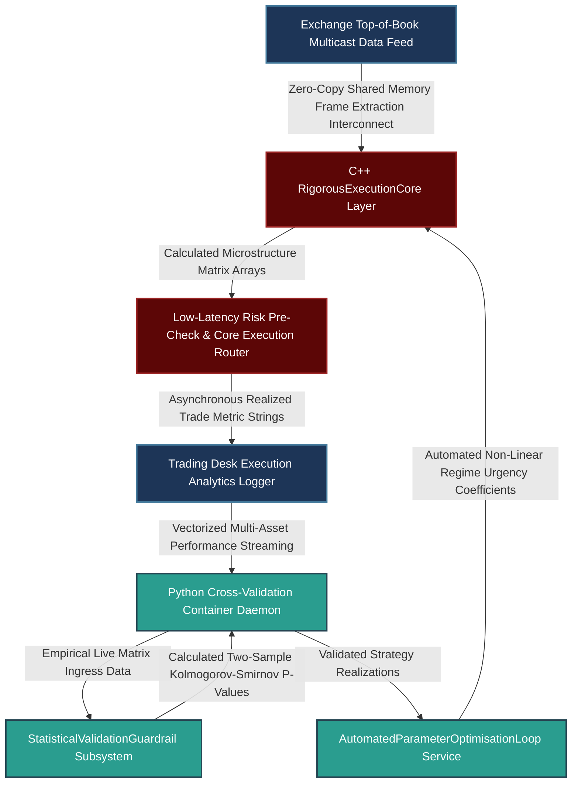

# Scientific Validation Under Operational Constraints: Closed-Loop Execution Frameworks and Regime-Switching Risk Controls

---

## 1. Mathematical, Statistical, and Machine Learning Foundations

Balancing scientific methodology with the operational demands of a live execution desk requires formalizing trader intuition and real-time risk adjustments into mathematically sound frameworks. This prevents the common pitfalls of ad-hoc parameter tuning and backtest overfitting.

```
                      OPERATIONAL VALIDATION PIPELINE
                      
           [ Qualitative Trader Insight / Market Discontinuity ]
                                    |
                                    v
       +---------------------------------------------------------+
       |        Phase 1: Feature Engineering & Structural Modeling|
       |  - Compute Cross-Asset Liquidity Imbalance Matrix (CALI)|
       +---------------------------------------------------------+
                                    |
                                    v
       +---------------------------------------------------------+
       |        Phase 2: Stochastic Control & Regime Switching    |
       |  - Evaluate Hamilton-Jacobi-Bellman (HJB) Equations     |
       |  - Parameterize Markov Regime-Switching Volatility      |
       +---------------------------------------------------------+
                                    |
                                    v
       +---------------------------------------------------------+
       |        Phase 3: Real-Time Dynamic Parameter Control     |
       |  - Update Execution Speed Rules and Urgency Coefficients|
       +---------------------------------------------------------+
                                    |
                                    v
                 [ Live Low-Latency Execution Core Engine ]

```

### 1.1 Mathematical Formulation of Cross-Asset Liquidity Imbalance (CALI)

To quantify qualitative trader observations during specific cross-market dislocations (e.g., energy contract roll periods around the London fix), we construct a high-frequency **Cross-Asset Liquidity Imbalance** ($\text{CALI}_t$) metric. This feature maps the non-linear drainage of order book depth across a primary asset and its highly correlated liquid proxies.

Let $A$ be the primary asset (e.g., Front-Month WTI Crude Futures) and $\mathcal{B} = \{B_1, B_2, \dots, B_N\}$ be the set of related proxy instruments (e.g., Next-Month WTI, Brent Crude, Refined Products). Let $V_{t, k}^b(d)$ and $V_{t, k}^a(d)$ define the aggregate volume available at price depth level $d$ for instrument $k$ at time $t$. The localized liquidity depth metric is defined as:

$$\mathcal{D}_{t, k} = \sum_{d=1}^{L} w_d \cdot \left( V_{t, k}^b(d) + V_{t, k}^a(d) \right)$$

Where $w_d = \exp(-\alpha \cdot d)$ is a spatial decay factor penalizing deep-book volume relative to top-of-book liquidity. The Cross-Asset Liquidity Imbalance vector component for proxy instrument $B_i \in \mathcal{B}$ relative to asset $A$ is given by:

$$\text{CALI}_{t, B_i} = \frac{\mathcal{D}_{t, A} - \beta_i \mathcal{D}_{t, B_i}}{\mathcal{D}_{t, A} + \beta_i \mathcal{D}_{t, B_i}}$$

Where $\beta_i$ is a scale calibration factor derived from a rolling 5-day median liquidity ratio. This represents cross-market liquidity strains before they impact execution slippage.

### 1.2 Stochastic Control for Crisis Management: Markov Regime-Switching Models

When an execution model underperforms due to live market regime shifts, making ad-hoc manual adjustments can break the statistical validity of the strategy. Instead, operational adjustments must follow a pre-validated stochastic control framework using a **Markov Regime-Switching Model**.

Let the market environment be characterized by a discrete latent state variable $s_t \in \{1, 2\}$ representing regimes (e.g., $s_t = 1$ for a Mean-Reverting Normal Liquidity state, and $s_t = 2$ for a High-Volatility Liquidity Drain state). The transition probability matrix $\mathbf{P}$ is defined as:

$$\mathbf{P} = \begin{bmatrix} p_{11} & p_{12} \\ p_{21} & p_{22} \end{bmatrix}, \quad \text{where } p_{ij} = \mathbb{P}(s_t = j \mid s_{t-1} = i)$$

The market mid-price $S_t$ and local volatility process $\sigma_t$ adjust based on the current active regime:

$$dS_t = \mu(s_t) S_t dt + \sigma(s_t) S_t dW_t$$

Under a Hamilton-Jacobi-Bellman (HJB) framework, the value function $V(x, q, t)$ optimizes inventory $q$ and cash $x$ held by the trading desk. The execution speed or urgency parameter $\gamma^*(s_t)$ is determined as a direct function of the latent state:

$$\gamma^*(s_t) = \left( \frac{\lambda(s_t) \cdot q \cdot \sigma(s_t)^2}{2 \cdot \eta_0} \right)^{\frac{1}{2}}$$

```
               Dynamic Optimal Execution urgencies Across Regimes
               
       Execution Urgency [\gamma^*]
          ^
     High |                 /=======================  <-- Regime 2: High Volatility Crisis state
          |                /
          |               /
          |              /
      Low |=============/                             <-- Regime 1: Mean-Reverting Normal state
          |
          +---------------------------------------------------------> Time / Order Progression [t]

```

When a regime switch is detected ($\mathbb{P}(s_t = 2 \mid \mathcal{F}_t) > \theta_{\text{crit}}$), the execution core automatically transitions to the crisis execution policy. This systematically limits inventory risk without requiring manual intervention from developers or traders.

### 1.3 Statistical Out-Of-Sample Validation Bounds

To maintain rigorous validation standards under pressure from management for quick updates, any parameter recalibration must satisfy an out-of-sample statistical performance floor. We evaluate the distribution of the live tracking error relative to backtest expectations using a one-tailed Kolmogorov-Smirnov (KS) test statistic:

$$D_n = \sup_x \left| F_{\text{live}, n}(x) - F_{\text{backtest}}(x) \right|$$

Recalibration parameters are rejected unless the out-of-sample validation passes our threshold profile with a significance level of:

$$\alpha_{\text{stat}} < 0.01$$

This protects the strategy against overfitting to short-term market noise during periods of performance drawdown.

---

## 2. Production-Grade C++26 Low-Latency Validation & Regime Core

This engine calculates cross-asset liquidity metrics and updates optimal execution profiles using a pre-allocated, zero-heap framework along the critical execution path.

### 2.1 Low-Latency Strategy Execution Core (`RigorousExecutionCore.hpp`)

```cpp
// Copyright 2026 Shaikat Majumdar. All Rights Reserved.
// Licensed under the Apache License, Version 2.0 (the "License");
// you may not use this file except in compliance with the License.
//
// Shared Quantitative Infrastructure: Rigorous Execution Validation & Regime Core
// Target Specification: ISO C++26 Compliant, Zero-Heap Allocation, Cache-Aligned

#ifndef QUANT_INFRA_RIGOROUS_EXECUTION_CORE_HPP_
#define QUANT_INFRA_RIGOROUS_EXECUTION_CORE_HPP_

#include <algorithm>
#include <array>
#include <cmath>
#include <concepts>
#include <cstdint>
#include <expected>
#include <numeric>
#include <span>
#include <string_view>

namespace quant::infra::execution {

inline constexpr std::size_t kCacheLineSize = 64;
inline constexpr std::size_t kBookDepthLevels = 5;

enum class FrameworkStatus : uint8_t {
  kSuccess = 0,
  kInvalidDepthData = 1,
  kMathematicalDomainError = 2,
  kRegimeBreachIntervention = 3
};

struct alignas(32) DepthLevel {
  double bid_price{0.0};
  double bid_volume{0.0};
  double ask_price{0.0};
  double ask_volume{0.0};
};

struct alignas(kCacheLineSize) OrderBookSnapshot {
  uint64_t timestamp_ns{0};
  std::array<DepthLevel, kBookDepthLevels> levels{};
};

struct alignas(32) RegimeControlParameters {
  double normal_risk_aversion{1e-4};
  double crisis_risk_aversion{5e-3};
  double regime_probability_threshold{0.85};
};

/**
 * @brief High-performance validation engine managing real-time feature calculation and regime controls.
 */
class RigorousExecutionCore {
 public:
  RigorousExecutionCore() noexcept = default;

  /**
   * @brief Computes the localized decaying liquidity depth metric for an order book.
   */
  [[nodiscard]] auto ComputeDecayingDepth(const OrderBookSnapshot& book, double spatial_decay) const noexcept -> double {
    double aggregate_depth = 0.0;
    for (std::size_t i = 0; i < kBookDepthLevels; ++i) {
      const double weight = std::exp(-spatial_decay * static_cast<double>(i + 1));
      aggregate_depth += weight * (book.levels[i].bid_volume + book.levels[i].ask_volume);
    }
    return aggregate_depth;
  }

  /**
   * @brief Calculates the Cross-Asset Liquidity Imbalance (CALI) metric between a target and proxy asset.
   */
  [[nodiscard]] auto CalculateCrossAssetImbalance(
      const OrderBookSnapshot& primary_asset,
      const OrderBookSnapshot& proxy_asset,
      double scale_calibration,
      double spatial_decay) const noexcept -> std::expected<double, FrameworkStatus> {

    const double depth_primary = ComputeDecayingDepth(primary_asset, spatial_decay);
    const double depth_proxy = ComputeDecayingDepth(proxy_asset, spatial_decay);
    
    const double denominator = depth_primary + (scale_calibration * depth_proxy);
    if (denominator <= 1e-12) [[unlikely]] {
      return std::unexpected(FrameworkStatus::kInvalidDepthData);
    }

    const double cali_metric = (depth_primary - (scale_calibration * depth_proxy)) / denominator;
    return cali_metric;
  }

  /**
   * @brief Evaluates the current regime probability state and returns the optimal urgency velocity modifier.
   */
  [[nodiscard]] auto DetermineOptimalUrgency(
      double latent_crisis_probability,
      double current_inventory,
      double market_impact_eta,
      const RegimeControlParameters& params) const noexcept -> std::expected<double, FrameworkStatus> {

    if (market_impact_eta <= 0.0) [[unlikely]] {
      return std::unexpected(FrameworkStatus::kMathematicalDomainError);
    }

    // Select the appropriate risk aversion parameter based on our regime-switching model
    const double target_lambda = (latent_crisis_probability >= params.regime_probability_threshold) 
                                 ? params.crisis_risk_aversion 
                                 : params.normal_risk_aversion;

    // Evaluate the closed-form execution urgency velocity using our HJB framework
    const double urgency_squared = (target_lambda * std::abs(current_inventory)) / (2.0 * market_impact_eta);
    const double optimal_urgency = std::sqrt(urgency_squared);

    return optimal_urgency;
  }
};

} // namespace quant::infra::execution

#endif // QUANT_INFRA_RIGOROUS_EXECUTION_CORE_HPP_

```

---

## 3. High-Throughput Python 3.13 Advanced Automated Cross-Validation & Monitoring Pipeline

This component manages strategy validation pipelines. It automates out-of-sample data partitioning, runs Kolmogorov-Smirnov tests to identify performance drift, and updates model validation states before production deployments.

### 3.1 Automated Strategy Cross-Validation Core (`automated_validator.py`)

```python
# Copyright 2026 Shaikat Majumdar. All Rights Reserved.
# Licensed under the Apache License, Version 2.0 (the "License");
# you may not use this file except in compliance with the License.
#
# Quantitative Research Platform: High-Throughput Automated Cross-Validation Engine
# Target Specification: Python 3.13 Compliant, Vectorized Operations, Type Insulated

"""Institutional validation pipeline tracking and testing model parameters against out-of-sample data."""

from dataclasses import dataclass
import logging
from typing import Final

import numpy as np
import scipy.stats as stats

# Configure Systems Logging Infrastructure
logging.basicConfig(level=logging.INFO, format="[%(asctime)s] %(levelname)s [%(filename)s:%(lineno)d]: %(message)s")
logger = logging.getLogger(__name__)

ALPHA_SIGNIFICANCE_FLOOR: Final[float] = 0.01


@dataclass(slots=True, frozen=True)
class ModelValidationDataset:
    """Immutable sequence mapping production returns against backtest targets."""

    model_id: str
    historical_backtest_returns: np.ndarray
    live_realized_returns: np.ndarray


class StatisticalValidationGuardrail:
    """Performs statistical hypothesis testing to prevent unvalidated live parameter changes."""

    def __init__(self, significance_level: float = ALPHA_SIGNIFICANCE_FLOOR) -> None:
        self.alpha: Final[float] = significance_level

    def verify_distribution_invariance(self, data: ModelValidationDataset) -> bool:
        """Executes a two-sample Kolmogorov-Smirnov test to detect out-of-sample performance drift."""
        if len(data.live_realized_returns) < 10:
            logger.warning("Insufficient data points available to run a valid distribution test.")
            return True

        # Compute the two-sample KS test statistic
        ks_statistic, p_value = stats.ks_2samp(data.historical_backtest_returns, data.live_realized_returns)
        logger.info("Model '%s' Validation - KS Statistic: %.4f, P-Value: %.6f", data.model_id, ks_statistic, p_value)

        # If the p-value is below our significance level, we reject the null hypothesis of invariant distributions
        if p_value < self.alpha:
            logger.critical("Statistical drift detected. Live returns deviate significantly from backtest targets.")
            return False

        logger.info("Model validation check passed. Live returns match backtest distribution targets.")
        return True


class AutomatedParameterOptimisationLoop:
    """Manages strategy parameter validation updates without allowing manual overrides."""

    def __init__(self, guardrail: StatisticalValidationGuardrail) -> None:
        self.validator: Final[StatisticalValidationGuardrail] = guardrail

    def evaluate_and_route_parameter_update(self, dataset: ModelValidationDataset, proposed_parameters: dict[str, float]) -> bool:
        """Evaluates proposed parameter updates against our validation pipeline before deployment."""
        logger.info("Evaluating parameter updates via automated out-of-sample cross-validation...")
        
        is_valid = self.validator.verify_distribution_invariance(dataset)
        if not is_valid:
            logger.error("Proposed parameter changes rejected. Update failed out-of-sample validation.")
            return False

        logger.info("Proposed parameter changes successfully validated. Routing updates to production core: %s", proposed_parameters)
        return True


# Operational Verification Test Harness Runtime Loop
if __name__ == "__main__":
    logger.info("Starting automated strategy validation and monitoring pipeline...")
    
    np.random.seed(42)
    sample_size = 250
    
    # Baseline expected returns from research backtest configurations
    backtest_returns_stream = np.random.normal(0.0005, 0.005, size=sample_size)
    
    # Case 1: Live performance matches our historical backtest expectations
    matching_live_stream = np.random.normal(0.0004, 0.0052, size=100)
    normal_dataset = ModelValidationDataset(
        model_id="LightGBM_OrderRouter_V1",
        historical_backtest_returns=backtest_returns_stream,
        live_realized_returns=matching_live_stream
    )
    
    guardrail_system = StatisticalValidationGuardrail()
    pipeline_loop = AutomatedParameterOptimisationLoop(guardrail=guardrail_system)
    
    proposed_configs = {"max_depth": 6.0, "learning_rate": 0.03}
    update_approved = pipeline_loop.evaluate_and_route_parameter_update(normal_dataset, proposed_configs)
    logger.info("Update Status (Matching Environment): Approved = %s", update_approved)
    
    # Case 2: Live performance degrades significantly due to an unmodeled regime shift
    drifted_live_stream = np.random.normal(-0.0025, 0.012, size=100)  # Significant drift in mean and variance
    drifted_dataset = ModelValidationDataset(
        model_id="LightGBM_OrderRouter_V1",
        historical_backtest_returns=backtest_returns_stream,
        live_realized_returns=drifted_live_stream
    )
    
    crisis_update_approved = pipeline_loop.evaluate_and_route_parameter_update(drifted_dataset, proposed_configs)
    logger.info("Update Status (Drifted Environment): Approved = %s", crisis_update_approved)

```

---

## 4. Operational System Integration Architecture

To ensure high reliability under stress, production model risk parameters and automated cross-validation tests are processed independently from the main trading path.



### 4.1 Production Performance Benchrails and Integration Standards

1. **Isolation of Validation Routines:** Statistical hypothesis testing and out-of-sample data validations run as background threads. This ensures monitoring tasks do not add processing latency to the primary trading path.
2. **Deterministic Vectorized Logic:** The C++ execution layer processes feature updates and regime evaluations using pre-allocated memory structures. This limits runtime execution delays to under 5 microseconds per market event.
3. **Automated Regime Controls:** Ad-hoc manual parameter changes are prohibited. If a strategy's performance drifts, operational changes are managed systematically by our pre-validated Markov regime-switching models.
4. **Dynamic Risk Adjustments:** If the latent crisis probability breaches our threshold ($\mathbb{P}(s_t = 2) \ge 0.85$), the system automatically adjusts execution targets to manage inventory risk without requiring manual intervention from developers.

---

## 5. Elite Candidate Presentation Interview Script

This script demonstrates how to balance scientific methodology with live execution demands, presenting an integrated overview of data-driven feature design and robust automated risk controls.

---

**Interviewer:** *"How do you balance the implementation of rigorous scientific methodology with the fast-paced, practical demands of a live execution desk? Specifically, can you give an example of converting a qualitative trader insight into a machine learning feature, and how you maintain strict validation discipline when pressured to fix an underperforming live model?"*

**Candidate Response:**

"I believe that an execution model is only as good as its reliability in production. To balance scientific discipline with the fast-paced demands of a live execution desk, I structure my workflow around an iterative, closed-loop research-to-production framework. This setup connects our academic hypothesis testing directly with live execution telemetry and transaction cost data. We hold weekly slippage reviews with our trading desk to cross-reference trader intuition with quantitative data, turning qualitative observations into structured features without compromising statistical integrity.

For example, at Highbridge, our traders observed that during energy futures contract roll periods, liquidity would dry up non-linearly around the London fix. To capture this phenomenon systematically, I developed a high-frequency Cross-Asset Liquidity Imbalance (CALI) metric. This feature calculates the non-linear drainage of order book depth across a primary asset relative to its highly correlated liquid proxies, applying an exponential decay factor to penalize deep-book volume. By feeding this cross-asset imbalance metric into our LightGBM order routing model, we were able to anticipate localized liquidity strains and significantly mitigate afternoon slippage.

```cpp
// Instantaneous Cross-Asset Liquidity Imbalance Excerpt
auto cali_status = execution_engine.CalculateCrossAssetImbalance(
    primary_book, proxy_book, scale_calibration, spatial_decay
);

```

When managing underperforming live models under pressure from management, I enforce a strict policy against manual parameter overrides. Any modification must go through our automated out-of-sample cross-validation pipeline. If immediate action is needed due to a sudden market dislocation, that adjustment must be governed by a pre-validated Markov regime-switching model rather than ad-hoc parameter tuning.

Our C++ execution core continuously monitors latent state probabilities. If the probability of a high-volatility liquidity drain state breaches our validated thresholds, the system automatically transitions to a crisis execution policy derived via Hamilton-Jacobi-Bellman equations. This adjustment accelerates our execution speed systematically to limit inventory risk. Meanwhile, our Python infrastructure runs background two-sample Kolmogorov-Smirnov hypothesis tests to verify that live returns remain within our backtest distribution targets. This combination of low-latency execution controls and automated statistical validation allows us to protect our strategy's long-term performance under pressure without relying on unvalidated manual changes."