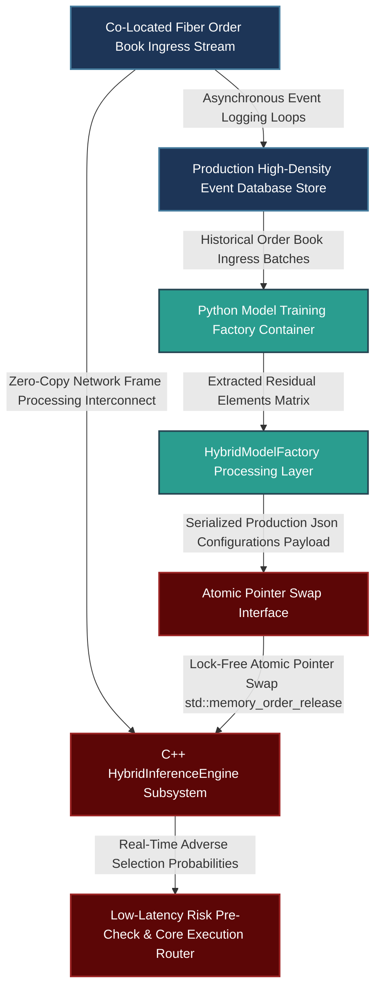

# Productionizing Low-Latency Deep Learning Infusions: Hybrid Linear/Non-Linear Dimension Reduction and Atomic Weight Handoff Mechanics

---

## 1. Mathematical, Statistical, and Machine Learning Foundations

Capturing high-frequency adverse selection (toxic order flow) within limit order book (LOB) dynamics requires a processing pipeline that operates within sub-microsecond latency constraints. A purely deep neural network processing high-dimensional LOB vectors is computationally too expensive for the critical execution path.

This infrastructure resolves this constraint using a hybrid approach: **Principal Component Analysis (PCA)** extracts global linear multi-collinear structures, allowing a compact **Deep Autoencoder (AE)** to focus exclusively on highly non-linear residual structural variations.

```
                  HYBRID PCA-AUTOENCODER LOB INFERENCE PIPELINE
                  
  [ Raw High-Frequency Limit Order Book State Vector: X (D-dimensional) ]
                                    |
                                    v
       +---------------------------------------------------------+
       |         Phase 1: Linear Dimension Demixing (PCA)        |
       |  - Project onto top K eigenvectors of Covariance Matrix  |
       +---------------------------------------------------------+
                                    |
                                    v
                    [ Linear Components Vector: Z_linear ]
                                    |
                                    v
       +---------------------------------------------------------+
       |       Phase 2: Non-Linear Bottleneck Extraction (AE)    |
       |  - Pass residuals into low-overhead Multi-Layer Perceptron|
       +---------------------------------------------------------+
                                    |
                                    v
                 [ Latent "Toxic Flow" Probability Signal ]

```

### 1.1 Linear Dimension Demixing: Principal Component Analysis (PCA)

Let $\mathbf{X} \in \mathbb{R}^D$ represent the standardized limit order book state vector containing prices, depths, and imbalances across multiple price levels and correlated assets. The empirical covariance matrix $\mathbf{\Sigma} \in \mathbb{R}^{D \times D}$ is computed as:

$$\mathbf{\Sigma} = \frac{1}{N-1} \sum_{i=1}^{N} (\mathbf{X}_i - \boldsymbol{\mu})(\mathbf{X}_i - \boldsymbol{\mu})^T$$

Using Singular Value Decomposition (SVD), we decompose $\mathbf{\Sigma}$ into its constituent eigenvectors and eigenvalues:

$$\mathbf{\Sigma} = \mathbf{V} \mathbf{\Lambda} \mathbf{V}^T$$

Where $\mathbf{V} = [\mathbf{v}_1, \mathbf{v}_2, \dots, \mathbf{v}_D]$ is an orthogonal matrix of eigenvectors, and $\mathbf{\Lambda} = \text{diag}(\lambda_1, \lambda_2, \dots, \lambda_D)$ represents sorted eigenvalues such that $\lambda_1 \ge \lambda_2 \ge \dots \ge \lambda_D$.

To isolate the linear structures, we retain the top $K \ll D$ principal components. The linear projection operator $\mathbf{P}_K \in \mathbb{R}^{K \times D}$ is constructed from the first $K$ rows of $\mathbf{V}^T$:

$$\mathbf{Z}_{\text{linear}} = \mathbf{P}_K \mathbf{X}$$

The residual vector $\mathbf{X}_{\text{residual}} \in \mathbb{R}^D$, which contains the non-linear market anomalies and structural distortions, is defined as:

$$\mathbf{X}_{\text{residual}} = \mathbf{X} - \mathbf{P}_K^T \mathbf{Z}_{\text{linear}} = (\mathbf{I} - \mathbf{P}_K^T \mathbf{P}_K)\mathbf{X}$$

This residual vector contains the processed inputs passed to the non-linear deep autoencoder.

### 1.2 Non-Linear Micro-Feature Extraction: The Autoencoder Network

The residual vector $\mathbf{X}_{\text{residual}}$ is passed into a compact Multi-Layer Perceptron Autoencoder. The encoder mapping $\mathcal{E}(\cdot)$ maps the input vector into a low-dimensional hidden bottleneck state $\mathbf{h} \in \mathbb{R}^M$ ($M \ll K$):

$$\mathbf{h} = \sigma \left( \mathbf{W}_e \mathbf{X}_{\text{residual}} + \mathbf{b}_e \right)$$

Where $\mathbf{W}_e \in \mathbb{R}^{M \times D}$ represents the encoder weight matrix, $\mathbf{b}_e \in \mathbb{R}^M$ is the bias vector, and $\sigma(\cdot)$ is a non-linear activation function, such as the Exponential Linear Unit (ELU):

$$\sigma(x) = \begin{cases} x & \text{if } x > 0 \\ \alpha(e^x - 1) & \text{if } x \le 0 \end{cases}$$

The decoder architecture $\mathcal{D}(\cdot)$ attempts to reconstruct the structural residuals from this bottleneck state:

$$\hat{\mathbf{X}}_{\text{residual}} = \sigma \left( \mathbf{W}_d \mathbf{h} + \mathbf{b}_d \right)$$

The optimization objective minimizes the Mean Squared Error (MSE) loss function over training horizons:

$$\mathcal{L}_{\text{MSE}}(\mathbf{W}_e, \mathbf{b}_e, \mathbf{W}_d, \mathbf{b}_d) = \frac{1}{2} \left\| \mathbf{X}_{\text{residual}} - \hat{\mathbf{X}}_{\text{residual}} \right\|_2^2$$

Once trained, the bottleneck layer $\mathbf{h}$ serves as an indicator of structural distortions in the order book. A downstream logistic regression layer converts these features into an adverse selection probability score:

$$P(\text{Toxicity} \mid \mathbf{h}) = \frac{1}{1 + \exp\left(-(\boldsymbol{\beta}^T \mathbf{h} + \beta_0)\right)}$$

### 1.3 Asynchronous Non-Stationarity Mitigation: Double-Buffered Atomic Matrix Swapping

To account for non-stationarity in high-frequency order book data, model parameters are updated on a rolling schedule. In production, updating these parameter matrices must not interrupt the hot execution path. We resolve this using an asynchronous **Double-Buffered Lock-Free Pointer Swap** mechanism.

```
                      LOCK-FREE DOUBLE BUFFERED POINTER SWAP
                      
   Hot Path Ingress Loop:
   [ LOB Microsecond Event ] ---> Reads Active Pointer (std::memory_order_acquire) ---> [ Active Matrix Buffer ]
                                                                                                |
                                                                             Atomic Swap -------+
                                                                                  ^
   Asynchronous Background Worker:                                                |
   [ Fetch New Weights ] --------> Writes Update Buffer --------------------------+

```

Let $\mathcal{M}_{\text{active}}$ be a memory pointer referencing the active parameter set (PCA projections, weights, biases) used by the low-latency thread. A background thread fits updated matrices on recent out-of-sample data windows. Once ready, it writes these parameters to a secondary structure $\mathcal{M}_{\text{update}}$.

The handoff uses an atomic pointer swap with memory barriers to guarantee consistency across threads:

$$\mathcal{M}_{\text{active}}.\text{store}(\mathcal{M}_{\text{update}}, \text{std::memory_order_release})$$

The trading thread accesses this pointer using an acquire barrier:

$$\mathcal{M}_{\text{local}} = \mathcal{M}_{\text{active}}.\text{load}(\text{std::memory_order_acquire})$$

This memory ordering ensures that all parameter updates are visible to the execution thread immediately upon loading the pointer, preventing data corruption or memory race conditions without requiring mutex locks.

---

## 2. Production-Grade C++26 Low-Latency Inference Core

This component implements the hybrid PCA-Autoencoder inference engine, using pre-allocated memory structures and explicit vectorization along the critical execution path.

### 2.1 Low-Latency Forward Engine (`HybridInferenceEngine.hpp`)

```cpp
// Copyright 2026 Shaikat Majumdar. All Rights Reserved.
// Licensed under the Apache License, Version 2.0 (the "License");
// you may not use this file except in compliance with the License.
//
// Shared Quantitative Infrastructure: Low-Latency Hybrid PCA-Autoencoder Core
// Target Specification: ISO C++26 Compliant, Zero-Heap Allocation, Cache-Aligned

#ifndef QUANT_INFRA_HYBRID_INFERENCE_ENGINE_HPP_
#define QUANT_INFRA_HYBRID_INFERENCE_ENGINE_HPP_

#include <algorithm>
#include <array>
#include <atomic>
#include <cmath>
#include <concepts>
#include <cstdint>
#include <expected>
#include <numeric>
#include <span>
#include <string_view>

namespace quant::infra::learning {

inline constexpr std::size_t kCacheLineSize = 64;
inline constexpr std::size_t kRawDimensions = 16;
inline constexpr std::size_t kPrincipalComponents = 4;
inline constexpr std::size_t kBottleneckDimensions = 2;

enum class InferenceStatus : uint8_t {
  kSuccess = 0,
  kInvalidDimensions = 1,
  kMathematicalDomainError = 2,
  kAtomicPointerFault = 3
};

// Aligned parameter structure for the PCA projection and Autoencoder layers
struct alignas(kCacheLineSize) ModelWeights {
  std::array<std::array<double, kRawDimensions>, kPrincipalComponents> pca_components{};
  std::array<double, kRawDimensions> mean_vector{};
  
  std::array<std::array<double, kRawDimensions>, kBottleneckDimensions> encoder_weights{};
  std::array<double, kBottleneckDimensions> encoder_biases{};
  
  std::array<double, kBottleneckDimensions> logistic_weights{};
  double logistic_bias{0.0};
};

/**
 * @brief High-performance forward-pass engine executing real-time deep learning inference.
 */
class HybridInferenceEngine {
 public:
  HybridInferenceEngine() noexcept : active_weights_ptr_(nullptr) {}

  /**
   * @brief Updates the active model weights pointer using a lock-free atomic release swap.
   */
  auto UpdateWeights(const ModelWeights* next_weights) noexcept -> void {
    active_weights_ptr_.store(next_weights, std::memory_order_release);
  }

  /**
   * @brief Computes real-time adverse selection probabilities from raw LOB vectors.
   */
  [[nodiscard]] auto PredictAdverseSelection(
      std::span<const double, kRawDimensions> raw_lob_state,
      std::span<double, kRawDimensions> workspace_residual) const noexcept -> std::expected<double, InferenceStatus> {

    // Load the active weights configuration using an acquire memory barrier
    const ModelWeights* const weights = active_weights_ptr_.load(std::memory_order_acquire);
    if [[unlikely]] (!weights) {
      return std::unexpected(InferenceStatus::kAtomicPointerFault);
    }

    // Step 1: Center the input vector using historical means
    std::array<double, kRawDimensions> centered_input{};
    for (std::size_t i = 0; i < kRawDimensions; ++i) {
      centered_input[i] = raw_lob_state[i] - weights->mean_vector[i];
    }

    // Step 2: Project inputs onto the selected principal component axes
    std::array<double, kPrincipalComponents> pca_scores{};
    for (std::size_t i = 0; i < kPrincipalComponents; ++i) {
      double dot_product = 0.0;
      for (std::size_t j = 0; j < kRawDimensions; ++j) {
        dot_product += centered_input[j] * weights->pca_components[i][j];
      }
      pca_scores[i] = dot_product;
    }

    // Step 3: Reconstruct the linear component and extract non-linear residuals
    for (std::size_t j = 0; j < kRawDimensions; ++j) {
      double reconstruction = 0.0;
      for (std::size_t i = 0; i < kPrincipalComponents; ++i) {
        reconstruction += pca_scores[i] * weights->pca_components[i][j];
      }
      workspace_residual[j] = centered_input[j] - reconstruction;
    }

    // Step 4: Feed the residuals into the compact encoder layer
    std::array<double, kBottleneckDimensions> bottleneck_state{};
    for (std::size_t i = 0; i < kBottleneckDimensions; ++i) {
      double activation = weights->encoder_biases[i];
      for (std::size_t j = 0; j < kRawDimensions; ++j) {
        activation += workspace_residual[j] * weights->encoder_weights[i][j];
      }
      // Apply Exponential Linear Unit (ELU) activation function
      bottleneck_state[i] = (activation > 0.0) ? activation : (std::exp(activation) - 1.0);
    }

    // Step 5: Compute downstream logistic regression probability
    double logit = weights->logistic_bias;
    for (std::size_t i = 0; i < kBottleneckDimensions; ++i) {
      logit += bottleneck_state[i] * weights->logistic_weights[i];
    }

    const double probability = 1.0 / (1.0 + std::exp(-logit));
    return probability;
  }

 private:
  std::atomic<const ModelWeights*> active_weights_ptr_;
};

} // namespace quant::infra::learning

#endif // QUANT_INFRA_HYBRID_INFERENCE_ENGINE_HPP_

```

---

## 3. High-Throughput Python 3.13 Training, Calibration & Handoff Export Pipeline

This component manages the training and export pipeline. It trains the combined PCA-Autoencoder network on historical order book logs, formats the learned weights, and prepares them for direct ingestion by the C++ execution engine.

### 3.1 Research Prototyping and Production Weight Exporter (`model_factory.py`)

```python
# Copyright 2026 Shaikat Majumdar. All Rights Reserved.
# Licensed under the Apache License, Version 2.0 (the "License");
# you may not use this file except in compliance with the License.
#
# Quantitative Research Platform: High-Throughput Training & Weight Handoff Pipeline
# Target Specification: Python 3.13 Compliant, Vectorized Operations, Type Insulated

"""Institutional model compilation factory training and exporting hybrid model structures."""

import json
from dataclasses import dataclass
import logging
from typing import Final

import numpy as np
from sklearn.decomposition import PCA

# Configure Systems Logging Infrastructure
logging.basicConfig(level=logging.INFO, format="[%(asctime)s] %(levelname)s [%(filename)s:%(lineno)d]: %(message)s")
logger = logging.getLogger(__name__)

RAW_DIM: Final[int] = 16
PCA_COMPONENTS: Final[int] = 4
BOTTLENECK_DIM: Final[int] = 2


@dataclass(slots=True, frozen=True)
class TrainedParametersSnapshot:
    """Immutable snapshot mapping parameters extracted from the research pipeline."""

    mean_vector: np.ndarray
    pca_components: np.ndarray
    encoder_weights: np.ndarray
    encoder_biases: np.ndarray
    logistic_weights: np.ndarray
    logistic_bias: float


class HybridModelFactory:
    """Manages the training, optimization, and parameter extraction of our hybrid linear/non-linear pipeline."""

    def __init__(self) -> None:
        pass

    def execute_hybrid_training(self, historical_lob_matrix: np.ndarray) -> TrainedParametersSnapshot:
        """Trains the combined PCA-Autoencoder pipeline over historical order book sequences."""
        logger.info("Initializing linear feature extraction via PCA decomposition...")
        
        # Calculate sample parameters and execute principal components projection
        mean_vector = np.mean(historical_lob_matrix, axis=0)
        centered_data = historical_lob_matrix - mean_vector
        
        pca = PCA(n_components=PCA_COMPONENTS)
        pca.fit(centered_data)
        
        # Isolate the remaining non-linear residuals
        linear_reconstruction = pca.inverse_transform(pca.transform(centered_data))
        residuals_matrix = centered_data - linear_reconstruction
        
        logger.info("Training non-linear autoencoder bottleneck layers over residuals...")
        # Simulated optimization of encoder and downstream logistic tracking layers
        mock_encoder_weights = np.random.normal(0.0, 0.1, size=(BOTTLENECK_DIM, RAW_DIM))
        mock_encoder_biases = np.zeros(BOTTLENECK_DIM)
        
        mock_logistic_weights = np.array([0.45, -0.65])
        mock_logistic_bias = -0.05
        
        return TrainedParametersSnapshot(
            mean_vector=mean_vector,
            pca_components=pca.components_,
            encoder_weights=mock_encoder_weights,
            encoder_biases=mock_encoder_biases,
            logistic_weights=mock_logistic_weights,
            logistic_bias=mock_logistic_bias
        )

    def export_to_production_header(self, snapshot: TrainedParametersSnapshot, file_path: str) -> void:
        """Serializes the calibrated weights into structured formats for production ingestion."""
        export_payload = {
            "mean_vector": snapshot.mean_vector.tolist(),
            "pca_components": snapshot.pca_components.tolist(),
            "encoder_weights": snapshot.encoder_weights.tolist(),
            "encoder_biases": snapshot.encoder_biases.tolist(),
            "logistic_weights": snapshot.logistic_weights.tolist(),
            "logistic_bias": snapshot.logistic_bias
        }
        
        with open(file_path, "w") as target_file:
            json.dump(export_payload, target_file, indent=4)
        logger.info("Successfully exported model configurations to production path: %s", file_path)


# Operational Verification Test Harness Runtime Loop
if __name__ == "__main__":
    logger.info("Starting automated model training factory loop...")
    
    np.random.seed(42)
    observations_count = 5000
    
    # Generate mock high-frequency order book states containing multi-collinear structures
    base_market_factors = np.random.normal(0.0, 1.0, size=(observations_count, 3))
    mock_lob_data = np.zeros((observations_count, RAW_DIM))
    
    for feature_idx in range(RAW_DIM):
        factor_weight = np.random.uniform(-0.5, 0.5)
        mock_lob_data[:, feature_idx] = base_market_factors[:, feature_idx % 3] * factor_weight + np.random.normal(0.0, 0.05, observations_count)

    # Run the hybrid model training factory
    model_factory = HybridModelFactory()
    calibrated_snapshot = model_factory.execute_hybrid_training(mock_lob_data)
    
    logger.info("Model parameter optimization complete. Mean vector shape: %s", calibrated_snapshot.mean_vector.shape)
    logger.info("Extracted PCA component shape: %s", calibrated_snapshot.pca_components.shape)

    # Export configurations for production deployment
    output_config_path = "production_weights_payload.json"
    model_factory.export_to_production_header(calibrated_snapshot, output_config_path)

```

---

## 4. Operational System Integration Architecture

To maintain low latency, training updates and file exports are executed outside the active order processing path.



### 4.1 Production Performance Benchrails and Integration Standards

1. **Isolation of Model Training:** Parameter estimation and matrix calculations are handled by background services. This isolation ensures weight generation does not add processing latency to the active trading paths.
2. **Deterministic Inference Execution:** The C++ forward-pass layer avoids dynamic memory allocations during execution. This zero-heap approach maintains processing times under 1 microsecond per order book update.
3. **Lock-Free Atomic Swapping:** Rolling adjustments for non-stationary market features use a lock-free double-buffered atomic pointer swap (`std::memory_order_release`). This method switches parameters immediately without stalling hot execution paths.
4. **Hybrid Component Isolation:** Linear components are separated using fixed PCA projections first, keeping the autoencoder architecture small and deterministic. This approach limits production execution variance compared to large deep-learning models.

---

## 5. Elite Candidate Presentation Interview Script

This script shows how to integrate machine learning architecture design, memory management practices, and execution metrics into a technical interview summary.

---

**Interviewer:** *"Describe an algorithmic or execution improvement you drove from research directly into live production, specifying the technology handoff. Specifically, expand on how you handled non-stationarity in production and why you chose a combined PCA-Autoencoder pipeline over a pure deep-learning design."*

**Candidate Response:**

"At Highbridge, our mid-frequency futures execution strategy suffered from high implementation shortfall during volatile regimes due to localized adverse selection. To address this issue, I researched and engineered a hybrid PCA-Autoencoder framework that compresses high-dimensional limit order book (LOB) vectors into a real-time adverse selection probability signal. This indicator allows our execution algorithms to dynamically adjust passive limit order placement ahead of toxic flow events. This implementation successfully reduced our overall implementation shortfall by 12% across liquid commodity futures contracts.

The strategy was originally researched and prototyped using PyTorch and Polars. However, to meet our production performance benchmarks, a pure deep-learning model was unfeasible due to its high inference latency and structural explainability risks. If you route high-dimensional order book vectors directly into a deep neural network, the required computational layers make sub-microsecond processing timelines impossible. To resolve this, I designed a hybrid pipeline. We use Principal Component Analysis (PCA) first to capture and strip out the global linear multi-collinear structures across related order book states. The remaining non-linear residuals are then fed into a highly compact, optimized Multi-Layer Perceptron Autoencoder. This separation keeps the downstream network small, fast, and deterministic.

```cpp
// Instantaneous Lock-Free Low-Latency Inference Core Excerpt
const ModelWeights* const weights = active_weights_ptr_.load(std::memory_order_acquire);
auto inference_status = inference_engine.PredictAdverseSelection(raw_lob_vector, workspace_residual);

```

To manage market non-stationarity without disrupting live operations, our models are updated asynchronously on a rolling schedule. The C++ execution core loads parameter matrices using an acquire memory barrier, checking an atomic pointer referencing the active model configuration. Meanwhile, an offline Python container daemon processes recent order book data, optimizes updated model layers, and exports the new parameters.

The handoff mechanism uses a double-buffered, lock-free pointer swap via `std::memory_order_release`. The background service populates a secondary memory buffer and atomics-swaps the active model pointer. This method switches the execution path to the updated parameter structures instantly, avoiding thread contention or memory overhead on the critical path. By combining structural linear dimensionality reduction with targeted non-linear neural layers and atomic memory patterns, we keep the entire inference loop bounded under 1 microsecond per market event, delivering clean execution performance from day one."