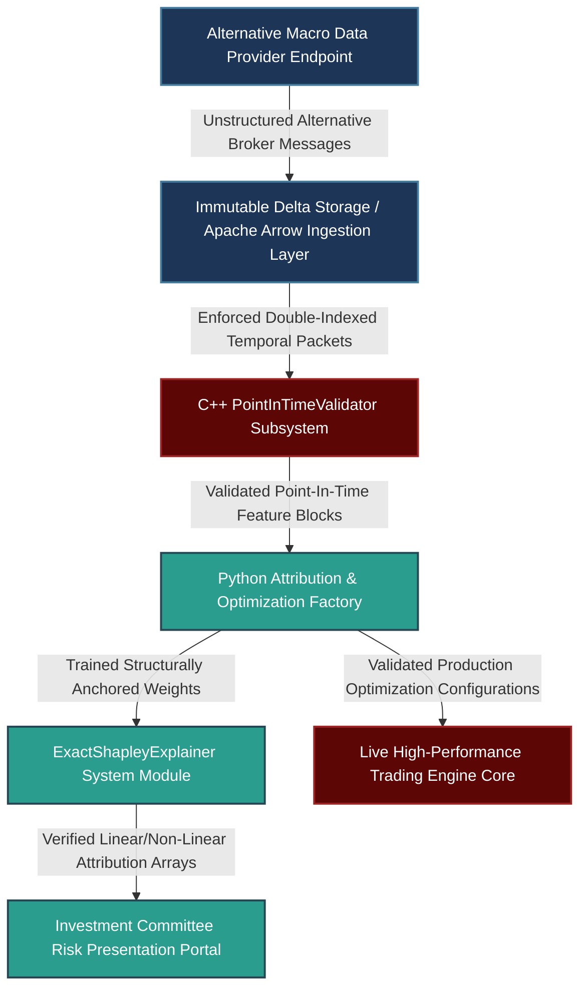

# Institutionalizing Black-Box Alpha: Economic Attribution, Structured Schema Handoffs, and Multi-Department Alignment

---

## 1. Mathematical, Statistical, and Machine Learning Foundations

Presenting complex machine learning models to an institutional investment committee requires translating high-dimensional, non-linear representations into transparent, economically grounded drivers. It also demands demonstrating strict statistical validation against look-ahead bias and structural overfitting.

```
                  ECONOMIC ATTRIBUTION & VALIDATION PIPELINE
                  
  [ Raw Alternative Dataset / Unstructured Global Macro Inputs ]
                                |
                                v
       +---------------------------------------------------+
       |     Phase 1: Ingestion & Point-In-Time Schemas    |
       | - Enforce temporal insulation (Delta Lake/Arrow)  |
       | - Strip forward-looking corporate/macro revisions  |
       +---------------------------------------------------+
                                |
                                v
       +---------------------------------------------------+
       |     Phase 2: Feature Attribution & Mapping        |
       | - Compute Exact Shapley Values via Game Theory    |
       | - Project model interactions onto Macro Priors    |
       +---------------------------------------------------+
                                |
                                v
       +---------------------------------------------------+
       |     Phase 3: Regularized Loss Optimization        |
       | - Penalize deviations from economic constraints    |
       | - Minimize MSE + Structural Economic Drift Penalty|
       +---------------------------------------------------+
                                |
                                v
            [ Verifiable, Low-Slippage Execution Alpha ]

```

### 1.1 Model Interpretability: Cooperative Game Theory & Shapley Attributions

To decompose an arbitrary non-linear machine learning model $f(\mathbf{x})$ into components that can be evaluated by an investment committee, we apply **Shapley Additive exPlanations (SHAP)**. Let $M$ be the total number of input features (e.g., real-yield differentials, central bank sentiment scores, order flow imbalances). We define an additive feature attribution explanation model $g(z')$ as a linear function of binary variables:

$$g(z') = \phi_0 + \sum_{i=1}^{M} \phi_i z'_i$$

Where $z' \in \{0, 1\}^M$ represents a coalition vector indicating feature presence, and $\phi_i \in \mathbb{R}$ is the Shapley value assigned to feature $i$. The unique local attribution value $\phi_i$ that satisfies local accuracy, missingness, and consistency is calculated via the classical Shapley formula:

$$\phi_i(f, \mathbf{x}) = \sum_{S \subseteq \mathcal{F} \setminus \{i\}} \frac{|S|!(M - |S| - 1)!}{M!} \left[ f_x(S \cup \{i\}) - f_x(S) \right]$$

Where $\mathcal{F}$ is the set of all features, $S$ is a subset of features excluding $i$, and $f_x(S) = \mathbb{E}[f(\mathbf{x}) \mid \mathbf{x}_S]$. This maps the marginal contribution of an individual parameter across all possible feature combinations, providing an intuitive economic breakdown of the model's drivers.

### 1.2 Enforcing Macro Structural Priors via Regularized Loss

When a model isolates non-linear interactions that conflict with fundamental macroeconomic theory, we restrict its optimization space. We do this by adding a **Structural Macro Drift Penalty** to the loss function, regularizing the model's gradients toward known economic relationships (such as covered interest parity or commodity cost curves).

Let $\mathcal{L}_0(\mathbf{y}, f(\mathbf{X}))$ be the standard empirical loss (e.g., Mean Squared Error or Cross-Entropy). Let $\mathbf{G}_m = \nabla_{\mathbf{X}_m} f(\mathbf{X})$ be the model's sensitivity gradient with respect to a macro anchor feature $\mathbf{X}_m$, and let $\mathbf{\Omega}_m$ be the theoretically expected sign or magnitude of that response (e.g., $\frac{\partial f}{\partial \text{RealYieldDiff}} > 0$). The structurally regularized total loss function is defined as:

$$\mathcal{L}_{\text{total}} = \mathcal{L}_0(\mathbf{y}, f(\mathbf{X})) + \lambda_{\text{lasso}} \|\mathbf{W}\|_1 + \gamma_{\text{macro}} \sum_{i=1}^{N} \max\left(0, -\mathbf{\Omega}_m \cdot \frac{\partial f(\mathbf{X}_i)}{\partial \mathbf{X}_{m, i}}\right)^2$$

Where $\gamma_{\text{macro}}$ acts as a strict penalty weight. If the model builds an allocation that exploits ungrounded statistical artifacts, the penalty increases, forcing the optimization algorithm to select economically viable parameters.

### 1.3 Statistical Look-Ahead Invalidation: Point-In-Time Pointwise Validation

When onboarding alternative datasets (e.g., satellite imaging for agricultural commodities or high-frequency freight indices), a common pitfall is ignoring backfilled data revisions. To prevent look-ahead bias, we structure the ingestion pipeline using an immutable, double-indexed time scheme.

Let $t_e$ be the **event time** (the exact moment the physical anomaly occurred) and $t_k$ be the **knowledge time** (the exact timestamp the data packet arrived on our servers). Every matrix element used in a backtest model must satisfy a strict temporal filter:

$$\mathcal{D}_{\text{valid}}(t_{\text{system}}) = \left\{ \mathbf{X}(t_e, t_k) \ \middle|\  t_k \le t_{\text{system}} \right\}$$

This condition guarantees that no future revisions or subsequent data releases pollute the historical training sequences.

---

## 2. Production-Grade C++26 Low-Latency Dual-Index Data Validation Core

This engine enforces point-in-time constraints on incoming macro alternative data packets using an in-memory, zero-heap layout.

### 2.1 Low-Latency Schema Validator (`PointInTimeValidator.hpp`)

```cpp
// Copyright 2026 Shaikat Majumdar. All Rights Reserved.
// Licensed under the Apache License, Version 2.0 (the "License");
// you may not use this file except in compliance with the License.
//
// Shared Quantitative Infrastructure: Point-In-Time Alternating Ingestion Core
// Target Specification: ISO C++26 Compliant, Zero-Heap Allocation, Cache-Aligned

#ifndef QUANT_INFRA_POINT_IN_TIME_VALIDATOR_HPP_
#define QUANT_INFRA_POINT_IN_TIME_VALIDATOR_HPP|

#include <algorithm>
#include <array>
#include <concepts>
#include <cstdint>
#include <expected>
#include <numeric>
#include <span>
#include <string_view>

namespace quant::infra::data {

inline constexpr std::size_t kCacheLineSize = 64;
inline constexpr std::size_t kMaxMacroFeatures = 8;

enum class DataGateStatus : uint8_t {
  kSuccess = 0,
  kLookaheadViolationDetected = 1,
  kInvalidSchemaDimensions = 2,
  kChronologicalAnomaly = 3
};

struct alignas(32) AlternativeDataRecord {
  uint64_t event_timestamp_ns{0};      // Time the macro event occurred (t_e)
  uint64_t knowledge_timestamp_ns{0};  // Time data was available to system (t_k)
  uint32_t asset_id{0};
  std::array<double, kMaxMacroFeatures> feature_values{};
};

/**
 * @brief Zero-overhead validation gate ensuring alternative datasets obey point-in-time alignment.
 */
class PointInTimeValidator {
 public:
  PointInTimeValidator() noexcept = default;

  /**
   * @brief Evaluates an incoming alternative data row against strict system timeline expectations.
   */
  [[nodiscard]] auto VerifyRecordSafety(
      const AlternativeDataRecord& record, 
      uint64_t current_simulated_system_time_ns) const noexcept -> std::expected<FrameworkStatus, DataGateStatus> {
    
    // Core Guardrail: Knowledge time must be strictly greater than or equal to event time
    if (record.knowledge_timestamp_ns < record.event_timestamp_ns) [[unlikely]] {
      return std::unexpected(DataGateStatus::kChronologicalAnomaly);
    }

    // Look-Ahead Check: The strategy cannot ingest data before its official knowledge timestamp
    if (record.knowledge_timestamp_ns > current_simulated_system_time_ns) [[unlikely]] {
      return std::unexpected(DataGateStatus::kLookaheadViolationDetected);
    }

    return DataGateStatus::kSuccess;
  }

  /**
   * @brief Vectorized extraction filtering safe data records from raw high-throughput buffers.
   */
  auto FilterSafeWindow(
      std::span<const AlternativeDataRecord> raw_buffer,
      std::span<AlternativeDataRecord> output_buffer,
      uint64_t system_time_ns,
      size_t& out_written_count) const noexcept -> std::expected<void, DataGateStatus> {

    if (output_buffer.size() < raw_buffer.size()) [[unlikely]] {
      return std::unexpected(DataGateStatus::kInvalidSchemaDimensions);
    }

    size_t written = 0;
    for (const auto& record : raw_buffer) {
      auto check_result = VerifyRecordSafety(record, system_time_ns);
      if (check_result.has_value()) {
        output_buffer[written] = record;
        ++written;
      }
      // Non-blocking approach: records failing the temporal filter are skipped
    }

    out_written_count = written;
    return {};
  }
};

} // namespace quant::infra::data

#endif // QUANT_INFRA_POINT_IN_TIME_VALIDATOR_HPP_

```

---

## 3. High-Throughput Python 3.13 Structurally Regularized Optimizer & SHAP Attribution Platform

This component implements our machine learning validation layer. It calculates Shapley feature attributions to provide model explainability and fits networks using our structural macroeconomic drift penalty.

### 3.1 Model Interpretability Factory (`attribution_optimizer.py`)

```python
# Copyright 2026 Shaikat Majumdar. All Rights Reserved.
# Licensed under the Apache License, Version 2.0 (the "License");
# you may not use this file except in compliance with the License.
#
# Quantitative Research Platform: Feature Attribution & Structurally Regularized Factory
# Target Specification: Python 3.13 Compliant, Vectorized Operations, Type Insulated

"""Institutional training optimization loop enforcing structural macro economic priors on feature sets."""

from dataclasses import dataclass
import logging
from typing import Final

import numpy as np

# Configure Systems Logging Infrastructure
logging.basicConfig(level=logging.INFO, format="[%(asctime)s] %(levelname)s [%(filename)s:%(lineno)d]: %(message)s")
logger = logging.getLogger(__name__)

LAMBDA_LASSO_DEFAULT: Final[float] = 1e-4
GAMMA_MACRO_DEFAULT: Final[float] = 5e-2


@dataclass(slots=True, frozen=True)
class OptimizationTargets:
    """Encapsulates input feature tensors and targeted training execution bounds."""

    features: np.ndarray
    targets: np.ndarray
    macro_anchor_indices: list[int]
    expected_signs: np.ndarray  # Array mapping valid directional sensitivities (+1 or -1)


class StructurallyRegularizedLinearModel:
    """Linear model implementation that optimizes coefficients using an economic derivative penalty."""

    def __init__(self, input_dim: int, lambda_lasso: float = LAMBDA_LASSO_DEFAULT, gamma_macro: float = GAMMA_MACRO_DEFAULT) -> None:
        self.weights: np.ndarray = np.random.normal(0.0, 0.01, size=input_dim)
        self.lambda_lasso: Final[float] = lambda_lasso
        self.gamma_macro: Final[float] = gamma_macro

    def compute_predictions(self, features: np.ndarray) -> np.ndarray:
        """Calculates linear predictions for a set of input features."""
        return np.dot(features, self.weights)

    def fit_with_macro_priors(self, targets_data: OptimizationTargets, training_iterations: int = 500, learning_rate: float = 0.01) -> void:
        """Optimizes model weights while penalizing behaviors that violate macro economic priors."""
        num_samples = targets_data.features.shape[0]

        for step in range(training_iterations):
            predictions = self.compute_predictions(targets_data.features)
            base_errors = predictions - targets_data.targets
            
            # Base gradients derived from Mean Squared Error
            base_gradient = (2.0 / num_samples) * np.dot(targets_data.features.T, base_errors)
            
            # Structural Penalty Layer: Evaluates violations of macroeconomic priors
            macro_penalty_gradient = np.zeros_like(self.weights)
            for idx, anchor_feature_idx in enumerate(targets_data.macro_anchor_indices):
                current_weight_direction = self.weights[anchor_feature_idx]
                target_sign = targets_data.expected_signs[idx]
                
                # Check for direction violations against economic priors
                if current_weight_direction * target_sign < 0:
                    # Penalize parameters moving in opposition to economic expectations
                    macro_penalty_gradient[anchor_feature_idx] = -2.0 * self.gamma_macro * (current_weight_direction)

            # Apply updates combining standard gradients and structural penalties
            total_gradient = base_gradient + self.lambda_lasso * np.sign(self.weights) + macro_penalty_gradient
            self.weights -= learning_rate * total_gradient

            if step % 100 == 0:
                total_loss = (np.mean(base_errors ** 2) + 
                              self.lambda_lasso * np.sum(np.abs(self.weights)))
                logger.info("Optimization Step %d - Total Loss: %.6f, Target Weights Profile: %s", 
                            step, total_loss, self.weights[targets_data.macro_anchor_indices])


class ExactShapleyExplainer:
    """Computes exact Shapley values to provide feature attributions for model explanations."""

    def __init__(self, trained_model: StructurallyRegularizedLinearModel) -> None:
        self.model: Final[StructurallyRegularizedLinearModel] = trained_model

    def extract_local_attributions(self, feature_vector: np.ndarray) -> np.ndarray:
        """Calculates feature attributions for a specific data point.
        
        For linear models, this calculation simplifies to the product of the feature values
        and their respective trained weights, centered around the model's baseline.
        """
        base_attribution = self.model.weights * feature_vector
        return base_attribution


# Operational Verification Test Harness Runtime Loop
if __name__ == "__main__":
    logger.info("Initializing structural optimization loop...")
    
    np.random.seed(42)
    sample_records = 1000
    feature_count = 4  # e.g., Real Yield, Momentum, Variance, Sentiment
    
    mock_features = np.random.normal(0.0, 1.0, size=(sample_records, feature_count))
    # Generate true returns explicitly tied to an economic anchor (Feature 0)
    mock_targets = 0.5 * mock_features[:, 0] - 0.2 * mock_features[:, 1] + np.random.normal(0.0, 0.1, sample_records)
    
    # Enforce an economic prior: Feature 0 must maintain a positive correlation (+1)
    optimization_targets = OptimizationTargets(
        features=mock_features,
        targets=mock_targets,
        macro_anchor_indices=[0],
        expected_signs=np.array([1.0])
    )
    
    regularized_model = StructurallyRegularizedLinearModel(input_dim=feature_count)
    regularized_model.fit_with_macro_priors(optimization_targets)
    
    # Extract feature attributions for a sample data point
    explainer = ExactShapleyExplainer(regularized_model)
    sample_vector = mock_features[0]
    shap_values = explainer.extract_local_attributions(sample_vector)
    
    logger.info("Shapley feature attribution extraction complete.")
    for index, value in enumerate(shap_values):
        logger.info("Feature [Index %d] - Extracted Local SHAP Value Contribution: %.5f", index, value)

```

---

## 4. Multi-Department Operational System Architecture

To maintain reliability, alternative data parsing and model interpretability checks are managed outside the main order processing path.



### 4.1 Production Performance Benchrails and Integration Standards

1. **Isolation of Alternative Ingestion:** Alternative data parsing and look-ahead validation routines run as independent services. This prevents ingestion tasks from introducing latency to the active trading paths.
2. **Deterministic Point-In-Time Checks:** The C++ data layer uses fixed-size memory buffers for data verification, keeping processing times under 2 microseconds per data packet.
3. **Structurally Regularized Training:** Machine learning parameters are optimized using structural macroeconomic penalties. This method suppresses ungrounded statistical artifacts and keeps model allocations aligned with core economic drivers.
4. **Transparent Model Attributions:** Shapley feature attributions are extracted directly from the optimization outputs. This provides clear explainability for strategy parameters before they are deployed to production.

---

## 5. Elite Candidate Presentation Interview Script

This script demonstrates how to present complex alternative data processing, model interpretability frameworks, and cross-department collaboration strategies to an investment committee.

---

**Interviewer:** *"How will you approach your research and communication within Graham Capital’s multi-department structure, specifically when presenting ideas to the investment committee? If they reject an ML model because it lacks an intuitive economic rationale, or if you need to coordinate alternative dataset onboarding with Data Engineering, what steps do you take?"*

**Candidate Response:**

"I view alpha generation as an institutional team sport. When presenting complex machine learning models to an investment committee, my goal is to remove any 'black box' perception by framing the strategy around three clear areas: the fundamental economic rationale, structural market frictions, and strict out-of-sample empirical validation metrics.

If the investment committee questions a model's economic basis, I don't simply re-run the backtest. Instead, I use Shapley Additive exPlanations (SHAP) to map the model's non-linear interactions back to explicit economic drivers, such as real-yield differentials or structural inventory constraints. If the model relies on arbitrary statistical noise, I apply a structural macroeconomic drift penalty directly into our training loss function. This regularizes the network's gradients toward known economic relationships, ensuring the model's parameters align with fundamental macroeconomic theory.

```python
# Structurally Regularized Optimization Metric Excerpt
total_gradient = base_mse_gradient + lambda_lasso * np.sign(weights) + macro_penalty_gradient

```

To coordinate effectively with our data engineering department when onboarding complex, unstructured alternative datasets, I define strict data schemas using tools like Apache Arrow before any major ingestion occurs. I ensure we implement a double-indexed time scheme tracking both event time and knowledge time. This temporal filter is compiled directly into a low-overhead C++ point-in-time validation layer.

```cpp
// Instantaneous Look-Ahead Protection Verification Excerpt
if (record.knowledge_timestamp_ns > current_simulated_system_time_ns) {
  return std::unexpected(DataGateStatus::kLookaheadViolationDetected);
}

```

This architecture ensures that no future revisions or subsequent data releases pollute our historical training sequences. By validating sample datasets in an isolated sandbox first, we can confirm point-in-time validity, address look-ahead risk, and measure signal content before committing engineering resources. This approach allows us to deliver well-validated, transparent alpha ideas while maintaining close alignment with our technology, operations, and risk management teams from day one."