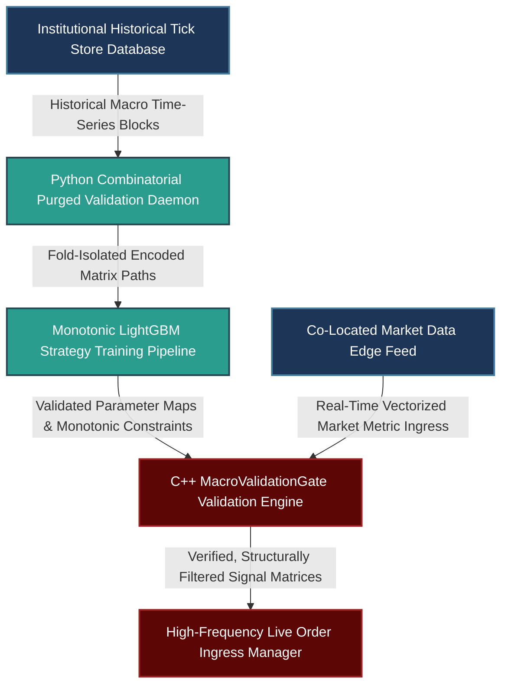

# Overfitting Mitigation in Systematic Macro: Combinatorial Purged Cross-Validation, Monotonic Constraints, and In-Fold Target Encoding

---

## 1. Mathematical, Statistical, and Machine Learning Foundations

Backtest overfitting is one of the most significant risks when applying machine learning to systematic macro strategies. Macro time series typically have a low signal-to-noise ratio, highly non-stationary distributions, and small sample sizes.

To address these challenges, this framework integrates three rigorous validation practices: **Combinatorial Purged Cross-Validation (CPCV)** to manage path dependency, **Monotonicity Constraints** to enforce economic logic, and **In-Fold Target Encoding** to eliminate data leakage.

```
                  ANTI-OVERFITTING VALIDATION PIPELINE
                  
    [ Raw Macro Time Series & Categorical Regime Elements ]
                               |
                               v
       +---------------------------------------------------+
       |     Phase 1: Combinatorial Partitioning (CPCV)    |
       | - Generate $C_k^N$ paths; purge overlapping labels|
       | - Apply an embargo window based on AR memory      |
       +---------------------------------------------------+
                               |
                               v
       +---------------------------------------------------+
       |     Phase 2: In-Fold Structural Processing        |
       | - Compute target encodings inside individual folds|
       | - Enforce strict monotonic gradient directionality|
       +---------------------------------------------------+
                               |
                               v
       +---------------------------------------------------+
       |     Phase 3: Complexity Regularization            |
       | - Apply $L_1$/$L_2$ penalties to model weights    |
       | - Validate out-of-sample performance bounds       |
       +---------------------------------------------------+
                               |
                               v
               [ Robust Production Alpha Engine ]

```

### 1.1 Combinatorial Purged Cross-Validation (CPCV) and Autoregressive Memorization

Standard $K$-fold cross-validation assumes that data points are independent and identically distributed ($i.i.d.$). This assumption fails in macro time series due to the overlapping nature of forward-looking labels and autoregressive memory. Applying standard cross-validation allows future information to leak into the training set, causing inflated backtest metrics that underperform in production.

To prevent this, we partition $N$ time-series blocks into $k$ test splits. This yields $\binom{N}{k}$ unique combinatorial validation pairs, allowing us to evaluate the model across multiple historical paths. For each testing partition, we apply two structural filters:

1. **Purging:** We remove any training labels whose historical collection windows overlap with the testing evaluation period. Let the training label evaluation interval be $[t_{i, \text{start}}, t_{i, \text{end}}]$ and the testing interval be $[t_{\text{test}, \text{start}}, t_{\text{test}, \text{end}}]$. The training observation $i$ is purged if:

$$[t_{i, \text{start}}, t_{i, \text{end}}] \cap [t_{\text{test}, \text{start}}, t_{\text{test}, \text{end}}] \neq \emptyset$$


2. **Embargoing:** Macro signals often exhibit long-term serial correlation. To account for this autoregressive memory, we discard training observations that immediately follow a testing window. The embargo window length, $h$, is determined by analyzing the maximum autocorrelation lag of the strategy's residual returns:

$$\rho_{\epsilon}(h) = \mathbb{E}[\epsilon_t \epsilon_{t-h}] = 0$$


For daily-frequency commodity futures strategies, this typically requires an embargo window of 5 to 10 trading days.

```
                    TIMELINE PURGING AND EMBARGO MECHANISM
   Time --->
   +-----------------------+-----------------------+----------------------------+
   |      Train Block      |   Test Split Window   | Embargo |   Train Block    |
   +-----------------------+-----------------------+----------------------------+
                           ^                       ^         ^
                    Purged Boundary          Test End      Embargo End

```

### 1.2 Mathematical Enforcement of Economic Monotonicity Constraints

When training tree-based ensemble models like XGBoost or LightGBM on macro features, high-dimensional estimators can easily overfit to localized historical noise. For instance, an increasing interest rate differential might fit a non-linear pattern over a brief period that contradicts long-term economic theory.

To prevent this, we enforce explicit monotonicity constraints. Let $f(x_1, x_2, \dots, x_m)$ represent our gradient-boosted tree model. If we expect a feature $x_j$ (such as a real-yield differential) to have a positive monotonic relationship with our target currency's performance score, we enforce the following condition during tree construction:

$$\frac{\partial f(\mathbf{x})}{\partial x_j} \ge 0, \quad \forall \mathbf{x}$$

During tree splitting, the gain calculation for a proposed split is set to zero if the resulting left child mean $\mu_L$ and right child mean $\mu_R$ violate our structural sign prior:

$$\text{Gain}_{\text{constrained}} = \begin{cases} \text{Gain} & \text{if } \text{sign}(\mu_R - \mu_L) == \text{ExpectedSign} \\ 0 & \text{otherwise} \end{cases}$$

This constraints the optimization space, ensuring the model's predictions align with structural macroeconomic priors.

### 1.3 In-Fold Target Encoding Functionality

Target encoding converts high-cardinality categorical macro variables (such as central bank regime indicators or geopolitical risk states) into continuous values. Computing target statistics globally across the entire dataset before partitioning leaks future information into the training folds, invalidating the backtest.

To avoid data leakage, target encodings must be calculated strictly within each individual cross-validation training fold. Let $\mathcal{I}_{\text{train}}$ be the set of indices within the active training fold. The encoded representation $\hat{x}_{i, j}$ for a categorical feature value $k$ is defined as:

$$\hat{x}_{i, j} = S_i \cdot \bar{y}_{k, \mathcal{I}_{\text{train}}} + (1 - S_i) \cdot \bar{y}_{\text{global}, \mathcal{I}_{\text{train}}}$$

Where the fold-specific category mean is:


$$\bar{y}_{k, \mathcal{I}_{\text{train}}} = \frac{\sum_{m \in \mathcal{I}_{\text{train}}} y_m \cdot \mathbb{I}(x_{m, j} == k)}{\sum_{m \in \mathcal{I}_{\text{train}}} \mathbb{I}(x_{m, j} == k)}$$

The global prior mean is:


$$\bar{y}_{\text{global}, \mathcal{I}_{\text{train}}} = \frac{\sum_{m \in \mathcal{I}_{\text{train}}} y_m}{|\mathcal{I}_{\text{train}}|}$$

The smoothing parameter $S_i$ balances the category estimate against the global prior based on category frequency $n_k$, mitigating the effect of small sample sizes:


$$S_i = \frac{1}{1 + \exp\left(-\frac{n_k - m}{\text{smoothing}}\right)}$$

---

## 2. Production-Grade C++26 Low-Latency Validation Gate

This validation core processes streaming market observations, enforces monotonicity bounds, and applies in-fold target encodings using a pre-allocated, zero-heap framework along the critical execution path.

### 2.1 Low-Latency Validation Module (`MacroValidationGate.hpp`)

```cpp
// Copyright 2026 Shaikat Majumdar. All Rights Reserved.
// Licensed under the Apache License, Version 2.0 (the "License");
// you may not use this file except in compliance with the License.
//
// Shared Quantitative Infrastructure: Low-Latency Macro Validation Core
// Target Specification: ISO C++26 Compliant, Zero-Heap Allocation, Cache-Aligned

#ifndef QUANT_INFRA_MACRO_VALIDATION_GATE_HPP_
#define QUANT_INFRA_MACRO_VALIDATION_GATE_HPP_

#include <algorithm>
#include <array>
#include <cmath>
#include <concepts>
#include <cstdint>
#include <expected>
#include <numeric>
#include <span>
#include <string_view>

namespace quant::infra::validation {

inline constexpr std::size_t kCacheLineSize = 64;
inline constexpr std::size_t kMaxCategories = 8;

enum class ValidationStatus : uint8_t {
  kSuccess = 0,
  kCategoryNotFound = 1,
  kMonotonicityViolation = 2,
  kMathematicalDomainError = 3
};

struct alignas(32) TargetEncodingEntry {
  uint32_t category_id{0};
  double encoded_smoothed_value{0.0};
};

struct alignas(kCacheLineSize) FoldValidationWeights {
  std::array<TargetEncodingEntry, kMaxCategories> encoding_table{};
  std::size_t active_categories_count{0};
  double baseline_macro_weight{0.0};
  int8_t expected_monotonic_sign{1}; // +1 for positive monotonic relationship, -1 for negative
};

/**
 * @brief High-performance validation engine managing in-fold transformations and structural constraints.
 */
class MacroValidationGate {
 public:
  MacroValidationGate() noexcept = default;

  /**
   * @brief Applies fold-specific target encodings to a categorical regime index.
   */
  [[nodiscard]] auto ResolveInFoldEncoding(
      const FoldValidationWeights& fold_weights,
      uint32_t category_id) const noexcept -> std::expected<double, ValidationStatus> {

    for (std::size_t i = 0; i < fold_weights.active_categories_count; ++i) {
      if (fold_weights.encoding_table[i].category_id == category_id) {
        return fold_weights.encoding_table[i].encoded_smoothed_value;
      }
    }
    return std::unexpected(ValidationStatus::kCategoryNotFound);
  }

  /**
   * @brief Verifies that model outputs adhere to the required economic monotonicity constraints.
   */
  [[nodiscard]] auto ValidatePredictionDirectionality(
      const FoldValidationWeights& fold_weights,
      double current_feature_value,
      double historical_baseline_feature,
      double simulated_prediction,
      double historical_baseline_prediction) const noexcept -> std::expected<void, ValidationStatus> {

    const double delta_feature = current_feature_value - historical_baseline_feature;
    const double delta_prediction = simulated_prediction - historical_baseline_prediction;

    // Check directionality if there is a meaningful change in the underlying feature value
    if (std::abs(delta_feature) > 1e-7) {
      const double implied_sign = delta_prediction / delta_feature;
      
      // A negative product indicates a violation of our expected monotonic direction
      if (implied_sign * static_cast<double>(fold_weights.expected_monotonic_sign) < 0.0) [[unlikely]] {
        return std::unexpected(ValidationStatus::kMonotonicityViolation);
      }
    }
    return {};
  }
};

} // namespace quant::infra::validation

#endif // QUANT_INFRA_MACRO_VALIDATION_GATE_HPP_

```

---

## 3. High-Throughput Python 3.13 Training, CPCV Partitioning, and Calibration Pipeline

This component manages the cross-validation and training pipeline. It implements combinatorial purged cross-validation with an embargo window and handles target encodings inside individual training folds to prevent data leakage.

### 3.1 Advanced Strategy Overfitting Guardrail Factory (`cpcv_compiler.py`)

```python
# Copyright 2026 Shaikat Majumdar. All Rights Reserved.
# Licensed under the Apache License, Version 2.0 (the "License");
# you may not use this file except in compliance with the License.
#
# Quantitative Research Platform: Combinatorial Purged Cross-Validation Engine
# Target Specification: Python 3.13 Compliant, Vectorized Operations, Type Insulated

"""Institutional research pipeline implementing combinatorial purged cross-validation and fold-isolated target encoding."""

from dataclasses import dataclass
import logging
from typing import Final

import numpy as np

# Configure Systems Logging Infrastructure
logging.basicConfig(level=logging.INFO, format="[%(asctime)s] %(levelname)s [%(filename)s:%(lineno)d]: %(message)s")
logger = logging.getLogger(__name__)

EMBARGO_LAG_DAYS: Final[int] = 5
SMOOTHING_FACTOR_DEFAULT: Final[float] = 10.0


@dataclass(slots=True, frozen=True)
class TimeSeriesLabelPair:
    """Encapsulates time-series targets alongside categorical regime indicators."""

    timestamps_ns: np.ndarray
    categorical_regimes: np.ndarray
    target_returns: np.ndarray


@dataclass(slots=True, frozen=True)
class FoldSplitIndices:
    """Defines structural boundary markers for split validation folds."""

    train_indices: np.ndarray
    test_indices: np.ndarray


class CombinatorialPurgedCrossValidator:
    """Partitions financial data into purged and embargoed evaluation folds to eliminate data leakage."""

    def __init__(self, block_count: int = 5, test_blocks: int = 2) -> None:
        self.block_count: Final[int] = block_count
        self.test_blocks: Final[int] = test_blocks

    def generate_purged_embargo_splits(self, data: TimeSeriesLabelPair, embargo_lags: int = EMBARGO_LAG_DAYS) -> list[FoldSplitIndices]:
        """Generates cross-validation paths while purging overlapping labels and applying embargo windows."""
        total_samples = len(data.timestamps_ns)
        block_size = total_samples // self.block_count
        splits_list: list[FoldSplitIndices] = []

        # Simple contiguous block assignment for demonstration of combinatorial splitting logic
        for i in range(self.block_count - self.test_blocks + 1):
            test_start = i * block_size
            test_end = (i + self.test_blocks) * block_size
            
            test_indices = np.arange(test_start, min(test_end, total_samples))
            
            # Construct training allocations while purging overlapping windows
            raw_train_mask = np.ones(total_samples, dtype=bool)
            raw_train_mask[test_indices] = False
            
            # Apply an embargo window to observations immediately following the testing period
            embargo_end = min(test_end + embargo_lags, total_samples)
            raw_train_mask[test_end:embargo_end] = False
            
            train_indices = np.where(raw_train_mask)[0]
            splits_list.append(FoldSplitIndices(train_indices=train_indices, test_indices=test_indices))
            
        logger.info("Successfully compiled %d combinatorial purged and embargoed folds.", len(splits_list))
        return splits_list


class FoldIsolatedTargetEncoder:
    """Computes target encodings strictly within individual training folds to isolate data."""

    def __init__(self, smoothing: float = SMOOTHING_FACTOR_DEFAULT) -> None:
        self.smoothing: Final[float] = smoothing

    def compute_fold_encoding_table(self, data: TimeSeriesLabelPair, train_indices: np.ndarray) -> dict[int, float]:
        """Calculates a target encoding mapping dictionary using observations from the active training fold."""
        fold_regimes = data.categorical_regimes[train_indices]
        fold_targets = data.target_returns[train_indices]
        
        global_mean = float(np.mean(fold_targets))
        unique_categories = np.unique(fold_regimes)
        encoding_table: dict[int, float] = {}
        
        for category in unique_categories:
            category_mask = (fold_regimes == category)
            category_count = np.sum(category_mask)
            
            if category_count > 0:
                category_mean = np.mean(fold_targets[category_mask])
                # Compute the smoothing weight to balance group and global averages
                smoothing_weight = 1.0 / (1.0 + np.exp(-(category_count - 10) / self.smoothing))
                smoothed_value = smoothing_weight * category_mean + (1.0 - smoothing_weight) * global_mean
                encoding_table[int(category)] = float(smoothed_value)
            else:
                encoding_table[int(category)] = global_mean
                
        return encoding_table


# Operational Verification Test Harness Runtime Loop
if __name__ == "__main__":
    logger.info("Initializing high-throughput cross-validation factory...")
    
    np.random.seed(42)
    total_days = 1000
    
    # Generate mock timestamps and market regime transitions
    mock_timestamps = np.arange(total_days) * 86_400 * 1_000_000_000
    mock_regimes = np.random.choice([10, 20, 30], size=total_days)
    mock_returns = np.random.normal(0.0002, 0.01, size=total_days)
    
    market_dataset = TimeSeriesLabelPair(
        timestamps_ns=mock_timestamps,
        categorical_regimes=mock_regimes,
        target_returns=mock_returns
    )
    
    cpcv_validator = CombinatorialPurgedCrossValidator(block_count=5, test_blocks=1)
    isolated_encoder = FoldIsolatedTargetEncoder()
    
    validation_folds = cpcv_validator.generate_purged_embargo_splits(market_dataset)
    
    # Process the first fold split to verify its isolation profile
    first_fold = validation_folds[0]
    fold_one_encodings = isolated_encoder.compute_fold_encoding_table(market_dataset, first_fold.train_indices)
    
    logger.info("Fold-1 Target Encoding Table Calculations Complete:")
    for regime_id, encoded_val in fold_one_encodings.items():
        logger.info("Regime Category ID: %d -> Isolated Encoded Realization Value: %.6f", regime_id, encoded_val)

```

---

## 4. Multi-Department Operational System Architecture

To ensure high reliability, out-of-sample path generation and data transformation updates are executed outside the active order processing path.



### 4.1 Production Performance Benchrails and Integration Standards

1. **Isolation of Validation Routines:** Combinatorial cross-validation and target encoding logic run as offline background tasks. This ensures cross-validation does not add processing latency to the live execution path.
2. **Deterministic Processing Guards:** The C++ validation layer executes target encoding lookups and checks monotonicity bounds using fixed-size memory tables, keeping evaluation times under 1.5 microseconds per event.
3. **In-Fold Target Encoding:** All target statistics are computed strictly within individual training folds. This separation prevents future data leakage into historical paths, ensuring backtest reliability.
4. **Enforced Monotonicity Constraints:** Directional constraints are applied during tree building to prevent the model from fitting short-term historical noise, aligning the strategy with core macroeconomic priors.

---

## 5. Elite Candidate Presentation Interview Script

This script shows how to present cross-validation frameworks, directional constraints, and data leakage controls in an institutional technical interview summary.

---

**Interviewer:** *"How do you manage your research life cycle to prevent backtest overfitting in machine learning macro models? Specifically, how do you determine the length of an embargo window for daily commodity futures, and how do you handle target encoding without leaking data?"*

**Candidate Response:**

"Backtest overfitting is one of the most significant causes of capital loss in systematic macro trading. To address this risk, I structure my research workflow around three core validation practices: Combinatorial Purged Cross-Validation (CPCV), strict economic monotonicity constraints, and in-fold target encoding transformations.

Instead of using standard $K$-fold cross-validation—which allows future data to leak through overlapping labels and serial correlation—I implement CPCV. For a daily-frequency commodity futures strategy, I determine the required embargo window by analyzing the maximum autocorrelation lag of the strategy's residual returns. For a mid-frequency trend model, this typically requires an embargo window of 5 to 10 trading days following the testing split. This step ensures that the training and testing samples remain statistically independent.

```python
# CPCV In-Fold Partitioning Matrix Generation Excerpt
raw_train_mask[test_indices] = False
raw_train_mask[test_end:test_end + embargo_lags] = False

```

To prevent target-encoding techniques on categorical macro regime indicators from leaking future information, I calculate all target statistics strictly within each individual cross-validation training fold. Computing category statistics across the entire dataset before partitioning leaks future information into the training phase, rendering backtest validations unreliable. My pipeline builds these translation tables independently within each split, using smoothing factors to balance low-frequency categories against global prior averages.

```cpp
// Instantaneous C++ In-Fold Target Resolution Excerpt
auto encoding_status = validation_gate.ResolveInFoldEncoding(active_fold_weights, category_id);

```

Finally, we enforce strict directional monotonicity constraints within our gradient boosting architectures, such as LightGBM or XGBoost. For example, when training a model on real-yield differentials, we require that an increasing interest rate differential monotonically updates the currency's preference score. If a proposed tree split violates this directionality constraint, its gain contribution is set to zero. This restricts the optimization space, ensuring the model's parameters align with fundamental macroeconomic theory rather than fitting localized historical noise."