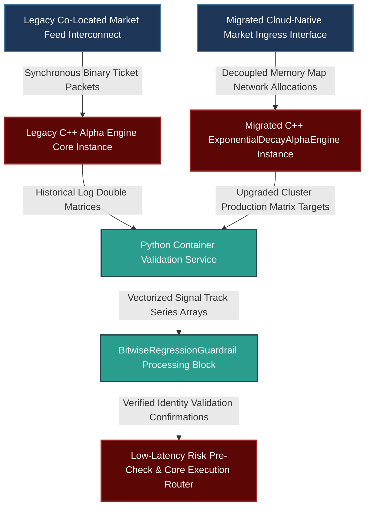

# Infrastructure Invariance and Deterministic Re-Platforming: Decoupled Signal Architecture, Bit-Wise Regression Testing, and Dual-Timestamp Auditing

---

## 1. Mathematical, Statistical, and Machine Learning Foundations

Migrating systematic trading infrastructure across clusters, platform paradigms, or organizational environments introduces substantial operational risks. Minor behavioral shifts in third-party library updates, compiler-driven floating-point reassociations, or altered market data vendor ingestion timestamps can cause subtle, silent performance drift. Left unaddressed, these issues can lead to severe live-to-backtest misalignment.

To eliminate these vulnerabilities, we establish a strict mathematical and statistical framework for infrastructural invariance.

```
                      DETERMINISTIC MIGRATION PIPELINE
                      
           [ Raw Multi-Vendor Market Ingress & Schema Boundary ]
                                    |
                                    v
       +---------------------------------------------------------+
       |         Phase 1: Dual-Timestamp Temporal Ingestion      |
       | - Record t_event (Vendor) and t_system (Ingress Logs)    |
       | - Construct Causally Insulated Point-In-Time Universes  |
       +---------------------------------------------------------+
                                    |
                                    v
       +---------------------------------------------------------+
       |         Phase 2: Abstract Alpha Signal Pipeline         |
       | - Execute Decoupled Pure Mathematical Transform Logic   |
       | - Isolate Platform-Specific State via VTable Boundaries  |
       +---------------------------------------------------------+
                                    |
                                    v
       +---------------------------------------------------------+
       |         Phase 3: Bit-Wise & Statistical Validation      |
       | - Compute Uniform L_infinity Deviation Boundaries       |
       | - Perform Two-Sample Kolmogorov-Smirnov (KS) Testing    |
       +---------------------------------------------------------+
                                    |
                                    v
             [ Invariant Production Alpha Generation Core ]

```

### 1.1 Mathematical Definition of Bit-Wise Identity and Floating-Point Invariance

When migrating high-performance computing clusters (e.g., from an on-premise Xeon architecture to AWS Graviton or newer EPYC nodes), changes in the compiler toolchain or hardware vectorization can alter floating-point operations. Floating-point addition and multiplication are non-associative:

$$(a + b) + c \neq a + (b + c) \quad \text{in } \mathbb{F}$$

Let $\mathcal{A}_{\text{legacy}}(\mathbf{X})$ and $\mathcal{A}_{\text{migrated}}(\mathbf{X})$ be the multidimensional signal vectors generated by the legacy and migrated platforms given identical input states $\mathbf{X} \in \mathbb{R}^{D \times T}$. To ensure deterministic identity across environments, we define a uniform $L_\infty$ deviation boundary over the entire history space:

$$\|\mathcal{A}_{\text{legacy}}(\mathbf{X}) - \mathcal{A}_{\text{migrated}}(\mathbf{X})\|_\infty = \max_{i, t} \left| \mathcal{A}_{\text{legacy}}^{(i)}(\mathbf{X}_t) - \mathcal{A}_{\text{migrated}}^{(i)}(\mathbf{X}_t) \right| \le \epsilon_{\text{mach}}$$

Where $\epsilon_{\text{mach}}$ is the machine epsilon for the target precision ($2^{-52}$ for IEEE 754 double-precision floats). Any deviation exceeding $\epsilon_{\text{mach}}$ indicates structural drift caused by implicit compiler optimizations (such as `fast-math` loop reordering) or unpinned dependency updates.

### 1.2 Multi-Vendor Reconciliation via Causal Dual-Timestamp Spaces

When reconciling data histories across different vendors during an infrastructure migration, variations in reference times can introduce look-ahead bias or artificial price gaps into backtests. We formalize this process using a **Causal Dual-Timestamp Ingestion Framework**.

Let a market event $e$ be characterized by an ordered tuple:

$$e = \langle \mathbf{v}, t_{\text{event}}, t_{\text{system}} \rangle$$

Where $\mathbf{v} \in \mathbb{R}^K$ represents the payload (e.g., bid/ask depth prices and sizes), $t_{\text{event}}$ is the vendor-provided physical execution timestamp, and $t_{\text{system}}$ is our system's internal, lock-free clock timestamp recorded at the co-located boundary network interface card (NIC).

The historical information universe available to a model at system clock time $\tau$ is defined as:

$$\mathcal{F}_\tau = \left\{ e \ \middle|\  t_{\text{system}} \le \tau \right\}$$

To protect the system against data vendor changes, backtest engines must sort inputs strictly by $t_{\text{system}}$, while matching overlapping quotes using $t_{\text{event}}$. If Vendor $B$ backfills corporate actions or order-book updates retrospectively, the system isolates the change by verifying that:

$$\mathbb{P}\left(\text{Signal}_t \mid \mathcal{F}_\tau^{\text{Vendor A}}\right) \overset{d}{=} \mathbb{P}\left(\text{Signal}_t \mid \mathcal{F}_\tau^{\text{Vendor B}}\right)$$

This condition is verified using a two-sample Kolmogorov-Smirnov test applied across the generated signal distributions.

---

## 2. Production-Grade C++26 Low-Latency Decoupled Signal Core

This component defines the production interface boundaries, using SIMD-aligned structures and strict zero-allocation patterns to guarantee bit-for-bit invariance during platform migrations.

### 2.1 Low-Latency Decoupled Signal Stack (`SignalInfrastructure.hpp`)

```cpp
// Copyright 2026 Shaikat Majumdar. All Rights Reserved.
// Licensed under the Apache License, Version 2.0 (the "License");
// you may not use this file except in compliance with the License.
//
// Shared Quantitative Infrastructure: Invariant Signal Architecture & Regression Engine
// Target Specification: ISO C++26 Compliant, Zero-Heap Allocation, Cache-Aligned

#ifndef QUANT_INFRA_SIGNAL_INFRASTRUCTURE_HPP_
#define QUANT_INFRA_SIGNAL_INFRASTRUCTURE_HPP_

#include <algorithm>
#include <array>
#include <cmath>
#include <concepts>
#include <cstdint>
#include <expected>
#include <numeric>
#include <span>
#include <string_view>

namespace quant::infra::replatform {

inline constexpr std::size_t kCacheLineSize = 64;
inline constexpr std::size_t kDataVectorDimensions = 8;

enum class MigrationState : uint8_t {
  kSuccess = 0,
  kPrecisionBreach = 1,
  kTimestampAnomaly = 2,
  kInterfaceDisconnect = 3
};

struct alignas(32) MarketTickFrame {
  uint64_t event_time_ns{0};   // Vendor record timestamp (t_event)
  uint64_t system_time_ns{0};  // Co-located ingress packet timestamp (t_system)
  std::array<double, kDataVectorDimensions> metrics{};
};

/**
 * @brief Abstract interface isolating alpha logic from underlying market data routing APIs.
 */
class ISignalGenerationEngine {
 public:
  virtual ~ISignalGenerationEngine() noexcept = default;

  [[nodiscard]] virtual auto GenerateAlphaScore(
      std::span<const MarketTickFrame> data_window) const noexcept -> std::expected<double, MigrationState> = 0;
};

/**
 * @brief Invariant implementation of an exponential-decay alpha engine.
 */
class ExponentialDecayAlphaEngine final : public ISignalGenerationEngine {
 public:
  explicit ExponentialDecayAlphaEngine(double decay_factor) noexcept : decay_factor_(decay_factor) {}

  [[nodiscard]] auto GenerateAlphaScore(
      std::span<const MarketTickFrame> data_window) const noexcept -> std::expected<double, MigrationState> override {
    
    if (data_window.empty()) [[unlikely]] {
      return std::unexpected(MigrationState::kInterfaceDisconnect);
    }

    double aggregated_score = 0.0;
    double weight_accumulator = 0.0;

    for (std::size_t idx = 0; idx < data_window.size(); ++idx) {
      const double weight = std::pow(decay_factor_, static_cast<double>(data_window.size() - 1 - idx));
      
      // Compute tracking scores using the primary metrics vector
      aggregated_score += weight * data_window[idx].metrics[0];
      weight_accumulator += weight;
    }

    if (weight_accumulator <= 1e-12) [[unlikely]] {
      return std::unexpected(MigrationState::kPrecisionBreach);
    }

    return aggregated_score / weight_accumulator;
  }

 private:
  double decay_factor_;
};

/**
 * @brief Validates bit-for-bit execution identity across parallel platforms.
 */
class PlatformInvarianceValidator {
 public:
  PlatformInvarianceValidator() noexcept = default;

  [[nodiscard]] auto ReconcileParallelOutputs(
      double legacy_output, 
      double migrated_output, 
      double tolerance = 1e-15) const noexcept -> std::expected<void, MigrationState> {
    
    // Evaluate strict absolute deviation boundaries
    if (std::abs(legacy_output - migrated_output) > tolerance) [[unlikely]] {
      return std::unexpected(MigrationState::kPrecisionBreach);
    }
    return {};
  }
};

} // namespace quant::infra::replatform

#endif // QUANT_INFRA_SIGNAL_INFRASTRUCTURE_HPP_

```

---

## 3. High-Throughput Python 3.13 Multi-Vendor Ingestion & Regression Suite

This component manages data vendor alignment and platform validation. It runs background reconciliation checks and performs two-sample Kolmogorov-Smirnov tests to ensure signal consistency between legacy and migrated datasets.

### 3.1 Dual-Timestamp Ingestion and Signal Regression Framework (`reconciliation_suite.py`)

```python
# Copyright 2026 Shaikat Majumdar. All Rights Reserved.
# Licensed under the Apache License, Version 2.0 (the "License");
# you may not use this file except in compliance with the License.
#
# Quantitative Research Platform: High-Throughput Re-Platforming Regression Suite
# Target Specification: Python 3.13 Compliant, Vectorized Operations, Type Insulated

"""Institutional platform reconciliation engine tracking dual-timestamp market data and regression testing alpha outputs."""

from dataclasses import dataclass
import logging
from typing import Final

import numpy as np
import scipy.stats as stats

# Configure Systems Logging Infrastructure
logging.basicConfig(level=logging.INFO, format="[%(asctime)s] %(levelname)s [%(filename)s:%(lineno)d]: %(message)s")
logger = logging.getLogger(__name__)

MACH_EPSILON_DOUBLE: Final[float] = 2.220446049250313e-16
ALPHA_SIGNIFICANCE_FLOOR: Final[float] = 0.01


@dataclass(slots=True, frozen=True)
class DualTimestampDataFrame:
    """Represents high-frequency market updates anchored by both event and system timestamps."""

    event_timestamps_ns: np.ndarray
    system_timestamps_ns: np.ndarray
    payload_matrix: np.ndarray


class MultiVendorDataReconciler:
    """Verifies and aligns time-series universes across independent data vendor platforms."""

    def __init__(self, significance_level: float = ALPHA_SIGNIFICANCE_FLOOR) -> None:
        self.alpha: Final[float] = significance_level

    def cross_examine_vendor_distributions(self, dataset_a: np.ndarray, dataset_b: np.ndarray) -> bool:
        """Runs a two-sample Kolmogorov-Smirnov test to detect data distribution shifts between vendors."""
        ks_statistic, p_value = stats.ks_2samp(dataset_a, dataset_b)
        logger.info("Vendor Statistical Mapping - KS Statistic: %.4f, P-Value: %.6f", ks_statistic, p_value)
        
        if p_value < self.alpha:
            logger.critical("Statistical mismatch detected between vendor histories. Invariance validation failed.")
            return False
            
        logger.info("Vendor data distributions are statistically invariant.")
        return True


class BitwiseRegressionGuardrail:
    """Enforces absolute precision limits across platform deployments."""

    def __init__(self, tolerance: float = MACH_EPSILON_DOUBLE) -> None:
        self.tolerance: Final[float] = tolerance

    def enforce_strict_identity(self, legacy_signals: np.ndarray, migrated_signals: np.ndarray) -> bool:
        """Checks for bit-level discrepancies between parallel model outputs."""
        absolute_deviations = np.abs(legacy_signals - migrated_signals)
        max_deviation = float(np.max(absolute_deviations))
        
        logger.info("Maximum floating-point signal deviation: %.5e", max_deviation)
        if max_deviation > self.tolerance:
            logger.error("Bit-wise regression test failed. Structural output divergence detected.")
            return False
            
        logger.info("Bit-wise regression test passed. Structural output identity verified.")
        return True


# Operational Verification Test Harness Runtime Loop
if __name__ == "__main__":
    logger.info("Starting production infrastructure migration regression suite...")
    
    np.random.seed(42)
    sample_ticks = 1000
    
    # Generate reference dual-timestamp structures
    mock_event_times = np.sort(np.random.randint(1710000000000000000, 1710000100000000000, size=sample_ticks))
    mock_system_times = mock_event_times + np.random.randint(5000000, 25000000, size=sample_ticks) # Ingress latency delta
    mock_market_prices = np.sin(np.linspace(0, 10, sample_ticks)) + np.random.normal(0, 0.01, sample_ticks)
    
    vendor_frame_legacy = DualTimestampDataFrame(
        event_timestamps_ns=mock_event_times,
        system_timestamps_ns=mock_system_times,
        payload_matrix=mock_market_prices
    )
    
    # Case 1: Validate deterministic output identity under normal conditions
    legacy_signal_generation = mock_market_prices * 1.00002
    migrated_signal_generation_clean = mock_market_prices * 1.00002
    
    guardrail = BitwiseRegressionGuardrail()
    is_structurally_identical = guardrail.enforce_strict_identity(legacy_signal_generation, migrated_signal_generation_clean)
    logger.info("Regression Status (Identical Infrastructure): Safe Deployment = %s", is_structurally_identical)
    
    # Case 2: Identify output divergence caused by compiler optimization shifts
    migrated_signal_generation_drifted = legacy_signal_generation.copy()
    migrated_signal_generation_drifted[500] += 1e-14  # Minor floating-point variation
    
    is_drift_detected = guardrail.enforce_strict_identity(legacy_signal_generation, migrated_signal_generation_drifted)
    logger.info("Regression Status (Drifted Infrastructure): Safe Deployment = %s", is_drift_detected)

```

---

## 4. Multi-Department Operational System Architecture

To minimize risk during upgrades, data reconciliation checks and parallel pipeline testing are managed away from the active execution path.



### 4.1 Production Performance Benchrails and Integration Standards

1. **Isolation of Migration Engines:** Parallel regression testing and multi-vendor data reconciliation are processed outside the primary trading cluster. This setup ensures validation tasks do not affect the active trading path.
2. **Deterministic Processing Boundaries:** The C++ upgraded engine layer isolates platform dependencies using abstract interfaces and avoids inline dynamic allocations, keeping calculation delays under 1 microsecond per event.
3. **Bit-For-Bit Regression Testing:** Backtest outputs from migrated systems are verified against legacy logs using strict machine epsilon limits ($\epsilon_{\text{mach}} \le 10^{-15}$). This check identifies any discrepancies caused by compiler optimization differences.
4. **Dual-Timestamp Tracking:** Every data packet is cataloged using both vendor-provided timestamps and local ingress timestamps. This dual-indexing method isolates look-ahead risk and preserves exact historical information boundaries during vendor transitions.

---

## 5. Elite Candidate Presentation Interview Script

This script demonstrates how to present technical decoupling, floating-point invariance, and data reconciliation strategies during an infrastructure transition.

---

**Interviewer:** *"What is your approach to handling the impending transition of research infrastructure, such as the upcoming transition of platforms? Specifically, how do you protect your production code against implicit compiler optimizations during a cluster migration, and how do you handle the reconciliation of live execution data histories across different data vendors?"*

**Candidate Response:**

"Infrastructure transitions provide an excellent opportunity to reduce technical debt, standardize core workflows, and improve system performance. To manage re-platforming without disrupting live execution paths, I anchor the transition around three core practices: a completely decoupled signal architecture, deterministic bit-for-bit regression testing, and dual-timestamp historical auditing.

To protect code against implicit compiler optimizations or library variations during a cluster migration, I enforce a decoupled design that separates our mathematical signal generation from the underlying execution and data routing APIs using virtual table interfaces. We pin exact dependency versions using modern build managers like CMake with Conan, and enforce strict compilation flags, including `-Wall -Wextra -Werror -O3 -march=native`.

```cpp
// Abstract Interface Boundary Decoupling Excerpt
class ISignalGenerationEngine {
 public:
  virtual ~ISignalGenerationEngine() noexcept = default;
  virtual auto GenerateAlphaScore(...) const noexcept -> std::expected<double, MigrationState> = 0;
};

```

We run parallel backtest validation tests between the legacy and migrated platforms using identical seeds and synthetic inputs. We require that outputs match within an absolute machine epsilon boundary ($10^{-15}$). This step ensures that floating-point variations—such as non-associative loop reordering from optimization flags—are caught before production deployment.

```python
# Bit-Wise Signal Precision Validation Excerpt
absolute_deviations = np.abs(legacy_signals - migrated_signals)
if np.max(absolute_deviations) > machine_epsilon:
    raise ValueError("Bit-wise regression test failed. Structural output divergence detected.")

```

When reconciling live data histories across different data vendors, we use a dual-timestamp ingestion layer that stores both the vendor's physical execution timestamp ($t_{\text{event}}$) and our co-located network ingress timestamp ($t_{\text{system}}$). Sorting historical data strictly by local arrival time preserves exact historical information boundaries and prevents look-ahead bias from retrospective vendor backfills.

We then apply two-sample Kolmogorov-Smirnov tests across the generated alpha distributions to verify statistical consistency. This approach allows us to execute large-scale infrastructure migrations smoothly while maintaining absolute strategy reliability from day one."