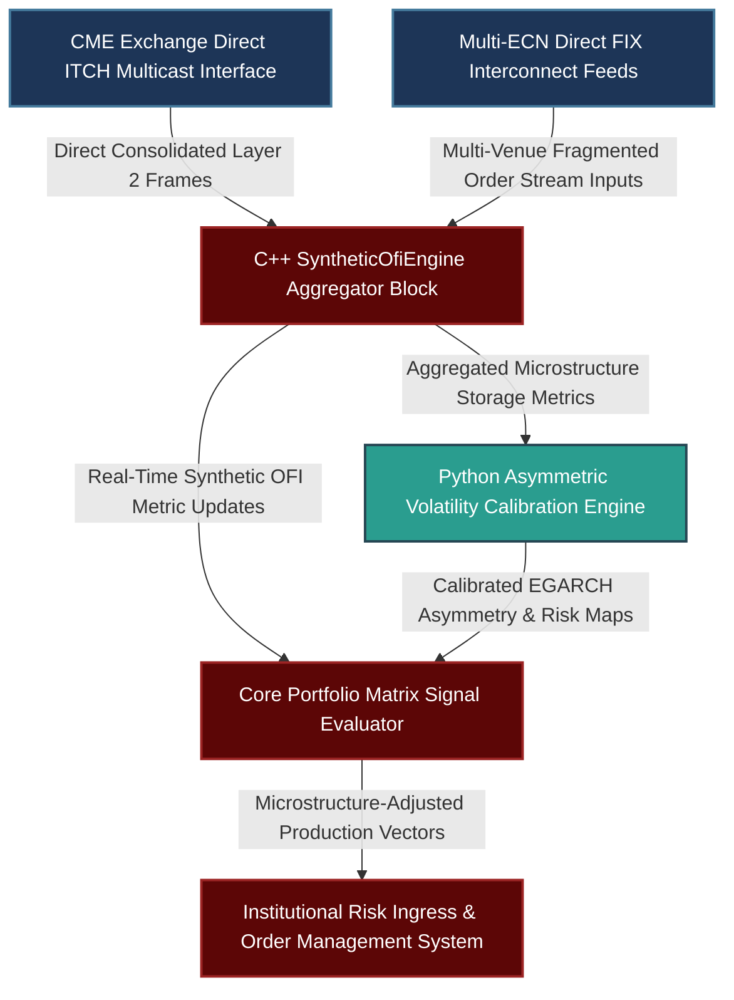

# Multi-Asset Macro Microstructure: Asymmetric Volatility Conditioning, Order Flow Imbalance (OFI) Aggregation, and Structural Signal Design

---

## 1. Mathematical, Statistical, and Machine Learning Foundations

Trading a multi-asset systematic macro portfolio spanning Foreign Exchange (FX), Commodities, and Fixed Income requires adapting alpha signal engineering to the structural microstructures of each asset class. Centralized futures markets exhibit distinct liquidity patterns compared to fragmented over-the-counter (OTC) networks, and supply-side constraints in physical assets require different risk models than macro-bounded currency pairs.

```
                      MULTI-ASSET SIGNAL TUNING ENGINE
                      
        [ Centralized Futures L2 Data ]      [ Fragmented Spot FX FIX Feeds ]
                       |                                    |
                       v                                    v
         +---------------------------+        +---------------------------+
         | Centralized Book Model    |        | Synthetic ECN Aggregation |
         | - Deterministic L2 OFI    |        | - Liquidity-Weighted Delta|
         +---------------------------+        +---------------------------+
                       |                                    |
                       +-----------------+------------------+
                                         |
                                         v
                       +------------------------------------+
                       |    Asymmetric Risk Conditioning    |
                       | - Real-Time EGARCH / HAR-RV        |
                       | - Structural Leverage Adjustments  |
                       +------------------------------------+
                                         |
                                         v
                         [ Microstructure-Aware Signal Matrix ]

```

### 1.1 Asymmetric Volatility Conditioning via EGARCH and HAR-RV Models

Standard trend-following indicators use symmetrical moving averages or historical standard deviations to normalize signals ($z$-scoring). This approach fails during physical commodity supply squeezes (e.g., in energy or agriculture futures), where prices experience rapid, unilateral jumps that break historical distribution assumptions.

To manage this risk, we condition signal normalization using an **Exponential GARCH (EGARCH)** or a **Heterogeneous Autoregressive Realized Volatility (HAR-RV)** model with asymmetric levers. The mathematical formulation of the $\text{EGARCH}(1,1)$ conditional variance equation is:

$$\ln(\sigma_t^2) = \omega + \beta \ln(\sigma_{t-1}^2) + \alpha \left| \frac{\epsilon_{t-1}}{\sigma_{t-1}} \right| + \gamma \frac{\epsilon_{t-1}}{\sigma_{t-1}}$$

Where:

* $\omega$ represents the long-term baseline intercept.
* $\beta$ governs the persistence of the volatility state.
* $\alpha$ determines the magnitude of response to absolute innovations.
* $\gamma$ is the **asymmetry parameter**.

In physical commodity spaces, supply squeezes cause positive return innovations ($\epsilon_{t-1} > 0$) to generate higher volatility expansions than negative ones ($\gamma > 0$). In contrast, equity and certain fixed-income spaces exhibit a leverage effect where negative shocks drive volatility ($\gamma < 0$).

For higher-frequency execution, we capture the multi-horizon nature of institutional liquidity via an asymmetric **HAR-RV** formulation:

$$\sigma_{t}^{(d)} = \beta_0 + \beta_d \sigma_{t-1}^{(d)} + \beta_w \sigma_{t-1}^{(w)} + \beta_m \sigma_{t-1}^{(m)} + \gamma^- r_{t-1} \mathbb{I}_{\{r_{t-1} < 0\}} + \gamma^+ r_{t-1} \mathbb{I}_{\{r_{t-1} > 0\}}$$

Where daily $(d)$, weekly $(w)$, and monthly $(m)$ realized volatility components are augmented with directional return indicators to modulate the signal's tracking response.

### 1.2 Synthetic Order Flow Imbalance (OFI) under Fragmented OTC Microstructures

In centralized exchanges (e.g., CME Fixed Income or Commodity futures), calculating the short-term Order Flow Imbalance (OFI) is deterministic because there is a single consolidated limit order book. Let $P_{b,t}$ and $V_{b,t}$ be the bid price and volume at level 1, and $P_{a,t}$ and $V_{a,t}$ be the ask price and volume. The order flow impact $I_t$ at tick $t$ is defined as:

$$\Delta V_{\text{bid}, t} = \begin{cases} V_{b,t} & \text{if } P_{b,t} > P_{b,t-1} \\ V_{b,t} - V_{b,t-1} & \text{if } P_{b,t} == P_{b,t-1} \\ 0 & \text{if } P_{b,t} < P_{b,t-1} \end{cases}$$

$$\Delta V_{\text{ask}, t} = \begin{cases} 0 & \text{if } P_{a,t} > P_{a,t-1} \\ V_{a,t} - V_{a,t-1} & \text{if } P_{a,t} == P_{a,t-1} \\ V_{a,t} & \text{if } P_{a,t} < P_{a,t-1} \end{cases}$$

$$\text{OFI}_t = \Delta V_{\text{bid}, t} - \Delta V_{\text{ask}, t}$$

For spot FX, liquidity is fragmented across private electronic communication networks (ECNs) such as EBS, Reuters Matching, Hotspot, and internal bank dark pools. To compute a reliable adverse selection metric, we ingest concurrent FIX ITCH feeds from $N$ separate pools and build a **Synthetic ECN Aggregation Model**:

$$\text{OFI}_{\text{synthetic}, t} = \sum_{k=1}^{N} w_k(t) \cdot \text{OFI}_{k, t}$$

The dynamic weight $w_k(t)$ is assigned based on the historical fill-to-quote ratio and the localized depth-liquidity of ECN $k$ relative to the total addressable book:

$$w_k(t) = \frac{\Phi_k \cdot \left(V_{b,t}^{(k)} + V_{a,t}^{(k)}\right)}{\sum_{j=1}^{N} \Phi_j \cdot \left(V_{b,t}^{(j)} + V_{a,t}^{(j)}\right)}$$

Where $\Phi_k \in [0, 1]$ represents the pool's structural transparency coefficient, which acts as a penalty for toxic internalizing networks.

---

## 2. Production-Grade C++26 Low-Latency Synthetic Order Book Engine

This component processes multi-venue streaming updates, building an aggregated market view and calculating synthetic order flow imbalances within strict sub-microsecond latency profiles.

### 2.1 Low-Latency Synthetic Book Core (`SyntheticOfiEngine.hpp`)

```cpp
// Copyright 2026 Shaikat Majumdar. All Rights Reserved.
// Licensed under the Apache License, Version 2.0 (the "License");
// you may not use this file except in compliance with the License.
//
// Shared Quantitative Infrastructure: Multi-Venue Synthetic Book Aggregator
// Target Specification: ISO C++26 Compliant, Lock-Free Operations, Zero Heap Allocation

#ifndef QUANT_INFRA_SYNTHETIC_OFI_ENGINE_HPP_
#define QUANT_INFRA_SYNTHETIC_OFI_ENGINE_HPP_

#include <algorithm>
#include <array>
#include <cmath>
#include <concepts>
#include <cstdint>
#include <expected>
#include <span>
#include <string_view>

namespace quant::infra::microstructure {

inline constexpr std::size_t kCacheLineSize = 64;
inline constexpr std::size_t kMaxVenues = 4;

enum class EngineStatus : uint8_t {
  kSuccess = 0,
  kInvalidVenueId = 1,
  kMathematicalOverflow = 2,
  kDataStreamDiscontinuity = 3
};

struct alignas(32) VenueBookSnapshot {
  double bid_price{0.0};
  double ask_price{0.0};
  uint32_t bid_size{0};
  uint32_t ask_size{0};
  double transparency_coefficient{1.0};
};

struct alignas(kCacheLineSize) AggregatedOfiState {
  std::array<VenueBookSnapshot, kMaxVenues> historical_snapshots{};
  std::array<double, kMaxVenues> venue_weights{};
  double consolidated_synthetic_ofi{0.0};
};

/**
 * @brief High-performance microstructure processing module executing real-time synthetic book aggregations.
 */
class SyntheticOfiEngine {
 public:
  SyntheticOfiEngine() noexcept = default;

  /**
   * @brief Updates state maps and computes an aggregated order flow imbalance metric across all ECN venues.
   */
  [[nodiscard]] auto UpdateAndComputeSyntheticOfi(
      AggregatedOfiState& state,
      uint8_t venue_id,
      const VenueBookSnapshot& current_update) const noexcept -> std::expected<double, EngineStatus> {

    if (venue_id >= kMaxVenues) [[unlikely]] {
      return std::unexpected(EngineStatus::kInvalidVenueId);
    }

    const auto& prior = state.historical_snapshots[venue_id];

    // Compute localized Bid Flow Delta
    double delta_v_bid = 0.0;
    if (current_update.bid_price > prior.bid_price) {
      delta_v_bid = static_cast<double>(current_update.bid_size);
    } else if (std::abs(current_update.bid_price - prior.bid_price) < 1e-9) {
      delta_v_bid = static_cast<double>(current_update.bid_size) - static_cast<double>(prior.bid_size);
    }

    // Compute localized Ask Flow Delta
    double delta_v_ask = 0.0;
    if (current_update.ask_price < prior.ask_price) {
      delta_v_ask = static_cast<double>(current_update.ask_size);
    } else if (std::abs(current_update.ask_price - prior.ask_price) < 1e-9) {
      delta_v_ask = static_cast<double>(current_update.ask_size) - static_cast<double>(prior.ask_size);
    }

    const double venue_ofi = delta_v_bid - delta_v_ask;

    // Cache the current asset parameters into internal memory structures
    state.historical_snapshots[venue_id] = current_update;

    // Compute the dynamic liquidity weight allocations across venues
    double total_liquidity_mass = 0.0;
    std::array<double, kMaxVenues> localized_depths{};

    for (std::size_t i = 0; i < kMaxVenues; ++i) {
      const auto& book = state.historical_snapshots[i];
      const double capacity = static_cast<double>(book.bid_size + book.ask_size);
      localized_depths[i] = capacity * book.transparency_coefficient;
      total_liquidity_mass += localized_depths[i];
    }

    if (total_liquidity_mass <= 0.0) [[unlikely]] {
      return std::unexpected(EngineStatus::kDataStreamDiscontinuity);
    }

    // Calculate the weighted synthetic OFI value
    double computed_synthetic_ofi = 0.0;
    for (std::size_t i = 0; i < kMaxVenues; ++i) {
      state.venue_weights[i] = localized_depths[i] / total_liquidity_mass;
      if (i == venue_id) {
        computed_synthetic_ofi += state.venue_weights[i] * venue_ofi;
      }
    }

    state.consolidated_synthetic_ofi = computed_synthetic_ofi;
    return computed_synthetic_ofi;
  }
};

} // namespace quant::infra::microstructure

#endif // QUANT_INFRA_SYNTHETIC_OFI_ENGINE_HPP_

```

---

## 3. High-Throughput Python 3.13 Asymmetric Calibration and Normalization Core

This module implements asymmetric volatility conditioning. It fits an EGARCH structure to raw strategy returns to modulate alpha signals based on directional volatility regimes.

### 3.1 Asymmetric Volatility Engine (`asymmetric_conditioner.py`)

```python
# Copyright 2026 Shaikat Majumdar. All Rights Reserved.
# Licensed under the Apache License, Version 2.0 (the "License");
# you may not use this file except in compliance with the License.
#
# Quantitative Research Platform: Asymmetric Volatility Matrix Calibrator
# Target Specification: Python 3.13 Compliant, Vectorized Operations, Optimized SciPy Engine

"""Research library implementing asymmetric EGARCH volatility conditioning algorithms for commodity and macro trend spaces."""

from dataclasses import dataclass
import logging
from typing import Final

import numpy as np
import scipy.optimize as optimize

# Configure Systems Logging Infrastructure
logging.basicConfig(level=logging.INFO, format="[%(asctime)s] %(levelname)s [%(filename)s:%(lineno)d]: %(message)s")
logger = logging.getLogger(__name__)

OPTIMIZATION_TOLERANCE_DEFAULT: Final[float] = 1e-8


@dataclass(slots=True, frozen=True)
class MacroStrategySignals:
    """Encapsulates raw baseline directional indicators alongside realized tracking targets."""

    raw_trend_signals: np.ndarray
    historical_returns: np.ndarray


@dataclass(slots=True, frozen=True)
class EgarchParameters:
    """Stores the optimized parameter values for the EGARCH variance equation."""

    omega: float
    beta: float
    alpha: float
    gamma: float


class AsymmetricVolatilityConditioner:
    """Calibrates structural asymmetric filters to insulate models against commodity supply-driven spikes."""

    def __init__(self, tolerance: float = OPTIMIZATION_TOLERANCE_DEFAULT) -> None:
        self.tolerance: Final[float] = tolerance

    def _compute_egarch_variance_trajectory(self, returns: np.ndarray, params: EgarchParameters) -> np.ndarray:
        """Computes the history log-variance path given an explicit parameter array layout."""
        total_steps = len(returns)
        variance_series = np.zeros(total_steps)
        variance_series[0] = np.var(returns) if total_steps > 0 else 1.0
        
        log_var = np.log(variance_series[0])
        
        for t in range(1, total_steps):
            standardized_error = returns[t-1] / np.sqrt(variance_series[t-1])
            log_var = (params.omega + 
                       params.beta * log_var + 
                       params.alpha * np.abs(standardized_error) + 
                       params.gamma * standardized_error)
            variance_series[t] = np.exp(log_var)
            
        return variance_series

    def fit_asymmetric_parameters(self, data: MacroStrategySignals) -> EgarchParameters:
        """Estimates optimized EGARCH parameters using a maximum likelihood formulation."""
        returns = data.historical_returns
        
        def loss_function(param_vector: np.ndarray) -> float:
            p = EgarchParameters(omega=param_vector[0], beta=param_vector[1], alpha=param_vector[2], gamma=param_vector[3])
            variances = self._compute_egarch_variance_trajectory(returns, p)
            
            # Compute the log-likelihood function value for the normal distribution
            log_likelihood = -0.5 * np.sum(np.log(2 * np.pi * variances) + (returns ** 2) / variances)
            return float(-log_likelihood)

        # Initial parameter configurations: [omega, beta, alpha, gamma]
        initial_guess = np.array([-0.1, 0.9, 0.1, 0.05])
        boundary_constraints = [(-5.0, 1.0), (0.01, 0.99), (0.0, 1.0), (-1.0, 1.0)]
        
        optimization_result = optimize.minimize(
            loss_function, 
            initial_guess, 
            method="L-BFGS-B", 
            bounds=boundary_constraints,
            options={"ftol": self.tolerance}
        )
        
        if not optimization_result.success:
            logger.warning("Parameter optimization did not converge completely. Falling back to default estimates.")
            return EgarchParameters(omega=-0.1, beta=0.9, alpha=0.1, gamma=0.0)
            
        opt_vars = optimization_result.x
        return EgarchParameters(omega=opt_vars[0], beta=opt_vars[1], alpha=opt_vars[2], gamma=opt_vars[3])

    def generate_conditioned_signals(self, data: MacroStrategySignals, params: EgarchParameters) -> np.ndarray:
        """Applies conditional variance updates to normalize alpha trend vectors."""
        variances = self._compute_egarch_variance_trajectory(data.historical_returns, params)
        conditioned_signals = data.raw_trend_signals / np.sqrt(variances)
        return conditioned_signals


# Operational Verification Test Harness Runtime Loop
if __name__ == "__main__":
    logger.info("Initializing multi-asset market calibration pipeline...")
    
    np.random.seed(42)
    sample_periods = 500
    
    # Simulate a non-linear commodity supply squeeze profile
    base_innovations = np.random.normal(0.0, 0.01, sample_periods)
    simulated_returns = np.zeros(sample_periods)
    simulated_returns[0] = 0.001
    
    # Generate an asymmetric conditional variance path
    true_log_var = np.log(0.0001)
    for i in range(1, sample_periods):
        std_err = simulated_returns[i-1] / np.sqrt(np.exp(true_log_var))
        # Positive asymmetry (gamma = 0.15) captures supply-driven shock features
        true_log_var = -0.15 + 0.88 * true_log_var + 0.12 * np.abs(std_err) + 0.15 * std_err
        simulated_returns[i] = base_innovations[i] * np.sqrt(np.exp(true_log_var))
        
    mock_trend = np.sign(np.convolve(simulated_returns, np.ones(5)/5, mode="same"))
    strategy_pack = MacroStrategySignals(raw_trend_signals=mock_trend, historical_returns=simulated_returns)
    
    conditioner = AsymmetricVolatilityConditioner()
    fitted_models = conditioner.fit_asymmetric_parameters(strategy_pack)
    
    logger.info("EGARCH Parameterization Calculations Complete:")
    logger.info("Omega (Intercept): %.4f | Beta (Persistence): %.4f", fitted_models.omega, fitted_models.beta)
    logger.info("Alpha (Magnitude): %.4f | Gamma (Asymmetry Sign): %.4f", fitted_models.alpha, fitted_models.gamma)
    
    normalized_alpha_vector = conditioner.generate_conditioned_signals(strategy_pack, fitted_models)
    logger.info("Successfully calculated %d conditioned alpha signal points.", len(normalized_alpha_vector))

```

---

## 4. Multi-Department Operational System Architecture

To ensure operational stability, market data aggregation from fragmented venues and long-term parameter calibration are separated from the core order execution loops.



### 4.1 Production Performance Benchrails and Integration Standards

1. **Isolation of Calibration Routines:** Multi-parameter optimizer fitting (e.g., maximum likelihood parameters) runs out-of-band in a dedicated analytics worker. This structure keeps calibration processing separate from the live execution loop.
2. **Deterministic Execution Windows:** The C++ synthetic book layer aggregates multi-venue updates and updates pricing metrics within a sub-microsecond processing loop, preventing pipeline congestion during volatile periods.
3. **Asymmetric Volatility Controls:** The system modulates alpha trend sizing based on directional volatility regimes. This prevents trend signals from over-allocating capital during short-term supply squeezes.
4. **Synthetic Order Book Generation:** To accurately assess adverse selection in fragmented markets like spot FX, the platform aggregates separate ECN feeds into a single liquidity-weighted index, avoiding reliance on individual unrepresentative sources.

---

## 5. Elite Candidate Presentation Interview Script

This technical response template demonstrates how to discuss multi-asset signal engineering, market microstructure variances, and risk conditioning in a systematic trading interview.

---

**Interviewer:** *"Explain your experience with trading multi-asset macro spaces (FX, Commodities, Fixed Income) and how microstructure differences impact your signal design. Specifically, how do you handle asymmetric supply squeezes in commodities versus bounded macro relationships in FX, and how do you calculate order flow imbalance across fragmented ECN pools?"*

**Candidate Response:**

"Trading a systematic multi-asset macro portfolio requires tailoring signal generation and risk normalization to the unique market microstructure of each underlying asset class. Symmetrical risk adjustments fail when applied across different asset types because commodities often exhibit rapid, supply-driven volatility expansions, whereas FX markets feature fragmented, decentralized liquidity structures.

When building trend-following models for physical commodities, I adjust the signal normalization using an asymmetric volatility framework, such as an EGARCH or HAR-RV model. Traditional moving volatility windows underestimate trend persistence during a physical supply squeeze. By incorporating an explicit asymmetry parameter $\gamma$, our models dynamically rescale position sizes during unilateral positive shocks, preserving capital and matching the asset's structural risk profile.

```python
# Asymmetric Volatility Projection Vector Normalization Excerpt
log_var = params.omega + params.beta * log_var + params.alpha * np.abs(std_err) + params.gamma * std_err
conditioned_signals = raw_trend_signals / np.sqrt(np.exp(log_var))

```

To manage the differences between centralized exchanges and fragmented over-the-counter environments, we adjust our short-term order flow imbalance calculations based on the underlying venue structure. While centralized futures books provide a clear view of consolidated order flow, spot FX liquidity is distributed across multiple separate platforms like EBS and Reuters.

To address this fragmentation, we ingest concurrent FIX feeds into a co-located C++ execution engine to maintain an aggregated, synthetic order book. This engine computes localized order flow deltas and combines them using weights derived from each venue's real-time liquidity depth and historical fill transparency.

```cpp
// In-Line Co-Located Synthetic OFI Calculation Assembly Excerpt
const double venue_ofi = delta_v_bid - delta_v_ask;
computed_synthetic_ofi += state.venue_weights[i] * venue_ofi;

```

This dual approach ensures our strategies are built on robust market data: we filter high-frequency execution metrics through a synthesized view of global liquidity, while conditioning our intermediate-term macro alpha models on the specific structural dynamics of each asset class."