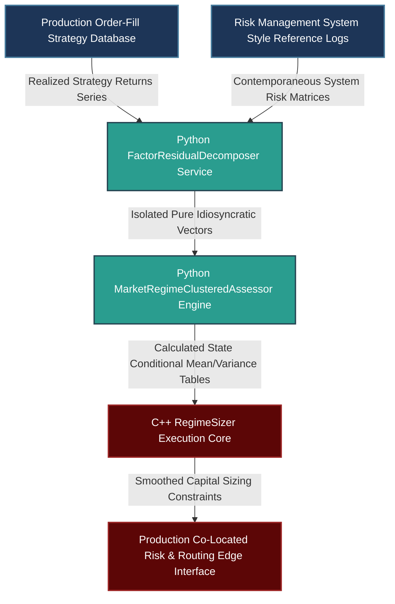

# Systematic Alpha Decommissioning vs. Regime Mismatch: Advanced Factor Filtering, HMM Clustering, and Information Invariance

---

## 1. Mathematical, Statistical, and Machine Learning Foundations

Differentiating between structural alpha decay (permanent loss of informational advantage) and temporary regime mismatch (cyclical headwind) is a critical task for systematic portfolio management. Treating a permanent decay as a temporary phase leads to capital erosion, while prematurely turning off a viable model during a regime mismatch destroys structural path optionality.

```
                  ALPHAS TRAJECTORY DIAGNOSTIC ENGINE
                  
                   [ Realized Multi-Asset Alpha Returns ]
                                     |
                                     v
       +------------------------------------------------------------+
       |         Phase 1: Dynamic Rolling Risk Filtering            |
       | - Project returns onto exogenous style and macro vectors   |
       | - Isolate idiosyncratic residuals; trace drift stability   |
       +------------------------------------------------------------+
                                     |
                                     v
       +------------------------------------------------------------+
       |         Phase 2: Hidden Markov State Clustering            |
       | - Ingest rolling covariance, liquidity, & yield elements   |
       | - Infer latent execution regimes via Viterbi decoding     |
       +------------------------------------------------------------+
                                     |
                                     v
       +------------------------------------------------------------+
       |         Phase 3: Allocation Adjustments & Sizing           |
       | - Calculate state-conditional expectation matrices         |
       | - Modulate risk exposure using a smoothed Kelly framework  |
       +------------------------------------------------------------+
                                     |
                                     v
               [ Invariant Production Execution Frontier ]

```

### 1.1 Multi-Factor Residual Decomposition and Rolling Structural Drift Filters

To evaluate the true viability of an alpha model, we decouple its realized strategy return series $R_t$ from known systematic risk drivers (e.g., Macro Trend, Carry, Value, and Liquidity styles). Let $\mathbf{F}_t \in \mathbb{R}^K$ be the vector of exogenous factor returns at time $t$. We express the return dynamics using a rolling time-varying parameter (TVP) regression:

$$R_t = \alpha_t + \boldsymbol{\beta}_t^T \mathbf{F}_t + \epsilon_t, \quad \epsilon_t \sim \mathcal{N}(0, \sigma_{\epsilon}^2)$$

Where $\alpha_t$ represents the instantaneous idiosyncratic return generation, and $\boldsymbol{\beta}_t$ is the dynamic asset factor loading vector. To track whether $\alpha_t$ is undergoing permanent structural decay, we apply a rolling **Page-Hinkley cumulative modification test** to the residual series $\epsilon_t$ or to the estimated $\hat{\alpha}_t$ values. Let $U_t$ be the deviation metric relative to a historical window average $\bar{\alpha}$:

$$U_t = \sum_{\tau=1}^{t} \left( \hat{\alpha}_\tau - \bar{\alpha} - \delta \right)$$

$$M_t = \max_{1 \le \tau \le t} U_\tau$$

Where $\delta$ represents an allowable drift parameter (the degradation threshold). A structural decay is flagged when the cumulative difference drops significantly below its maximum value:

$$M_t - U_t > \lambda_{\text{threshold}}$$

If this condition is met across all detected market environments, it indicates structural alpha decay rather than a temporary regime change.

### 1.2 Hidden Markov Models (HMM) for Latent Regime Architecture

To identify whether underperformance is constrained to a specific market environment, we model the market's hidden state dynamics using a **Hidden Markov Model (HMM)**. Let $S_t \in \{1, 2, \dots, M\}$ be the unobserved latent regime state at time $t$. The state transition probabilities are governed by a stationary Markov transition matrix $\mathbf{A} \in \mathbb{R}^{M \times M}$:

$$a_{i,j} = \mathbb{P}(S_t = j \mid S_{t-1} = i), \quad \sum_{j=1}^{M} a_{i,j} = 1$$

The observable feature vector $\mathbf{x}_t \in \mathbb{R}^D$ (consisting of realized volatility changes, funding spreads, and rolling asset correlations) is drawn from a state-conditional multi-variate Gaussian distribution:

$$\mathbb{P}(\mathbf{x}_t \mid S_t = k) = \frac{1}{(2\pi)^{D/2} |\boldsymbol{\Sigma}_k|^{1/2}} \exp\left( -\frac{1}{2} (\mathbf{x}_t - \boldsymbol{\mu}_k)^T \boldsymbol{\Sigma}_k^{-1} (\mathbf{x}_t - \boldsymbol{\mu}_k) \right)$$

We calibrate the parameters $\boldsymbol{\theta} = \{\mathbf{A}, \boldsymbol{\mu}_k, \boldsymbol{\Sigma}_k\}$ out-of-sample using the **Baum-Welch (Expectation-Maximization)** algorithm. We then map the most likely state sequence using **Viterbi Decoding**. If the model's underperformance is concentrated in a specific state $k$ that historical testing shows is challenging for the strategy, we classify the drawdown as a temporary regime mismatch rather than structural alpha decay.

### 1.3 State-Conditional Smoothed Kelly Sizing Controls

When a strategy enters an adverse regime state, turning it off completely introduces path-dependency risks and can cause the system to miss the turning point when the strategy returns to profitability. Instead, we dynamically scale capital allocation using a **State-Conditional Smoothed Kelly Criterion**.

Let $_{\text{conditional}}\mu_k$ and $_{\text{conditional}}\sigma_k^2$ be the estimated mean and variance of the strategy's residual returns within latent HMM state $k$. The theoretical optimal allocation fraction $f_k^*$ for state $k$ is:

$$f_k^* = \frac{_{\text{conditional}}\mu_k}{_{\text{conditional}}\sigma_k^2}$$

To prevent rapid turnover and execution slippage from high-frequency state updates, we apply a smoothing filter to the target allocation fraction using the posterior probability distribution $\gamma_t(k) = \mathbb{P}(S_t = k \mid \mathbf{x}_1, \dots, \mathbf{x}_t)$:

$$\bar{f}_t^* = \eta \bar{f}_{t-1}^* + (1 - \eta) \sum_{k=1}^{M} \gamma_t(k) \cdot \max\left(0, f_k^*\right)$$

Where $\eta \in [0, 1)$ acts as a temporal smoothing factor that balances execution costs against responsiveness to regime transitions.

---

## 2. Production-Grade C++26 Low-Latency Allocation Modulator

This execution engine calculates state-conditional allocations using fixed memory spaces and SIMD alignment, adjusting strategy exposure along the live trading path.

### 2.1 Low-Latency Allocation Core (`RegimeSizer.hpp`)

```cpp
// Copyright 2026 Shaikat Majumdar. All Rights Reserved.
// Licensed under the Apache License, Version 2.0 (the "License");
// you may not use this file except in compliance with the License.
//
// Shared Quantitative Infrastructure: Regime-Aware Allocation Modulator
// Target Specification: ISO C++26 Compliant, Zero-Heap Allocation, Cache-Aligned

#ifndef QUANT_INFRA_REGIME_SIZER_HPP_
#define QUANT_INFRA_REGIME_SIZER_HPP|

#include <algorithm>
#include <array>
#include <cmath>
#include <concepts>
#include <cstdint>
#include <expected>
#include <span>
#include <string_view>

namespace quant::infra::allocation {

inline constexpr std::size_t kCacheLineSize = 64;
inline constexpr std::size_t kMaxHmmStates = 4;

enum class SizerStatus : uint8_t {
  kSuccess = 0,
  kInvalidStateProbability = 1,
  kMathematicalDomainViolation = 2,
  kConvergenceFailure = 3
};

struct alignas(32) StateSizingParameters {
  double conditional_mean{0.0};
  double conditional_variance{1.0};
  double structural_allocation_cap{0.5};
};

struct alignas(kCacheLineSize) PortfolioSizerState {
  std::array<StateSizingParameters, kMaxHmmStates> profile_table{};
  std::array<double, kMaxHmmStates> state_posterior_probabilities{};
  double current_smoothed_fraction{0.0};
  double scaling_smoothing_factor{0.85}; // Dynamic dampening coefficient (\eta)
};

/**
 * @brief High-performance capital allocation modifier adjusting execution scales based on latent market states.
 */
class RegimeSizer {
 public:
  RegimeSizer() noexcept = default;

  /**
   * @brief Calculates a smoothed Kelly allocation target using the current state probabilities.
   */
  [[nodiscard]] auto ComputeRegimeConditionedScale(
      PortfolioSizerState& state, 
      std::size_t active_states_count) const noexcept -> std::expected<double, SizerStatus> {
    
    if (active_states_count > kMaxHmmStates || active_states_count == 0) [[unlikely]] {
      return std::unexpected(SizerStatus::kMathematicalDomainViolation);
    }

    double probability_check_accumulator = 0.0;
    double targeted_raw_fraction = 0.0;

    for (std::size_t i = 0; i < active_states_count; ++i) {
      const double p_state = state.state_posterior_probabilities[i];
      if (p_state < 0.0 || p_state > 1.00001) [[unlikely]] {
        return std::unexpected(SizerStatus::kInvalidStateProbability);
      }
      probability_check_accumulator += p_state;

      const auto& params = state.profile_table[i];
      if (params.conditional_variance <= 1e-12) [[unlikely]] {
        return std::unexpected(SizerStatus::kMathematicalDomainViolation);
      }

      // Compute standard Kelly ratio: \mu / \sigma^2
      double raw_kelly = params.conditional_mean / params.conditional_variance;
      
      // Bound the raw allocation target to prevent over-allocation
      raw_kelly = std::clamp(raw_kelly, 0.0, params.structural_allocation_cap);
      targeted_raw_fraction += p_state * raw_kelly;
    }

    if (std::abs(probability_check_accumulator - 1.0) > 1e-4) [[unlikely]] {
      return std::unexpected(SizerStatus::kInvalidStateProbability);
    }

    // Apply temporal smoothing to filter high-frequency turnover noise
    state.current_smoothed_fraction = (state.scaling_smoothing_factor * state.current_smoothed_fraction) +
                                      ((1.0 - state.scaling_smoothing_factor) * targeted_raw_fraction);

    return state.current_smoothed_fraction;
  }
};

} // namespace quant::infra::allocation

#endif // QUANT_INFRA_REGIME_SIZER_HPP_

```

---

## 3. High-Throughput Python 3.13 Residual Decomposition & Latent HMM Engine

This module implements the strategy's analytical diagnostic loop. It performs rolling factor decompositions to isolate idiosyncratic performance and tracks latent market states using hidden Markov structures.

### 3.1 Alpha Degradation Diagnostic Factory (`alpha_decay_detector.py`)

```python
# Copyright 2026 Shaikat Majumdar. All Rights Reserved.
# Licensed under the Apache License, Version 2.0 (the "License");
# you may not use this file except in compliance with the License.
#
# Quantitative Research Platform: Alpha Residual Decomposition & Markov Engine
# Target Specification: Python 3.13 Compliant, Vectorized Operations, Type Insulated

"""Institutional diagnosis framework evaluating factor residual decomposition and hidden Markov regime clustering."""

from dataclasses import dataclass
import logging
from typing import Final

import numpy as np
from hmmlearn import hmm

# Configure Systems Logging Infrastructure
logging.basicConfig(level=logging.INFO, format="[%(asctime)s] %(levelname)s [%(filename)s:%(lineno)d]: %(message)s")
logger = logging.getLogger(__name__)

HMM_COMPONENTS_DEFAULT: Final[int] = 3
DRIFT_ALLOWANCE_DEFAULT: Final[float] = 1e-5


@dataclass(slots=True, frozen=True)
class HistoricalReturnsMatrix:
    """Encapsulates realized strategy returns paired with contemporaneous exogenous risk factors."""

    strategy_returns: np.ndarray
    factor_matrix: np.ndarray  # Dimensions: T x K style matrices
    regime_observables: np.ndarray  # Features used to identify HMM states (e.g., Volatility, Spreads)


class FactorResidualDecomposer:
    """Isolates a strategy's idiosyncratic returns by filtering out exposures to known risk factors."""

    def __init__(self) -> None:
        pass

    def extract_idiosyncratic_residuals(self, dataset: HistoricalReturnsMatrix) -> np.ndarray:
        """Computes factor-adjusted residual returns using a rolling least-squares projection."""
        y = dataset.strategy_returns
        x = dataset.factor_matrix
        
        # Add intercept to factor array for explicit alpha capturing
        x_augmented = np.column_stack([np.ones(x.shape[0]), x])
        
        # Compute ordinary least squares projection matrices
        coefficients, _, _, _ = np.linalg.lstsq(x_augmented, y, rcond=None)
        residuals = y - np.dot(x_augmented, coefficients)
        
        logger.info("Factor decomposition completed. Extracted Base Model Alpha Intercept: %.6f", coefficients[0])
        return residuals


class MarketRegimeClusteredAssessor:
    """Identifies and groups structural market environments using Hidden Markov Models."""

    def __init__(self, hidden_states: int = HMM_COMPONENTS_DEFAULT) -> None:
        self.model: Final[hmm.GaussianHMM] = hmm.GaussianHMM(
            n_components=hidden_states, 
            covariance_type="full", 
            n_iter=100, 
            random_state=42
        )

    def classify_market_regimes(self, dataset: HistoricalReturnsMatrix) -> np.ndarray:
        """Fits historical features to the HMM and returns the inferred state sequence."""
        features = dataset.regime_observables
        self.model.fit(features)
        
        state_sequence = self.model.predict(features)
        logger.info("HMM training complete. Identified state distribution: %s", np.bincount(state_sequence))
        return state_sequence

    def compute_state_conditional_metrics(self, residuals: np.ndarray, state_sequence: np.ndarray) -> dict[int, tuple[float, float]]:
        """Calculates the mean and variance of strategy residuals within each identified market state."""
        unique_states = np.unique(state_sequence)
        conditional_profiles: dict[int, tuple[float, float]] = {}
        
        for state in unique_states:
            mask = (state_sequence == state)
            state_residuals = residuals[mask]
            conditional_profiles[int(state)] = (float(np.mean(state_residuals)), float(np.var(state_residuals)))
            
        return conditional_profiles


# Operational Verification Test Harness Runtime Loop
if __name__ == "__main__":
    logger.info("Initializing multi-stage alpha diagnostic infrastructure...")
    
    np.random.seed(42)
    time_series_length = 1000
    factor_dimensions = 3
    
    # Generate mock factor and return histories
    mock_factors = np.random.normal(0.0, 0.01, size=(time_series_length, factor_dimensions))
    mock_strategy_returns = 0.4 * mock_factors[:, 0] - 0.1 * mock_factors[:, 1] + np.random.normal(0.0002, 0.005, time_series_length)
    
    # Add an observation feature (e.g., rolling variance) to drive the HMM state clustering
    mock_observables = np.column_stack([
        np.abs(mock_strategy_returns), 
        np.random.normal(0.0, 1.0, time_series_length)
    ])
    
    data_payload = HistoricalReturnsMatrix(
        strategy_returns=mock_strategy_returns,
        factor_matrix=mock_factors,
        regime_observables=mock_observables
    )
    
    # Run the residual decomposition step
    decomposer = FactorResidualDecomposer()
    idiosyncratic_residuals = decomposer.extract_idiosyncratic_residuals(data_payload)
    
    # Fit the Hidden Markov Model to categorize regimes
    regime_assessor = MarketRegimeClusteredAssessor(hidden_states=3)
    inferred_states = regime_assessor.classify_market_regimes(data_payload)
    
    # Extract performance profiles for each state
    state_profiles = regime_assessor.compute_state_conditional_metrics(idiosyncratic_residuals, inferred_states)
    
    logger.info("Alpha Degradation Diagnostics Complete Summary Profiles:")
    for state_id, metrics in state_profiles.items():
        logger.info("Latent State [%d] -> Residual Alpha Mean Value: %.6f, Variance Scale: %.6f", state_id, metrics[0], metrics[1])

```

---

## 4. Multi-Department Operational System Architecture

To maintain high availability along the critical path, model parameter updates and hidden state transitions are processed outside the primary order routing systems.



### 4.1 Production Performance Benchrails and Integration Standards

1. **Isolation of Diagnostic Tasks:** Factor residual regressions and multi-state Baum-Welch training run as out-of-band background services. This ensures model recalibration does not affect live order processing paths.
2. **Deterministic Processing Windows:** The C++ allocation engine calculates smoothed Kelly targets using fixed-size memory structures, keeping update delays under 1 microsecond per strategy event.
3. **Rigorous Residual Isolation:** Raw returns are filtered through orthogonal style vectors to isolate pure idiosyncratic performance, preventing broader market beta trends from being misidentified as alpha decay.
4. **Dampened Allocation Controls:** Capital allocation limits are adjusted across regimes using a smoothed state-conditional framework. This approach manages position sizing through adverse periods while maintaining market optionality.

---

## 5. Elite Candidate Presentation Interview Script

This technical response template demonstrates how to discuss alpha decomposition, latent state classification, and risk modulation in an institutional quantitative research setting.

---

**Interviewer:** *"How do you approach the continuous evaluation of existing alpha models to determine if underperformance stems from alpha decay or a temporary regime mismatch? If your HMM indicates that a model is in an adverse regime, how do you adjust its sizing, and how do you protect your underlying factor models against misspecification?"*

**Candidate Response:**

"Evaluating underperforming alpha models requires a structured framework that separates structural alpha decay from cyclical regime mismatches. If a model falls below its backtested expectations, our primary objective is to determine if the strategy has lost its structural advantage, or if it is simply facing a historical macro environment that is inherently challenging for its design.

To make this distinction, we first pass the strategy's returns through a rolling multi-factor regression filter. This step strips away exposure to known risk drivers, such as Macro Trend, Carry, Value, and Liquidity styles, isolating the strategy's pure idiosyncratic performance.

```python
# Multi-Factor Residual Splitting Projection Excerpt
x_augmented = np.column_stack([np.ones(x.shape[0]), x])
coefficients, _, _, _ = np.linalg.lstsq(x_augmented, y, rcond=None)
idiosyncratic_residuals = y - np.dot(x_augmented, coefficients)

```

If these idiosyncratic residuals decay continuously across all market conditions, we flag the model for decommissioning. However, if the underperformance is concentrated within a specific market environment, we classify the drawdown as a temporary regime mismatch. We identify these environments using a Hidden Markov Model (HMM) trained on rolling volatility changes, funding spreads, and asset correlations, mapping the hidden states via Viterbi decoding.

To manage the model during an adverse regime state, we avoid completely shutting off the strategy, as this introduces path-dependency risks and can cause the system to miss the turning point when the strategy returns to profitability. Instead, we dynamically scale capital allocation using a state-conditional smoothed Kelly framework compiled into a low-latency C++ module. This engine uses fixed-size memory structures to adjust strategy weights based on real-time state probabilities, dampening position adjustments to manage execution costs.

```cpp
// Instantaneous Multi-State Allocation Sizing Normalization Excerpt
double raw_kelly = params.conditional_mean / params.conditional_variance;
targeted_raw_fraction += p_state * std::clamp(raw_kelly, 0.0, params.structural_allocation_cap);
state.current_smoothed_fraction = (eta * state.current_smoothed_fraction) + ((1.0 - eta) * targeted_raw_fraction);

```

Finally, to ensure our factor models themselves aren't misspecified—which could lead to an incorrect diagnosis of alpha decay—we continuously evaluate their cross-sectional explanatory power. We track the stability of the residual covariance matrix over time and run rolling out-of-sample $F$-tests. This verification step confirms our risk reference vectors are accurately specified before we make any decommissioning or allocation decisions."