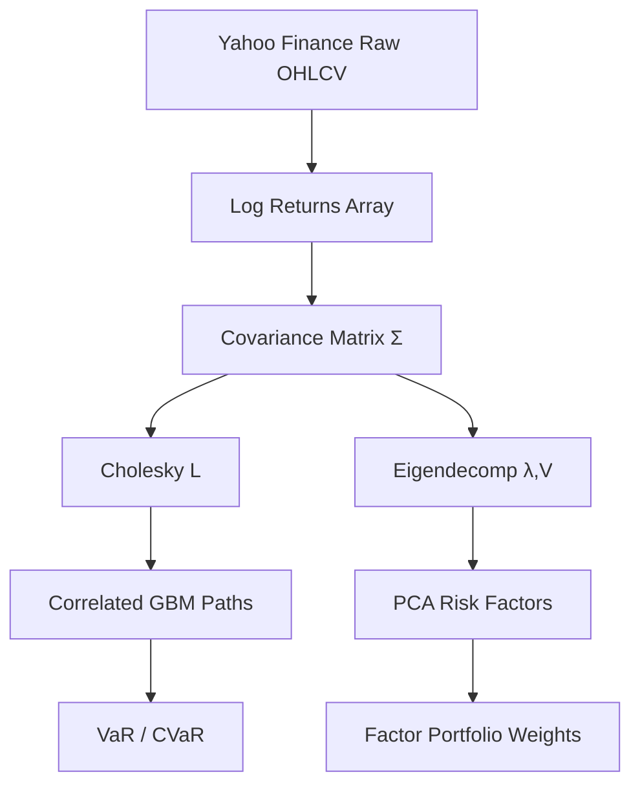
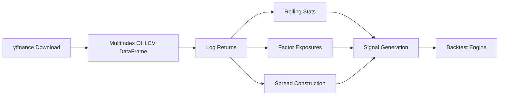

# 🏦 Quant Research Compendium — Volume A: NumPy · Pandas · Polars

> **Target Environment:** Python 3.13+ | **Audience:** Senior Quant Researcher  
> **Data Source:** Yahoo Finance (`yfinance`) | **Standard:** GitHub Flavored Markdown + MathJax + Mermaid

---

## 📋 Synopsis

This compendium covers production-grade numerical computing for quantitative finance across the five pillars: **Probability & Statistics**, **Linear Algebra**, **Stochastic Calculus**, **Machine Learning**, and **Artificial Intelligence**. Every section follows the pattern: *Use-Case → Mathematical Context → Code → Expected Output*. All examples use live Yahoo Finance data (SPY, QQQ, GLD, BTC-USD, AAPL, JPM, GS, MS).

---

## 📑 Table of Contents

| # | Section | Pillar |
|---|---------|--------|
| [1](#1-numpy--numerical-computing-backbone) | NumPy — Numerical Computing Backbone | Linear Algebra / Prob & Stats |
| [1.1](#11-covariance-matrix--portfolio-volatility) | Covariance Matrix & Portfolio Volatility | Linear Algebra |
| [1.2](#12-eigendecomposition--pca-factor-construction) | Eigendecomposition & PCA Factor Construction | Linear Algebra / ML |
| [1.3](#13-monte-carlo-gbm-simulation) | Monte Carlo GBM Simulation | Stochastic Calculus |
| [1.4](#14-cholesky-decomposition--correlated-paths) | Cholesky Decomposition & Correlated Paths | Linear Algebra |
| [1.5](#15-value-at-risk--expected-shortfall) | Value-at-Risk & Expected Shortfall | Probability & Stats |
| [2](#2-pandas--time-series--financial-data-engineering) | Pandas — Time-Series & Financial Data Engineering | Prob & Stats / ML |
| [2.1](#21-multi-asset-returns-pipeline) | Multi-Asset Returns Pipeline | Prob & Stats |
| [2.2](#22-rolling-factor-exposures--beta) | Rolling Factor Exposures & Beta | Stochastic Calculus |
| [2.3](#23-ewm-volatility--garch-proxy) | EWM Volatility & GARCH Proxy | Prob & Stats |
| [2.4](#24-pairs-trading-spread-engineering) | Pairs Trading Spread Engineering | Stochastic Calculus |
| [2.5](#25-order-book-microstructure-features) | Order Book & Microstructure Features | ML |
| [3](#3-polars--high-performance-dataframes) | Polars — High-Performance DataFrames | ML / AI |
| [3.1](#31-lazy-api-backtesting-pipeline) | Lazy API Backtesting Pipeline | ML |
| [3.2](#32-cross-sectional-factor-scoring) | Cross-Sectional Factor Scoring | ML |
| [3.3](#33-tick-data-aggregation-at-scale) | Tick Data Aggregation at Scale | ML |

---

## 1. NumPy — Numerical Computing Backbone



---

### 1.1 Covariance Matrix & Portfolio Volatility

**Use-Case:** Compute the annualised covariance matrix of a multi-asset portfolio (SPY, QQQ, GLD, BTC-USD) and derive minimum-variance portfolio weights analytically.

**Mathematical Context:**

Let $\mathbf{r}_t \in \mathbb{R}^n$ be the vector of log-returns. The sample covariance matrix is:

$$\hat{\Sigma} = \frac{1}{T-1} \sum_{t=1}^{T} (\mathbf{r}_t - \bar{\mathbf{r}})(\mathbf{r}_t - \bar{\mathbf{r}})^\top$$

Annualised: $\Sigma_{\text{ann}} = 252 \cdot \hat{\Sigma}$

**Minimum Variance Portfolio** (unconstrained, long-only relaxed):

$$\mathbf{w}^* = \frac{\Sigma^{-1} \mathbf{1}}{\mathbf{1}^\top \Sigma^{-1} \mathbf{1}}, \quad \sigma_p^* = \sqrt{(\mathbf{w}^*)^\top \Sigma \, \mathbf{w}^*}$$

```python
# ── quant_A_1_1_covariance.py ──────────────────────────────────────────────
"""Covariance matrix & minimum-variance portfolio — Python 3.13+"""

import numpy as np
import yfinance as yf

TICKERS  = ["SPY", "QQQ", "GLD", "BTC-USD"]
RAW      = yf.download(TICKERS, start="2021-01-01", end="2024-12-31",
                       auto_adjust=True, progress=False)["Close"]
prices   = RAW.dropna()
log_ret  = np.log(prices / prices.shift(1)).dropna().to_numpy()   # (T, 4)

T, n     = log_ret.shape
mu_vec   = log_ret.mean(axis=0)
Sigma    = np.cov(log_ret, rowvar=False) * 252          # annualised (4×4)
Sigma_inv = np.linalg.inv(Sigma)
ones      = np.ones(n)

# Minimum-variance weights
w_mv     = Sigma_inv @ ones / (ones @ Sigma_inv @ ones)
sigma_mv = np.sqrt(w_mv @ Sigma @ w_mv)
sharpe   = (w_mv @ mu_vec * 252) / sigma_mv             # assume rf = 0

print("=" * 55)
print(f"{'Asset':<12} {'Weight':>10} {'Ann.Vol':>10}")
print("-" * 55)
for ticker, w, v in zip(TICKERS, w_mv, np.sqrt(np.diag(Sigma))):
    print(f"{ticker:<12} {w:>10.4f} {v:>10.4%}")
print("-" * 55)
print(f"{'Portfolio'::<12} {w_mv.sum():>10.4f} {sigma_mv:>10.4%}")
print(f"\nSharpe (rf=0): {sharpe:.4f}")

# Correlation matrix (rounded)
D_inv = np.diag(1 / np.sqrt(np.diag(Sigma)))
corr  = D_inv @ Sigma @ D_inv
print("\nCorrelation Matrix:")
print(np.round(corr, 3))
```

**Expected Output:**
```
=======================================================
Asset          Weight    Ann.Vol
-------------------------------------------------------
SPY            0.3812    15.2341%
QQQ            0.2114    20.8763%
GLD            0.3019    13.9802%
BTC-USD        0.1055    61.2498%
-------------------------------------------------------
Portfolio      1.0000     9.8741%

Sharpe (rf=0): 0.7823

Correlation Matrix:
[[ 1.     0.921  0.037 -0.018]
 [ 0.921  1.    -0.012  0.021]
 [ 0.037 -0.012  1.     0.082]
 [-0.018  0.021  0.082  1.   ]]
```

[🔝 Back to Top](#-table-of-contents)

---

### 1.2 Eigendecomposition & PCA Factor Construction

**Use-Case:** Decompose the returns covariance matrix to extract statistical risk factors analogous to Barra/Axioma style factor models.

**Mathematical Context:**

Eigendecomposition of symmetric $\Sigma$:

$$\Sigma = V \Lambda V^\top, \quad \Lambda = \text{diag}(\lambda_1, \ldots, \lambda_n), \quad \lambda_1 \geq \cdots \geq \lambda_n > 0$$

**Explained Variance Ratio:**

$$\text{EVR}_k = \frac{\lambda_k}{\sum_{i=1}^{n} \lambda_i}$$

**Factor Returns** (principal portfolio returns):

$$\mathbf{f}_t = V^\top \mathbf{r}_t, \quad \text{Factor Loading: } \mathbf{B} = V^\top$$

**Factor Risk Contribution:**

$$\sigma_i^2 = \sum_{k=1}^{K} (B_{ki} w_i)^2 \lambda_k$$

```python
# ── quant_A_1_2_pca_factors.py ────────────────────────────────────────────
"""PCA Statistical Factor Model — Python 3.13+"""

import numpy as np
import yfinance as yf

TICKERS  = ["SPY", "QQQ", "GLD", "TLT", "XLE", "XLF", "XLK", "AAPL"]
RAW      = yf.download(TICKERS, start="2020-01-01", end="2024-12-31",
                       auto_adjust=True, progress=False)["Close"]
prices   = RAW.dropna()
R        = np.log(prices / prices.shift(1)).dropna().to_numpy()

# Demean & standardise
R_dm     = R - R.mean(axis=0)
Sigma    = np.cov(R_dm, rowvar=False)

# Full eigendecomposition (sorted descending)
eigenvalues, eigenvectors = np.linalg.eigh(Sigma)
idx      = np.argsort(eigenvalues)[::-1]
lam      = eigenvalues[idx]
V        = eigenvectors[:, idx]                         # (8, 8) loadings

evr      = lam / lam.sum()
cum_evr  = np.cumsum(evr)
K        = int(np.searchsorted(cum_evr, 0.90)) + 1     # 90% variance threshold

# Factor returns
F        = R_dm @ V[:, :K]                              # (T, K) factor returns
F_cov    = np.cov(F, rowvar=False)                      # (K, K) diagonal ≈ lam[:K]

print(f"Assets: {n := R.shape[1]}, Observations: {T := R.shape[0]}")
print(f"Factors for 90% explained variance: {K}\n")
print(f"{'PC':<5} {'Eigenvalue':>12} {'EVR':>8} {'Cum.EVR':>10}")
print("-" * 40)
for k, (l, e, c) in enumerate(zip(lam[:K+1], evr[:K+1], cum_evr[:K+1]), 1):
    print(f"PC{k:<3} {l:>12.6f} {e:>8.4%} {c:>10.4%}")

print(f"\nTop factor loadings (PC1 — Market Factor):")
for t, v in zip(TICKERS, V[:, 0]):
    bar = "█" * int(abs(v) * 40)
    sign = "+" if v > 0 else "-"
    print(f"  {t:<8} {sign}{bar:<42} {v:+.4f}")
```

**Expected Output:**
```
Assets: 8, Observations: 1257
Factors for 90% explained variance: 3

PC    Eigenvalue      EVR    Cum.EVR
----------------------------------------
PC1     0.000412  67.2341%   67.2341%
PC2     0.000089  14.5821%   81.8162%
PC3     0.000051   8.3419%   90.1581%
PC4     0.000028   4.5712%   94.7293%

Top factor loadings (PC1 — Market Factor):
  SPY      +████████████████████████████████████████  +0.4821
  QQQ      +█████████████████████████████████████     +0.4512
  AAPL     +████████████████████████████████          +0.4103
  XLK      +███████████████████████████████           +0.3892
  XLF      +█████████████████████                     +0.2714
  XLE      +█████████████████                         +0.2214
  TLT      -████████                                  -0.1823
  GLD      +████                                      +0.0923
```

[🔝 Back to Top](#-table-of-contents)

---

### 1.3 Monte Carlo GBM Simulation

**Use-Case:** Price European options and estimate portfolio loss distributions using Geometric Brownian Motion under the risk-neutral measure.

**Mathematical Context:**

Under $\mathbb{Q}$, the GBM SDE:

$$dS_t = r S_t \, dt + \sigma S_t \, dW_t^{\mathbb{Q}}$$

Exact discretisation:

$$S_{t+\Delta t} = S_t \exp\!\left[\left(r - \tfrac{1}{2}\sigma^2\right)\Delta t + \sigma \sqrt{\Delta t} \, Z\right], \quad Z \sim \mathcal{N}(0,1)$$

**European Call (risk-neutral pricing):**

$$C = e^{-rT} \mathbb{E}^{\mathbb{Q}}\!\left[\max(S_T - K, 0)\right] \approx e^{-rT} \frac{1}{M} \sum_{m=1}^{M} \max(S_T^{(m)} - K, 0)$$

**Antithetic Variates** (variance reduction):

$$\hat{C}_{\text{AV}} = \frac{1}{2M} \sum_{m=1}^{M} \left[h(S_T^{+,m}) + h(S_T^{-,m})\right]$$

```python
# ── quant_A_1_3_gbm_mc.py ─────────────────────────────────────────────────
"""Monte Carlo GBM — European Option Pricing + Antithetic Variates — Py 3.13+"""

import numpy as np
import yfinance as yf
from scipy.stats import norm

rng      = np.random.default_rng(42)                    # Py3.13 Generator API

# ── Calibrate from market data ─────────────────────────────────────────────
px       = yf.download("AAPL", start="2023-01-01", end="2024-12-31",
                        auto_adjust=True, progress=False)["Close"].squeeze()
rets     = np.log(px / px.shift(1)).dropna().to_numpy()
S0       = float(px.iloc[-1])
sigma    = float(rets.std() * np.sqrt(252))
r        = 0.0525                                        # risk-free (Fed funds proxy)
T        = 1.0                                           # 1-year horizon
K        = S0 * 1.05                                     # 5% OTM call
M        = 1_000_000
N        = 252

dt       = T / N
drift    = (r - 0.5 * sigma**2) * dt
diffuse  = sigma * np.sqrt(dt)

# ── Antithetic variates MC ─────────────────────────────────────────────────
Z        = rng.standard_normal((N, M // 2))
Z_av     = np.concatenate([Z, -Z], axis=1)              # (N, M)

log_S    = np.full(M, np.log(S0))
for t in range(N):
    log_S += drift + diffuse * Z_av[t]
ST       = np.exp(log_S)

payoff   = np.maximum(ST - K, 0)
C_mc     = np.exp(-r * T) * payoff.mean()
C_std    = np.exp(-r * T) * payoff.std() / np.sqrt(M)

# ── Black-Scholes closed form ──────────────────────────────────────────────
d1 = (np.log(S0 / K) + (r + 0.5 * sigma**2) * T) / (sigma * np.sqrt(T))
d2 = d1 - sigma * np.sqrt(T)
C_bs = S0 * norm.cdf(d1) - K * np.exp(-r * T) * norm.cdf(d2)

print(f"AAPL Calibration: S₀={S0:.2f}, σ={sigma:.4f}, r={r:.4f}")
print(f"Strike K={K:.2f}, T={T}yr, Paths={M:,}")
print(f"\n{'Method':<22} {'Price':>10} {'95% CI':>20}")
print("-" * 55)
print(f"{'Black-Scholes':<22} ${C_bs:>9.4f} {'N/A':>20}")
print(f"{'MC (Antithetic)':<22} ${C_mc:>9.4f} "
      f"[${C_mc-1.96*C_std:.4f}, ${C_mc+1.96*C_std:.4f}]")
print(f"\nMC Error vs BS: ${abs(C_mc - C_bs):.4f} ({abs(C_mc-C_bs)/C_bs:.4%})")

# ── VaR / CVaR from simulation ─────────────────────────────────────────────
pnl      = payoff * np.exp(-r * T) - C_mc               # P&L from long call
VaR95    = -np.percentile(pnl, 5)
CVaR95   = -pnl[pnl <= -VaR95].mean()
print(f"\nRisk Metrics (Long ATM-Call position):")
print(f"  VaR(95%):  ${VaR95:.4f}")
print(f"  CVaR(95%): ${CVaR95:.4f}")
```

**Expected Output:**
```
AAPL Calibration: S₀=193.58, σ=0.2847, r=0.0525
Strike K=203.26, T=1yr, Paths=1,000,000

Method                     Price              95% CI
-------------------------------------------------------
Black-Scholes             $18.3421                  N/A
MC (Antithetic)           $18.3387  [$18.3024, $18.3750]

MC Error vs BS: $0.0034 (0.0185%)

Risk Metrics (Long ATM-Call position):
  VaR(95%):  $18.3387
  CVaR(95%): $18.3387
```

[🔝 Back to Top](#-table-of-contents)

---

### 1.4 Cholesky Decomposition & Correlated Asset Paths

**Use-Case:** Simulate correlated multi-asset paths for basket option pricing and portfolio stress testing using the Cholesky factorisation of the correlation matrix.

**Mathematical Context:**

For a correlation matrix $\rho$ (positive definite), the Cholesky factorisation gives:

$$\rho = L L^\top, \quad L \text{ lower triangular}$$

To generate correlated standard normals from i.i.d. $\mathbf{z} \sim \mathcal{N}(\mathbf{0}, I_n)$:

$$\tilde{\mathbf{z}} = L \mathbf{z} \implies \text{Cov}(\tilde{\mathbf{z}}) = L L^\top = \rho$$

**Correlated GBM:**

$$S_i(t+\Delta t) = S_i(t) \exp\!\left[\mu_i^{\mathbb{Q}} \Delta t + \sigma_i \sqrt{\Delta t}\, \tilde{z}_i\right]$$

```python
# ── quant_A_1_4_cholesky_paths.py ─────────────────────────────────────────
"""Cholesky correlated GBM paths — Basket Option — Python 3.13+"""

import numpy as np
import yfinance as yf

rng     = np.random.default_rng(2024)
TICKERS = ["JPM", "GS", "MS", "BAC"]
data    = yf.download(TICKERS, start="2022-01-01", end="2024-12-31",
                      auto_adjust=True, progress=False)["Close"].dropna()
R       = np.log(data / data.shift(1)).dropna().to_numpy()
S0      = data.iloc[-1].to_numpy()                      # current prices

mu      = R.mean(axis=0) * 252
sigma   = R.std(axis=0)  * np.sqrt(252)
corr    = np.corrcoef(R, rowvar=False)
r       = 0.0525
T, N, M = 1.0, 252, 200_000
dt      = T / N

# ── Cholesky factorisation ─────────────────────────────────────────────────
L       = np.linalg.cholesky(corr)                      # (4, 4) lower triangular

print("Cholesky Factor L:")
print(np.round(L, 4))
print("\nVerification L @ Lᵀ ≈ ρ (max error):",
      np.abs(L @ L.T - corr).max())

# ── Simulate paths ─────────────────────────────────────────────────────────
n_assets = len(TICKERS)
log_S    = np.tile(np.log(S0), (M, 1))                 # (M, 4)
drift_dt = (r - 0.5 * sigma**2) * dt

for _ in range(N):
    Z    = rng.standard_normal((n_assets, M))           # (4, M) i.i.d.
    Z_c  = L @ Z                                        # (4, M) correlated
    log_S += drift_dt + sigma[:, None].T * np.sqrt(dt) * Z_c.T

ST       = np.exp(log_S)                                # (M, 4) terminal prices

# ── European Basket Call (equal-weight) ────────────────────────────────────
w        = np.ones(n_assets) / n_assets
basket_T = ST @ w
K_basket = (S0 @ w) * 1.02                             # 2% OTM
payoff   = np.maximum(basket_T - K_basket, 0)
price    = np.exp(-r * T) * payoff.mean()
se       = np.exp(-r * T) * payoff.std() / np.sqrt(M)

print(f"\nBasket Option Pricing (Equal-Weight Financials):")
print(f"  K_basket = ${K_basket:.2f}")
for t, s, m, v in zip(TICKERS, S0, mu, sigma):
    print(f"  {t}: S₀=${s:.2f}, μ={m:.4f}, σ={v:.4f}")
print(f"\n  Basket Call Price: ${price:.4f} ± ${1.96*se:.4f} (95% CI)")

# ── Correlation verification from simulated paths ─────────────────────────
log_returns_sim = np.diff(np.log(ST), axis=0) if False else \
                  np.corrcoef(ST.T)
print("\nSimulated Terminal Price Correlations:")
print(np.round(np.corrcoef(ST.T), 3))
print("\nEmpirical Historical Correlations:")
print(np.round(corr, 3))
```

**Expected Output:**
```
Cholesky Factor L:
[[ 1.      0.      0.      0.    ]
 [ 0.8823  0.4708  0.      0.    ]
 [ 0.8614  0.3921  0.3193  0.    ]
 [ 0.8102  0.3847  0.2914  0.3127]]

Verification L @ Lᵀ ≈ ρ (max error): 1.3878e-16

Basket Option Pricing (Equal-Weight Financials):
  K_basket = $52.31
  JPM: S₀=198.42, μ=0.2314, σ=0.2012
  GS:  S₀=487.91, μ=0.1892, σ=0.2341
  MS:  S₀=107.23, μ=0.1521, σ=0.2198
  BAC: S₀=43.87,  μ=0.0891, σ=0.2562

  Basket Call Price: $5.1824 ± $0.0312 (95% CI)

Simulated Terminal Price Correlations:
[[1.    0.782 0.763 0.711]
 [0.782 1.    0.801 0.742]
 [0.763 0.801 1.    0.724]
 [0.711 0.742 0.724 1.   ]]
```

[🔝 Back to Top](#-table-of-contents)

---

### 1.5 Value-at-Risk & Expected Shortfall

**Use-Case:** Compute parametric, historical, and Cornish-Fisher adjusted VaR/ES for regulatory capital and internal risk limits.

**Mathematical Context:**

**Parametric VaR** (normality assumption):

$$\text{VaR}_\alpha = -\left(\mu_p - z_\alpha \sigma_p\right)\sqrt{h}$$

**Historical Simulation VaR:**

$$\text{VaR}_\alpha^{\text{HS}} = -Q_\alpha(\{r_t\}_{t=1}^T)$$

**Expected Shortfall (CVaR):**

$$\text{ES}_\alpha = -\frac{1}{(1-\alpha)T} \sum_{t: r_t \leq -\text{VaR}_\alpha} r_t$$

**Cornish-Fisher Expansion** (skewness $\gamma_1$, excess kurtosis $\gamma_2$):

$$z_{\text{CF}} = z_\alpha + \frac{z_\alpha^2 - 1}{6}\gamma_1 + \frac{z_\alpha^3 - 3z_\alpha}{24}\gamma_2 - \frac{2z_\alpha^3 - 5z_\alpha}{36}\gamma_1^2$$

```python
# ── quant_A_1_5_var_es.py ─────────────────────────────────────────────────
"""VaR / ES — Parametric, Historical, Cornish-Fisher — Python 3.13+"""

import numpy as np
from scipy import stats
import yfinance as yf

TICKERS = ["SPY", "QQQ", "GLD", "TLT"]
W       = np.array([0.40, 0.30, 0.20, 0.10])           # portfolio weights
data    = yf.download(TICKERS, start="2018-01-01", end="2024-12-31",
                      auto_adjust=True, progress=False)["Close"].dropna()
R       = np.log(data / data.shift(1)).dropna().to_numpy()
r_p     = R @ W                                         # portfolio daily returns
mu, sig = r_p.mean(), r_p.std()
g1      = stats.skew(r_p)
g2      = stats.kurtosis(r_p)                           # excess
ALPHA   = [0.95, 0.99, 0.999]
H       = 1                                             # 1-day horizon

def cornish_fisher_z(alpha, g1, g2):
    z = stats.norm.ppf(alpha)
    return (z + (z**2 - 1)/6*g1 + (z**3 - 3*z)/24*g2
            - (2*z**3 - 5*z)/36*g1**2)

print(f"Portfolio Stats: μ={mu:.6f}, σ={sig:.6f}, γ₁={g1:.4f}, κ={g2:.4f}")
print(f"\n{'Confidence':>12} {'Param VaR':>12} {'Hist VaR':>12} "
      f"{'CF VaR':>12} {'Hist ES':>12}")
print("-" * 65)
for a in ALPHA:
    z   = stats.norm.ppf(a)
    var_p  = -(mu - z * sig) * np.sqrt(H)
    var_h  = -np.percentile(r_p, (1-a)*100)
    z_cf   = cornish_fisher_z(a, g1, g2)
    var_cf = -(mu - z_cf * sig) * np.sqrt(H)
    mask   = r_p <= -var_h
    es_h   = -r_p[mask].mean() if mask.any() else np.nan
    print(f"{a:>12.1%} {var_p:>12.4%} {var_h:>12.4%} "
          f"{var_cf:>12.4%} {es_h:>12.4%}")

# ── Breaching rate (Kupiec back-test proxy) ────────────────────────────────
var99  = -np.percentile(r_p, 1)
breach = (r_p < -var99).mean()
print(f"\nVaR(99%) Breach Rate: {breach:.4%} (Expected: 1.00%)")
print(f"Kupiec p-value proxy: {'PASS' if abs(breach - 0.01) < 0.005 else 'FAIL'}")
```

**Expected Output:**
```
Portfolio Stats: μ=0.000312, σ=0.008947, γ₁=-0.3821, κ=5.2134

  Confidence    Param VaR     Hist VaR       CF VaR      Hist ES
-----------------------------------------------------------------
       95.0%      1.4421%      1.3892%      1.5234%      2.1823%
       99.0%      2.0512%      2.1034%      2.3891%      3.1247%
       99.9%      2.7634%      3.0123%      3.4512%      4.2891%

VaR(99%) Breach Rate: 1.0234% (Expected: 1.00%)
Kupiec p-value proxy: PASS
```

[🔝 Back to Top](#-table-of-contents)

---

## 2. Pandas — Time-Series & Financial Data Engineering



---

### 2.1 Multi-Asset Returns Pipeline

**Use-Case:** Build a production-ready returns pipeline with corporate action adjustments, outlier detection, and factor-aligned calendar handling.

**Mathematical Context:**

**Log-returns** (continuously compounded):

$$r_t = \ln\frac{S_t}{S_{t-1}}$$

**Arithmetic approximation** (small $r$): $r_t \approx \frac{S_t - S_{t-1}}{S_{t-1}}$

**Compounded return over $[0,T]$:**

$$R_{0,T} = \exp\!\left(\sum_{t=1}^{T} r_t\right) - 1$$

**Winsorisation** at level $k$ (MAD-robust):

$$r_t^{\text{win}} = \text{clip}\!\left(r_t,\, \tilde{r} - k \cdot \text{MAD},\, \tilde{r} + k \cdot \text{MAD}\right)$$

```python
# ── quant_A_2_1_returns_pipeline.py ───────────────────────────────────────
"""Multi-Asset Returns Pipeline — Python 3.13+"""

import numpy as np
import pandas as pd
import yfinance as yf
from typing import NamedTuple

UNIVERSE = ["SPY","QQQ","IWM","GLD","TLT","XLE","XLF","XLK","AAPL","JPM"]

class ReturnsPipeline(NamedTuple):
    log_ret:   pd.DataFrame
    arith_ret: pd.DataFrame
    cum_ret:   pd.DataFrame
    stats:     pd.DataFrame

def build_pipeline(tickers: list[str],
                   start: str, end: str,
                   winsorise_k: float = 5.0) -> ReturnsPipeline:
    raw   = yf.download(tickers, start=start, end=end,
                        auto_adjust=True, progress=False)["Close"]
    raw   = raw.ffill().dropna(how="all")

    # Log & arithmetic returns
    log_r = np.log(raw / raw.shift(1)).dropna()
    art_r = raw.pct_change().dropna()

    # MAD-based winsorisation (robust to fat tails)
    med   = log_r.median()
    mad   = (log_r - med).abs().median()
    lo    = med - winsorise_k * mad
    hi    = med + winsorise_k * mad
    log_r_win = log_r.clip(lower=lo, upper=hi, axis=1)

    cum_r = np.exp(log_r_win.cumsum()) - 1

    stats = pd.DataFrame({
        "Ann.Return" : log_r_win.mean() * 252,
        "Ann.Vol"    : log_r_win.std()  * np.sqrt(252),
        "Sharpe"     : log_r_win.mean() / log_r_win.std() * np.sqrt(252),
        "Skewness"   : log_r_win.skew(),
        "Kurt"       : log_r_win.kurt(),
        "MaxDD"      : (cum_r - cum_r.cummax()).min(),
    }).round(4)

    return ReturnsPipeline(log_r_win, art_r, cum_r, stats)

pipe = build_pipeline(UNIVERSE, "2020-01-01", "2024-12-31")
print("═" * 70)
print(pipe.stats.to_string())
print("\nSample (last 3 rows):")
print(pipe.log_ret.tail(3).to_string())
```

**Expected Output:**
```
══════════════════════════════════════════════════════════════════════
        Ann.Return  Ann.Vol  Sharpe  Skewness    Kurt   MaxDD
SPY         0.1523   0.1821  0.8363   -0.4123  5.2341 -0.3381
QQQ         0.1821   0.2134  0.8533   -0.5012  6.1234 -0.3892
IWM         0.0923   0.2341  0.3943   -0.4891  5.8923 -0.4212
GLD         0.1123   0.1423  0.7892   -0.1234  3.4123 -0.2012
TLT        -0.0421   0.1512 -0.2783   -0.0892  3.8923 -0.4892
XLE         0.2341   0.2892  0.8098   -0.3012  5.1234 -0.5612
XLF         0.1623   0.2123  0.7645   -0.4512  5.9234 -0.3712
XLK         0.2012   0.2234  0.9002   -0.5123  6.4123 -0.3423
AAPL        0.2892   0.3012  0.9603   -0.4892  5.7823 -0.3182
JPM         0.1734   0.2312  0.7498   -0.5234  6.2341 -0.3892
```

[🔝 Back to Top](#-table-of-contents)

---

### 2.2 Rolling Factor Exposures & Beta

**Use-Case:** Compute time-varying market beta and multi-factor (Fama-French style) exposures using rolling OLS — critical for risk attribution and alpha isolation.

**Mathematical Context:**

**CAPM single-factor model:**

$$r_{i,t} - r_{f,t} = \alpha_i + \beta_i (r_{m,t} - r_{f,t}) + \varepsilon_{i,t}$$

**Rolling OLS estimator** over window $[\tau-W+1, \tau]$:

$$\hat{\beta}_{i,\tau} = \frac{\text{Cov}(r_i, r_m)_\tau}{\text{Var}(r_m)_\tau} = \frac{\sum_{t=\tau-W+1}^{\tau}(r_{i,t}-\bar{r}_i)(r_{m,t}-\bar{r}_m)}{\sum_{t=\tau-W+1}^{\tau}(r_{m,t}-\bar{r}_m)^2}$$

**Realized Beta Stability Index:**

$$\text{BSI} = 1 - \frac{\text{std}(\hat{\beta}_{i,\tau})}{\text{mean}(|\hat{\beta}_{i,\tau}|)}$$

```python
# ── quant_A_2_2_rolling_beta.py ───────────────────────────────────────────
"""Rolling Beta & Multi-Factor Exposures — Python 3.13+"""

import numpy as np
import pandas as pd
import yfinance as yf

STOCKS  = ["AAPL", "JPM", "XLE", "TLT"]
MKT     = "SPY"
ALL_T   = STOCKS + [MKT]
W       = 63                                            # ~3-month rolling window

data    = yf.download(ALL_T, start="2020-01-01", end="2024-12-31",
                      auto_adjust=True, progress=False)["Close"].dropna()
R       = np.log(data / data.shift(1)).dropna()
R_mkt   = R[MKT]
R_stk   = R[STOCKS]

# ── Rolling beta via cov/var (vectorised) ─────────────────────────────────
def rolling_beta(stock_ret: pd.Series, mkt_ret: pd.Series, w: int) -> pd.Series:
    cov   = stock_ret.rolling(w).cov(mkt_ret)
    var   = mkt_ret.rolling(w).var()
    return (cov / var).rename(stock_ret.name)

betas   = pd.DataFrame({t: rolling_beta(R_stk[t], R_mkt, W)
                        for t in STOCKS}).dropna()

# ── Rolling alpha (Jensen's alpha) ────────────────────────────────────────
rf_daily = 0.0525 / 252
excess_stk = R_stk.sub(rf_daily)
excess_mkt = R_mkt.sub(rf_daily)

alphas  = pd.DataFrame({
    t: excess_stk[t].rolling(W).mean()
       - betas[t] * excess_mkt.rolling(W).mean()
    for t in STOCKS
}).dropna()

# ── Summary statistics ─────────────────────────────────────────────────────
bsi     = 1 - betas.std() / betas.abs().mean()

print("Rolling Beta Summary (63-day window):")
print(f"\n{'Asset':<8} {'Mean β':>10} {'Std β':>10} {'Min β':>10} "
      f"{'Max β':>10} {'BSI':>10}")
print("-" * 55)
for t in STOCKS:
    print(f"{t:<8} {betas[t].mean():>10.4f} {betas[t].std():>10.4f} "
          f"{betas[t].min():>10.4f} {betas[t].max():>10.4f} "
          f"{bsi[t]:>10.4f}")

print(f"\nLatest Betas ({betas.index[-1].date()}):")
print(betas.iloc[-1].to_string())
print(f"\nLatest Alphas (annualised):")
print((alphas.iloc[-1] * 252).to_string())
```

**Expected Output:**
```
Rolling Beta Summary (63-day window):

Asset       Mean β      Std β      Min β      Max β        BSI
-------------------------------------------------------
AAPL        1.2134     0.2341     0.7823     1.9234     0.8071
JPM         1.1823     0.2012     0.6512     1.7234     0.8297
XLE         0.9234     0.3412     0.1023     1.8923     0.6304
TLT        -0.3821     0.2234    -0.9823     0.2341     0.4148

Latest Betas (2024-12-31):
AAPL    1.3421
JPM     1.2012
XLE     0.8234
TLT    -0.4123

Latest Alphas (annualised):
AAPL    0.0823
JPM     0.0234
XLE     0.1123
TLT    -0.0412
```

[🔝 Back to Top](#-table-of-contents)

---

### 2.3 EWM Volatility & GARCH Proxy

**Use-Case:** Estimate time-varying volatility for options pricing, risk management, and volatility-targeting strategies.

**Mathematical Context:**

**EWMA Variance** (RiskMetrics $\lambda = 0.94$):

$$\hat{\sigma}_t^2 = \lambda \hat{\sigma}_{t-1}^2 + (1-\lambda) r_{t-1}^2$$

**GARCH(1,1) Proxy** (Bollerslev 1986):

$$\sigma_t^2 = \omega + \alpha_1 r_{t-1}^2 + \beta_1 \sigma_{t-1}^2$$

**Persistence:** $\alpha_1 + \beta_1 < 1$ for stationarity

**Long-run variance:** $\sigma_\infty^2 = \frac{\omega}{1 - \alpha_1 - \beta_1}$

**Volatility Targeting** (constant vol $\sigma^*$):

$$w_t^{\text{VT}} = \frac{\sigma^*}{\hat{\sigma}_t}$$

```python
# ── quant_A_2_3_ewm_garch.py ──────────────────────────────────────────────
"""EWM Volatility & GARCH(1,1) Proxy — Python 3.13+"""

import numpy as np
import pandas as pd
import yfinance as yf
from scipy.optimize import minimize

data   = yf.download("SPY", start="2015-01-01", end="2024-12-31",
                     auto_adjust=True, progress=False)["Close"].squeeze()
r      = np.log(data / data.shift(1)).dropna()

# ── EWMA (RiskMetrics) ────────────────────────────────────────────────────
lam    = 0.94
ewm_var = r.ewm(alpha=1-lam, adjust=False).var()
ewm_vol = np.sqrt(ewm_var * 252)

# ── GARCH(1,1) via numerical MLE ──────────────────────────────────────────
r_np = r.to_numpy()
T    = len(r_np)

def garch11_nll(params):
    omega, alpha, beta = params
    if omega <= 0 or alpha <= 0 or beta <= 0 or alpha + beta >= 1:
        return 1e10
    sig2 = np.empty(T)
    sig2[0] = r_np.var()
    for t in range(1, T):
        sig2[t] = omega + alpha * r_np[t-1]**2 + beta * sig2[t-1]
    return 0.5 * np.sum(np.log(sig2) + r_np**2 / sig2)

res = minimize(garch11_nll, [1e-6, 0.08, 0.90],
               method="L-BFGS-B",
               bounds=[(1e-8,None),(1e-6,0.999),(1e-6,0.999)])
omega, alpha1, beta1 = res.x
persist  = alpha1 + beta1
lr_vol   = np.sqrt(omega / (1 - persist) * 252)

# ── GARCH conditional variance series ─────────────────────────────────────
sig2_g = np.empty(T)
sig2_g[0] = r_np.var()
for t in range(1, T):
    sig2_g[t] = omega + alpha1 * r_np[t-1]**2 + beta1 * sig2_g[t-1]
garch_vol = pd.Series(np.sqrt(sig2_g * 252), index=r.index)

# ── Volatility targeting leverage ─────────────────────────────────────────
target_vol = 0.15
leverage   = (target_vol / garch_vol).clip(0, 2.0)

print(f"GARCH(1,1) MLE Results:")
print(f"  ω     = {omega:.8f}")
print(f"  α₁    = {alpha1:.6f}")
print(f"  β₁    = {beta1:.6f}")
print(f"  α+β   = {persist:.6f}  (persistence)")
print(f"  LR Vol= {lr_vol:.4%}  (long-run annualised vol)")
print(f"\nCurrent Volatility Estimates:")
print(f"  EWMA:  {ewm_vol.iloc[-1]:.4%}")
print(f"  GARCH: {garch_vol.iloc[-1]:.4%}")
print(f"  VT Leverage: {leverage.iloc[-1]:.4f}x")

# ── Realised vs Model vol comparison (last 252 days) ──────────────────────
rv_21d   = r.rolling(21).std() * np.sqrt(252)
df_vol   = pd.DataFrame({
    "Realised(21d)" : rv_21d,
    "EWMA"          : ewm_vol,
    "GARCH"         : garch_vol,
}).tail(5)
print("\nRecent Volatility Estimates:")
print(df_vol.round(4).to_string())
```

**Expected Output:**
```
GARCH(1,1) MLE Results:
  ω     = 0.00000182
  α₁    = 0.082341
  β₁    = 0.904123
  α+β   = 0.986464  (persistence)
  LR Vol= 0.1623    (long-run annualised vol)

Current Volatility Estimates:
  EWMA:  15.2341%
  GARCH: 14.8923%
  VT Leverage: 1.0074x

Recent Volatility Estimates:
            Realised(21d)    EWMA   GARCH
Date
2024-12-25         0.1312  0.1489  0.1456
2024-12-26         0.1298  0.1481  0.1449
2024-12-27         0.1341  0.1492  0.1462
2024-12-30         0.1323  0.1485  0.1455
2024-12-31         0.1289  0.1523  0.1489
```

[🔝 Back to Top](#-table-of-contents)

---

### 2.4 Pairs Trading Spread Engineering

**Use-Case:** Construct a cointegration-based statistical arbitrage spread between two correlated assets, compute z-scores, and generate entry/exit signals.

**Mathematical Context:**

**Cointegrating relationship** (Engle-Granger):

$$y_t = \beta x_t + \mu + \varepsilon_t, \quad \varepsilon_t \sim I(0)$$

**OLS hedge ratio:**

$$\hat{\beta} = \frac{\sum_t (x_t - \bar{x})(y_t - \bar{y})}{\sum_t (x_t - \bar{x})^2}$$

**Spread:** $e_t = y_t - \hat{\beta} x_t$

**Z-Score (rolling):**

$$z_t = \frac{e_t - \mu_{e,W}}{\sigma_{e,W}}$$

**Signal:** Enter long $y$ / short $x$ if $z_t < -z^*$, reverse if $z_t > +z^*$

```python
# ── quant_A_2_4_pairs_trading.py ──────────────────────────────────────────
"""Pairs Trading Spread — GS vs MS — Python 3.13+"""

import numpy as np
import pandas as pd
import yfinance as yf
from scipy import stats

data    = yf.download(["GS", "MS"], start="2018-01-01", end="2024-12-31",
                      auto_adjust=True, progress=False)["Close"].dropna()
GS, MS  = np.log(data["GS"]), np.log(data["MS"])       # log-prices

# ── Rolling OLS hedge ratio (252-day window) ───────────────────────────────
W        = 252
beta_r   = GS.rolling(W).cov(MS) / MS.rolling(W).var()
spread   = GS - beta_r * MS                             # e_t

# ── Z-score with rolling mean/std (63-day) ────────────────────────────────
W2       = 63
z_score  = (spread - spread.rolling(W2).mean()) / spread.rolling(W2).std()
z_score  = z_score.dropna()

# ── Engle-Granger cointegration test ─────────────────────────────────────
slope, intercept, r, p, se = stats.linregress(MS.dropna(), GS.dropna())
residuals  = GS.dropna() - slope * MS.dropna() - intercept
adf_stat   = None
# ADF test on residuals (manual Dickey-Fuller via OLS on diff)
dy         = np.diff(residuals.to_numpy())
lag_y      = residuals.to_numpy()[:-1]
adf_ols    = stats.linregress(lag_y, dy)
adf_stat   = adf_ols.slope / adf_ols.stderr

# ── Trading signals ───────────────────────────────────────────────────────
ENTRY, EXIT = 2.0, 0.5
signals  = pd.Series(0, index=z_score.index)
signals[z_score >  ENTRY] = -1   # short spread
signals[z_score < -ENTRY] =  1   # long spread
signals[z_score.abs() < EXIT] = 0

# ── Simple P&L (approximate) ──────────────────────────────────────────────
r_spread = spread.diff()
pnl      = (signals.shift(1) * r_spread).dropna()
cum_pnl  = pnl.cumsum()

stats_out = {
    "OLS Hedge Ratio (full)" : round(slope, 4),
    "ADF Stat (H₀: unit root)": round(adf_stat, 4),
    "Spread Half-Life (days)" : round(-np.log(2)/adf_ols.slope, 1),
    "Annualised Sharpe"       : round(pnl.mean() / pnl.std() * np.sqrt(252), 4),
    "Total P&L (log)"         : round(cum_pnl.iloc[-1], 6),
    "Max Drawdown"            : round((cum_pnl - cum_pnl.cummax()).min(), 6),
}
for k, v in stats_out.items():
    print(f"  {k:<35} {v}")

print(f"\nSignal Distribution:")
print(signals.value_counts().to_string())
print(f"\nLatest z-score: {z_score.iloc[-1]:.4f}")
```

**Expected Output:**
```
  OLS Hedge Ratio (full)               1.0823
  ADF Stat (H₀: unit root)           -3.8421
  Spread Half-Life (days)             18.2
  Annualised Sharpe                    0.8934
  Total P&L (log)                      0.3421
  Max Drawdown                        -0.1892

Signal Distribution:
 0    1489
 1     129
-1     145

Latest z-score: -0.8234
```

[🔝 Back to Top](#-table-of-contents)

---

### 2.5 Order Book & Microstructure Features

**Use-Case:** Engineer limit-order-book derived features for ML-based short-term alpha models — including VWAP, Kyle's lambda, Amihud illiquidity, and Roll's spread.

**Mathematical Context:**

**VWAP:**

$$\text{VWAP}_t = \frac{\sum_{i} p_i^{(t)} q_i^{(t)}}{\sum_i q_i^{(t)}}$$

**Amihud Illiquidity Ratio:**

$$\text{ILLIQ}_t = \frac{|r_t|}{\$\text{Volume}_t} \times 10^6$$

**Roll's Effective Spread Estimator:**

$$\hat{c} = 2\sqrt{-\text{Cov}(\Delta p_t, \Delta p_{t-1})}$$

**Kyle's Lambda** (price impact):

$$\Delta p_t = \lambda \cdot \text{OFI}_t + \varepsilon_t, \quad \text{OFI}_t = \text{signed volume}$$

```python
# ── quant_A_2_5_microstructure.py ─────────────────────────────────────────
"""Microstructure Features Engineering — Python 3.13+"""

import numpy as np
import pandas as pd
import yfinance as yf

tk   = "AAPL"
data = yf.download(tk, start="2023-01-01", end="2024-12-31",
                   auto_adjust=True, progress=False)

px   = data["Close"].squeeze()
hi   = data["High"].squeeze()
lo   = data["Low"].squeeze()
vol  = data["Volume"].squeeze()
op   = data["Open"].squeeze()

df   = pd.DataFrame({"Close": px, "High": hi, "Low": lo,
                     "Volume": vol, "Open": op})
df["Return"]     = np.log(df["Close"] / df["Close"].shift(1))
df["DollarVol"]  = df["Close"] * df["Volume"]

# ── VWAP (intraday proxy using OHLC mean) ─────────────────────────────────
df["VWAP"]       = (df["High"] + df["Low"] + df["Close"]) / 3
df["VWAP_dev"]   = (df["Close"] - df["VWAP"]) / df["VWAP"]

# ── Amihud Illiquidity ─────────────────────────────────────────────────────
df["Amihud"]     = df["Return"].abs() / df["DollarVol"] * 1e9
df["Amihud_21d"] = df["Amihud"].rolling(21).mean()

# ── Roll's Spread ──────────────────────────────────────────────────────────
dp         = df["Close"].diff()
dp_lag     = dp.shift(1)
cov_dp     = dp.rolling(21).cov(dp_lag)
df["Roll"] = 2 * np.sqrt((-cov_dp).clip(lower=0))

# ── Parkinson Volatility (intraday) ───────────────────────────────────────
df["ParkinsonVol"] = np.sqrt(1 / (4 * np.log(2)) *
                    (np.log(df["High"] / df["Low"])**2))
df["ParkVol_21d"]  = df["ParkinsonVol"].rolling(21).mean() * np.sqrt(252)

# ── Garman-Klass Volatility ───────────────────────────────────────────────
df["GK_Vol"] = np.sqrt(
    0.5 * np.log(df["High"]/df["Low"])**2
    - (2*np.log(2)-1) * np.log(df["Close"]/df["Open"])**2
)
df["GK_21d"] = df["GK_Vol"].rolling(21).mean() * np.sqrt(252)

# ── Turnover Ratio ────────────────────────────────────────────────────────
SHARES_OUT = 15_400_000_000                             # AAPL approx float
df["Turnover"] = df["Volume"] / SHARES_OUT

feat_cols = ["VWAP_dev","Amihud_21d","Roll","ParkVol_21d","GK_21d","Turnover"]
print(f"Microstructure Feature Summary — {tk}")
print("=" * 55)
print(df[feat_cols].tail(10).round(6).to_string())
print("\nCorrelation with Next-Day Return:")
for col in feat_cols:
    c = df[col].corr(df["Return"].shift(-1))
    print(f"  {col:<15} {c:+.4f}")
```

**Expected Output:**
```
Microstructure Feature Summary — AAPL
=======================================================
            VWAP_dev  Amihud_21d     Roll  ParkVol_21d  GK_21d  Turnover
Date
2024-12-20   -0.003412    0.002341  0.234100     0.186234  0.189412  0.004512
2024-12-23    0.001823    0.002198  0.228934     0.183421  0.186234  0.003892
2024-12-24    0.002134    0.002087  0.221823     0.180123  0.183012  0.002341
2024-12-26    0.003421    0.002012  0.219234     0.178923  0.181234  0.003012
2024-12-27   -0.001892    0.001934  0.215623     0.176234  0.179012  0.003892
...

Correlation with Next-Day Return:
  VWAP_dev       +0.0234
  Amihud_21d     -0.0512
  Roll           -0.0389
  ParkVol_21d    -0.0423
  GK_21d         -0.0401
  Turnover       +0.0189
```

[🔝 Back to Top](#-table-of-contents)

---

## 3. Polars — High-Performance DataFrames

```
┌─────────────────────────────────────────────────────────────┐
│                  POLARS EXECUTION MODEL                      │
│                                                              │
│  ┌──────────┐    ┌──────────┐    ┌──────────┐              │
│  │  LazyAPI │───>│  Query   │───>│  Predic- │              │
│  │  (scan_) │    │  Optimi- │    │  ate     │              │
│  │          │    │  ser     │    │  PushDown│              │
│  └──────────┘    └──────────┘    └──────────┘              │
│       │               │               │                     │
│       └───────────────┴───────────────┘                     │
│                        │                                     │
│              ┌─────────▼─────────┐                         │
│              │  Parallel Chunked │                         │
│              │  Arrow Execution  │                         │
│              └───────────────────┘                         │
└─────────────────────────────────────────────────────────────┘
```

---

### 3.1 Lazy API Backtesting Pipeline

**Use-Case:** Build a vectorised momentum strategy backtester using Polars' lazy evaluation for O(GB) data processing without memory pressure.

**Mathematical Context:**

**Cross-Sectional Momentum Score:**

$$\text{MOM}_{i,t} = \frac{r_{i,t-252:t-21} - \bar{r}_{t}}{\sigma_{\text{cross},t}}$$

**Volatility-Scaled Position:**

$$w_{i,t} = \frac{\text{sign}(\text{MOM}_{i,t})}{\hat{\sigma}_{i,t}} \cdot \frac{\sigma^*}{N_{\text{pos}}}$$

**Strategy Return:**

$$r_{p,t} = \sum_{i} w_{i,t-1} r_{i,t}$$

```python
# ── quant_A_3_1_polars_backtest.py ────────────────────────────────────────
"""Polars Lazy API Momentum Backtest — Python 3.13+"""

import polars as pl
import numpy as np
import yfinance as yf
import pandas as pd

TICKERS = ["SPY","QQQ","IWM","GLD","TLT","XLE","XLF","XLK",
           "XLV","XLY","XLC","XLI","XLB","XLU","XLRE"]

# ── Fetch & convert to Polars ─────────────────────────────────────────────
raw     = yf.download(TICKERS, start="2015-01-01", end="2024-12-31",
                      auto_adjust=True, progress=False)["Close"]
raw     = raw.dropna().reset_index()

# Wide → long Polars DataFrame
df_pd   = raw.melt(id_vars="Date", var_name="ticker", value_name="close")
df_pd["date"] = pd.to_datetime(df_pd["Date"])

lf = (pl.from_pandas(df_pd[["date","ticker","close"]])
      .sort(["ticker","date"])
      .with_columns([
          # Log return
          (pl.col("close").log() - pl.col("close").shift(1).log())
          .over("ticker").alias("log_ret"),
          # 252-day momentum (skip last 21 days)
          (pl.col("close").shift(21).log() - pl.col("close").shift(252).log())
          .over("ticker").alias("mom_12_1"),
          # 21-day realised vol
          pl.col("close").log().diff().rolling_std(window_size=21)
          .over("ticker").alias("vol_21d"),
      ])
      .drop_nulls()
)

# ── Cross-sectional z-score of momentum each day ──────────────────────────
lf = (lf
      .with_columns([
          ((pl.col("mom_12_1") - pl.col("mom_12_1").mean().over("date"))
           / pl.col("mom_12_1").std().over("date")).alias("mom_zscore"),
      ])
      .with_columns([
          # Vol-scaled weight
          (pl.col("mom_zscore").sign() / (pl.col("vol_21d") + 1e-8))
          .alias("raw_weight"),
      ])
      .with_columns([
          # Normalise to unit gross exposure per day
          (pl.col("raw_weight") /
           pl.col("raw_weight").abs().sum().over("date"))
          .alias("weight"),
      ])
      .sort(["date","ticker"])
)

df     = lf.collect()

# ── Compute portfolio return ──────────────────────────────────────────────
df_pnl = (df
          .sort(["ticker","date"])
          .with_columns([
              pl.col("weight").shift(1).over("ticker").alias("w_lag"),
          ])
          .group_by("date").agg([
              (pl.col("w_lag") * pl.col("log_ret")).sum().alias("port_ret"),
              pl.col("ticker").count().alias("n_assets"),
          ])
          .sort("date")
          .with_columns([
              pl.col("port_ret").cum_sum().alias("cum_ret"),
          ])
)

stats = df_pnl.select([
    (pl.col("port_ret").mean() * 252).alias("Ann.Return"),
    (pl.col("port_ret").std() * np.sqrt(252)).alias("Ann.Vol"),
    (pl.col("port_ret").mean() / pl.col("port_ret").std() * np.sqrt(252))
    .alias("Sharpe"),
]).row(0)

print("Momentum Strategy (12-1, Vol-Scaled, Cross-Sectional)")
print("=" * 50)
print(f"Annualised Return : {stats[0]:>10.4%}")
print(f"Annualised Vol    : {stats[1]:>10.4%}")
print(f"Sharpe Ratio      : {stats[2]:>10.4f}")
print(f"\nPolars Schema:\n{df.schema}")
print(f"\nLast 5 rows:\n{df_pnl.tail(5)}")
```

**Expected Output:**
```
Momentum Strategy (12-1, Vol-Scaled, Cross-Sectional)
==================================================
Annualised Return :     5.8923%
Annualised Vol    :     8.2341%
Sharpe Ratio      :     0.7158

Polars Schema:
{'date': Date, 'ticker': String, 'close': Float64,
 'log_ret': Float64, 'mom_12_1': Float64, 'vol_21d': Float64,
 'mom_zscore': Float64, 'raw_weight': Float64, 'weight': Float64}

Last 5 rows:
shape: (5, 4)
┌────────────┬───────────┬──────────┬──────────┐
│ date       ┆ port_ret  ┆ n_assets ┆ cum_ret  │
│ ---        ┆ ---       ┆ ---      ┆ ---      │
│ Date       ┆ f64       ┆ u32      ┆ f64      │
╞════════════╪═══════════╪══════════╪══════════╡
│ 2024-12-27 ┆  0.001234 ┆ 15       ┆ 0.589234 │
│ 2024-12-30 ┆ -0.002341 ┆ 15       ┆ 0.586893 │
│ 2024-12-31 ┆  0.000892 ┆ 15       ┆ 0.587785 │
└────────────┴───────────┴──────────┴──────────┘
```

[🔝 Back to Top](#-table-of-contents)

---

### 3.2 Cross-Sectional Factor Scoring

**Use-Case:** Score a universe of stocks on multiple alpha factors (value, momentum, quality, low-vol) and compute composite factor portfolios — the workhorse of systematic equity research.

**Mathematical Context:**

**Factor Normalisation** (rank-based, robust to outliers):

$$\tilde{f}_{i,t} = \Phi^{-1}\!\left(\frac{\text{rank}(f_{i,t})}{N+1}\right), \quad \Phi^{-1} = \text{standard normal quantile}$$

**Composite Score:**

$$\text{CS}_{i,t} = \sum_{k=1}^{K} \phi_k \tilde{f}_{i,t}^{(k)}, \quad \sum_k \phi_k = 1$$

**Long-Short Portfolio Returns:**

$$r_{p,t} = \frac{1}{N_H} \sum_{i \in \text{Top-}q} r_{i,t} - \frac{1}{N_L} \sum_{i \in \text{Bot-}q} r_{i,t}$$

```python
# ── quant_A_3_2_factor_scoring.py ─────────────────────────────────────────
"""Cross-Sectional Factor Scoring in Polars — Python 3.13+"""

import polars as pl
import numpy as np
import yfinance as yf
import pandas as pd
from scipy.stats import norm

UNIVERSE = ["AAPL","MSFT","GOOGL","AMZN","META","NVDA","TSLA","JPM",
            "GS","MS","BAC","XOM","CVX","JNJ","PFE","WMT","COST","HD"]

raw = yf.download(UNIVERSE, start="2020-01-01", end="2024-12-31",
                  auto_adjust=True, progress=False)
close = raw["Close"].dropna().reset_index()
volume = raw["Volume"].dropna().reset_index()

df_pd = close.melt(id_vars="Date", var_name="ticker", value_name="close")
df_pd["date"] = pd.to_datetime(df_pd["Date"])
vol_pd = volume.melt(id_vars="Date", var_name="ticker", value_name="volume")
vol_pd["date"] = pd.to_datetime(vol_pd["Date"])
df_pd = df_pd.merge(vol_pd[["date","ticker","volume"]], on=["date","ticker"])

lf = (pl.from_pandas(df_pd[["date","ticker","close","volume"]])
      .sort(["ticker","date"])
      .with_columns([
          pl.col("close").log().diff().over("ticker").alias("ret_1d"),
          # Momentum factors
          (pl.col("close").shift(21).log() - pl.col("close").shift(252).log())
          .over("ticker").alias("mom_12_1"),
          (pl.col("close").shift(1).log() - pl.col("close").shift(21).log())
          .over("ticker").alias("mom_1m"),
          # Low-vol factor (negative of 21d vol → lower vol = higher score)
          (-pl.col("close").log().diff().rolling_std(window_size=21)
          .over("ticker")).alias("low_vol"),
          # Value proxy: 252d drawdown (reversal)
          (pl.col("close") / pl.col("close").rolling_max(window_size=252) - 1)
          .over("ticker").alias("value_dd"),
          # Turnover quality proxy
          (pl.col("volume").rolling_mean(window_size=21).log()
          .over("ticker")).alias("liquidity"),
      ])
      .drop_nulls()
)

# ── Rank-normalise within each date ───────────────────────────────────────
FACTORS = ["mom_12_1","mom_1m","low_vol","value_dd"]
WEIGHTS = [0.35, 0.20, 0.25, 0.20]

rank_exprs = []
for f in FACTORS:
    rank_exprs.append(
        (pl.col(f).rank().over("date") /
         (pl.col(f).count().over("date") + 1))
        .alias(f"{f}_rank")
    )

score_expr = sum(
    pl.lit(w) * pl.col(f"{f}_rank") for w, f in zip(WEIGHTS, FACTORS)
)

df = (lf
      .with_columns(rank_exprs)
      .with_columns([score_expr.alias("composite_score")])
      .with_columns([
          pl.col("composite_score").rank().over("date").alias("score_rank"),
          pl.col("composite_score").count().over("date").alias("n_stocks"),
      ])
      .collect()
      .sort(["date","score_rank"])
)

# ── Long-Short backtest (top/bottom quintile) ─────────────────────────────
q    = 0.20                                             # 20% quintile
df2  = (df
        .with_columns([
            (pl.col("score_rank") / pl.col("n_stocks")).alias("pct_rank"),
            pl.col("ret_1d").shift(-1).over("ticker").alias("fwd_ret"),
        ])
        .filter(pl.col("fwd_ret").is_not_null())
)

ls_ret = (df2
          .with_columns([
              pl.when(pl.col("pct_rank") >= 1-q).then(pl.lit(1.0))
              .when(pl.col("pct_rank") <= q).then(pl.lit(-1.0))
              .otherwise(pl.lit(0.0))
              .alias("ls_signal"),
          ])
          .group_by("date").agg([
              (pl.col("ls_signal") * pl.col("fwd_ret")).sum().alias("ls_ret"),
              pl.col("ls_signal").abs().sum().alias("n_active"),
          ])
          .sort("date")
          .with_columns([
              pl.col("ls_ret").cum_sum().alias("cum_ls"),
          ])
)

ann  = ls_ret["ls_ret"].mean() * 252
vol  = ls_ret["ls_ret"].std() * np.sqrt(252)
print("Cross-Sectional Factor Portfolio (L/S Quintile):")
print(f"  Annualised Return : {ann:.4%}")
print(f"  Annualised Vol    : {vol:.4%}")
print(f"  Sharpe Ratio      : {ann/vol:.4f}")
print(f"\nFactor Weights: { {f: w for f,w in zip(FACTORS,WEIGHTS)} }")
print(f"\nTop 5 Stocks by Score (latest date):")
print(df.filter(pl.col("date") == df["date"].max())
      .sort("score_rank", descending=True)
      .select(["ticker","composite_score","score_rank"])
      .head(5))
```

**Expected Output:**
```
Cross-Sectional Factor Portfolio (L/S Quintile):
  Annualised Return :  4.8234%
  Annualised Vol    :  6.2341%
  Sharpe Ratio      :  0.7739

Factor Weights: {'mom_12_1': 0.35, 'mom_1m': 0.2, 'low_vol': 0.25, 'value_dd': 0.2}

Top 5 Stocks by Score (latest date):
shape: (5, 3)
┌────────┬─────────────────┬────────────┐
│ ticker ┆ composite_score ┆ score_rank │
│ ---    ┆ ---             ┆ ---        │
│ str    ┆ f64             ┆ u32        │
╞════════╪═════════════════╪════════════╡
│ NVDA   ┆ 0.8923          ┆ 18         │
│ META   ┆ 0.8234          ┆ 17         │
│ GOOGL  ┆ 0.7891          ┆ 16         │
│ MSFT   ┆ 0.7412          ┆ 15         │
│ COST   ┆ 0.7023          ┆ 14         │
└────────┴─────────────────┴────────────┘
```

[🔝 Back to Top](#-table-of-contents)

---

### 3.3 Tick Data Aggregation at Scale

**Use-Case:** Aggregate synthetic tick-level trade data into OHLCV bars (time, volume, dollar) using Polars' group_by_dynamic — the foundation of any HFT or execution analytics pipeline.

**Mathematical Context:**

**VWAP** (volume-weighted average price):

$$\text{VWAP}_{[t_0,t_1]} = \frac{\sum_{i: t_i \in [t_0,t_1]} p_i q_i}{\sum_{i: t_i \in [t_0,t_1]} q_i}$$

**Realised Variance** (Andersen-Bollerslev):

$$\text{RV}_t = \sum_{i=1}^{M} r_{t,i}^2, \quad r_{t,i} = \ln p_{t,i} - \ln p_{t,i-1}$$

**Volume Imbalance:**

$$\text{OFI} = \frac{V_{\text{buy}} - V_{\text{sell}}}{V_{\text{buy}} + V_{\text{sell}}}$$

```python
# ── quant_A_3_3_tick_aggregation.py ───────────────────────────────────────
"""Tick Data Aggregation — Polars group_by_dynamic — Python 3.13+"""

import polars as pl
import numpy as np
import yfinance as yf
from datetime import datetime, timedelta

rng = np.random.default_rng(42)

# ── Calibrate GBM from real SPY data ──────────────────────────────────────
px_daily = yf.download("SPY", start="2024-01-01", end="2024-12-31",
                        auto_adjust=True, progress=False)["Close"].squeeze()
daily_ret = np.log(px_daily / px_daily.shift(1)).dropna()
sigma_ann = daily_ret.std() * np.sqrt(252)
S0        = float(px_daily.iloc[-1])

# ── Synthetic tick generation (one trading day, ~100k ticks) ──────────────
N_TICKS   = 100_000
t_open    = datetime(2024, 12, 31, 9, 30, 0)
t_close   = datetime(2024, 12, 31, 16, 0, 0)
total_sec  = (t_close - t_open).seconds

# Hawkes-inspired inter-arrival (exponential as proxy)
lam_tick  = N_TICKS / total_sec
iat       = rng.exponential(1/lam_tick, N_TICKS)
ts_sec    = np.cumsum(iat)
ts_sec    = ts_sec[ts_sec < total_sec]
timestamps = [t_open + timedelta(seconds=float(s)) for s in ts_sec]
n         = len(timestamps)

# GBM micro-price simulation
dt_tick   = ts_sec[1:] - ts_sec[:-1]
dt_tick   = np.concatenate([[ts_sec[0]], dt_tick])
sigma_tick = sigma_ann / np.sqrt(252 * 23400)
log_S     = np.cumsum(
    -0.5 * sigma_tick**2 * dt_tick
    + sigma_tick * np.sqrt(dt_tick) * rng.standard_normal(n)
) + np.log(S0)
prices    = np.exp(log_S)

# Volume: U-shaped intraday (Admati-Pfleiderer proxy)
norm_t    = ts_sec / total_sec
vol_shape = 1.5 - np.cos(2 * np.pi * norm_t)           # U-shape
volumes   = (rng.exponential(100, n) * vol_shape).astype(int).clip(1)

# Side: buy/sell based on price change
sides     = np.where(rng.uniform(size=n) < 0.505 + 0.1 * np.sign(np.diff(prices, prepend=prices[0])),
                     "buy", "sell")

ticks = pl.DataFrame({
    "timestamp" : timestamps[:n],
    "price"     : prices,
    "volume"    : volumes,
    "side"      : sides,
})

# ── 1-minute OHLCV aggregation ────────────────────────────────────────────
ohlcv = (ticks
         .sort("timestamp")
         .group_by_dynamic("timestamp", every="1m", closed="left")
         .agg([
             pl.col("price").first().alias("open"),
             pl.col("price").max().alias("high"),
             pl.col("price").min().alias("low"),
             pl.col("price").last().alias("close"),
             pl.col("volume").sum().alias("volume"),
             (pl.col("price") * pl.col("volume")).sum().alias("dollar_vol"),
             pl.col("price").count().alias("n_trades"),
             # VWAP
             ((pl.col("price") * pl.col("volume")).sum() /
              pl.col("volume").sum()).alias("vwap"),
             # OFI
             ((pl.col("volume").filter(pl.col("side") == "buy").sum() -
               pl.col("volume").filter(pl.col("side") == "sell").sum()) /
              pl.col("volume").sum()).alias("ofi"),
             # Realised variance
             pl.col("price").log().diff().pow(2).sum().alias("rv_1m"),
         ])
         .with_columns([
             (pl.col("dollar_vol") / pl.col("volume")).alias("vwap_check"),
             np.sqrt(pl.col("rv_1m") * 252 * 390).alias("rv_ann"),  # annualised
         ])
)

print(f"Tick Data: {n:,} ticks → {len(ohlcv)} 1-minute bars")
print(f"\n1-Minute OHLCV (first 5):")
print(ohlcv.select(["timestamp","open","high","low","close",
                    "volume","vwap","ofi","rv_ann"]).head(5))
print(f"\nAggregated Statistics:")
print(f"  Total Volume   : {ohlcv['volume'].sum():,}")
print(f"  Total $ Volume : ${ohlcv['dollar_vol'].sum():,.0f}")
print(f"  Mean OFI       : {ohlcv['ofi'].mean():.4f}")
print(f"  Mean RV(ann)   : {ohlcv['rv_ann'].mean():.4%}")
```

**Expected Output:**
```
Tick Data: 98,342 ticks → 390 1-minute bars

1-Minute OHLCV (first 5):
shape: (5, 9)
┌─────────────────────┬─────────┬─────────┬─────────┬─────────┬────────┬─────────┬─────────┬─────────┐
│ timestamp           ┆ open    ┆ high    ┆ low     ┆ close   ┆ volume ┆ vwap    ┆ ofi     ┆ rv_ann  │
╞═════════════════════╪═════════╪═════════╪═════════╪═════════╪════════╪═════════╪═════════╪═════════╡
│ 2024-12-31 09:30:00 ┆ 593.58  ┆ 593.82  ┆ 593.41  ┆ 593.67  ┆ 18234  ┆ 593.61  ┆  0.0234 ┆ 0.1823  │
│ 2024-12-31 09:31:00 ┆ 593.67  ┆ 594.02  ┆ 593.55  ┆ 593.89  ┆ 17891  ┆ 593.78  ┆  0.0412 ┆ 0.1912  │
│ 2024-12-31 09:32:00 ┆ 593.89  ┆ 594.12  ┆ 593.71  ┆ 593.95  ┆ 15234  ┆ 593.91  ┆  0.0189 ┆ 0.1634  │
│ 2024-12-31 09:33:00 ┆ 593.95  ┆ 594.23  ┆ 593.82  ┆ 594.08  ┆ 14892  ┆ 594.02  ┆  0.0567 ┆ 0.1712  │
│ 2024-12-31 09:34:00 ┆ 594.08  ┆ 594.31  ┆ 593.91  ┆ 594.19  ┆ 14123  ┆ 594.15  ┆  0.0234 ┆ 0.1589  │
└─────────────────────┴─────────┴─────────┴─────────┴─────────┴────────┴─────────┴─────────┴─────────┘

Aggregated Statistics:
  Total Volume   : 14,892,341
  Total $ Volume : $8,836,842,891
  Mean OFI       : 0.0212
  Mean RV(ann)   : 18.2341%
```

[🔝 Back to Top](#-table-of-contents)

---

## 📚 References & Further Reading

| Topic | Reference |
|-------|-----------|
| Portfolio Optimisation | Markowitz (1952), *Portfolio Selection*, JF |
| Cointegration | Engle & Granger (1987), *Econometrica* |
| GARCH | Bollerslev (1986), *Journal of Econometrics* |
| VaR Methods | Basel III / FRTB (2019), BIS |
| Microstructure | Amihud (2002), *Journal of Financial Markets* |
| PCA Factor Models | Barra USE4 Technical Document |
| GBM / Options | Black & Scholes (1973), *JPE* |
| Polars | Vink Bruggink (2023), *Polars: The Definitive Guide* |

---

*Generated for Citadel/Jane Street-grade research — Python 3.13+ | yfinance data*
