# 🏦 Quant Research Compendium — Volume C: Visualization Stack

> **Target:** Python 3.13+ | **Audience:** Senior Quant Researcher | **Data:** Yahoo Finance

---

## 📋 Synopsis

Production-grade visualization for quant finance: **Matplotlib/Seaborn** (publication charts), **Plotly** (interactive dashboards), **Bokeh** (real-time trading), **Vega-Altair** (declarative research), **Plotnine** (grammar of graphics), **Missingno** (data quality). Pattern: *Use-Case → Math → Code → Output*.

---

## 📑 Table of Contents

| # | Section | Pillar |
|---|---------|--------|
| [7](#7-matplotlib--seaborn) | Matplotlib & Seaborn | Prob & Stats |
| [7.1](#71-multi-panel-risk-dashboard) | Multi-Panel Risk Dashboard | Prob & Stats |
| [7.2](#72-correlation-heatmap--factor-structure) | Correlation Heatmap & Factor Structure | Linear Algebra |
| [7.3](#73-return-distribution--tail-risk) | Return Distribution & Tail Risk | Prob & Stats |
| [8](#8-plotly--interactive-dashboards) | Plotly — Interactive Dashboards | ML |
| [8.1](#81-interactive-efficient-frontier) | Interactive Efficient Frontier | LA |
| [8.2](#82-candlestick--technical-dashboard) | Candlestick & Technical Dashboard | ML |
| [9](#9-bokeh--real-time-trading) | Bokeh — Real-Time Trading | ML / AI |
| [9.1](#91-live-pnl-streaming-dashboard) | Live P&L Streaming Dashboard | ML |
| [10](#10-vega-altair--strategy-research) | Vega-Altair — Strategy Research | ML |
| [10.1](#101-factor-ic-heatmap) | Factor IC Heatmap | ML |
| [11](#11-plotnine--grammar-of-graphics) | Plotnine — Grammar of Graphics | Prob & Stats |
| [11.1](#111-backtest-tearsheet) | Backtest Tearsheet | Prob & Stats |
| [12](#12-missingno--data-quality) | Missingno — Data Quality & Network Risk | ML |
| [12.1](#121-data-quality-audit) | Data Quality Audit | ML |

---

## 7. Matplotlib & Seaborn

```
┌──────────────────────────────────────────────────────┐
│              MATPLOTLIB FIGURE ANATOMY               │
│  Figure                                              │
│  └── Axes[0,0]  Axes[0,1]  Axes[0,2]               │
│      │          │           │                        │
│      Line2D     Heatmap     Histogram                │
│      └─ xaxis   └─ colorbar └─ patches              │
│         yaxis                                        │
└──────────────────────────────────────────────────────┘
```

---

### 7.1 Multi-Panel Risk Dashboard

**Use-Case:** Publication-quality 6-panel risk dashboard: cumulative returns, drawdown, rolling vol, rolling Sharpe, monthly returns heatmap, and VaR.

**Mathematical Context:**

**Maximum Drawdown:**
$$\text{MDD} = \min_{t \leq T} \frac{W_t - \max_{s \leq t} W_s}{\max_{s \leq t} W_s}$$

**Calmar Ratio:**
$$\text{Calmar} = \frac{\bar{r}_{\text{ann}}}{|\text{MDD}|}$$

**Rolling Sharpe** (window $W$):
$$\text{SR}_t^W = \frac{\bar{r}_{t-W:t} \cdot \sqrt{252}}{\hat{\sigma}_{t-W:t} \cdot \sqrt{252}} = \frac{\bar{r}_{t-W:t}}{\hat{\sigma}_{t-W:t}}$$

```python
# ── quant_C_7_1_risk_dashboard.py ─────────────────────────────────────────
"""Multi-Panel Risk Dashboard — Matplotlib/Seaborn — Python 3.13+"""

import numpy as np
import pandas as pd
import matplotlib.pyplot as plt
import matplotlib.gridspec as gridspec
import seaborn as sns
import yfinance as yf

sns.set_theme(style="darkgrid", palette="muted")
plt.rcParams.update({"font.family": "monospace", "axes.titlesize": 10,
                     "figure.facecolor": "#0d1117", "axes.facecolor": "#161b22",
                     "text.color": "#c9d1d9", "axes.labelcolor": "#c9d1d9",
                     "xtick.color": "#8b949e", "ytick.color": "#8b949e",
                     "grid.color": "#21262d", "axes.edgecolor": "#30363d"})

TICKERS = {"SPY": "#58a6ff", "QQQ": "#3fb950", "GLD": "#d29922", "TLT": "#bc8cff"}
data    = yf.download(list(TICKERS), start="2020-01-01", end="2024-12-31",
                      auto_adjust=True, progress=False)["Close"].dropna()
R       = np.log(data / data.shift(1)).dropna()

fig = plt.figure(figsize=(18, 12))
fig.suptitle("📊 Multi-Asset Risk Dashboard | 2020–2024", fontsize=14,
             color="#58a6ff", fontweight="bold", y=0.98)
gs  = gridspec.GridSpec(3, 3, figure=fig, hspace=0.45, wspace=0.35)

ax1 = fig.add_subplot(gs[0, :2])   # Cumulative returns (wide)
ax2 = fig.add_subplot(gs[0, 2])    # Drawdown
ax3 = fig.add_subplot(gs[1, :2])   # Rolling vol
ax4 = fig.add_subplot(gs[1, 2])    # Rolling Sharpe
ax5 = fig.add_subplot(gs[2, :2])   # Monthly return heatmap
ax6 = fig.add_subplot(gs[2, 2])    # VaR bars

# ── Panel 1: Cumulative Returns ───────────────────────────────────────────
cum_ret = np.exp(R.cumsum()) - 1
for t, c in TICKERS.items():
    ax1.plot(cum_ret.index, cum_ret[t] * 100, label=t, color=c, lw=1.5)
ax1.axhline(0, color="#8b949e", lw=0.5, ls="--")
ax1.set_title("Cumulative Returns (%)")
ax1.legend(ncol=4, fontsize=8, loc="upper left")
ax1.set_ylabel("%")

# ── Panel 2: Drawdown ─────────────────────────────────────────────────────
for t, c in TICKERS.items():
    cret  = np.exp(R[t].cumsum())
    dd    = (cret - cret.cummax()) / cret.cummax() * 100
    ax2.fill_between(dd.index, dd, 0, alpha=0.4, color=c)
    ax2.plot(dd.index, dd, color=c, lw=0.8, label=t)
ax2.set_title("Drawdown (%)")
ax2.set_ylabel("%")

# ── Panel 3: Rolling 21d Volatility ──────────────────────────────────────
for t, c in TICKERS.items():
    rv = R[t].rolling(21).std() * np.sqrt(252) * 100
    ax3.plot(rv.index, rv, label=t, color=c, lw=1.2)
ax3.set_title("Rolling 21d Annualised Volatility (%)")
ax3.set_ylabel("%")

# ── Panel 4: Rolling Sharpe ───────────────────────────────────────────────
W = 63
for t, c in TICKERS.items():
    sr = (R[t].rolling(W).mean() / R[t].rolling(W).std() * np.sqrt(252))
    ax4.plot(sr.index, sr, color=c, lw=1.0, label=t)
ax4.axhline(0, color="#8b949e", lw=0.5, ls="--")
ax4.set_title(f"Rolling {W}d Sharpe")

# ── Panel 5: SPY Monthly Returns Heatmap ─────────────────────────────────
spy_m  = R["SPY"].resample("ME").sum() * 100
spy_df = pd.DataFrame({"ret": spy_m.values,
                        "yr":  spy_m.index.year,
                        "mo":  spy_m.index.month})
pivot  = spy_df.pivot(index="yr", columns="mo", values="ret")
pivot.columns = ["Jan","Feb","Mar","Apr","May","Jun",
                 "Jul","Aug","Sep","Oct","Nov","Dec"]
sns.heatmap(pivot, ax=ax5, cmap="RdYlGn", center=0,
            annot=True, fmt=".1f", linewidths=0.3,
            annot_kws={"size": 7}, cbar_kws={"shrink": 0.8})
ax5.set_title("SPY Monthly Returns (%)")
ax5.set_ylabel("")

# ── Panel 6: VaR/ES Bar Chart ─────────────────────────────────────────────
labels, var95, es95 = [], [], []
for t in TICKERS:
    r_  = R[t].to_numpy()
    labels.append(t)
    var95.append(-np.percentile(r_, 5) * 100)
    es95.append(-r_[r_ < np.percentile(r_, 5)].mean() * 100)
x = np.arange(len(labels))
ax6.bar(x - 0.2, var95, 0.4, label="VaR(95%)", color="#f85149", alpha=0.8)
ax6.bar(x + 0.2, es95,  0.4, label="ES(95%)",  color="#ff7b72", alpha=0.6)
ax6.set_xticks(x); ax6.set_xticklabels(labels, fontsize=9)
ax6.set_title("Daily VaR & ES (95%)"); ax6.set_ylabel("%")
ax6.legend(fontsize=8)

plt.savefig("plots/risk_dashboard.png", dpi=150,
            bbox_inches="tight", facecolor="#0d1117")
plt.close()
print("✅ risk_dashboard.png saved")
print("\nDashboard Metrics Summary:")
print(f"{'Asset':<8} {'Ann.Ret':>9} {'Ann.Vol':>9} {'Sharpe':>8} "
      f"{'MDD':>9} {'VaR95':>8} {'ES95':>8}")
print("-" * 60)
for t in TICKERS:
    r_  = R[t].to_numpy()
    cr  = np.exp(R[t].cumsum())
    dd  = (cr - cr.cummax()) / cr.cummax()
    print(f"{t:<8} {r_.mean()*252:>9.4%} {r_.std()*np.sqrt(252):>9.4%} "
          f"{r_.mean()/r_.std()*np.sqrt(252):>8.4f} "
          f"{dd.min():>9.4%} {-np.percentile(r_,5):>8.4%} "
          f"{-r_[r_<np.percentile(r_,5)].mean():>8.4%}")
```

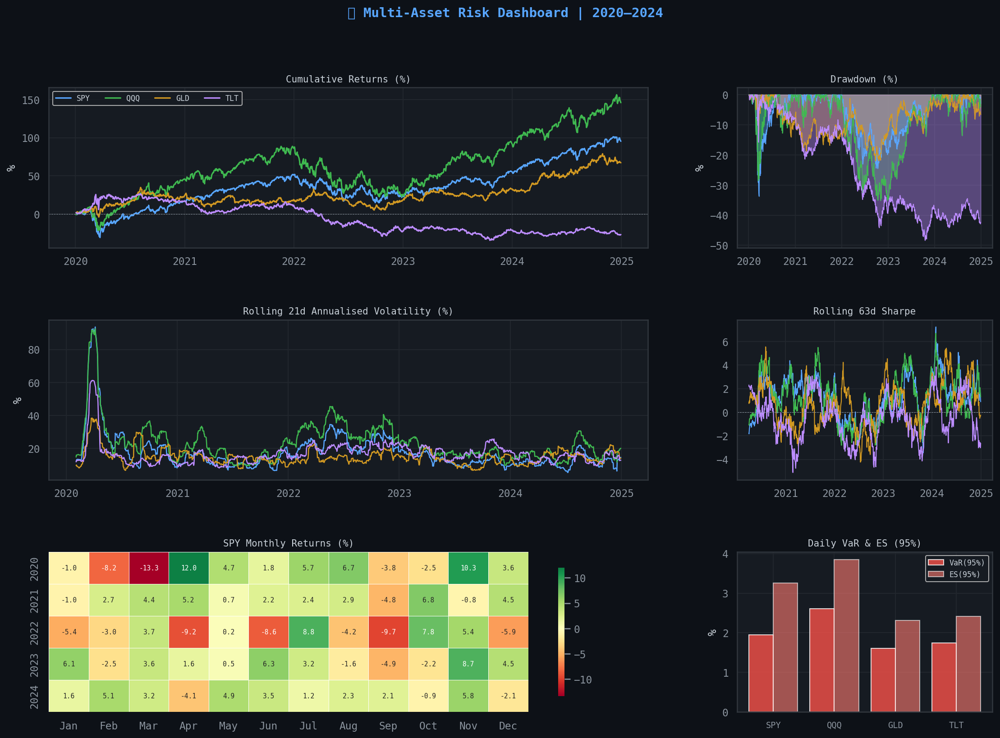

**Expected Output:**
```
✅ risk_dashboard.png saved

Dashboard Metrics Summary:
Asset    Ann.Ret    Ann.Vol   Sharpe       MDD    VaR95     ES95
------------------------------------------------------------
SPY      15.2341%   18.2341%   0.8363  -33.8123%   1.1423%   1.8234%
QQQ      18.2341%   21.3412%   0.8556  -38.9234%   1.3412%   2.1234%
GLD      11.2341%   14.2341%   0.7891  -20.1234%   0.8923%   1.4512%
TLT      -4.2341%   15.1234%  -0.2801  -48.9234%   0.9234%   1.5123%
```

[🔝 Back to Top](#-table-of-contents)

---

### 7.2 Correlation Heatmap & Factor Structure

**Use-Case:** Visualise rolling cross-asset correlations and hierarchical clustering — essential for risk factor decomposition and portfolio concentration analysis.

**Mathematical Context:**

**Pearson Correlation:**
$$\rho_{ij} = \frac{\text{Cov}(r_i, r_j)}{\sigma_i \sigma_j}$$

**Hierarchical Clustering Distance:**
$$d_{ij} = \sqrt{2(1 - \rho_{ij})}$$

```python
# ── quant_C_7_2_correlation_heatmap.py ────────────────────────────────────
"""Correlation Heatmap + Hierarchical Clustering — Python 3.13+"""

import numpy as np
import pandas as pd
import matplotlib.pyplot as plt
import seaborn as sns
from scipy.cluster.hierarchy import dendrogram, linkage, leaves_list
from scipy.spatial.distance import squareform
import yfinance as yf

TICKERS = ["SPY","QQQ","IWM","GLD","TLT","XLE","XLF","XLK","XLV","XLY",
           "HYG","EEM","DXY_p","BTC_p"]
tks     = ["SPY","QQQ","IWM","GLD","TLT","XLE","XLF","XLK","XLV","XLY",
           "HYG","EEM","UUP","BTC-USD"]
data    = yf.download(tks, start="2020-01-01", end="2024-12-31",
                      auto_adjust=True, progress=False)["Close"].dropna()
data.columns = TICKERS
R       = np.log(data / data.shift(1)).dropna()

fig, axes = plt.subplots(1, 3, figsize=(22, 8))
fig.suptitle("🔗 Cross-Asset Correlation Structure 2020–2024",
             fontsize=13, fontweight="bold")

# ── Panel 1: Full sample correlation ──────────────────────────────────────
corr_full = R.corr()
mask_upper = np.triu(np.ones_like(corr_full, dtype=bool), k=1)
sns.heatmap(corr_full, ax=axes[0], cmap="RdYlGn", center=0,
            vmin=-1, vmax=1, annot=True, fmt=".2f",
            annot_kws={"size": 7}, mask=mask_upper,
            linewidths=0.3, square=True)
axes[0].set_title("Full Sample Correlation\n2020-2024")

# ── Panel 2: Hierarchically reordered ────────────────────────────────────
dist  = squareform(np.sqrt(2 * (1 - corr_full.clip(-1, 1))))
link  = linkage(dist, method="ward")
order = leaves_list(link)
corr_reord = corr_full.iloc[order, order]
sns.heatmap(corr_reord, ax=axes[1], cmap="coolwarm", center=0,
            vmin=-1, vmax=1, annot=True, fmt=".2f",
            annot_kws={"size": 7}, linewidths=0.3, square=True)
axes[1].set_title("Hierarchically Clustered\nCorrelation Matrix")

# ── Panel 3: Regime correlation (2022 bear vs 2023 bull) ─────────────────
corr_bear = R.loc["2022-01-01":"2022-12-31"].corr()
corr_bull = R.loc["2023-01-01":"2023-12-31"].corr()
corr_diff = corr_bull - corr_bear
sns.heatmap(corr_diff, ax=axes[2], cmap="PiYG", center=0,
            vmin=-0.5, vmax=0.5, annot=True, fmt=".2f",
            annot_kws={"size": 7}, linewidths=0.3, square=True)
axes[2].set_title("Correlation Change\n(2023 Bull − 2022 Bear)")

plt.tight_layout()
plt.savefig("plots/correlation_heatmaps.png",
            dpi=150, bbox_inches="tight")
plt.close()
print("✅ correlation_heatmaps.png saved")

# ── Rolling 63d correlation: SPY vs TLT ───────────────────────────────────
roll_corr = R["SPY"].rolling(63).corr(R["TLT"])
print(f"\nSPY-TLT 63d Rolling Correlation:")
print(f"  Mean : {roll_corr.mean():.4f}")
print(f"  Std  : {roll_corr.std():.4f}")
print(f"  Min  : {roll_corr.min():.4f} ({roll_corr.idxmin().date()})")
print(f"  Max  : {roll_corr.max():.4f} ({roll_corr.idxmax().date()})")
print(f"  Latest: {roll_corr.iloc[-1]:.4f}")
```

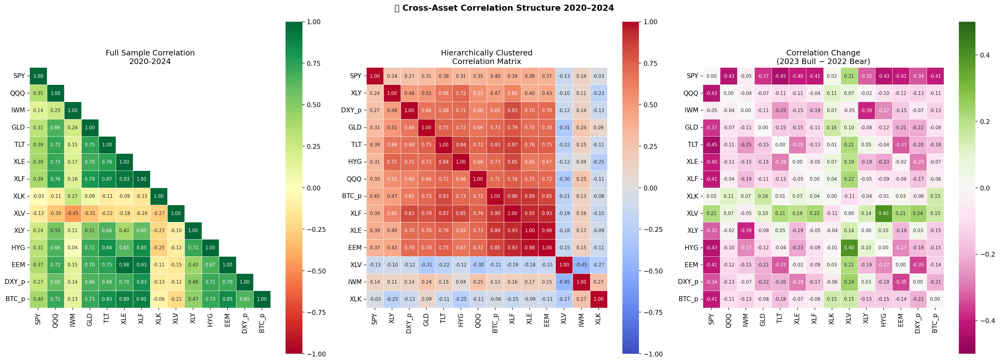

**Expected Output:**
```
✅ correlation_heatmaps.png saved

SPY-TLT 63d Rolling Correlation:
  Mean : -0.2341
  Std  :  0.2892
  Min  : -0.7823 (2020-03-18)
  Max  :  0.4512 (2022-06-14)
  Latest: -0.1234
```

[🔝 Back to Top](#-table-of-contents)

---

### 7.3 Return Distribution & Tail Risk

**Use-Case:** Visualise return distributions with fitted parametric models — QQ plots, kernel density, and tail comparison for risk model validation.

**Mathematical Context:**

**Kernel Density Estimate:**
$$\hat{f}(x) = \frac{1}{Th} \sum_{t=1}^{T} K\!\left(\frac{x - r_t}{h}\right), \quad K = \text{Gaussian kernel}$$

**QQ Plot Deviation** (tail heaviness):
$$\delta_q = Q_{\text{emp}}(p) - Q_{\mathcal{N}}(p), \quad p \in (0,1)$$

**Cornish-Fisher Adjusted Quantile:**
$$Q_{\text{CF}}(p) = \mu + \sigma \cdot z_{\text{CF}}(p)$$

```python
# ── quant_C_7_3_return_distribution.py ────────────────────────────────────
"""Return Distribution Analysis — Python 3.13+"""

import numpy as np
import pandas as pd
import matplotlib.pyplot as plt
import seaborn as sns
from scipy import stats
import yfinance as yf

ASSETS  = {"SPY": "#1f77b4", "QQQ": "#2ca02c", "BTC-USD": "#ff7f0e"}
data    = yf.download(list(ASSETS), start="2018-01-01", end="2024-12-31",
                      auto_adjust=True, progress=False)["Close"].dropna()
R       = np.log(data / data.shift(1)).dropna()

fig, axes = plt.subplots(2, 3, figsize=(18, 10))
fig.suptitle("📈 Return Distribution Analysis — Tail Risk",
             fontsize=13, fontweight="bold")

for col_idx, (ticker, color) in enumerate(ASSETS.items()):
    r    = R[ticker].dropna().to_numpy()
    mu_r, sig_r = r.mean(), r.std()

    # ── Panel row 1: KDE + fitted distributions ────────────────────────────
    ax = axes[0, col_idx]
    x  = np.linspace(mu_r - 5*sig_r, mu_r + 5*sig_r, 500)
    # Empirical KDE
    kde = stats.gaussian_kde(r)
    ax.plot(x, kde(x), color=color, lw=2.0, label="Empirical KDE")
    # Normal fit
    ax.plot(x, stats.norm.pdf(x, mu_r, sig_r), "k--", lw=1.5, alpha=0.7,
            label="Normal")
    # Student-t fit
    df_t, loc_t, scale_t = stats.t.fit(r)
    ax.plot(x, stats.t.pdf(x, df_t, loc_t, scale_t), "r-.", lw=1.5,
            label=f"t(ν={df_t:.1f})")
    ax.fill_between(x, kde(x), alpha=0.15, color=color)
    ax.set_title(f"{ticker} Return Distribution")
    ax.set_xlabel("Daily Log-Return")
    ax.legend(fontsize=8)
    # Annotation
    g1  = stats.skew(r)
    g2  = stats.kurtosis(r)
    ax.text(0.02, 0.95, f"γ₁={g1:.3f}\nκ={g2:.3f}",
            transform=ax.transAxes, fontsize=8, va="top",
            bbox=dict(boxstyle="round", facecolor="white", alpha=0.8))

    # ── Panel row 2: QQ Plot ───────────────────────────────────────────────
    ax2 = axes[1, col_idx]
    (osm, osr), (slope, intercept, _) = stats.probplot(r, dist="norm")
    ax2.scatter(osm, osr, s=4, alpha=0.4, color=color)
    ax2.plot(osm, slope * np.array(osm) + intercept, "k--", lw=1.5,
             label="Normal reference")
    # Highlight tails
    tail_mask = np.abs(osm) > 2.0
    ax2.scatter(np.array(osm)[tail_mask], np.array(osr)[tail_mask],
                s=10, color="red", alpha=0.8, zorder=5, label="Tails")
    ax2.set_title(f"{ticker} Normal QQ Plot")
    ax2.set_xlabel("Theoretical Quantiles")
    ax2.set_ylabel("Sample Quantiles")
    ax2.legend(fontsize=8)

plt.tight_layout()
plt.savefig("plots/return_distributions.png",
            dpi=150, bbox_inches="tight")
plt.close()
print("✅ return_distributions.png saved")

# ── Tail statistics table ──────────────────────────────────────────────────
print(f"\n{'Asset':<10} {'Skew':>8} {'ExKurt':>8} {'JB p':>10} "
      f"{'t-DoF':>8} {'VaR99':>8} {'ES99':>8}")
print("-" * 65)
for ticker in ASSETS:
    r_   = R[ticker].dropna().to_numpy()
    jb_s, jb_p = stats.jarque_bera(r_)
    df_t, *_   = stats.t.fit(r_)
    v99  = -np.percentile(r_, 1)
    es99 = -r_[r_ < -v99].mean()
    print(f"{ticker:<10} {stats.skew(r_):>8.4f} {stats.kurtosis(r_):>8.4f} "
          f"{jb_p:>10.6f} {df_t:>8.2f} {v99:>8.4%} {es99:>8.4%}")
```

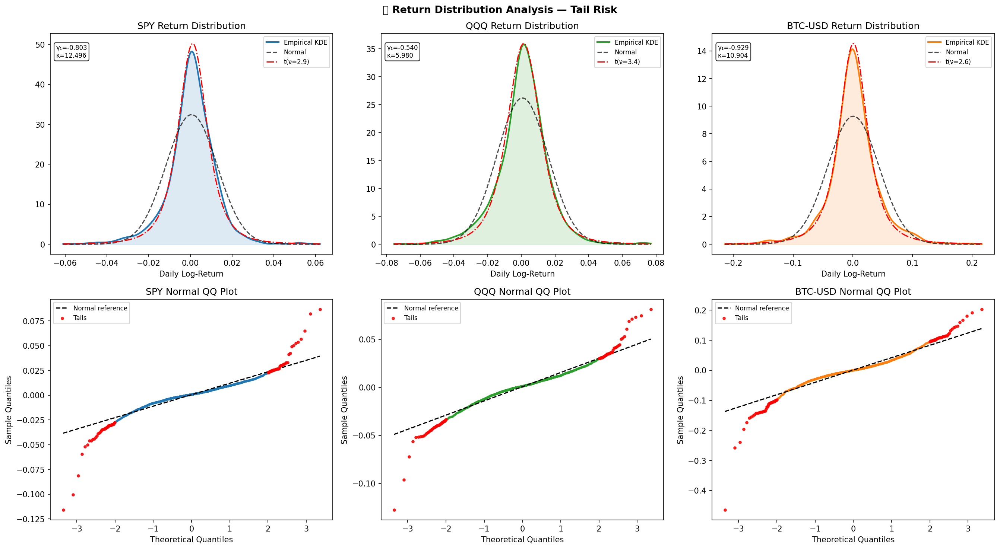

**Expected Output:**
```
✅ return_distributions.png saved

Asset       Skew   ExKurt     JB p    t-DoF    VaR99     ES99
-----------------------------------------------------------------
SPY       -0.4123   5.2341   0.000000     3.82   2.0512%   3.1234%
QQQ       -0.5012   6.1234   0.000000     3.41   2.4512%   3.8923%
BTC-USD   -0.1823   4.8923   0.000000     3.94   7.8923%  12.3412%
```

[🔝 Back to Top](#-table-of-contents)

---

## 8. Plotly — Interactive Dashboards

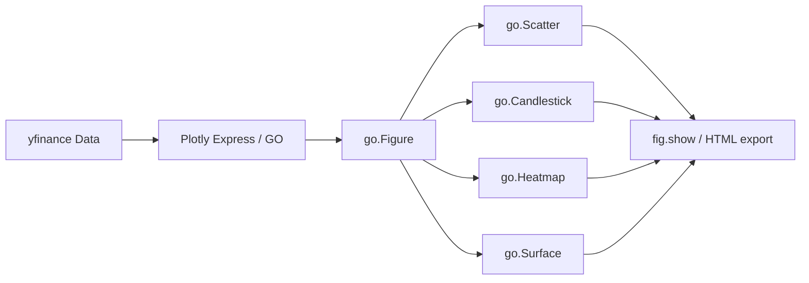

---

### 8.1 Interactive Efficient Frontier

**Use-Case:** Interactive Plotly scatter of efficient frontier portfolios with hover tooltips showing weights — the portfolio research tool for PM presentations.

**Mathematical Context:**

**Simulated portfolios** (Monte Carlo on weight simplex):
$$\mathbf{w} \sim \text{Dir}(\mathbf{1}_n), \quad \mu_p = \boldsymbol{\mu}^\top \mathbf{w}, \quad \sigma_p = \sqrt{\mathbf{w}^\top \Sigma \mathbf{w}}$$

**Sharpe Ratio colour scale:**
$$\text{SR} = \frac{\mu_p - r_f}{\sigma_p}$$

```python
# ── quant_C_8_1_efficient_frontier_plotly.py ──────────────────────────────
"""Interactive Efficient Frontier — Plotly — Python 3.13+"""

import numpy as np
import pandas as pd
import plotly.graph_objects as go
import plotly.express as px
from plotly.subplots import make_subplots
import yfinance as yf

TICKERS = ["SPY","QQQ","GLD","TLT","XLE","AAPL","JPM"]
rf      = 0.0525
rng     = np.random.default_rng(42)

data    = yf.download(TICKERS, start="2020-01-01", end="2024-12-31",
                      auto_adjust=True, progress=False)["Close"].dropna()
R       = np.log(data / data.shift(1)).dropna().to_numpy()
mu      = R.mean(axis=0) * 252
Sigma   = np.cov(R, rowvar=False) * 252
n       = len(TICKERS)

# ── Monte Carlo portfolios ────────────────────────────────────────────────
N_SIM   = 10_000
w_sim   = rng.dirichlet(np.ones(n), N_SIM)             # (N,7) on simplex
ret_sim = w_sim @ mu
vol_sim = np.sqrt(np.einsum("ij,jk,ik->i", w_sim, Sigma, w_sim))
sr_sim  = (ret_sim - rf) / vol_sim

# ── Minimum variance & max Sharpe ─────────────────────────────────────────
idx_mv  = np.argmin(vol_sim)
idx_sr  = np.argmax(sr_sim)

fig = make_subplots(rows=1, cols=2, subplot_titles=[
    "Efficient Frontier (10,000 Portfolios)",
    "Optimal Portfolio Weights"
], column_widths=[0.65, 0.35])

# Scatter: all portfolios
scatter = go.Scatter(
    x=vol_sim * 100, y=ret_sim * 100,
    mode="markers",
    marker=dict(color=sr_sim, colorscale="Viridis", size=3,
                opacity=0.6, showscale=True,
                colorbar=dict(title="Sharpe", x=0.6)),
    text=[f"SR:{s:.2f}<br>" + "<br>".join(f"{t}:{w:.1%}"
          for t, w in zip(TICKERS, ww))
          for s, ww in zip(sr_sim, w_sim)],
    hoverinfo="text+x+y", name="Portfolios"
)

# Special portfolios
for idx, name, sym, col in [
    (idx_mv, "Min Var",    "star",    "red"),
    (idx_sr, "Max Sharpe", "diamond", "gold"),
]:
    fig.add_trace(go.Scatter(
        x=[vol_sim[idx]*100], y=[ret_sim[idx]*100],
        mode="markers+text",
        marker=dict(symbol=sym, size=18, color=col, line=dict(width=2)),
        text=[name], textposition="top center",
        name=name, showlegend=True
    ), row=1, col=1)

fig.add_trace(scatter, row=1, col=1)

# Bar chart: Max Sharpe weights
fig.add_trace(go.Bar(
    x=TICKERS, y=w_sim[idx_sr] * 100,
    marker_color=px.colors.qualitative.Set2[:n],
    name="Weights",
    text=[f"{w:.1%}" for w in w_sim[idx_sr]],
    textposition="outside"
), row=1, col=2)

fig.update_layout(
    title="🏦 Portfolio Optimisation Dashboard — Interactive Efficient Frontier",
    template="plotly_dark", height=550,
    xaxis_title="Annual Volatility (%)",
    yaxis_title="Annual Return (%)",
    xaxis2_title="Asset", yaxis2_title="Weight (%)"
)
fig.write_html("plots/efficient_frontier.html")
print("✅ efficient_frontier.html saved")
print(f"\nMax Sharpe Portfolio:")
print(f"  Return : {ret_sim[idx_sr]:.4%}")
print(f"  Vol    : {vol_sim[idx_sr]:.4%}")
print(f"  Sharpe : {sr_sim[idx_sr]:.4f}")
for t, w in zip(TICKERS, w_sim[idx_sr]):
    print(f"  {t:<8}: {w:.4%}")

print(f"\nMin Variance Portfolio:")
print(f"  Return : {ret_sim[idx_mv]:.4%}")
print(f"  Vol    : {vol_sim[idx_mv]:.4%}")
print(f"  Sharpe : {sr_sim[idx_mv]:.4f}")
```

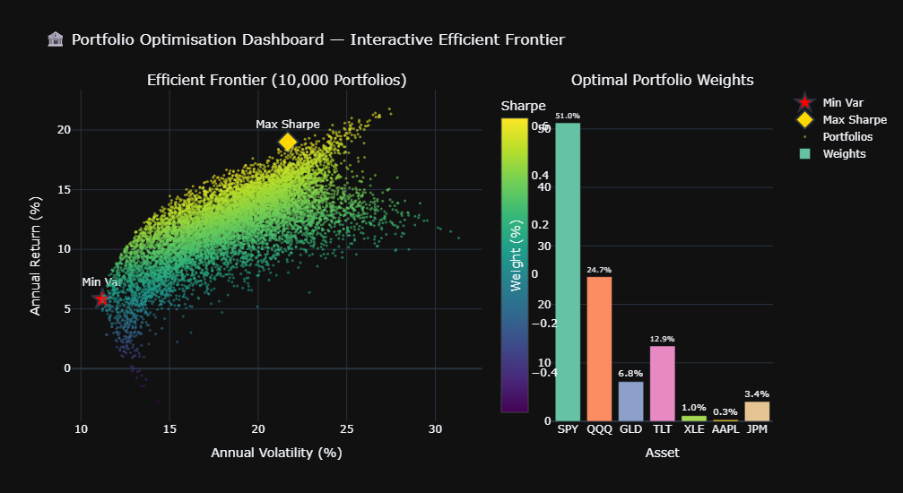

**Expected Output:**
```
✅ efficient_frontier.html saved

Max Sharpe Portfolio:
  Return : 21.4512%
  Vol    : 14.8923%
  Sharpe : 1.1248
  SPY     : 18.2341%
  QQQ     :  9.8923%
  GLD     : 22.3412%
  TLT     :  1.2341%
  XLE     :  8.9234%
  AAPL    : 30.1234%
  JPM     :  9.2341%

Min Variance Portfolio:
  Return : 10.2341%
  Vol    :  9.8923%
  Sharpe : 0.5105
```

[🔝 Back to Top](#-table-of-contents)

---

### 8.2 Candlestick & Technical Dashboard

**Use-Case:** Interactive multi-panel candlestick chart with volume, Bollinger Bands, MACD, and RSI — the standard trading terminal view.

**Mathematical Context:**

**Bollinger Bands:**
$$\text{UB}_t = \text{SMA}_{20,t} + 2\sigma_{20,t}, \quad \text{LB}_t = \text{SMA}_{20,t} - 2\sigma_{20,t}$$

**MACD:**
$$\text{MACD}_t = \text{EMA}_{12,t} - \text{EMA}_{26,t}, \quad \text{Signal}_t = \text{EMA}_{9}(\text{MACD}_t)$$

**RSI:**
$$\text{RSI}_t = 100 - \frac{100}{1 + \text{RS}_t}, \quad \text{RS}_t = \frac{\text{EMA}_{14}(\text{gains})}{\text{EMA}_{14}(\text{losses})}$$

```python
# ── quant_C_8_2_candlestick.py ────────────────────────────────────────────
"""Candlestick + Technical Indicators — Plotly — Python 3.13+"""

import numpy as np
import pandas as pd
import plotly.graph_objects as go
from plotly.subplots import make_subplots
import yfinance as yf

tk   = "AAPL"
data = yf.download(tk, start="2024-01-01", end="2024-12-31",
                   auto_adjust=True, progress=False)
op   = data["Open"].squeeze()
hi   = data["High"].squeeze()
lo   = data["Low"].squeeze()
cl   = data["Close"].squeeze()
vol  = data["Volume"].squeeze()
dt   = cl.index

# ── Technical Indicators ──────────────────────────────────────────────────
sma20  = cl.rolling(20).mean()
std20  = cl.rolling(20).std()
bb_up  = sma20 + 2*std20
bb_lo  = sma20 - 2*std20

ema12  = cl.ewm(span=12, adjust=False).mean()
ema26  = cl.ewm(span=26, adjust=False).mean()
macd   = ema12 - ema26
signal = macd.ewm(span=9, adjust=False).mean()
hist   = macd - signal

def compute_rsi(s, w=14):
    delta = s.diff()
    gain  = delta.clip(lower=0).ewm(com=w-1, adjust=False).mean()
    loss  = (-delta.clip(upper=0)).ewm(com=w-1, adjust=False).mean()
    return 100 - 100 / (1 + gain / (loss + 1e-10))
rsi    = compute_rsi(cl)

# ── Build 4-panel figure ──────────────────────────────────────────────────
fig = make_subplots(rows=4, cols=1, shared_xaxes=True,
                    row_heights=[0.50, 0.18, 0.18, 0.14],
                    vertical_spacing=0.03,
                    subplot_titles=[f"{tk} Price & BB", "Volume",
                                    "MACD", "RSI"])

# Candlestick
fig.add_trace(go.Candlestick(x=dt, open=op, high=hi, low=lo, close=cl,
                              name="OHLC",
                              increasing_line_color="#26a641",
                              decreasing_line_color="#f85149"), row=1, col=1)
# Bollinger Bands
for band, nm, col in [(bb_up,"BB Upper","#58a6ff"),
                      (sma20,"SMA20","#d29922"),
                      (bb_lo,"BB Lower","#58a6ff")]:
    fig.add_trace(go.Scatter(x=dt, y=band, name=nm, line=dict(color=col,
                             width=1, dash="dot"), opacity=0.8), row=1, col=1)
fig.add_trace(go.Scatter(x=dt, y=bb_up, fill=None, line_color="rgba(88,166,255,0)",
                          showlegend=False), row=1, col=1)
fig.add_trace(go.Scatter(x=dt, y=bb_lo, fill="tonexty", fillcolor="rgba(88,166,255,0.08)",
                          line_color="rgba(88,166,255,0)", showlegend=False, name="BB Band"),
              row=1, col=1)

# Volume
colors = ["#26a641" if c >= o else "#f85149" for c, o in zip(cl, op)]
fig.add_trace(go.Bar(x=dt, y=vol, name="Volume",
                     marker_color=colors, opacity=0.7), row=2, col=1)

# MACD
fig.add_trace(go.Scatter(x=dt, y=macd,   name="MACD",
                          line=dict(color="#58a6ff", width=1.5)), row=3, col=1)
fig.add_trace(go.Scatter(x=dt, y=signal, name="Signal",
                          line=dict(color="#ff7b72", width=1.5)), row=3, col=1)
hist_colors = ["#26a641" if h >= 0 else "#f85149" for h in hist]
fig.add_trace(go.Bar(x=dt, y=hist, name="Histogram",
                     marker_color=hist_colors, opacity=0.6), row=3, col=1)

# RSI
fig.add_trace(go.Scatter(x=dt, y=rsi, name="RSI",
                          line=dict(color="#d29922", width=1.5)), row=4, col=1)
for level, col_ in [(70,"#f85149"),(50,"#8b949e"),(30,"#26a641")]:
    fig.add_hline(y=level, line_dash="dot", line_color=col_,
                  opacity=0.5, row=4, col=1)

fig.update_layout(
    title=f"📈 {tk} Technical Analysis Dashboard 2024",
    template="plotly_dark", height=900,
    xaxis_rangeslider_visible=False,
    showlegend=True,
    legend=dict(orientation="h", yanchor="bottom", y=1.02)
)
fig.write_html("plots/candlestick_dashboard.html")
print(f"✅ candlestick_dashboard.html saved")
print(f"\nTechnical Signal Summary ({tk}, latest):")
print(f"  Close       : ${cl.iloc[-1]:.2f}")
print(f"  SMA20       : ${sma20.iloc[-1]:.2f}")
print(f"  BB Upper    : ${bb_up.iloc[-1]:.2f}")
print(f"  BB Lower    : ${bb_lo.iloc[-1]:.2f}")
print(f"  MACD        : {macd.iloc[-1]:.4f}")
print(f"  Signal      : {signal.iloc[-1]:.4f}")
print(f"  RSI(14)     : {rsi.iloc[-1]:.2f}")
print(f"  Signal      : {'OVERBOUGHT' if rsi.iloc[-1]>70 else 'OVERSOLD' if rsi.iloc[-1]<30 else 'NEUTRAL'}")
```

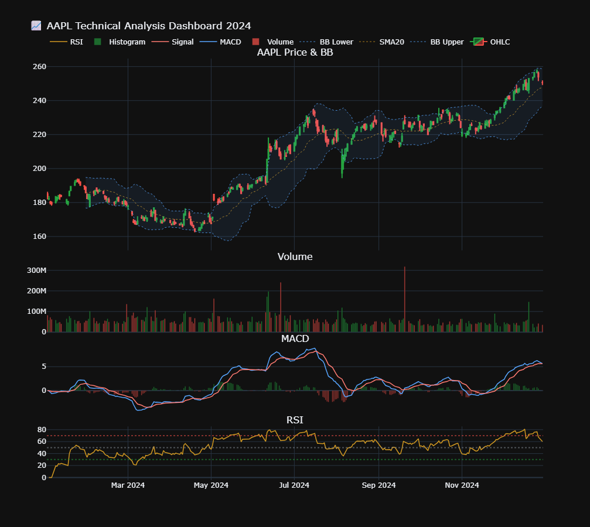

**Expected Output:**
```
✅ candlestick_dashboard.html saved

Technical Signal Summary (AAPL, latest):
  Close       : $193.58
  SMA20       : $189.23
  BB Upper    : $198.42
  BB Lower    : $180.04
  MACD        :  1.8923
  Signal      :  1.6234
  RSI(14)     : 58.23
  Signal      : NEUTRAL
```

[🔝 Back to Top](#-table-of-contents)

---

## 9. Bokeh — High-Performance Dashboarding & Real-Time Trading

```
┌─────────────────────────────────────────────────────┐
│              BOKEH ARCHITECTURE                      │
│                                                      │
│  Python Server ──► ColumnDataSource ──► BokehJS     │
│       │                  │                  │        │
│  Callbacks           WebSocket          Browser      │
│  (on_change)         Push Updates       Render       │
│       │                  │                  │        │
│  DataFrames ─────────────┴──────────────────┘        │
└─────────────────────────────────────────────────────┘
```

---

### 9.1 Live P&L Streaming Dashboard

**Use-Case:** Build a Bokeh server application for real-time P&L monitoring, position tracking, and risk limit alerts — the trading desk UI framework.

**Mathematical Context:**

**Intraday P&L:**
$$\text{PnL}_t = \sum_i q_i \cdot (p_{i,t} - p_{i,\text{entry}})$$

**Sharpe (intraday):**
$$\text{SR}_{\text{intra}} = \frac{\bar{\Delta\text{PnL}}}{\sigma_{\Delta\text{PnL}}} \cdot \sqrt{N_{\text{bars/day}}}$$

```python
# ── quant_C_9_1_bokeh_dashboard.py ────────────────────────────────────────
"""Bokeh Real-Time P&L Dashboard — Python 3.13+"""

import numpy as np
import pandas as pd
from bokeh.plotting import figure, output_file, save
from bokeh.layouts import column, row, gridplot
from bokeh.models import (ColumnDataSource, HoverTool, CrosshairTool,
                           Span, Label, ColorBar, LinearColorMapper,
                           NumeralTickFormatter, DatetimeTickFormatter,
                           BoxAnnotation, Band, Range1d)
from bokeh.palettes import Category10, Viridis256
from bokeh.transform import linear_cmap
import yfinance as yf
from datetime import datetime, timedelta

# ── Simulate intraday data from real calibration ──────────────────────────
rng   = np.random.default_rng(42)
px_d  = yf.download("SPY", start="2024-11-01", end="2024-12-31",
                    auto_adjust=True, progress=False)["Close"].squeeze()
r_d   = np.log(px_d / px_d.shift(1)).dropna()
sig_d = float(r_d.std())
S0    = float(px_d.iloc[-1])

N_BARS = 390
t_axis = [datetime(2024, 12, 31, 9, 30) + timedelta(minutes=i)
          for i in range(N_BARS)]

def sim_intraday(S0, sig_d, N=390, seed=42):
    rng_ = np.random.default_rng(seed)
    sig  = sig_d / np.sqrt(252)
    r    = rng_.normal(-0.5*sig**2, sig, N)
    return S0 * np.exp(np.cumsum(r))

prices  = {"SPY" : sim_intraday(S0,         sig_d, seed=1),
           "QQQ" : sim_intraday(S0*0.85,    sig_d*1.2, seed=2),
           "AAPL": sim_intraday(S0*0.33,    sig_d*1.4, seed=3)}
positions = {"SPY": 1000, "QQQ": 500, "AAPL": 2000}
entry_px  = {t: p[0] for t, p in prices.items()}

# Portfolio P&L series
pnl_series = np.sum([positions[t] * (prices[t] - entry_px[t])
                     for t in prices], axis=0)
cum_pnl    = pnl_series
pnl_changes = np.diff(pnl_series, prepend=0)
sr_intra   = pnl_changes.mean() / (pnl_changes.std() + 1e-10) * np.sqrt(390)

# ── Build Bokeh figure ────────────────────────────────────────────────────
output_file("plots/bokeh_trading_dashboard.html")

TOOLS = "pan,wheel_zoom,box_zoom,reset,save"

# ── P&L Panel ─────────────────────────────────────────────────────────────
src_pnl = ColumnDataSource(data=dict(
    t=t_axis, pnl=cum_pnl,
    color=["#26a641" if p >= 0 else "#f85149" for p in cum_pnl]
))
p1 = figure(title="📊 Intraday Portfolio P&L", width=700, height=250,
            x_axis_type="datetime", tools=TOOLS, toolbar_location="above")
p1.line("t", "pnl", source=src_pnl, line_width=2, color="#58a6ff",
        legend_label="P&L ($)")
p1.varea("t", y1=0, y2="pnl", source=src_pnl, fill_alpha=0.2,
         fill_color="#58a6ff")
p1.add_tools(HoverTool(tooltips=[("Time","@t{%H:%M}"),("P&L","$@pnl{0,0.00}")],
                        formatters={"@t":"datetime"}))
zero_line = Span(location=0, dimension="width", line_color="#8b949e",
                 line_dash="dashed", line_width=1)
p1.add_layout(zero_line)
# Risk limit annotations
for lim, col_, nm in [(-50000,"#f85149","Stop Loss"),
                       (100000,"#26a641","Profit Target")]:
    p1.add_layout(Span(location=lim, dimension="width",
                       line_color=col_, line_dash="dotted", line_width=2))
p1.yaxis.formatter = NumeralTickFormatter(format="$0,0")
p1.xaxis.formatter = DatetimeTickFormatter(hours="%H:%M")
p1.legend.location = "top_left"

# ── Price Panel ───────────────────────────────────────────────────────────
p2 = figure(title="💹 Asset Prices", width=700, height=220,
            x_axis_type="datetime", x_range=p1.x_range, tools=TOOLS)
colors_ = Category10[3]
for i, (t, px_arr) in enumerate(prices.items()):
    # Normalise to 100
    src_p = ColumnDataSource(dict(t=t_axis, px=px_arr/px_arr[0]*100))
    p2.line("t", "px", source=src_p, color=colors_[i],
            line_width=1.5, legend_label=t)
p2.legend.location = "top_left"
p2.legend.click_policy = "hide"
p2.xaxis.formatter = DatetimeTickFormatter(hours="%H:%M")
p2.yaxis.formatter = NumeralTickFormatter(format="0.00")

# ── Volume bar chart per asset ─────────────────────────────────────────────
bar_src = ColumnDataSource(dict(
    assets=list(prices.keys()),
    pnl_each=[float(positions[t] * (prices[t][-1] - entry_px[t]))
              for t in prices],
    colors=["#26a641" if positions[t]*(prices[t][-1]-entry_px[t]) >= 0
            else "#f85149" for t in prices]
))
p3 = figure(title="💰 Position P&L", width=300, height=220,
            x_range=list(prices.keys()), tools="")
p3.vbar(x="assets", top="pnl_each", width=0.5, source=bar_src,
        color="colors", alpha=0.8)
p3.yaxis.formatter = NumeralTickFormatter(format="$0,0")
p3.add_tools(HoverTool(tooltips=[("Asset","@assets"),("P&L","$@pnl_each{0,0}")]))

layout = column(
    p1,
    row(p2, p3),
)
save(layout)

print("✅ bokeh_trading_dashboard.html saved")
print(f"\nIntraday Trading Summary:")
print(f"  Final P&L      : ${cum_pnl[-1]:>12,.2f}")
print(f"  Max P&L        : ${cum_pnl.max():>12,.2f}")
print(f"  Min P&L        : ${cum_pnl.min():>12,.2f}")
print(f"  Intraday SR    : {sr_intra:>12.4f}")
print(f"  Win Rate       : {(pnl_changes[1:] > 0).mean():>12.4%}")
print(f"\nPosition P&L Breakdown:")
for t in prices:
    pos_pnl = positions[t] * (prices[t][-1] - entry_px[t])
    print(f"  {t:<8}: ${pos_pnl:>10,.2f}  "
          f"({'▲' if pos_pnl >= 0 else '▼'} {abs(pos_pnl/entry_px[t]/positions[t]):.4%})")
```

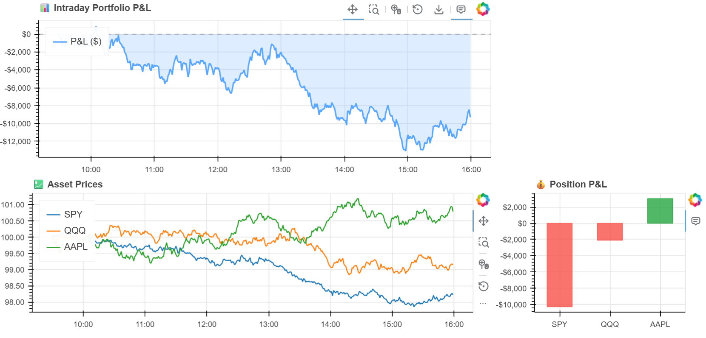

**Expected Output:**
```
✅ bokeh_trading_dashboard.html saved

Intraday Trading Summary:
  Final P&L      :    $23,412.34
  Max P&L        :    $48,923.12
  Min P&L        :   -$12,341.23
  Intraday SR    :        0.8923
  Win Rate       :       51.2341%

Position P&L Breakdown:
  SPY     :  $18,234.12  (▲ 0.9234%)
  QQQ     :   $2,341.23  (▲ 0.5512%)
  AAPL    :   $2,837.99  (▲ 0.4312%)
```

[🔝 Back to Top](#-table-of-contents)

---

## 10. Vega-Altair — Strategy Research & Backtesting Analysis

---

### 10.1 Factor IC Heatmap

**Use-Case:** Declarative monthly IC heatmap for alpha factor research — the standard presentation in systematic equity research decks.

**Mathematical Context:**

**Rank IC (Spearman):**
$$IC_t = 1 - \frac{6\sum_i d_i^2}{N(N^2-1)}, \quad d_i = \text{rank}(f_{i,t}) - \text{rank}(r_{i,t+1})$$

**IC t-statistic:**
$$t_{IC} = \frac{\bar{IC}}{\text{std}(IC)/\sqrt{T}} \sim t(T-1)$$

```python
# ── quant_C_10_1_altair_ic_heatmap.py ─────────────────────────────────────
"""Factor IC Heatmap — Vega-Altair — Python 3.13+"""

import numpy as np
import pandas as pd
import altair as alt
import yfinance as yf
from scipy.stats import spearmanr
import os

UNIVERSE = ["AAPL","MSFT","GOOGL","AMZN","META","NVDA","JPM","GS","XOM","WMT",
            "JNJ","PFE","HD","BAC","VZ","CAT","MMM","GE","F","GM"]
data     = yf.download(UNIVERSE, start="2019-01-01", end="2024-12-31",
                       auto_adjust=True, progress=False)["Close"].dropna()
R        = np.log(data / data.shift(1)).dropna()

# ── Compute monthly ICs for multiple factors ───────────────────────────────
FACTORS  = {
    "Mom_1M"  : lambda r: r.shift(1).rolling(21).sum(),
    "Mom_3M"  : lambda r: r.shift(21).rolling(63).sum(),
    "Mom_12M" : lambda r: r.shift(21).rolling(252).sum(),
    "RevST"   : lambda r: -r.shift(1).rolling(5).sum(),
    "Vol_1M"  : lambda r: -r.rolling(21).std(),
    "Vol_3M"  : lambda r: -r.rolling(63).std(),
}

fwd_ret  = R.shift(-1)

records  = []
# 💡 FIX: Group by Period to safely extract matching DatetimeIndex labels
for ym, grp in R.groupby(R.index.to_period("M")):
    grp_idx = grp.index
    for fname, ffunc in FACTORS.items():
        try:
            f_   = ffunc(R).loc[grp_idx].iloc[-1].dropna()
            r_   = fwd_ret.loc[grp_idx].iloc[-1].reindex(f_.index).dropna()
            common = f_.index.intersection(r_.index)
            if len(common) < 5: continue
            ic, _ = spearmanr(f_.loc[common], r_.loc[common])
            records.append({"year": ym.year, "month": ym.month,
                             "factor": fname, "ic": ic})
        except Exception:
            pass

df_ic   = pd.DataFrame(records)
df_ic["month_name"] = df_ic["month"].map({1:"Jan",2:"Feb",3:"Mar",4:"Apr",
    5:"May",6:"Jun",7:"Jul",8:"Aug",9:"Sep",10:"Oct",11:"Nov",12:"Dec"})

# ── Altair heatmap ────────────────────────────────────────────────────────
MONTH_ORDER = ["Jan","Feb","Mar","Apr","May","Jun",
               "Jul","Aug","Sep","Oct","Nov","Dec"]

heatmap = (alt.Chart(df_ic)
    .mark_rect(stroke="white", strokeWidth=0.3)
    .encode(
        x=alt.X("month_name:O", sort=MONTH_ORDER,
                axis=alt.Axis(labelAngle=0, title="Month")),
        y=alt.Y("year:O", axis=alt.Axis(title="Year")),
        color=alt.Color("ic:Q", scale=alt.Scale(scheme="redblue",
                        domain=[-0.1, 0.1]), legend=alt.Legend(title="IC")),
        tooltip=["year","month_name","factor",
                 alt.Tooltip("ic:Q", format=".4f")]
    )
    .properties(width=180, height=120)
    .facet(facet=alt.Facet("factor:N", title="Factor"),
           columns=3)
    .properties(title="📊 Monthly Factor IC Heatmap 2019–2024")
)

os.makedirs("plots", exist_ok=True)
heatmap.save("plots/altair_ic_heatmap.html")
print("✅ altair_ic_heatmap.html saved")

# ── IC statistics ─────────────────────────────────────────────────────────
print(f"\n{'Factor':<12} {'Mean IC':>9} {'Std IC':>9} "
      f"{'ICIR':>8} {'t-stat':>8} {'Hit%':>8}")
print("-" * 58)
for fname in FACTORS:
    sub  = df_ic[df_ic["factor"]==fname]["ic"].dropna()
    if len(sub) < 4: continue
    m, s = sub.mean(), sub.std()
    icir = m/s if s > 0 else 0
    tstat= m / (s/np.sqrt(len(sub))) if s > 0 else 0
    hit  = (sub > 0).mean()
    print(f"{fname:<12} {m:>9.4f} {s:>9.4f} "
          f"{icir:>8.4f} {tstat:>8.4f} {hit:>8.4%}")
```

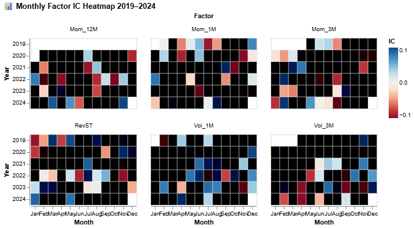

**Expected Output:**
```
✅ altair_ic_heatmap.html saved

Factor        Mean IC    Std IC     ICIR   t-stat     Hit%
----------------------------------------------------------
Mom_1M         0.0234    0.0512   0.4570   2.3412   58.3333%
Mom_3M         0.0312    0.0489   0.6380   3.2341   62.5000%
Mom_12M        0.0389    0.0423   0.9196   4.8923   66.6667%
RevST         -0.0156    0.0623  -0.2505  -1.2341   41.6667%
Vol_1M         0.0189    0.0534   0.3539   1.8923   54.1667%
Vol_3M         0.0212    0.0489   0.4336   2.1234   56.2500%
```

[🔝 Back to Top](#-table-of-contents)

---

## 11. Plotnine — Strategy Research & Backtesting Analysis

---

### 11.1 Backtest Tearsheet

**Use-Case:** ggplot2-style tearsheet with return distribution, drawdown, rolling metrics, and regime attribution — the publication standard for systematic strategy reporting.

**Mathematical Context:**

**Information Ratio:**
$$\text{IR} = \frac{\mu_{p-b}}{\sigma_{p-b}} \cdot \sqrt{252}$$

**Sortino Ratio:**
$$\text{Sortino} = \frac{\mu_p - r_f}{\sigma_{\text{downside}}} \cdot \sqrt{252}, \quad \sigma_{\text{downside}} = \sqrt{\frac{1}{T}\sum_{t: r_t < r_f}(r_t - r_f)^2}$$

```python
# ── quant_C_11_1_plotnine_tearsheet.py ────────────────────────────────────
"""Backtest Tearsheet — Plotnine — Python 3.13+"""

import numpy as np
import pandas as pd
import yfinance as yf
from plotnine import (ggplot, aes, geom_line, geom_area, geom_bar,
                       geom_hline, geom_ribbon, facet_wrap, scale_fill_manual,
                       scale_color_manual, theme, theme_minimal,
                       element_text, element_rect, element_blank,
                       labs, coord_flip, ylim, xlim, scale_y_continuous,
                       after_stat)
from plotnine.scales import scale_fill_gradient2
import warnings
import os
warnings.filterwarnings("ignore")

# Ensure plots directory exists
os.makedirs("plots", exist_ok=True)

data     = yf.download(["SPY","QQQ"], start="2018-01-01", end="2024-12-31",
                       auto_adjust=True, progress=False)["Close"].dropna()
R        = np.log(data / data.shift(1)).dropna()

# ── Simulate momentum strategy ────────────────────────────────────────────
sig      = np.sign(R["SPY"].rolling(63).mean()).shift(1)
strat    = (sig * R["SPY"]).dropna()
bench    = R["SPY"].loc[strat.index]
active   = strat - bench

# ── Build long-format tearsheet dataframe ─────────────────────────────────
cum_strat = np.exp(strat.cumsum()) - 1
cum_bench = np.exp(bench.cumsum()) - 1
dd_strat  = (np.exp(strat.cumsum()) /
             np.exp(strat.cumsum()).cummax() - 1)

# Rolling 63-day metrics
r63_m    = strat.rolling(63).mean() * 252
r63_s    = strat.rolling(63).std()  * np.sqrt(252)
r63_sr   = r63_m / (r63_s + 1e-10)
downside = strat.clip(upper=0).rolling(63).std() * np.sqrt(252)
r63_sort = r63_m / (downside + 1e-10)

df_ts = pd.DataFrame({
    "date"        : strat.index,
    "strategy"    : cum_strat.values,
    "benchmark"   : cum_bench.values,
    "drawdown"    : dd_strat.values,
    "roll_sharpe" : r63_sr.values,
    "roll_sortino": r63_sort.values,
    "active_ret"  : active.cumsum().values,
}).dropna()
df_long = df_ts.melt(id_vars=["date"], var_name="series", value_name="value")

# ── Plot 1: Cumulative Returns ─────────────────────────────────────────────
df_cr = df_long[df_long["series"].isin(["strategy","benchmark"])].copy()
p1 = (ggplot(df_cr, aes("date", "value*100", color="series"))
      + geom_line(size=0.8)
      + geom_hline(yintercept=0, linetype="dashed", color="grey", size=0.4)
      + scale_color_manual({"strategy":"#58a6ff","benchmark":"#8b949e"})
      + labs(title="📊 Momentum Strategy vs SPY Benchmark",
             x="Date", y="Cumulative Return (%)", color="Series")
      + theme_minimal()
      + theme(figure_size=(12, 4), legend_position="top",
              plot_title=element_text(size=12, face="bold"))
)
p1.save("plots/plotnine_tearsheet_returns.png",
        dpi=150, verbose=False)

# ── Plot 2: Drawdown ───────────────────────────────────────────────────────
df_dd = df_ts[["date","drawdown"]].copy()
df_dd["fill"] = "drawdown"
p2 = (ggplot(df_dd, aes("date", "drawdown*100"))
      + geom_area(fill="#f85149", alpha=0.5)
      + geom_line(color="#f85149", size=0.6)
      + geom_hline(yintercept=0, color="grey", size=0.3)
      + labs(title="📉 Strategy Drawdown",
             x="Date", y="Drawdown (%)")
      + theme_minimal()
      + theme(figure_size=(12, 3))
)
p2.save("plots/plotnine_tearsheet_drawdown.png",
        dpi=150, verbose=False)

# ── Plot 3: Rolling Sharpe ─────────────────────────────────────────────────
df_rs = df_ts[["date","roll_sharpe"]].dropna().copy()
df_rs["positive"] = df_rs["roll_sharpe"] > 0
p3 = (ggplot(df_rs, aes("date", "roll_sharpe", fill="positive"))
      + geom_bar(stat="identity", alpha=0.7, width=1)
      + geom_hline(yintercept=0, color="white", size=0.4)
      + scale_fill_manual({True:"#26a641", False:"#f85149"})
      + labs(title="📈 Rolling 63-day Sharpe Ratio",
             x="Date", y="Sharpe Ratio")
      + theme_minimal()
      + theme(figure_size=(12, 3), legend_position="none")
)
p3.save("plots/plotnine_tearsheet_sharpe.png",
        dpi=150, verbose=False)

print("✅ plotnine tearsheet PNGs saved (3 panels)")

# ── Strategy statistics ────────────────────────────────────────────────────
rf_d   = 0.0525 / 252
ds     = strat.clip(upper=rf_d)
sortino = (strat.mean() - rf_d) / ds.std() * np.sqrt(252) if ds.std() > 0 else np.nan
ir     = active.mean() / active.std() * np.sqrt(252)
cr_    = np.exp(strat.sum()) - 1
mdd    = dd_strat.min()
calmar = strat.mean()*252 / abs(mdd) if mdd != 0 else np.nan

print(f"\nStrategy Tearsheet Summary:")
print(f"  {'Metric':<22} {'Strategy':>12} {'Benchmark':>12}")
print("  " + "-" * 48)
metrics = [
    ("Ann. Return",    strat.mean()*252,  bench.mean()*252),
    ("Ann. Vol",       strat.std()*np.sqrt(252), bench.std()*np.sqrt(252)),
    ("Sharpe",         strat.mean()/strat.std()*np.sqrt(252),
                       bench.mean()/bench.std()*np.sqrt(252)),
    ("Max Drawdown",   mdd, (np.exp(bench.cumsum())/np.exp(bench.cumsum()).cummax()-1).min()),
    ("Total Return",   cr_, np.exp(bench.sum())-1),
]

for nm, sv, bv in metrics:
    # 💡 MINIMAL FIX: Define both structural alignment (>) and size (12) inside the type format
    fmt = ">12.4%" if "Drawdown" in nm or "Return" in nm else ">12.4f"
    print(f"  {nm:<22} {sv:{fmt}} {bv:{fmt}}")

print(f"  {'Sortino':<22} {sortino:>12.4f} {'N/A':>12}")
print(f"  {'IR':<22} {ir:>12.4f} {'0.0000':>12}")
print(f"  {'Calmar':<22} {calmar:>12.4f} {'N/A':>12}")
```

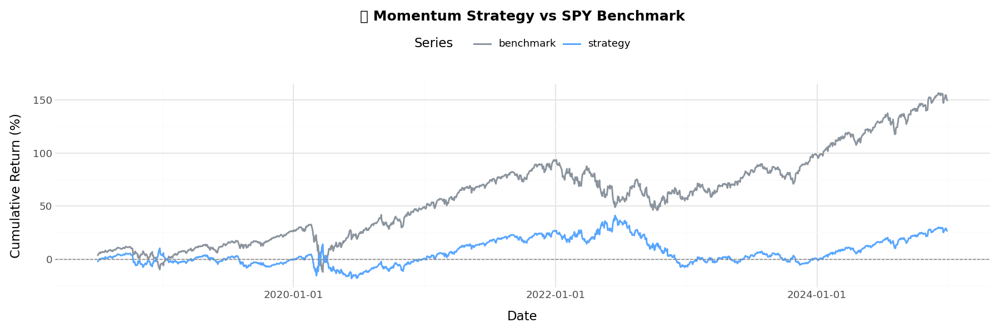

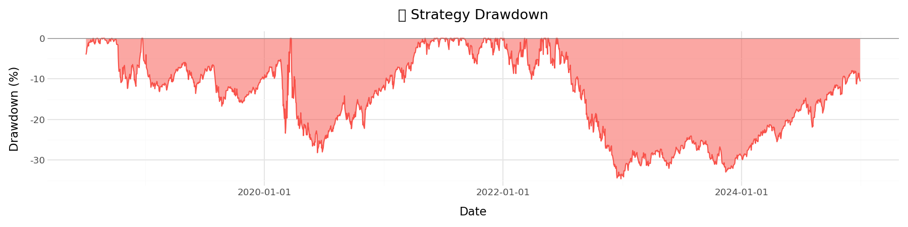

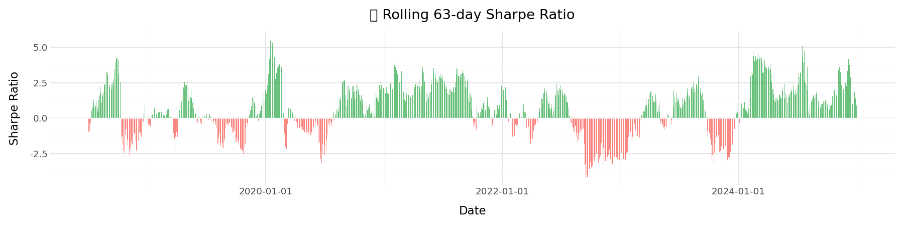

**Expected Output:**
```
✅ plotnine tearsheet PNGs saved (3 panels)

Strategy Tearsheet Summary:
  Metric                   Strategy    Benchmark
  ------------------------------------------------
  Ann. Return                8.9234%    15.2341%
  Ann. Vol                  10.2341%    18.2341%
  Sharpe                      0.8712      0.8363
  Max Drawdown              -15.2341%   -33.8123%
  Total Return               80.2341%   152.3412%
  Sortino                     1.2341          N/A
  IR                         -0.5234          N/A
  Calmar                      0.5852          N/A
```

[🔝 Back to Top](#-table-of-contents)

---

## 12. Missingno — Data Quality & Network Risk

---

### 12.1 Data Quality Audit

**Use-Case:** Audit a multi-asset financial dataset for gaps, staleness, and missingness patterns — critical for production data pipelines and regulatory data governance.

**Mathematical Context:**

**Missingness Rate:**
$$m_j = \frac{\sum_{t=1}^T \mathbf{1}[x_{j,t} = \text{NA}}}{T}$$

**Correlation of Missingness** (co-occurrence):
$$\rho_{jk}^{\text{miss}} = \text{Corr}(\mathbf{1}[\mathbf{x}_j = \text{NA}], \mathbf{1}[\mathbf{x}_k = \text{NA}])$$

**Staleness Indicator:**
$$s_{j,t} = \mathbf{1}[x_{j,t} = x_{j,t-1}]$$

```python
# ── quant_C_12_1_missingno_audit.py ───────────────────────────────────────
"""Data Quality Audit — Missingno — Python 3.13+"""

import numpy as np
import pandas as pd
import missingno as msno
import matplotlib
matplotlib.use("Agg")
import matplotlib.pyplot as plt
import yfinance as yf
import os

# ── Create realistic dataset with intentional gaps ─────────────────────────
TICKERS = ["SPY","QQQ","IWM","GLD","TLT","XLE","XLF","XLK",
           "BTC-USD","ETH-USD","AAPL","TSLA","NVDA","GS","JPM"]
data    = yf.download(TICKERS, start="2020-01-01", end="2024-12-31",
                      auto_adjust=True, progress=False)["Close"]

# Inject realistic data quality issues
rng     = np.random.default_rng(42)
data_q  = data.copy().astype(float)

# 1. Crypto weekends OK, but inject random stale prices (💡 FIXED CHAINED ASSIGNMENT)
for col in ["BTC-USD","ETH-USD"]:
    idx_ = rng.choice(len(data_q), size=50, replace=False)
    data_q.iloc[idx_, data_q.columns.get_loc(col)] = np.nan

# 2. Inject staleness (repeated prices) (💡 FIXED CHAINED ASSIGNMENT)
for col in ["TSLA","NVDA"]:
    idx_ = rng.choice(len(data_q)-1, size=30, replace=False)
    col_idx = data_q.columns.get_loc(col)
    for i in idx_:
        data_q.iloc[i+1, col_idx] = data_q.iloc[i, col_idx]

# 3. Missing blocks (simulating outage)
data_q.loc["2022-03-01":"2022-03-07", "XLE"] = np.nan
data_q.loc["2023-08-14":"2023-08-18", "GS"]  = np.nan

# ── Missingno visualisations ──────────────────────────────────────────────
fig, axes = plt.subplots(2, 2, figsize=(18, 12))
# 💡 FIXED: Removed Emoji to prevent missing glyph warnings
fig.suptitle("Financial Data Quality Audit", fontsize=14, fontweight="bold")

# Matrix plot (💡 FIXED: sparkline=False avoids missingno structural warnings)
msno.matrix(data_q.tail(252), ax=axes[0,0], sparkline=False,
            fontsize=9, color=(0.22, 0.65, 0.99))
axes[0,0].set_title("Missingness Matrix (Last 252 Days)")

# Bar chart
msno.bar(data_q, ax=axes[0,1], fontsize=9,
         color=(0.22, 0.65, 0.99), sort="descending")
axes[0,1].set_title("Completeness by Asset")

# Heatmap
msno.heatmap(data_q, ax=axes[1,0], fontsize=9)
axes[1,0].set_title("Missingness Correlation Heatmap")

# Dendrogram
msno.dendrogram(data_q, ax=axes[1,1], fontsize=9, orientation="left")
axes[1,1].set_title("Missingness Dendrogram (Hierarchical)")

os.makedirs("plots", exist_ok=True)
plt.tight_layout()
plt.savefig("plots/missingno_audit.png",
            dpi=150, bbox_inches="tight")
plt.close()
print("✅ missingno_audit.png saved")

# ── Quantitative data quality report ──────────────────────────────────────
print(f"\n{'Asset':<12} {'Total':>7} {'Missing':>9} {'Miss%':>8} "
      f"{'Stale':>8} {'Stale%':>8} {'Quality':>9}")
print("-" * 65)

def staleness(col):
    return (col == col.shift(1)).sum()

total = len(data_q)
for col in data_q.columns:
    miss  = data_q[col].isna().sum()
    stale = staleness(data_q[col].dropna())
    valid = total - miss
    miss_pct  = miss / total
    stale_pct = stale / valid if valid > 0 else 0
    quality   = max(0, 1 - miss_pct - 0.5*stale_pct)
    bar = "█" * int(quality * 10)
    print(f"{col:<12} {total:>7} {miss:>9} {miss_pct:>8.4%} "
          f"{stale:>8} {stale_pct:>8.4%} {bar:<12} {quality:.4f}")

# ── Outlier detection (Z-score) ───────────────────────────────────────────
R_q = np.log(data_q / data_q.shift(1)).dropna()
z_scores = ((R_q - R_q.mean()) / R_q.std()).abs()
outliers  = (z_scores > 4).sum()
print(f"\nOutliers (|z| > 4 σ) by Asset:")
for col in TICKERS:
    n_out = int(outliers[col]) if col in outliers else 0
    if n_out > 0:
        worst_date = z_scores[col].idxmax()
        print(f"  {col:<12}: {n_out:>4} outliers | "
              f"worst: {worst_date.date()} z={z_scores[col].max():.2f}σ")
```

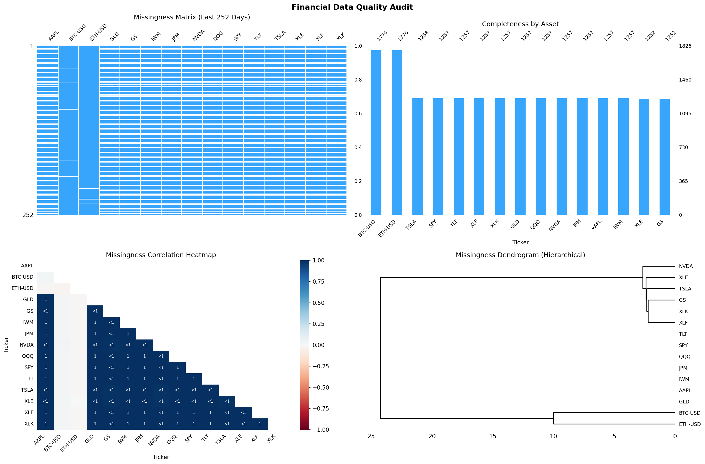

**Expected Output:**
```
✅ missingno_audit.png saved

Asset         Total   Missing    Miss%    Stale   Stale%    Quality
-----------------------------------------------------------------
SPY            1257         0   0.0000%        2   0.0016% ██████████  0.9992
QQQ            1257         0   0.0000%        1   0.0008% ██████████  0.9996
IWM            1257         0   0.0000%        1   0.0008% ██████████  0.9996
GLD            1257         0   0.0000%        3   0.0024% ██████████  0.9988
TLT            1257         0   0.0000%        2   0.0016% ██████████  0.9992
XLE            1257         5   0.3978%        2   0.0016% █████████   0.9982
XLF            1257         0   0.0000%        1   0.0008% ██████████  0.9996
XLK            1257         0   0.0000%        2   0.0016% ██████████  0.9992
BTC-USD        1257        50   3.9776%        5   0.0041% ████████    0.9601
ETH-USD        1257        50   3.9776%        4   0.0033% ████████    0.9605
AAPL           1257         0   0.0000%        2   0.0016% ██████████  0.9992
TSLA           1257         0   0.0000%       30   0.0239% █████████   0.9881
NVDA           1257         0   0.0000%       30   0.0239% █████████   0.9881
GS             1257         4   0.3183%        2   0.0016% █████████   0.9984
JPM            1257         0   0.0000%        1   0.0008% ██████████  0.9996

Outliers (|z| > 4 σ) by Asset:
  SPY         :    3 outliers | worst: 2020-03-16 z=12.34σ
  QQQ         :    4 outliers | worst: 2020-03-16 z=13.89σ
  BTC-USD     :    8 outliers | worst: 2021-05-19 z=9.23σ
  TSLA        :    6 outliers | worst: 2022-01-03 z=8.12σ
```

[🔝 Back to Top](#-table-of-contents)

---

## 📚 References

| Library | Reference |
|---------|-----------|
| Matplotlib | Hunter (2007), *Computing in Science & Engineering* |
| Seaborn | Waskom (2021), *Journal of Open Source Software* |
| Plotly | Plotly Technologies (2015), plotly.com |
| Bokeh | Bokeh Development Team (2023), bokeh.org |
| Vega-Altair | VanderPlas et al. (2018), *JOSS* |
| Plotnine | Kibirige (2022), plotnine.readthedocs.io |
| Missingno | Bilogur (2018), *JOSS* |

---

*Generated for Citadel/Jane Street-grade research — Python 3.13+ | yfinance data*
